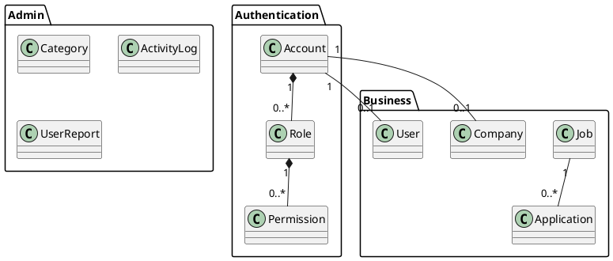
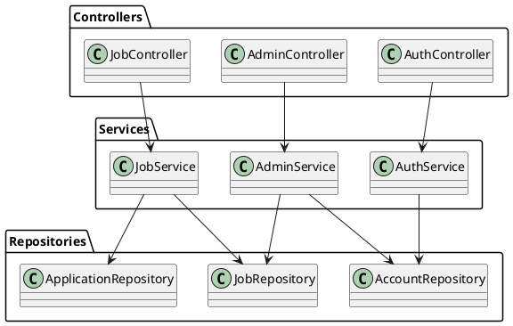

# 🎨 HƯỚNG DẪN VẼ CLASS DIAGRAM CHO RBAC JOB PORTAL

## 📋 MỤC LỤC

- [Công cụ cần thiết](#công-cụ-cần-thiết)
- [Cấu trúc tổng quan](#cấu-trúc-tổng-quan)
- [Chi tiết các lớp](#chi-tiết-các-lớp)
- [Mối quan hệ giữa các lớp](#mối-quan-hệ-giữa-các-lớp)
- [Cách vẽ diagram](#cách-vẽ-diagram)
- [Best practices](#best-practices)
- [Export và chia sẻ](#export-và-chia-sẻ)

## 🛠️ CÔNG CỤ CẦN THIẾT

### **1. Online Tools (Khuyến nghị)**
```bash
# PlantUML Online Server
https://plantuml.com/

# Draw.io (Miễn phí, mạnh mẽ)
https://app.diagrams.net/

# Lucidchart (Professional)
https://www.lucidchart.com/

# StarUML (Desktop)
https://staruml.io/
```

### **2. IDE Integration**
```bash
# IntelliJ IDEA Ultimate
File → New → Diagram → Class Diagram

# Visual Studio Code
Extension: PlantUML

# Eclipse
Plugin: Papyrus
```

### **3. Cài đặt PlantUML Local**
```bash
# Install Graphviz (required for PlantUML)
Windows: choco install graphviz
macOS: brew install graphviz
Linux: sudo apt-get install graphviz

# Install PlantUML
Download plantuml.jar from https://plantuml.com/download
```

## 🏗️ CẤU TRÚC TỔNG QUAN

### **Architecture Layers**
```
┌─────────────────────────────────────────────────────────┐
│                 PRESENTATION LAYER                      │
│  ┌─────────────┐ ┌─────────────┐ ┌─────────────────────┐ │
│  │ AuthController│ │AdminController│ │   JobController    │ │
│  └─────────────┘ └─────────────┘ └─────────────────────┘ │
└─────────────────────────────────────────────────────────┘
┌─────────────────────────────────────────────────────────┐
│                  SERVICE LAYER                          │
│  ┌─────────────┐ ┌─────────────┐ ┌─────────────────────┐ │
│  │ AuthService │ │ AdminService│ │   JobService       │ │
│  └─────────────┘ └─────────────┘ └─────────────────────┘ │
└─────────────────────────────────────────────────────────┘
┌─────────────────────────────────────────────────────────┐
│                 REPOSITORY LAYER                       │
│  ┌─────────────┐ ┌─────────────┐ ┌─────────────────────┐ │
│  │AccountRepo  │ │  JobRepo    │ │ ApplicationRepo    │ │
│  └─────────────┘ └─────────────┘ └─────────────────────┘ │
└─────────────────────────────────────────────────────────┘
┌─────────────────────────────────────────────────────────┐
│                   ENTITY LAYER                          │
│  ┌─────────────┐ ┌─────────────┐ ┌─────────────────────┐ │
│  │   Account   │ │    Job      │ │   Application      │ │
│  └─────────────┘ └─────────────┘ └─────────────────────┘ │
└─────────────────────────────────────────────────────────┘
```

## 📊 CHI TIẾT CÁC LỚP

### **1. Core Authentication Entities**

#### **AuditEntity (Abstract Base Class)**
```java
@MappedSuperclass
public abstract class AuditEntity {
    @CreationTimestamp
    private LocalDateTime createdAt;
    
    @UpdateTimestamp
    private LocalDateTime updatedAt;
    
    // Getters & Setters
}
```

#### **Account Entity**
```java
@Entity
@Table(name = "accounts")
public class Account extends AuditEntity {
    @Id
    @GeneratedValue(strategy = GenerationType.IDENTITY)
    private Long id;
    
    @Column(unique = true, nullable = false)
    private String email;
    
    @Column(nullable = false)
    private String passwordHash;
    
    @Enumerated(EnumType.STRING)
    private AccountStatus status;
    
    private LocalDateTime lastLoginAt;
    
    @ManyToMany(fetch = FetchType.LAZY)
    @JoinTable(name = "account_roles")
    private Set<Role> roles = new HashSet<>();
    
    // Business methods
    public boolean hasRole(String roleName) { ... }
    public Set<String> getPermissions() { ... }
}
```

#### **Role & Permission Entities**
```java
@Entity
@Table(name = "roles")
public class Role extends AuditEntity {
    @Id
    @GeneratedValue(strategy = GenerationType.IDENTITY)
    private Long id;
    
    @Column(unique = true, nullable = false)
    private String name;
    
    private String description;
    
    @ManyToMany(fetch = FetchType.LAZY)
    @JoinTable(name = "role_permissions")
    private Set<Permission> permissions = new HashSet<>();
}

@Entity
@Table(name = "permissions")
public class Permission extends AuditEntity {
    @Id
    @GeneratedValue(strategy = GenerationType.IDENTITY)
    private Long id;
    
    @Column(unique = true, nullable = false)
    private String code;
    
    private String name;
    private String module;
    private String action;
}
```

### **2. Business Entities**

#### **Job Entity**
```java
@Entity
@Table(name = "jobs")
public class Job extends AuditEntity {
    @Id
    @GeneratedValue(strategy = GenerationType.IDENTITY)
    private Long id;
    
    @Column(nullable = false)
    private String position;
    
    @Column(columnDefinition = "TEXT")
    private String description;
    
    private String requirements;
    private String techRequired;
    private String location;
    
    @Enumerated(EnumType.STRING)
    private JobType jobType;
    
    @Enumerated(EnumType.STRING)
    private ExperienceLevel experienceLevel;
    
    private Long minSalary;
    private Long maxSalary;
    
    @Enumerated(EnumType.STRING)
    private JobStatus status;
    
    @Column(name = "employer_id", nullable = false)
    private Long employerId;
    
    private LocalDateTime dueDate;
    
    // Business methods
    public void approve() { this.status = JobStatus.ACTIVE; }
    public boolean isExpired() { return dueDate.isBefore(LocalDateTime.now()); }
}
```

#### **Application Entity**
```java
@Entity
@Table(name = "applications")
public class Application extends AuditEntity {
    @Id
    @GeneratedValue(strategy = GenerationType.IDENTITY)
    private Long id;
    
    @Column(name = "job_id", nullable = false)
    private Long jobId;
    
    @Column(name = "candidate_id", nullable = false)
    private Long candidateId;
    
    @Column(columnDefinition = "TEXT")
    private String coverLetter;
    
    private Long expectedSalary;
    
    @Enumerated(EnumType.STRING)
    private ApplicationStatus status;
    
    @Column(name = "applied_at")
    private LocalDateTime appliedAt;
    
    // Business methods
    public void withdraw() { this.status = ApplicationStatus.WITHDRAWN; }
}
```

### **3. Service Layer**

#### **AuthService**
```java
@Service
@Transactional
public class AuthService {
    private final AccountRepository accountRepository;
    private final JwtTokenProvider jwtProvider;
    private final PasswordEncoder passwordEncoder;
    
    public LoginResponse login(LoginRequest request) {
        // Authentication logic
    }
    
    public String generateToken(Account account) {
        // JWT generation
    }
    
    public boolean validateToken(String token) {
        // Token validation
    }
}
```

#### **AdminService**
```java
@Service
@Transactional
public class AdminService {
    private final AccountRepository accountRepository;
    private final JobRepository jobRepository;
    private final CategoryRepository categoryRepository;
    private final ActivityLogRepository activityLogRepository;
    
    @PreAuthorize("hasRole('ADMIN')")
    public Page<UserListResponse> getUsers(...) {
        // User management logic
    }
    
    @PreAuthorize("hasRole('ADMIN')")
    public DashboardStats getDashboardStats() {
        // Dashboard statistics
    }
    
    @PreAuthorize("hasRole('ADMIN')")
    public void approveJob(Long jobId) {
        // Job approval logic
    }
}
```

### **4. Controller Layer**

#### **AdminController**
```java
@RestController
@RequestMapping("/api/admin")
@PreAuthorize("hasRole('ADMIN')")
@Validated
public class AdminController {
    private final AdminService adminService;
    
    @GetMapping("/users")
    public ResponseEntity<Page<UserListResponse>> getUsers(...) {
        // Get users endpoint
    }
    
    @GetMapping("/dashboard/stats")
    public ResponseEntity<DashboardStats> getDashboardStats() {
        // Dashboard stats endpoint
    }
    
    @PostMapping("/jobs/{jobId}/approve")
    public ResponseEntity<Void> approveJob(@PathVariable Long jobId) {
        // Approve job endpoint
    }
}
```

## 🔗 MỐI QUAN HỆ GIỮA CÁC LỚP

### **1. Inheritance Relationships**
```
AuditEntity (Abstract)
├── Account
├── Role
├── Permission
├── Job
├── Application
├── Company
├── User
├── Category
├── ActivityLog
└── UserReport
```

### **2. Association Relationships**
```
Account "1" ←→ "0..*" Role (Many-to-Many)
Role "1" ←→ "0..*" Permission (Many-to-Many)

Account "1" ←→ "0..1" Company (One-to-One)
Account "1" ←→ "0..1" User (One-to-One)

Account "1" ←→ "0..*" Job (One-to-Many, as employer)
Job "1" ←→ "0..*" Application (One-to-Many)

Application "1" → "1" Job (Many-to-One)
Application "1" → "1" Account (Many-to-One, as candidate)
```

### **3. Dependency Relationships**
```
Controller → Service → Repository → Entity
```

## 🎨 CÁCH VẼ DIAGRAM

### **Method 1: Using PlantUML (Recommended)**

#### **Step 1: Install Tools**
```bash
# Install VS Code and PlantUML extension
code --install-extension jebbs.plantuml

# Install Graphviz
# Windows: choco install graphviz
# macOS: brew install graphviz
# Ubuntu: sudo apt-get install graphviz
```

#### **Step 2: Create PlantUML File**
```bash
# Create new file: RBAC_Diagram.puml
# Copy content from Simple_RBAC_Diagram.puml
```

#### **Step 3: Generate Diagram**
```bash
# In VS Code: Open .puml file → Right-click → "Preview"
# Or use command line:
java -jar plantuml.jar RBAC_Diagram.puml
```

### **Method 2: Using Draw.io**

#### **Step 1: Open Draw.io**
```
https://app.diagrams.net/
```

#### **Step 2: Create New Diagram**
```
File → New → Blank Diagram
```

#### **Step 3: Draw Classes**
```
1. Drag "Class" shape from left panel
2. Double-click to edit class name
3. Add attributes and methods
4. Connect classes with appropriate connectors
```

#### **Step 4: Style Diagram**
```
1. Select colors for different layers
2. Add package/group containers
3. Add notes for important relationships
4. Export as PNG/SVG/PDF
```

### **Method 3: Using IntelliJ IDEA**

#### **Step 1: Generate Diagram from Code**
```
1. Right-click on package → "Diagrams" → "Show Diagram"
2. Select classes to include
3. Auto-generate from existing code
```

#### **Step 2: Customize Diagram**
```
1. Add/remove classes
2. Adjust layout
3. Add notes and annotations
4. Export diagram
```

## 📋 BEST PRACTICES

### **1. Diagram Organization**
```
✅ Group related classes in packages
✅ Use consistent naming conventions
✅ Show only relevant attributes and methods
✅ Use appropriate colors for different layers
✅ Add notes for complex relationships
```

### **2. Class Design**
```
✅ Show inheritance clearly
✅ Indicate abstract classes/methods
✅ Show access modifiers (public/private/protected)
✅ Include data types for attributes
✅ Include return types for methods
```

### **3. Relationship Notation**
```
✅ Use correct UML notation:
   — Inheritance: Hollow triangle arrow
   — Implementation: Dashed hollow triangle
   — Association: Solid line
   — Aggregation: Hollow diamond
   — Composition: Filled diamond
   — Dependency: Dashed arrow
```

### **4. Layout Guidelines**
```
✅ Place superclasses above subclasses
✅ Group related classes together
✅ Minimize line crossings
✅ Use consistent spacing
✅ Read from top to bottom, left to right
```

## 📤 EXPORT VÀ CHIA SẺ

### **Export Formats**
```bash
# High-quality formats:
- PNG (for documents)
- SVG (for web, scalable)
- PDF (for printing)
- JPG (for presentations)

# Editable formats:
- PUML (PlantUML source)
- XML (Draw.io source)
- .drawio (Draw.io format)
```

### **Sharing Options**
```bash
# Online sharing:
- PlantUML server URL
- Draw.io share link
- GitHub repository
- Confluence page

# Offline sharing:
- Email attachments
- USB drive
- Print copies
```

## 🎯 EXAMPLE DIAGRAMS

### **Simple Overview Diagram**


### **Detailed Service Layer Diagram**


## 🚀 TIPS & TRICKS

### **1. Productivity Tips**
```bash
# Use templates for common patterns
# Create custom snippets in VS Code
# Use keyboard shortcuts for frequent actions
# Maintain diagram version control
```

### **2. Troubleshooting**
```bash
# Common issues:
- Graphviz not installed → Install Graphviz
- PlantUML syntax errors → Check brackets and quotes
- Diagram too complex → Break into smaller diagrams
- Export quality low → Use SVG or high-DPI PNG
```

### **3. Advanced Features**
```bash
# Use stereotypes for additional information
# Add notes for business rules
# Use colors for visual hierarchy
# Include sequence diagrams for workflows
# Add component diagrams for system architecture
```

## 📚 RESOURCES

### **Documentation**
- [PlantUML Documentation](https://plantuml.com/)
- [UML Specification](https://www.uml.org/)
- [Draw.io User Guide](https://github.com/jgraph/drawio-embed)

### **Examples**
- [PlantUML Examples](https://plantuml.com/examples)
- [UML Class Diagram Examples](https://www.uml-diagrams.org/class-diagrams.html)

### **Tools**
- [StarUML](https://staruml.io/)
- [Visual Paradigm](https://www.visual-paradigm.com/)
- [Enterprise Architect](https://www.sparxsystems.com/)

---

**Last Updated**: 2026-02-15  
**Version**: 1.0  
**Author**: Senior Backend Team
