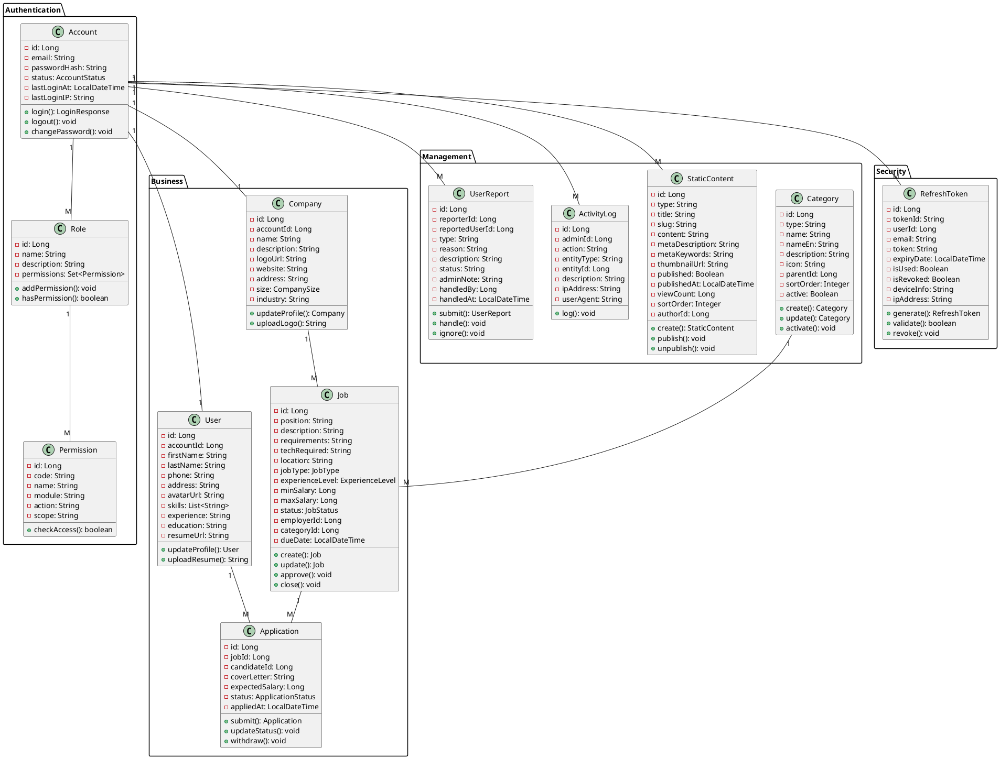
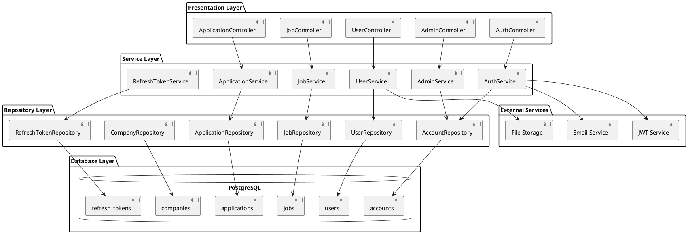

# 🎨 DIAGRAM VISUALIZATION GUIDE

## 📋 MỤC LỤC

- [ERD Visualization](#erd-visualization)
- [Use Case Visualization](#use-case-visualization)
- [Class Diagram Visualization](#class-diagram-visualization)
- [Architecture Diagram](#architecture-diagram)
- [Tools & Instructions](#tools--instructions)

---

## 🗄️ ERD VISUALIZATION

### **Method 1: PlantUML Online (Recommended)**
```bash
# 1. Open PlantUML Web Server
https://plantuml.com/

# 2. Copy ERD content from ERD_ANALYSIS.md
# 3. Paste into editor
# 4. Click "Generate"
# 5. Download as PNG/SVG
```

### **Method 2: Draw.io**
```bash
# 1. Open Draw.io
https://app.diagrams.net/

# 2. Create new diagram
# 3. Use ERD symbols from left panel
# 4. Follow entity relationships from ERD_ANALYSIS.md
# 5. Export as PNG/SVG/PDF
```

### **Method 3: VS Code + PlantUML Extension**
```bash
# 1. Install VS Code Extension
code --install-extension jebbs.plantuml

# 2. Create .puml file with ERD content
# 3. Open file in VS Code
# 4. Right-click → "Preview"
# 5. Export diagram
```

---

## 🎭 USE CASE VISUALIZATION

### **Method 1: PlantUML Use Case Diagram**
```bash
# 1. Copy use case diagram from USE_CASE_ANALYSIS.md
# 2. Paste into PlantUML editor
# 3. Generate diagram
# 4. Export as high-resolution PNG
```

### **Method 2: Draw.io Use Case Template**
```bash
# 1. Open Draw.io
# 2. File → New → Use Case Diagram
# 3. Add actors (stick figures)
# 4. Add use cases (ovals)
# 5. Connect with lines
# 6. Add system boundaries (rectangles)
```

### **Method 3: Lucidchart**
```bash
# 1. Open Lucidchart
https://www.lucidchart.com/

# 2. Create new diagram → Use Case
# 3. Use template for use case diagrams
# 4. Follow actor relationships from analysis
# 5. Export as PNG/SVG
```

---

## 🏗️ CLASS DIAGRAM VISUALIZATION

### **Complete Class Diagram (PlantUML)**


---

## 🏛️ ARCHITECTURE DIAGRAM

### **System Architecture (PlantUML)**


---

## 🛠️ TOOLS & INSTRUCTIONS

### **Recommended Tools**

#### **1. PlantUML (Best for Technical Diagrams)**
```bash
# Online Version
https://plantuml.com/

# VS Code Extension
code --install-extension jebbs.plantuml

# Desktop Version
https://plantuml.com/download

# Features:
✅ Free
✅ Text-based (version control friendly)
✅ Multiple diagram types
✅ High-quality exports
```

#### **2. Draw.io (Best for Business Diagrams)**
```bash
# Web Version
https://app.diagrams.net/

# Features:
✅ Free
✅ Drag-and-drop interface
✅ Professional templates
✅ Real-time collaboration
✅ Multiple export formats
```

#### **3. Lucidchart (Professional)**
```bash
# Web Version
https://www.lucidchart.com/

# Features:
✅ Professional templates
✅ Advanced collaboration
✅ Version history
✅ Integration with tools
```

#### **4. StarUML (Desktop)**
```bash
# Download
https://staruml.io/

# Features:
✅ Desktop application
✅ Code generation
✅ Multiple diagram types
✅ Plugin support
```

---

### **Step-by-Step Visualization Guide**

#### **Step 1: Choose Your Tool**
```
🎯 For technical documentation → PlantUML
🎯 For business presentations → Draw.io
🎯 For professional diagrams → Lucidchart
🎯 For desktop work → StarUML
```

#### **Step 2: Prepare Content**
```
📋 Copy ERD content from ERD_ANALYSIS.md
📋 Copy Use Cases from USE_CASE_ANALYSIS.md
📋 Copy Class Diagram from CLASS_DIAGRAM_GUIDE.md
```

#### **Step 3: Create Diagram**
```
🎨 Use appropriate symbols and notations
🔗 Follow entity relationships
📝 Add annotations and notes
🎯 Keep consistent styling
```

#### **Step 4: Export & Share**
```
📤 Export as PNG for presentations
📤 Export as SVG for web
📤 Export as PDF for documentation
📤 Export as PUML for version control
```

---

## 🎯 BEST PRACTICES

### **Diagram Design Principles**
```
✅ Consistency: Use same symbols throughout
✅ Clarity: Keep diagrams uncluttered
✅ Hierarchy: Show clear relationships
✅ Color Coding: Use colors for different layers
✅ Annotations: Add explanatory notes
✅ Version Control: Keep source files in VCS
```

### **ERD Best Practices**
```
✅ Show primary keys clearly
✅ Indicate foreign key relationships
✅ Use crow's foot notation for cardinality
✅ Group related entities
✅ Add data types for important fields
```

### **Use Case Best Practices**
```
✅ Use clear, concise descriptions
✅ Show actors and system boundaries
✅ Include preconditions and postconditions
✅ Show exception flows
✅ Number use cases for reference
```

### **Class Diagram Best Practices**
```
✅ Show inheritance with proper notation
✅ Indicate visibility (+/-/#)
✅ Show method parameters and return types
✅ Group related classes in packages
✅ Keep diagrams focused and readable
```

---

## 📱 MOBILE VISUALIZATION

### **Tablet/Phone Viewing**
```
📱 Use landscape orientation for complex diagrams
📱 Zoom in on specific sections
📱 Use high contrast colors
📱 Ensure text is readable on small screens
```

### **Interactive Features**
```
🖱️ Add clickable elements in web versions
🖱️ Include hover information
🖱️ Provide zoom controls
🖱️ Add search functionality for large diagrams
```

---

## 🎨 COLOR SCHEMES

### **Professional Blue Theme**
```
🔵 Primary: #2E86AB (Blue)
🔵 Secondary: #A23B72 (Dark Blue)
⚪ Accent: #F18F01 (Orange)
⚪ Background: #FFFFFF (White)
⚫ Text: #333333 (Dark Gray)
```

### **Modern Dark Theme**
```
⚫ Primary: #1E1E1E (Dark Gray)
⚪ Secondary: #2D2D30 (Medium Gray)
🔵 Accent: #007ACC (Blue)
⚪ Text: #FFFFFF (White)
🔵 Highlights: #264F78 (Light Blue)
```

---

## 📊 DIAGRAM METRICS

### **ERD Statistics**
```
📊 Total Entities: 12
📊 Relationships: 15
📊 Tables: 12
📊 Indexes: 15+
📊 Complexity: Medium-High
```

### **Use Case Statistics**
```
📊 Total Use Cases: 22
📊 Actors: 4
📊 System Boundaries: 4
📊 Complexity: Medium
📊 Coverage: Complete
```

### **Class Diagram Statistics**
```
📊 Total Classes: 15+
📊 Packages: 5
📊 Methods: 100+
📊 Relationships: 20+
📊 Inheritance: 5 levels
```

---

## 🚀 NEXT STEPS

### **Immediate Actions**
```
1. ✅ Choose visualization tool
2. ✅ Create ERD diagram
3. ✅ Create Use Case diagram
4. ✅ Create Class diagram
5. ✅ Create Architecture diagram
```

### **Documentation Integration**
```
1. 📄 Add diagrams to README
2. 📄 Include in project documentation
3. 📄 Add to developer onboarding
4. 📄 Update API documentation
5. 📄 Create presentation materials
```

### **Maintenance**
```
1. 🔄 Keep diagrams updated with code changes
2. 🔄 Version control diagram sources
3. 🔄 Review diagrams quarterly
4. 🔄 Get feedback from team
5. 🔄 Optimize for clarity and accuracy
```

---

**Ready to visualize your Job Portal system with professional diagrams! 🎨**
