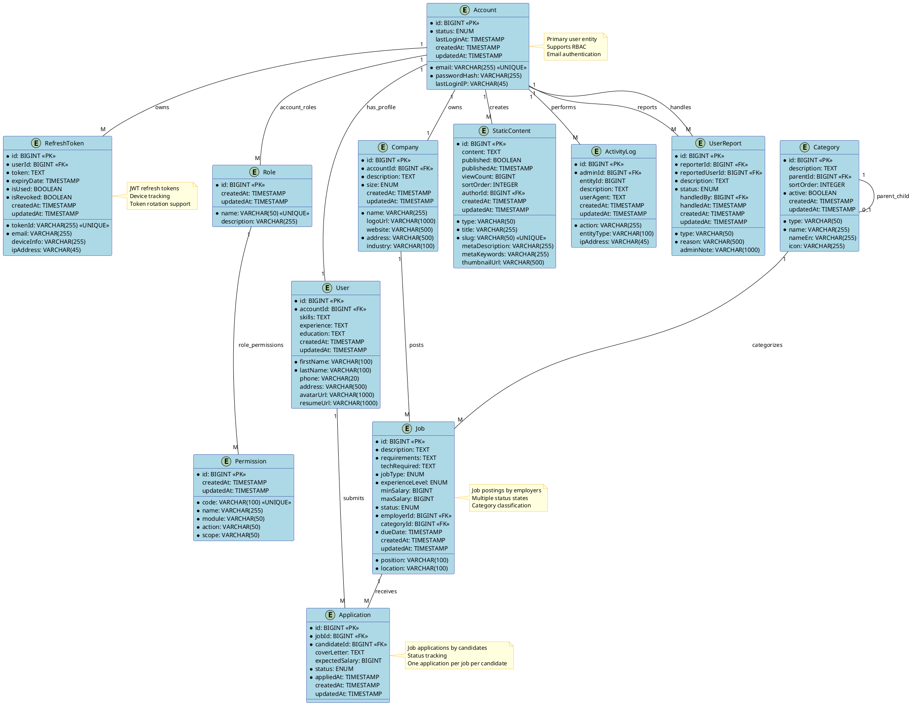

# 🗄️ ENTITY RELATIONSHIP DIAGRAM (ERD) ANALYSIS

## 📋 MỤC LỤC

- [Entities Overview](#entities-overview)
- [Relationships](#relationships)
- [Attributes](#attributes)
- [ERD Diagram](#erd-diagram)
- [Database Schema](#database-schema)

---

## 🏗️ ENTITIES OVERVIEW

### **Core Authentication Entities**
```
🔐 Account (Primary User Entity)
├── id (PK)
├── email (Unique)
├── passwordHash
├── status (ACTIVE, BANNED, PENDING)
├── lastLoginAt
└── lastLoginIP

👑 Role (RBAC Role)
├── id (PK)
├── name (Unique: ADMIN, EMPLOYER, CANDIDATE)
├── description
└── permissions (Many-to-Many)

🔑 Permission (RBAC Permission)
├── id (PK)
├── code (Unique: MODULE_ACTION_SCOPE)
├── name
├── module (AUTH, USER, JOB, etc.)
├── action (CREATE, READ, UPDATE, DELETE)
└── scope (ALL, OWN, JOB_OWN)
```

### **Business Entities**
```
👤 User (Candidate Profile)
├── id (PK)
├── accountId (FK → Account)
├── firstName
├── lastName
├── phone
├── address
├── avatarUrl
├── skills
├── experience
├── education
└── resumeUrl

🏢 Company (Employer Profile)
├── id (PK)
├── accountId (FK → Account)
├── name
├── description
├── logoUrl
├── website
├── address
├── size (STARTUP, SMALL, MEDIUM, LARGE, ENTERPRISE)
└── industry

💼 Job (Job Posting)
├── id (PK)
├── position
├── description
├── requirements
├── techRequired
├── location
├── jobType (FULL_TIME, PART_TIME, CONTRACT, INTERNSHIP, REMOTE)
├── experienceLevel (ENTRY, JUNIOR, MID, SENIOR, LEAD)
├── minSalary
├── maxSalary
├── status (PENDING, ACTIVE, CLOSED, EXPIRED)
├── employerId (FK → Company)
├── categoryId (FK → Category)
└── dueDate

📄 Application (Job Application)
├── id (PK)
├── jobId (FK → Job)
├── candidateId (FK → User)
├── coverLetter
├── expectedSalary
├── status (PENDING, REVIEWING, ACCEPTED, REJECTED, WITHDRAWN)
└── appliedAt
```

### **Management Entities**
```
📂 Category (Job Categories)
├── id (PK)
├── type
├── name
├── nameEn
├── description
├── icon
├── parentId (FK → Category, self-reference)
├── sortOrder
└── active

📝 StaticContent (CMS Content)
├── id (PK)
├── type
├── title
├── slug (Unique)
├── content
├── metaDescription
├── metaKeywords
├── thumbnailUrl
├── published
├── publishedAt
├── viewCount
├── sortOrder
└── authorId (FK → Account)

📊 ActivityLog (System Audit)
├── id (PK)
├── adminId (FK → Account)
├── action
├── entityType
├── entityId
├── description
├── ipAddress
└── userAgent

📋 UserReport (User Reports)
├── id (PK)
├── reporterId (FK → Account)
├── reportedUserId (FK → Account)
├── type
├── reason
├── description
├── status (PENDING, HANDLED, IGNORED)
├── adminNote
├── handledBy (FK → Account)
└── handledAt
```

### **Token Management**
```
🎫 RefreshToken (Token Storage)
├── id (PK)
├── tokenId (Unique)
├── userId (FK → Account)
├── email
├── token (TEXT)
├── expiryDate
├── isUsed
├── isRevoked
├── deviceInfo
└── ipAddress
```

---

## 🔗 RELATIONSHIPS

### **Primary Relationships**
```
Account (1) ←→ (M) Role          [account_roles]
Role (1) ←→ (M) Permission     [role_permissions]

Account (1) ←→ (1) User          [account_id]
Account (1) ←→ (1) Company       [account_id]

Company (1) ←→ (M) Job           [employer_id]
Job (1) ←→ (M) Application    [job_id]
User (1) ←→ (M) Application    [candidate_id]

Category (1) ←→ (M) Job          [category_id]
Category (1) ←→ (M) Category      [parent_id] (self-reference)

Account (1) ←→ (M) StaticContent  [author_id]
Account (1) ←→ (M) ActivityLog   [admin_id]
Account (1) ←→ (M) UserReport    [reporter_id, reported_user_id, handled_by]

Account (1) ←→ (M) RefreshToken   [user_id]
```

### **Relationship Types**
```
🔗 One-to-One (1:1)
├── Account → User (Candidate)
├── Account → Company (Employer)
└── Category → Category (Parent-Child)

🔗 One-to-Many (1:M)
├── Company → Job
├── Job → Application
├── User → Application
├── Category → Job
├── Account → StaticContent
├── Account → ActivityLog
├── Account → RefreshToken
└── Account → UserReport

🔗 Many-to-Many (M:N)
├── Account → Role
└── Role → Permission
```

---

## 📊 ATTRIBUTES ANALYSIS

### **Audit Fields (Common to All Entities)**
```java
@MappedSuperclass
public abstract class AuditEntity {
    @CreationTimestamp
    private LocalDateTime createdAt;
    
    @UpdateTimestamp
    private LocalDateTime updatedAt;
}
```

### **Key Constraints**
```
🔑 Primary Keys (PK)
├── All entities: id (BIGINT, AUTO_INCREMENT)

🔑 Unique Constraints
├── Account.email
├── Role.name
├── Permission.code
├── StaticContent.slug
├── RefreshToken.tokenId

🔑 Foreign Keys (FK)
├── User.account_id → Account.id
├── Company.account_id → Account.id
├── Job.employer_id → Company.id
├── Application.job_id → Job.id
├── Application.candidate_id → User.id
├── Job.category_id → Category.id
├── Category.parent_id → Category.id
├── StaticContent.author_id → Account.id
├── ActivityLog.admin_id → Account.id
├── UserReport.reporter_id → Account.id
├── UserReport.reported_user_id → Account.id
├── UserReport.handled_by → Account.id
├── RefreshToken.user_id → Account.id
```

---

## 🎨 ERD DIAGRAM (PlantUML)



---

## 🗃️ DATABASE SCHEMA

### **Core Tables**
```sql
-- Authentication
CREATE TABLE accounts (
    id BIGSERIAL PRIMARY KEY,
    email VARCHAR(255) UNIQUE NOT NULL,
    password_hash VARCHAR(255) NOT NULL,
    status VARCHAR(20) NOT NULL,
    last_login_at TIMESTAMP,
    last_login_ip VARCHAR(45),
    created_at TIMESTAMP NOT NULL DEFAULT NOW(),
    updated_at TIMESTAMP NOT NULL DEFAULT NOW()
);

CREATE TABLE roles (
    id BIGSERIAL PRIMARY KEY,
    name VARCHAR(50) UNIQUE NOT NULL,
    description VARCHAR(255),
    created_at TIMESTAMP NOT NULL DEFAULT NOW(),
    updated_at TIMESTAMP NOT NULL DEFAULT NOW()
);

CREATE TABLE permissions (
    id BIGSERIAL PRIMARY KEY,
    code VARCHAR(100) UNIQUE NOT NULL,
    name VARCHAR(255) NOT NULL,
    module VARCHAR(50) NOT NULL,
    action VARCHAR(50) NOT NULL,
    scope VARCHAR(50) NOT NULL,
    created_at TIMESTAMP NOT NULL DEFAULT NOW(),
    updated_at TIMESTAMP NOT NULL DEFAULT NOW()
);

-- RBAC Mappings
CREATE TABLE account_roles (
    account_id BIGINT NOT NULL REFERENCES accounts(id),
    role_id BIGINT NOT NULL REFERENCES roles(id),
    PRIMARY KEY (account_id, role_id)
);

CREATE TABLE role_permissions (
    role_id BIGINT NOT NULL REFERENCES roles(id),
    permission_id BIGINT NOT NULL REFERENCES permissions(id),
    PRIMARY KEY (role_id, permission_id)
);
```

### **Business Tables**
```sql
-- Profiles
CREATE TABLE users (
    id BIGSERIAL PRIMARY KEY,
    account_id BIGINT UNIQUE NOT NULL REFERENCES accounts(id),
    first_name VARCHAR(100) NOT NULL,
    last_name VARCHAR(100) NOT NULL,
    phone VARCHAR(20),
    address VARCHAR(500),
    avatar_url VARCHAR(1000),
    skills TEXT,
    experience TEXT,
    education TEXT,
    resume_url VARCHAR(1000),
    created_at TIMESTAMP NOT NULL DEFAULT NOW(),
    updated_at TIMESTAMP NOT NULL DEFAULT NOW()
);

CREATE TABLE companies (
    id BIGSERIAL PRIMARY KEY,
    account_id BIGINT UNIQUE NOT NULL REFERENCES accounts(id),
    name VARCHAR(255) NOT NULL,
    description TEXT,
    logo_url VARCHAR(1000),
    website VARCHAR(500),
    address VARCHAR(500) NOT NULL,
    size VARCHAR(20) NOT NULL,
    industry VARCHAR(100),
    created_at TIMESTAMP NOT NULL DEFAULT NOW(),
    updated_at TIMESTAMP NOT NULL DEFAULT NOW()
);

-- Jobs & Applications
CREATE TABLE jobs (
    id BIGSERIAL PRIMARY KEY,
    position VARCHAR(100) NOT NULL,
    description TEXT NOT NULL,
    requirements TEXT NOT NULL,
    tech_required TEXT,
    location VARCHAR(100) NOT NULL,
    job_type VARCHAR(20) NOT NULL,
    experience_level VARCHAR(20) NOT NULL,
    min_salary BIGINT,
    max_salary BIGINT,
    status VARCHAR(20) NOT NULL,
    employer_id BIGINT NOT NULL REFERENCES companies(id),
    category_id BIGINT REFERENCES categories(id),
    due_date TIMESTAMP NOT NULL,
    created_at TIMESTAMP NOT NULL DEFAULT NOW(),
    updated_at TIMESTAMP NOT NULL DEFAULT NOW()
);

CREATE TABLE applications (
    id BIGSERIAL PRIMARY KEY,
    job_id BIGINT NOT NULL REFERENCES jobs(id),
    candidate_id BIGINT NOT NULL REFERENCES users(id),
    cover_letter TEXT,
    expected_salary BIGINT,
    status VARCHAR(20) NOT NULL,
    applied_at TIMESTAMP NOT NULL DEFAULT NOW(),
    created_at TIMESTAMP NOT NULL DEFAULT NOW(),
    updated_at TIMESTAMP NOT NULL DEFAULT NOW(),
    UNIQUE(job_id, candidate_id)
);
```

---

## 📈 INDEXES & PERFORMANCE

### **Recommended Indexes**
```sql
-- Authentication
CREATE INDEX idx_accounts_email ON accounts(email);
CREATE INDEX idx_accounts_status ON accounts(status);

-- Jobs
CREATE INDEX idx_jobs_employer_id ON jobs(employer_id);
CREATE INDEX idx_jobs_category_id ON jobs(category_id);
CREATE INDEX idx_jobs_status ON jobs(status);
CREATE INDEX idx_jobs_due_date ON jobs(due_date);
CREATE INDEX idx_jobs_location ON jobs(location);

-- Applications
CREATE INDEX idx_applications_job_id ON applications(job_id);
CREATE INDEX idx_applications_candidate_id ON applications(candidate_id);
CREATE INDEX idx_applications_status ON applications(status);

-- Categories
CREATE INDEX idx_categories_parent_id ON categories(parent_id);
CREATE INDEX idx_categories_type ON categories(type);
CREATE INDEX idx_categories_active ON categories(active);

-- Tokens
CREATE INDEX idx_refresh_tokens_user_id ON refresh_tokens(user_id);
CREATE INDEX idx_refresh_tokens_token_id ON refresh_tokens(token_id);
CREATE INDEX idx_refresh_tokens_expiry_date ON refresh_tokens(expiry_date);
```

---

## 🔍 ERD ANALYSIS SUMMARY

### **Entity Count**: 12 entities
### **Relationship Types**: 
- 1:1 relationships: 3
- 1:M relationships: 10
- M:N relationships: 2

### **Key Features**:
- ✅ RBAC system with roles & permissions
- ✅ Audit trails with timestamps
- ✅ Token management for security
- ✅ Hierarchical categories
- ✅ Complete job application workflow
- ✅ Content management system
- ✅ User reporting system

### **Database Design Principles**:
- ✅ Normalized to 3NF
- ✅ Proper foreign key constraints
- ✅ Unique constraints where needed
- ✅ Audit fields on all entities
- ✅ Appropriate indexes for performance
