# 🎭 USE CASE ANALYSIS - JOB PORTAL RBAC SYSTEM

## 📋 MỤC LỤC

- [Actors Overview](#actors-overview)
- [Authentication Use Cases](#authentication-use-cases)
- [User Management Use Cases](#user-management-use-cases)
- [Job Management Use Cases](#job-management-use-cases)
- [Application Use Cases](#application-use-cases)
- [Admin Use Cases](#admin-use-cases)
- [System Use Cases](#system-use-cases)
- [Use Case Diagram](#use-case-diagram)

---

## 👥 ACTORS OVERVIEW

### **Primary Actors**
```
👤 CANDIDATE
├── Job seeker
├── Submits applications
├── Manages profile
└── Views job listings

🏢 EMPLOYER
├── Job poster
├── Reviews applications
├── Manages company profile
└── Posts job listings

👑 ADMIN
├── System administrator
├── Manages all users
├── Controls system settings
└── Handles reports

🤖 SYSTEM
├── Automated processes
├── Token management
├── Email notifications
└── Data cleanup
```

---

## 🔐 AUTHENTICATION USE CASES

### **UC-01: User Registration**
```
Actor: CANDIDATE, EMPLOYER
Description: New user creates account
Preconditions: Valid email, password
Main Flow:
1. User enters registration details
2. System validates email uniqueness
3. System creates Account with ACTIVE status
4. System assigns default role (CANDIDATE/EMPLOYER)
5. System creates corresponding profile (User/Company)
6. System sends welcome email
Postconditions: Account created, profile created
Exceptions: Email already exists, invalid data
```

### **UC-02: User Login**
```
Actor: CANDIDATE, EMPLOYER, ADMIN
Description: User authenticates to system
Preconditions: Valid account exists
Main Flow:
1. User enters email and password
2. System validates credentials
3. System generates JWT access token (24h)
4. System generates refresh token (7d)
5. System updates lastLoginAt and lastLoginIP
6. System returns tokens and user info
Postconditions: User authenticated, tokens issued
Exceptions: Invalid credentials, account banned
```

### **UC-03: Token Refresh**
```
Actor: CANDIDATE, EMPLOYER, ADMIN
Description: User refreshes expired access token
Preconditions: Valid refresh token exists
Main Flow:
1. User sends refresh token request
2. System validates refresh token
3. System checks token not used/revoked/expired
4. System generates new access token
5. System marks old refresh token as used
6. System generates new refresh token
7. System returns new tokens
Postconditions: New tokens issued, old token invalidated
Exceptions: Invalid/expired refresh token
```

### **UC-04: User Logout**
```
Actor: CANDIDATE, EMPLOYER, ADMIN
Description: User logs out from system
Preconditions: User is authenticated
Main Flow:
1. User sends logout request
2. System revokes current refresh token
3. System optionally revokes all user tokens
4. System clears session data
Postconditions: User logged out, tokens revoked
Exceptions: None
```

### **UC-05: Password Management**
```
Actor: CANDIDATE, EMPLOYER, ADMIN
Description: User changes password
Preconditions: User is authenticated
Main Flow:
1. User enters current password
2. User enters new password
3. System validates current password
4. System validates new password strength
5. System updates password hash
6. System invalidates all refresh tokens
7. System sends confirmation email
Postconditions: Password changed, tokens invalidated
Exceptions: Invalid current password, weak password
```

---

## 👤 USER MANAGEMENT USE CASES

### **UC-06: Profile Management**
```
Actor: CANDIDATE
Description: Candidate manages personal profile
Preconditions: User is authenticated as CANDIDATE
Main Flow:
1. User views current profile information
2. User updates personal details (name, phone, address)
3. User uploads/updates avatar
4. User updates skills and experience
5. User uploads/updates resume
6. System validates and saves changes
7. System updates audit trail
Postconditions: Profile updated successfully
Exceptions: Invalid data, file upload errors
```

### **UC-07: Company Profile Management**
```
Actor: EMPLOYER
Description: Employer manages company profile
Preconditions: User is authenticated as EMPLOYER
Main Flow:
1. User views current company information
2. User updates company details (name, description, website)
3. User uploads company logo
4. User updates company size and industry
5. System validates and saves changes
6. System updates audit trail
Postconditions: Company profile updated successfully
Exceptions: Invalid data, file upload errors
```

### **UC-08: Account Status Management**
```
Actor: ADMIN
Description: Admin manages user account status
Preconditions: User is authenticated as ADMIN
Main Flow:
1. Admin searches for user account
2. Admin views current account status
3. Admin changes account status (ACTIVE/BANNED/PENDING)
4. System validates status change
5. System updates account status
6. System logs status change in ActivityLog
7. System sends notification email to user
Postconditions: Account status updated
Exceptions: User not found, invalid status
```

---

## 💼 JOB MANAGEMENT USE CASES

### **UC-09: Job Creation**
```
Actor: EMPLOYER
Description: Employer creates new job posting
Preconditions: User is authenticated as EMPLOYER, company verified
Main Flow:
1. User enters job details (position, description, requirements)
2. User specifies job type, experience level, location
3. User sets salary range and due date
4. User selects job category
5. System validates job data
6. System creates job with PENDING status
7. System sends notification to admin for approval
8. System logs job creation
Postconditions: Job created, pending approval
Exceptions: Invalid data, insufficient permissions
```

### **UC-10: Job Search & Filtering**
```
Actor: CANDIDATE, EMPLOYER
Description: Users search and filter job listings
Preconditions: User is authenticated
Main Flow:
1. User enters search criteria (keywords, location)
2. User applies filters (job type, experience level, salary)
3. User sorts results (date, relevance, salary)
4. System searches job database
5. System applies filters and sorting
6. System returns paginated results
7. User can save search criteria
Postconditions: Search results displayed
Exceptions: No results found, invalid search criteria
```

### **UC-11: Job Application**
```
Actor: CANDIDATE
Description: Candidate applies for job
Preconditions: User is authenticated as CANDIDATE, profile complete
Main Flow:
1. User views job details
2. User clicks "Apply" button
3. User writes cover letter
4. User specifies expected salary
5. User uploads resume (if not already uploaded)
6. System validates application data
7. System checks user hasn't applied before
8. System creates application with PENDING status
9. System sends notification to employer
10. System logs application
Postconditions: Application submitted successfully
Exceptions: Already applied, incomplete profile
```

### **UC-12: Application Management**
```
Actor: EMPLOYER
Description: Employer manages job applications
Preconditions: User is authenticated as EMPLOYER
Main Flow:
1. User views applications for their jobs
2. User filters applications (job, status, date)
3. User reviews application details and resume
4. User changes application status (REVIEWING/ACCEPTED/REJECTED)
5. User can shortlist promising candidates
6. User can schedule interviews
7. System updates application status
8. System sends notifications to candidates
9. System logs status changes
Postconditions: Application status updated
Exceptions: Application not found, invalid status
```

### **UC-13: Job Status Management**
```
Actor: EMPLOYER, ADMIN
Description: Manage job lifecycle status
Preconditions: User has appropriate permissions
Main Flow:
1. User selects job to manage
2. User changes job status:
   - EMPLOYER: PUBLISH/UNPUBLISH/CLOSE/EXTEND
   - ADMIN: APPROVE/REJECT/FEATURE
3. System validates status change
4. System updates job status
5. System logs status change
6. System sends notifications if needed
Postconditions: Job status updated
Exceptions: Job not found, invalid status transition
```

---

## 📋 ADMIN USE CASES

### **UC-14: User Management**
```
Actor: ADMIN
Description: Admin manages all user accounts
Preconditions: User is authenticated as ADMIN
Main Flow:
1. Admin views user list with filters
2. Admin searches users by email, name, role
3. Admin views user details and activity
4. Admin can:
   - View user profile (User/Company)
   - Update user information
   - Change user roles
   - Ban/unban user accounts
   - Delete user accounts
5. System validates all actions
6. System logs all admin actions
7. System sends notifications for critical changes
Postconditions: User management actions completed
Exceptions: User not found, insufficient permissions
```

### **UC-15: Role & Permission Management**
```
Actor: ADMIN
Description: Admin manages RBAC roles and permissions
Preconditions: User is authenticated as ADMIN
Main Flow:
1. Admin views all roles and permissions
2. Admin can create new roles
3. Admin can assign permissions to roles
4. Admin can assign roles to users
5. System validates RBAC constraints
6. System updates role-permission mappings
7. System logs all RBAC changes
Postconditions: RBAC configuration updated
Exceptions: Invalid role/permission, circular dependencies
```

### **UC-16: Category Management**
```
Actor: ADMIN
Description: Admin manages job categories
Preconditions: User is authenticated as ADMIN
Main Flow:
1. Admin views category hierarchy
2. Admin can create new categories
3. Admin can update category details
4. Admin can reorder categories
5. Admin can activate/deactivate categories
6. System validates category structure
7. System updates category hierarchy
8. System logs category changes
Postconditions: Category structure updated
Exceptions: Invalid parent category, duplicate names
```

### **UC-17: Content Management**
```
Actor: ADMIN
Description: Admin manages static content (CMS)
Preconditions: User is authenticated as ADMIN
Main Flow:
1. Admin views content list
2. Admin creates new content pages
3. Admin edits existing content
4. Admin manages content metadata (SEO, images)
5. Admin publishes/unpublishes content
6. System validates content structure
7. System updates content
8. System logs content changes
Postconditions: Content updated successfully
Exceptions: Invalid slug, duplicate content
```

### **UC-18: Report Management**
```
Actor: ADMIN
Description: Admin handles user reports
Preconditions: User is authenticated as ADMIN
Main Flow:
1. Admin views list of user reports
2. Admin filters reports by status, type, date
3. Admin reviews report details
4. Admin investigates reported content/user
5. Admin takes action:
   - Handle report (take action)
   - Ignore report (no action needed)
   - Ban reported user if violation
6. Admin adds admin notes
7. System updates report status
8. System sends notifications to involved users
9. System logs report handling
Postconditions: Report processed
Exceptions: Report not found, invalid action
```

### **UC-19: System Analytics**
```
Actor: ADMIN
Description: Admin views system analytics and reports
Preconditions: User is authenticated as ADMIN
Main Flow:
1. Admin views dashboard with key metrics
2. Admin can view:
   - User statistics (registration, activity)
   - Job statistics (posted, filled, expired)
   - Application statistics (submitted, hired)
   - Company statistics (verified, active)
   - System performance metrics
3. Admin can filter by date ranges
4. Admin can export reports
5. System generates real-time analytics
6. System caches frequently accessed data
Postconditions: Analytics displayed
Exceptions: Data not available, export errors
```

---

## 🔧 SYSTEM USE CASES

### **UC-20: Token Cleanup**
```
Actor: SYSTEM
Description: Automated cleanup of expired tokens
Preconditions: Scheduled task configured
Main Flow:
1. System runs cleanup job (daily at 2 AM)
2. System deletes expired refresh tokens
3. System deletes used refresh tokens
4. System logs cleanup activities
5. System sends cleanup report to admin
Postconditions: Expired tokens removed
Exceptions: Database errors
```

### **UC-21: Email Notifications**
```
Actor: SYSTEM
Description: Automated email notifications
Preconditions: Email system configured
Main Flow:
1. System triggers email events:
   - Welcome email (registration)
   - Password reset request
   - Job application received
   - Application status change
   - Account status change
   - System maintenance notices
2. System generates email content
3. System sends emails via SMTP
4. System logs email delivery status
5. System handles delivery failures
Postconditions: Emails sent successfully
Exceptions: Email delivery failures
```

### **UC-22: Data Backup**
```
Actor: SYSTEM
Description: Automated database backups
Preconditions: Backup system configured
Main Flow:
1. System creates scheduled backups (daily)
2. System compresses backup files
3. System stores backups securely
4. System verifies backup integrity
5. System cleans old backups
6. System sends backup status to admin
Postconditions: Database backed up
Exceptions: Backup failures, storage issues
```

---

## 🎨 USE CASE DIAGRAM (PlantUML)

```plantuml
@startuml Job_Portal_Use_Cases

' ========== ACTORS ==========
actor Candidate as "👤\nCANDIDATE"
actor Employer as "🏢\nEMPLOYER"
actor Admin as "👑\nADMIN"
actor System as "🤖\nSYSTEM"

' ========== AUTHENTICATION USE CASES ==========
rectangle "Authentication" {
    usecase "UC-01: Register" as UC01
    usecase "UC-02: Login" as UC02
    usecase "UC-03: Refresh Token" as UC03
    usecase "UC-04: Logout" as UC04
    usecase "UC-05: Change Password" as UC05
}

' ========== USER MANAGEMENT ==========
rectangle "User Management" {
    usecase "UC-06: Manage Profile" as UC06
    usecase "UC-07: Manage Company" as UC07
    usecase "UC-08: Manage Account Status" as UC08
}

' ========== JOB MANAGEMENT ==========
rectangle "Job Management" {
    usecase "UC-09: Create Job" as UC09
    usecase "UC-10: Search Jobs" as UC10
    usecase "UC-11: Apply to Job" as UC11
    usecase "UC-12: Manage Applications" as UC12
    usecase "UC-13: Manage Job Status" as UC13
}

' ========== ADMIN MANAGEMENT ==========
rectangle "Admin Management" {
    usecase "UC-14: Manage Users" as UC14
    usecase "UC-15: Manage RBAC" as UC15
    usecase "UC-16: Manage Categories" as UC16
    usecase "UC-17: Manage Content" as UC17
    usecase "UC-18: Handle Reports" as UC18
    usecase "UC-19: View Analytics" as UC19
}

' ========== SYSTEM PROCESSES ==========
rectangle "System Processes" {
    usecase "UC-20: Token Cleanup" as UC20
    usecase "UC-21: Email Notifications" as UC21
    usecase "UC-22: Data Backup" as UC22
}

' ========== RELATIONSHIPS ==========

' === CANDIDATE RELATIONSHIPS ===
Candidate --> UC01 : can
Candidate --> UC02 : can
Candidate --> UC03 : can
Candidate --> UC04 : can
Candidate --> UC05 : can
Candidate --> UC06 : can
Candidate --> UC10 : can
Candidate --> UC11 : can

' === EMPLOYER RELATIONSHIPS ===
Employer --> UC01 : can
Employer --> UC02 : can
Employer --> UC03 : can
Employer --> UC04 : can
Employer --> UC05 : can
Employer --> UC07 : can
Employer --> UC09 : can
Employer --> UC10 : can
Employer --> UC12 : can
Employer --> UC13 : can

' === ADMIN RELATIONSHIPS ===
Admin --> UC02 : can
Admin --> UC03 : can
Admin --> UC04 : can
Admin --> UC05 : can
Admin --> UC08 : can
Admin --> UC14 : can
Admin --> UC15 : can
Admin --> UC16 : can
Admin --> UC17 : can
Admin --> UC18 : can
Admin --> UC19 : can

' === SYSTEM RELATIONSHIPS ===
System --> UC20 : performs
System --> UC21 : performs
System --> UC22 : performs

' === INCLUDE/EXTEND RELATIONSHIPS ===
UC09 ..> UC13 : includes
UC11 ..> UC12 : extends
UC14 ..> UC08 : includes
UC18 ..> UC08 : extends

' ========== NOTES ==========
note right of UC02
  Core authentication
  Returns JWT tokens
  Supports refresh flow
end note

note right of UC11
  One application per job
  Requires complete profile
  Status tracking
end note

note right of UC15
  RBAC management
  Role-permission mapping
  User role assignment
end note

@enduml
```



---

## 📊 USE CASE SUMMARY

### **Total Use Cases**: 22
### **By Category**:
- **Authentication**: 5 use cases
- **User Management**: 3 use cases  
- **Job Management**: 5 use cases
- **Admin Management**: 6 use cases
- **System Processes**: 3 use cases

### **By Actor**:
- **CANDIDATE**: 8 use cases
- **EMPLOYER**: 8 use cases
- **ADMIN**: 9 use cases
- **SYSTEM**: 3 use cases

### **Complexity Levels**:
- **Simple**: Registration, Login, Logout, Search (UC-01,02,04,10)
- **Medium**: Profile Management, Job Creation, Application (UC-06,07,09,11)
- **Complex**: RBAC Management, Analytics, System Processes (UC-15,19,20,21,22)

### **Key Features**:
- ✅ Complete authentication flow with token refresh
- ✅ Role-based access control throughout system
- ✅ Comprehensive job application workflow
- ✅ Full admin management capabilities
- ✅ Automated system processes
- ✅ Audit trails and logging
- ✅ Content management system
- ✅ User reporting mechanism

### **Security Considerations**:
- ✅ All actions require appropriate permissions
- ✅ Sensitive operations logged
- ✅ Token-based authentication with rotation
- ✅ Input validation and sanitization
- ✅ Rate limiting and abuse prevention
