# Tổng hợp use case theo Controller

Tài liệu này được tổng hợp từ các controller trong `src/main/java/com/iting/jobportal`. Mục tiêu là liệt kê các use case hiện có của hệ thống theo actor/module để phục vụ viết tài liệu đặc tả.

Sơ đồ Mermaid đầy đủ cho _tất cả_ use case: `instructions/USE_CASES_FROM_CONTROLLERS_MERMAID_ALL.md`.

## Actor chính

| Actor              | Mô tả                                                                                                                      |
| ------------------ | -------------------------------------------------------------------------------------------------------------------------- |
| Guest              | Người dùng chưa đăng nhập, có thể xem nội dung công khai, tìm việc, xem công ty, đăng ký, đăng nhập và khôi phục mật khẩu. |
| Candidate          | Ứng viên, có thể quản lý hồ sơ, CV, ứng tuyển, lưu việc, theo dõi công ty, nhận thông báo việc làm và nhắn tin.            |
| Employer           | Nhà tuyển dụng, có thể quản lý hồ sơ công ty, đăng tin tuyển dụng, quản lý ứng viên và nhắn tin.                           |
| Admin              | Quản trị viên, có thể quản trị user, công ty, job, đơn ứng tuyển, báo cáo, cấu hình hệ thống và audit log.                 |
| Authenticated User | Người dùng đã đăng nhập, dùng các chức năng chung như hồ sơ cá nhân, thông báo, tin nhắn, báo cáo.                         |

## Sơ đồ Mermaid

Các sơ đồ dưới đây được viết bằng Mermaid để có thể nhúng trực tiếp vào Markdown viewer có hỗ trợ Mermaid.

### Use case tổng quan hệ thống

```mermaid
flowchart LR
    guest["Guest"]
    candidate["Candidate"]
    employer["Employer"]
    admin["Admin"]
    user["Authenticated User"]

    subgraph public_uc["Public use cases"]
        uc_auth["Đăng ký / đăng nhập / khôi phục mật khẩu"]
        uc_public_content["Xem nội dung công khai"]
        uc_search_jobs["Tìm kiếm và xem việc làm"]
        uc_view_companies["Tìm kiếm và xem công ty"]
    end

    subgraph candidate_uc["Candidate use cases"]
        uc_candidate_profile["Quản lý hồ sơ ứng viên"]
        uc_cv["Quản lý CV"]
        uc_apply["Ứng tuyển và theo dõi đơn"]
        uc_saved_jobs["Lưu việc làm"]
        uc_follow_company["Theo dõi công ty"]
        uc_job_alert["Xem job alert"]
    end

    subgraph employer_uc["Employer use cases"]
        uc_company_profile["Quản lý hồ sơ công ty"]
        uc_company_review["Gửi hồ sơ công ty để duyệt"]
        uc_employer_jobs["Quản lý tin tuyển dụng"]
        uc_employer_apps["Quản lý đơn ứng tuyển"]
        uc_candidate_search["Tìm ứng viên bằng CV / keyword"]
    end

    subgraph common_uc["Common authenticated use cases"]
        uc_user_profile["Quản lý hồ sơ cá nhân"]
        uc_messages["Nhắn tin"]
        uc_notifications["Nhận và xử lý thông báo"]
        uc_reports["Gửi báo cáo vi phạm"]
    end

    subgraph admin_uc["Admin use cases"]
        uc_admin_users["Quản trị user"]
        uc_admin_companies["Duyệt và quản trị công ty"]
        uc_admin_jobs["Duyệt và quản trị job"]
        uc_admin_apps["Quản trị đơn ứng tuyển"]
        uc_admin_reports["Xử lý báo cáo"]
        uc_admin_config["Cấu hình và audit hệ thống"]
    end

    guest --> uc_auth
    guest --> uc_public_content
    guest --> uc_search_jobs
    guest --> uc_view_companies

    candidate --> uc_candidate_profile
    candidate --> uc_cv
    candidate --> uc_apply
    candidate --> uc_saved_jobs
    candidate --> uc_follow_company
    candidate --> uc_job_alert
    candidate --> uc_messages
    candidate --> uc_notifications
    candidate --> uc_reports

    employer --> uc_company_profile
    employer --> uc_company_review
    employer --> uc_employer_jobs
    employer --> uc_employer_apps
    employer --> uc_candidate_search
    employer --> uc_messages
    employer --> uc_notifications
    employer --> uc_reports

    user --> uc_user_profile
    user --> uc_messages
    user --> uc_notifications
    user --> uc_reports

    admin --> uc_admin_users
    admin --> uc_admin_companies
    admin --> uc_admin_jobs
    admin --> uc_admin_apps
    admin --> uc_admin_reports
    admin --> uc_admin_config
```

### Use case của Candidate

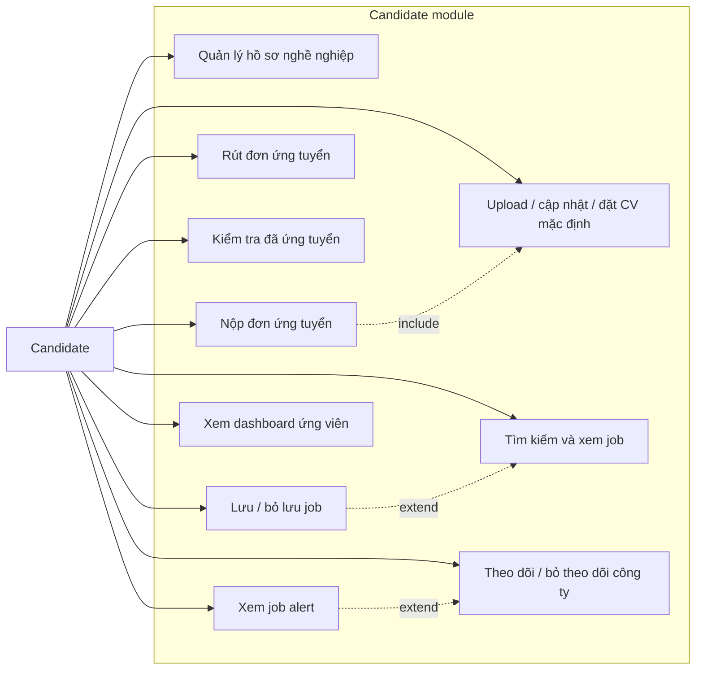

### Use case của Employer

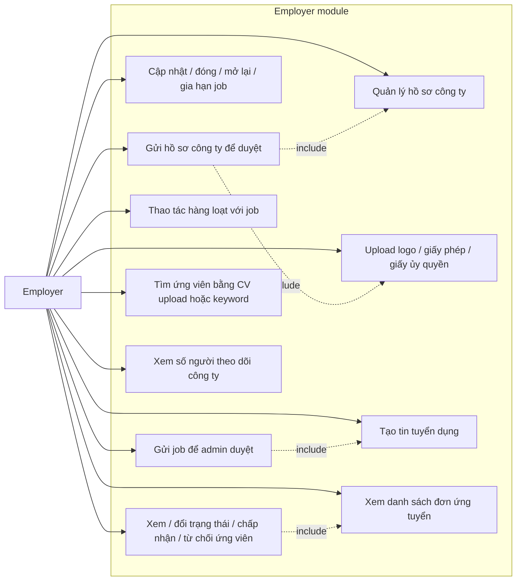

### Use case của Admin

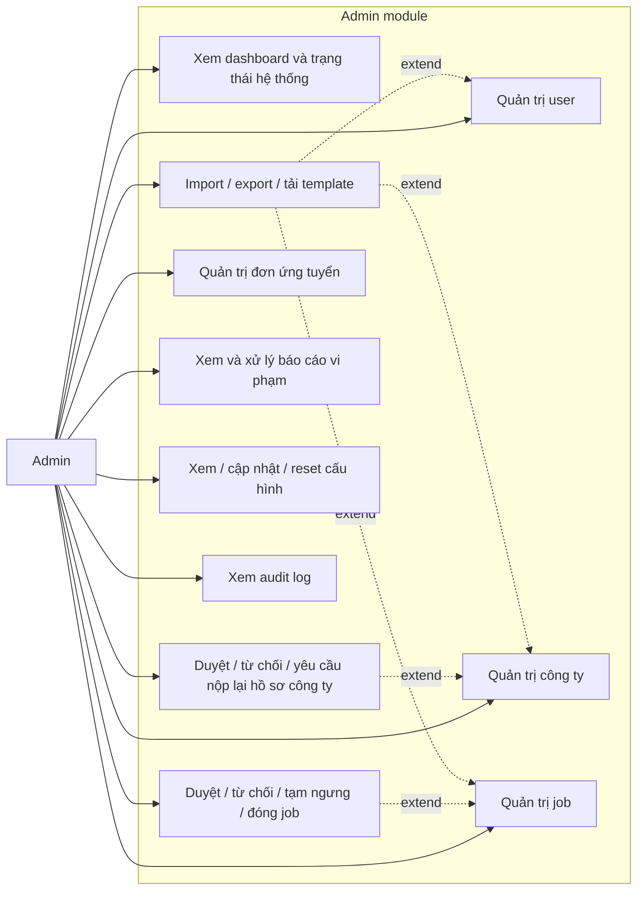

### Activity: đăng ký, đăng nhập và làm mới token

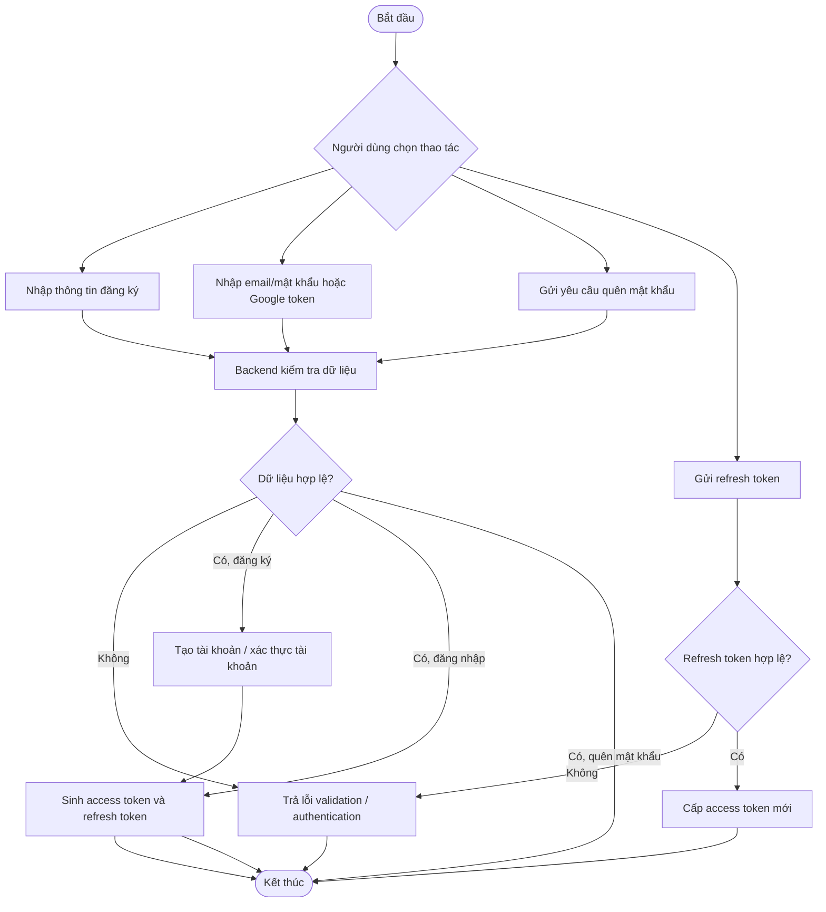

### Activity: Candidate ứng tuyển job

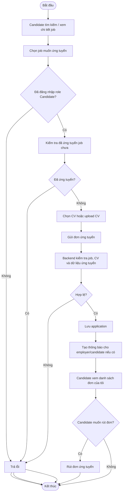

### Activity: Employer đăng và quản lý job

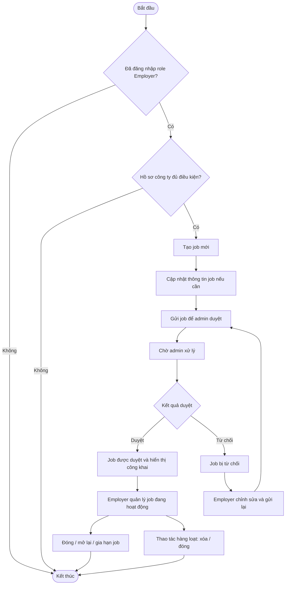

### Activity: Employer xử lý đơn ứng tuyển

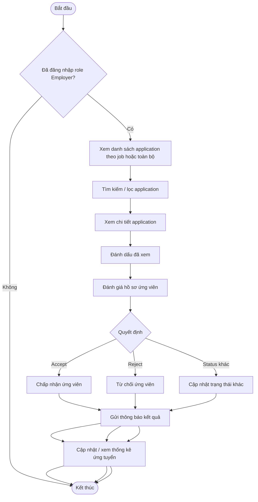

### Activity: Employer gửi hồ sơ công ty và Admin duyệt KYB

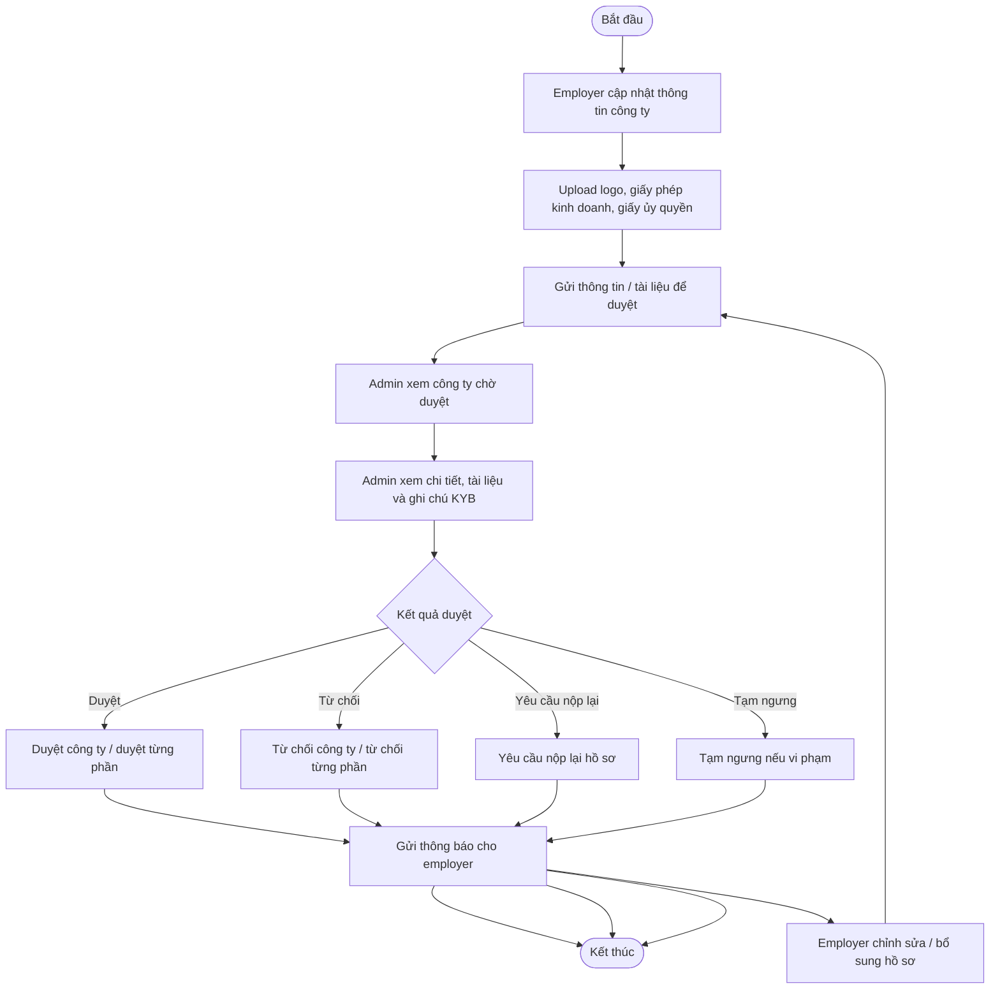

### Activity: Admin duyệt và quản trị job

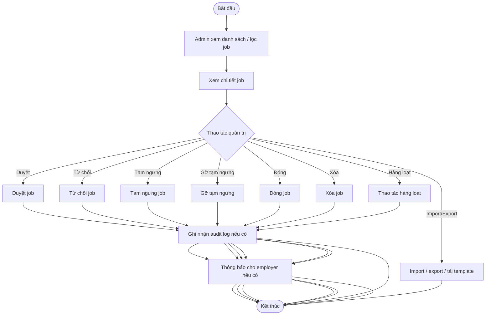

### Activity: nhắn tin realtime

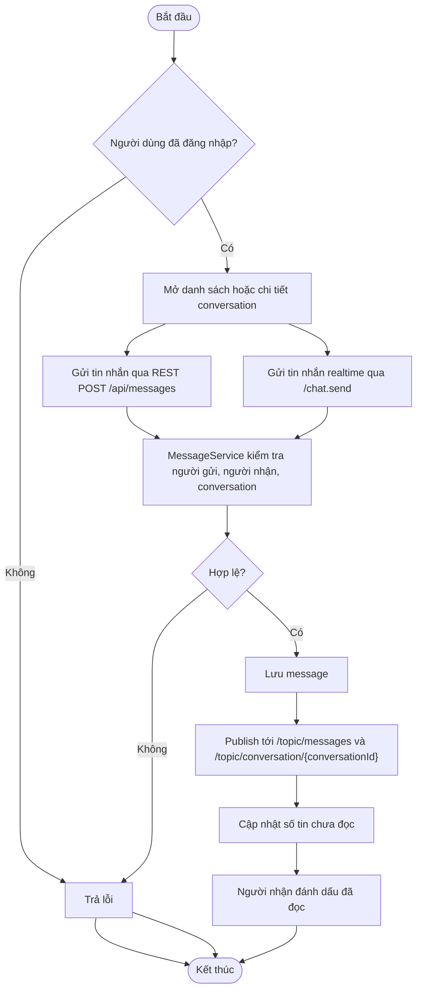

## Auth và phiên đăng nhập

| Mã UC   | Use case                         | Actor              | Endpoint chính                           |
| ------- | -------------------------------- | ------------------ | ---------------------------------------- |
| AUTH-01 | Đăng ký tài khoản                | Guest              | `POST /api/auth/register`                |
| AUTH-02 | Đăng nhập bằng email/mật khẩu    | Guest              | `POST /api/auth/login`                   |
| AUTH-03 | Đăng nhập bằng Google            | Guest              | `POST /api/auth/google`                  |
| AUTH-04 | Đổi mật khẩu                     | Authenticated User | `POST /api/auth/change-password`         |
| AUTH-05 | Gửi yêu cầu quên mật khẩu        | Guest              | `POST /api/auth/forgot-password`         |
| AUTH-06 | Đặt lại mật khẩu                 | Guest              | `POST /api/auth/reset-password`          |
| AUTH-07 | Lấy thông tin tài khoản hiện tại | Authenticated User | `GET /api/auth/me`                       |
| AUTH-08 | Làm mới access token             | Guest/User         | `POST /api/auth/refresh`                 |
| AUTH-09 | Đăng xuất phiên hiện tại         | Authenticated User | `POST /api/auth/logout`                  |
| AUTH-10 | Đăng xuất tất cả phiên           | Authenticated User | `POST /api/auth/logout-all`              |
| AUTH-11 | Admin khóa tài khoản             | Admin              | `POST /api/v1/admin/accounts/{id}/ban`   |
| AUTH-12 | Admin mở khóa tài khoản          | Admin              | `POST /api/v1/admin/accounts/{id}/unban` |

## Nội dung công khai

| Mã UC  | Use case                            | Actor | Endpoint chính                          |
| ------ | ----------------------------------- | ----- | --------------------------------------- |
| PUB-01 | Xem trang nội dung tĩnh theo slug   | Guest | `GET /api/public/pages/{slug}`          |
| PUB-02 | Xem danh sách FAQ                   | Guest | `GET /api/public/faqs`                  |
| PUB-03 | Xem danh sách blog                  | Guest | `GET /api/public/blogs`                 |
| PUB-04 | Xem danh mục ngành nghề             | Guest | `GET /api/public/categories/industries` |
| PUB-05 | Xem danh mục kỹ năng                | Guest | `GET /api/public/categories/skills`     |
| PUB-06 | Xem danh mục địa điểm               | Guest | `GET /api/public/categories/locations`  |
| PUB-07 | Xem danh mục theo loại              | Guest | `GET /api/public/categories/{type}`     |
| PUB-08 | Xem thống kê công khai của hệ thống | Guest | `GET /api/public/stats`                 |

## Việc làm công khai

| Mã UC      | Use case                 | Actor           | Endpoint chính         |
| ---------- | ------------------------ | --------------- | ---------------------- |
| JOB-PUB-01 | Tìm kiếm/lọc việc làm    | Guest/Candidate | `GET /api/jobs/search` |
| JOB-PUB-02 | Xem chi tiết việc làm    | Guest/Candidate | `GET /api/jobs/{id}`   |
| JOB-PUB-03 | Xem việc làm mới nhất    | Guest/Candidate | `GET /api/jobs/latest` |
| JOB-PUB-04 | Xem việc làm nổi bật/hot | Guest/Candidate | `GET /api/jobs/hot`    |

## Công ty công khai

| Mã UC          | Use case             | Actor           | Endpoint chính                   |
| -------------- | -------------------- | --------------- | -------------------------------- |
| COMPANY-PUB-01 | Tìm kiếm/lọc công ty | Guest/Candidate | `GET /api/public/companies`      |
| COMPANY-PUB-02 | Xem chi tiết công ty | Guest/Candidate | `GET /api/public/companies/{id}` |

## Hồ sơ cá nhân người dùng

| Mã UC   | Use case                                    | Actor              | Endpoint chính                         |
| ------- | ------------------------------------------- | ------------------ | -------------------------------------- |
| USER-01 | Xem hồ sơ cá nhân                           | Authenticated User | `GET /api/user/profile`                |
| USER-02 | Cập nhật thông tin cơ bản                   | Authenticated User | `PUT /api/user/profile/basic`          |
| USER-03 | Cập nhật avatar bằng URL/thông tin ảnh      | Authenticated User | `PUT /api/user/profile/avatar`         |
| USER-04 | Upload avatar                               | Authenticated User | `POST /api/user/profile/avatar/upload` |
| USER-05 | Xóa avatar                                  | Authenticated User | `DELETE /api/user/profile/avatar`      |
| USER-06 | Cập nhật thông tin cá nhân                  | Authenticated User | `PUT /api/user/profile/personal`       |
| USER-07 | Cập nhật hồ sơ cơ bản ứng viên              | Candidate          | `PUT /api/candidate/profile/basic`     |
| USER-08 | Xem liên kết mạng xã hội                    | Authenticated User | `GET /api/user/social-links`           |
| USER-09 | Lưu/cập nhật liên kết mạng xã hội dạng bulk | Authenticated User | `PUT /api/user/social-links`           |

## Hồ sơ nghề nghiệp ứng viên

| Mã UC      | Use case                                | Actor     | Endpoint chính                                            |
| ---------- | --------------------------------------- | --------- | --------------------------------------------------------- |
| PROFILE-01 | Xem hồ sơ nghề nghiệp                   | Candidate | `GET /api/user/professional-profile`                      |
| PROFILE-02 | Cập nhật hồ sơ nghề nghiệp              | Candidate | `PUT /api/user/professional-profile`                      |
| PROFILE-03 | Xem danh sách học vấn                   | Candidate | `GET /api/user/professional-profile/education`            |
| PROFILE-04 | Thêm học vấn                            | Candidate | `POST /api/user/professional-profile/education`           |
| PROFILE-05 | Cập nhật học vấn                        | Candidate | `PUT /api/user/professional-profile/education/{id}`       |
| PROFILE-06 | Xóa học vấn                             | Candidate | `DELETE /api/user/professional-profile/education/{id}`    |
| PROFILE-07 | Xem danh sách kỹ năng                   | Candidate | `GET /api/user/professional-profile/skills`               |
| PROFILE-08 | Thêm kỹ năng                            | Candidate | `POST /api/user/professional-profile/skills`              |
| PROFILE-09 | Cập nhật kỹ năng                        | Candidate | `PUT /api/user/professional-profile/skills/{id}`          |
| PROFILE-10 | Xóa kỹ năng                             | Candidate | `DELETE /api/user/professional-profile/skills/{id}`       |
| PROFILE-11 | Xem danh sách chứng chỉ                 | Candidate | `GET /api/user/professional-profile/certificates`         |
| PROFILE-12 | Thêm chứng chỉ                          | Candidate | `POST /api/user/professional-profile/certificates`        |
| PROFILE-13 | Cập nhật chứng chỉ                      | Candidate | `PUT /api/user/professional-profile/certificates/{id}`    |
| PROFILE-14 | Xóa chứng chỉ                           | Candidate | `DELETE /api/user/professional-profile/certificates/{id}` |
| PROFILE-15 | Xem danh sách kinh nghiệm               | Candidate | `GET /api/user/professional-profile/experience`           |
| PROFILE-16 | Thêm kinh nghiệm                        | Candidate | `POST /api/user/professional-profile/experience`          |
| PROFILE-17 | Cập nhật kinh nghiệm                    | Candidate | `PUT /api/user/professional-profile/experience/{id}`      |
| PROFILE-18 | Xóa kinh nghiệm                         | Candidate | `DELETE /api/user/professional-profile/experience/{id}`   |
| PROFILE-19 | Xem danh sách portfolio                 | Candidate | `GET /api/user/professional-profile/portfolios`           |
| PROFILE-20 | Thêm portfolio                          | Candidate | `POST /api/user/professional-profile/portfolio`           |
| PROFILE-21 | Cập nhật portfolio                      | Candidate | `PUT /api/user/professional-profile/portfolio/{id}`       |
| PROFILE-22 | Xóa portfolio                           | Candidate | `DELETE /api/user/professional-profile/portfolio/{id}`    |
| PROFILE-23 | Xem danh sách CV trong hồ sơ            | Candidate | `GET /api/user/professional-profile/cv`                   |
| PROFILE-24 | Thêm CV vào hồ sơ                       | Candidate | `POST /api/user/professional-profile/cv`                  |
| PROFILE-25 | Đổi tiêu đề CV                          | Candidate | `PATCH /api/user/professional-profile/cv/{id}/title`      |
| PROFILE-26 | Đặt CV mặc định                         | Candidate | `PATCH /api/user/professional-profile/cv/{id}/default`    |
| PROFILE-27 | Xóa CV                                  | Candidate | `DELETE /api/user/professional-profile/cv/{id}`           |
| PROFILE-28 | Xem social link trong hồ sơ nghề nghiệp | Candidate | `GET /api/user/professional-profile/social-links`         |
| PROFILE-29 | Thêm social link vào hồ sơ nghề nghiệp  | Candidate | `POST /api/user/professional-profile/social-link`         |
| PROFILE-30 | Xóa social link khỏi hồ sơ nghề nghiệp  | Candidate | `DELETE /api/user/professional-profile/social-link/{id}`  |

## CV ứng viên

| Mã UC | Use case            | Actor     | Endpoint chính                    |
| ----- | ------------------- | --------- | --------------------------------- |
| CV-01 | Xem các CV gần đây  | Candidate | `GET /api/candidates/cvs/recent`  |
| CV-02 | Upload CV dạng file | Candidate | `POST /api/candidates/cvs/upload` |
| CV-03 | Đếm số lượng CV     | Candidate | `GET /api/candidates/cvs/count`   |

## Ứng tuyển của Candidate

| Mã UC      | Use case                            | Actor     | Endpoint chính                                     |
| ---------- | ----------------------------------- | --------- | -------------------------------------------------- |
| APP-CAN-01 | Nộp đơn ứng tuyển vào việc làm      | Candidate | `POST /api/candidates/applications/apply`          |
| APP-CAN-02 | Rút đơn ứng tuyển                   | Candidate | `POST /api/candidates/applications/{id}/withdraw`  |
| APP-CAN-03 | Xem danh sách đơn ứng tuyển của tôi | Candidate | `GET /api/candidates/applications/my-applications` |
| APP-CAN-04 | Kiểm tra đã ứng tuyển một job chưa  | Candidate | `GET /api/candidates/applications/check/{jobId}`   |

## Việc đã lưu và job alert của Candidate

| Mã UC       | Use case                             | Actor     | Endpoint chính                                 |
| ----------- | ------------------------------------ | --------- | ---------------------------------------------- |
| SAVE-01     | Xem danh sách việc đã lưu            | Candidate | `GET /api/candidates/saved-jobs`               |
| SAVE-02     | Lưu việc làm                         | Candidate | `POST /api/candidates/saved-jobs/{jobId}`      |
| SAVE-03     | Bỏ lưu việc làm                      | Candidate | `DELETE /api/candidates/saved-jobs/{jobId}`    |
| SAVE-04     | Kiểm tra một việc đã được lưu chưa   | Candidate | `GET /api/candidates/saved-jobs/{jobId}/check` |
| SAVE-05     | Đếm số việc đã lưu                   | Candidate | `GET /api/candidates/saved-jobs/count`         |
| ALERT-01    | Xem job alert từ công ty đã theo dõi | Candidate | `GET /api/candidates/job-alerts`               |
| DASH-CAN-01 | Xem thống kê dashboard ứng viên      | Candidate | `GET /api/candidates/dashboard/stats`          |

## Theo dõi công ty

| Mã UC     | Use case                             | Actor     | Endpoint chính                                |
| --------- | ------------------------------------ | --------- | --------------------------------------------- |
| FOLLOW-01 | Theo dõi công ty                     | Candidate | `POST /api/companies/follow`                  |
| FOLLOW-02 | Bỏ theo dõi công ty                  | Candidate | `DELETE /api/companies/follow/{companyId}`    |
| FOLLOW-03 | Kiểm tra trạng thái theo dõi công ty | Candidate | `GET /api/companies/follow/check/{companyId}` |
| FOLLOW-04 | Xem danh sách công ty đã theo dõi    | Candidate | `GET /api/companies/follow/my-followed`       |

## Hồ sơ công ty của Employer

| Mã UC          | Use case                                                        | Actor    | Endpoint chính                                          |
| -------------- | --------------------------------------------------------------- | -------- | ------------------------------------------------------- |
| COMPANY-EMP-01 | Xem hồ sơ công ty của tôi                                       | Employer | `GET /api/companies/me`                                 |
| COMPANY-EMP-02 | Cập nhật thông tin cơ bản công ty                               | Employer | `PUT /api/companies/me/basic-info`                      |
| COMPANY-EMP-03 | Cập nhật thông tin người đại diện                               | Employer | `PUT /api/companies/me/representative`                  |
| COMPANY-EMP-04 | Xem form giấy phép kinh doanh                                   | Employer | `GET /api/companies/me/business-license`                |
| COMPANY-EMP-05 | Xem file giấy phép kinh doanh                                   | Employer | `GET /api/companies/me/business-license/view`           |
| COMPANY-EMP-06 | Upload/cập nhật giấy phép kinh doanh                            | Employer | `PUT /api/companies/me/business-license`                |
| COMPANY-EMP-07 | Upload giấy ủy quyền/consent document dạng multipart            | Employer | `POST /api/companies/me/consent-document`               |
| COMPANY-EMP-08 | Upload giấy ủy quyền/consent document dạng JSON/service request | Employer | `POST /api/companies/me/consent-document`               |
| COMPANY-EMP-09 | Xác minh số điện thoại công ty                                  | Employer | `POST /api/companies/me/verify-phone`                   |
| COMPANY-EMP-10 | Xác minh giấy phép kinh doanh                                   | Employer | `POST /api/companies/me/verify-license`                 |
| COMPANY-EMP-11 | Xem số người theo dõi công ty                                   | Employer | `GET /api/companies/my-followers/count`                 |
| COMPANY-EMP-12 | Gửi thông tin công ty để duyệt                                  | Employer | `POST /api/companies/me/submit-info-review`             |
| COMPANY-EMP-13 | Gửi bộ tài liệu công ty để duyệt                                | Employer | `POST /api/companies/me/submit-document-review`         |
| COMPANY-EMP-14 | Gửi giấy phép kinh doanh để duyệt                               | Employer | `POST /api/companies/me/submit-business-license-review` |
| COMPANY-EMP-15 | Gửi giấy ủy quyền để duyệt                                      | Employer | `POST /api/companies/me/submit-consent-document-review` |
| COMPANY-EMP-16 | Upload logo công ty                                             | Employer | `POST /api/companies/me/logo/upload`                    |

Ghi chú: Trong `CompanyController` có hai method cùng mapping `POST /api/companies/me/consent-document` với khác biệt ở `consumes`; khi viết docs API cần kiểm tra cấu hình runtime để tránh trùng route.

## Quản lý job của Employer

| Mã UC      | Use case                  | Actor    | Endpoint chính                               |
| ---------- | ------------------------- | -------- | -------------------------------------------- |
| JOB-EMP-01 | Tạo tin tuyển dụng        | Employer | `POST /api/employer/jobs`                    |
| JOB-EMP-02 | Cập nhật tin tuyển dụng   | Employer | `PUT /api/employer/jobs/{id}`                |
| JOB-EMP-03 | Xóa tin tuyển dụng        | Employer | `DELETE /api/employer/jobs/{id}`             |
| JOB-EMP-04 | Gia hạn tin tuyển dụng    | Employer | `POST /api/employer/jobs/{id}/extend`        |
| JOB-EMP-05 | Đóng tin tuyển dụng       | Employer | `POST /api/employer/jobs/{id}/close`         |
| JOB-EMP-06 | Mở lại tin tuyển dụng     | Employer | `POST /api/employer/jobs/{id}/reopen`        |
| JOB-EMP-07 | Xem danh sách job của tôi | Employer | `GET /api/employer/jobs/my-jobs`             |
| JOB-EMP-08 | Gửi job để admin duyệt    | Employer | `POST /api/employer/jobs/{id}/submit-review` |
| JOB-EMP-09 | Xóa nhiều job             | Employer | `POST /api/employer/jobs/bulk-delete`        |
| JOB-EMP-10 | Đóng nhiều job            | Employer | `POST /api/employer/jobs/bulk-close`         |

## Quản lý đơn ứng tuyển của Employer

| Mã UC      | Use case                                | Actor    | Endpoint chính                                     |
| ---------- | --------------------------------------- | -------- | -------------------------------------------------- |
| APP-EMP-01 | Xem đơn ứng tuyển theo job              | Employer | `GET /api/employer/applications/job/{jobId}`       |
| APP-EMP-02 | Xem tất cả đơn ứng tuyển thuộc employer | Employer | `GET /api/employer/applications`                   |
| APP-EMP-03 | Tìm kiếm/lọc đơn ứng tuyển              | Employer | `GET /api/employer/applications/search`            |
| APP-EMP-04 | Xem chi tiết đơn ứng tuyển              | Employer | `GET /api/employer/applications/{id}`              |
| APP-EMP-05 | Đánh dấu đã xem đơn ứng tuyển           | Employer | `POST /api/employer/applications/{id}/view`        |
| APP-EMP-06 | Cập nhật trạng thái đơn ứng tuyển       | Employer | `PUT /api/employer/applications/{id}/status`       |
| APP-EMP-07 | Chấp nhận ứng viên                      | Employer | `POST /api/employer/applications/{id}/accept`      |
| APP-EMP-08 | Từ chối ứng viên                        | Employer | `POST /api/employer/applications/{id}/reject`      |
| APP-EMP-09 | Xem thống kê ứng tuyển                  | Employer | `GET /api/employer/applications/stats`             |
| APP-EMP-10 | Tìm ứng viên bằng CV upload             | Employer | `POST /api/employer/applications/search/cv-upload` |
| APP-EMP-11 | Tìm ứng viên bằng từ khóa trong CV      | Employer | `GET /api/employer/applications/search/cv-keyword` |

## Tin nhắn

| Mã UC  | Use case                                               | Actor              | Endpoint chính                                                                                    |
| ------ | ------------------------------------------------------ | ------------------ | ------------------------------------------------------------------------------------------------- |
| MSG-01 | Gửi tin nhắn                                           | Authenticated User | `POST /api/messages`                                                                              |
| MSG-02 | Xem danh sách cuộc trò chuyện                          | Authenticated User | `GET /api/messages/conversations`                                                                 |
| MSG-03 | Xem chi tiết cuộc trò chuyện                           | Authenticated User | `GET /api/messages/conversations/{conversationId}`                                                |
| MSG-04 | Xóa cuộc trò chuyện                                    | Authenticated User | `DELETE /api/messages/conversations/{conversationId}`                                             |
| MSG-05 | Xem tin nhắn trong cuộc trò chuyện dạng phân trang     | Authenticated User | `GET /api/messages/conversations/{conversationId}/messages`                                       |
| MSG-06 | Xem toàn bộ tin nhắn trong cuộc trò chuyện             | Authenticated User | `GET /api/messages/conversations/{conversationId}/messages/all`                                   |
| MSG-07 | Đánh dấu một tin nhắn đã đọc                           | Authenticated User | `PATCH /api/messages/{messageId}/read`                                                            |
| MSG-08 | Đánh dấu toàn bộ tin nhắn trong cuộc trò chuyện đã đọc | Authenticated User | `PATCH /api/messages/conversations/{conversationId}/read`                                         |
| MSG-09 | Đếm tin nhắn chưa đọc                                  | Authenticated User | `GET /api/messages/unread/count`                                                                  |
| MSG-10 | Xem danh sách tin nhắn chưa đọc                        | Authenticated User | `GET /api/messages/unread`                                                                        |
| MSG-11 | Gửi tin nhắn realtime qua WebSocket                    | Authenticated User | `@MessageMapping /chat.send`, publish `/topic/messages` và `/topic/conversation/{conversationId}` |

## Thông báo

| Mã UC   | Use case                         | Actor                     | Endpoint chính                                   |
| ------- | -------------------------------- | ------------------------- | ------------------------------------------------ |
| NOTI-01 | Tạo thông báo                    | Authenticated User/System | `POST /api/notifications`                        |
| NOTI-02 | Xem danh sách thông báo          | Authenticated User        | `GET /api/notifications`                         |
| NOTI-03 | Xem danh sách thông báo chưa đọc | Authenticated User        | `GET /api/notifications/unread`                  |
| NOTI-04 | Đếm thông báo chưa đọc           | Authenticated User        | `GET /api/notifications/unread/count`            |
| NOTI-05 | Đánh dấu một thông báo đã đọc    | Authenticated User        | `PATCH /api/notifications/{notificationId}/read` |
| NOTI-06 | Đánh dấu tất cả thông báo đã đọc | Authenticated User        | `PATCH /api/notifications/read-all`              |
| NOTI-07 | Xóa thông báo                    | Authenticated User        | `DELETE /api/notifications/{notificationId}`     |

## Báo cáo vi phạm của User

| Mã UC          | Use case            | Actor              | Endpoint chính      |
| -------------- | ------------------- | ------------------ | ------------------- |
| REPORT-USER-01 | Tạo báo cáo vi phạm | Authenticated User | `POST /api/reports` |

## Dashboard và trạng thái Admin

| Mã UC         | Use case                      | Actor | Endpoint chính                   |
| ------------- | ----------------------------- | ----- | -------------------------------- |
| ADMIN-DASH-01 | Kiểm tra trạng thái admin API | Admin | `GET /api/admin/status`          |
| ADMIN-DASH-02 | Xem thống kê dashboard admin  | Admin | `GET /api/admin/dashboard/stats` |

## Quản trị User

| Mã UC         | Use case                 | Actor | Endpoint chính                      |
| ------------- | ------------------------ | ----- | ----------------------------------- |
| ADMIN-USER-01 | Xem danh sách user       | Admin | `GET /api/admin/users`              |
| ADMIN-USER-02 | Xem chi tiết user        | Admin | `GET /api/admin/users/{id}`         |
| ADMIN-USER-03 | Cập nhật user            | Admin | `PUT /api/admin/users/{id}`         |
| ADMIN-USER-04 | Khóa user                | Admin | `POST /api/admin/users/{id}/ban`    |
| ADMIN-USER-05 | Mở khóa user             | Admin | `POST /api/admin/users/{id}/unban`  |
| ADMIN-USER-06 | Xóa user                 | Admin | `DELETE /api/admin/users/{id}`      |
| ADMIN-USER-07 | Khóa nhiều user          | Admin | `POST /api/admin/users/bulk-ban`    |
| ADMIN-USER-08 | Mở khóa nhiều user       | Admin | `POST /api/admin/users/bulk-unban`  |
| ADMIN-USER-09 | Xóa nhiều user           | Admin | `POST /api/admin/users/bulk-delete` |
| ADMIN-USER-10 | Export danh sách user    | Admin | `GET /api/admin/users/export`       |
| ADMIN-USER-11 | Import danh sách user    | Admin | `POST /api/admin/users/import`      |
| ADMIN-USER-12 | Tải template import user | Admin | `GET /api/admin/users/template`     |

## Quản trị Company

| Mã UC            | Use case                                   | Actor | Endpoint chính                                        |
| ---------------- | ------------------------------------------ | ----- | ----------------------------------------------------- |
| ADMIN-COMPANY-01 | Xem danh sách công ty                      | Admin | `GET /api/admin/companies`                            |
| ADMIN-COMPANY-02 | Xem danh sách công ty chờ duyệt            | Admin | `GET /api/admin/companies/pending-reviews`            |
| ADMIN-COMPANY-03 | Xem ghi chú KYB của công ty                | Admin | `GET /api/admin/companies/{id}/notes`                 |
| ADMIN-COMPANY-04 | Thêm ghi chú KYB cho công ty               | Admin | `POST /api/admin/companies/{id}/notes`                |
| ADMIN-COMPANY-05 | Xem chi tiết công ty                       | Admin | `GET /api/admin/companies/{id}`                       |
| ADMIN-COMPANY-06 | Lọc/tìm kiếm công ty                       | Admin | `GET /api/admin/companies/filter`                     |
| ADMIN-COMPANY-07 | Duyệt công ty                              | Admin | `POST /api/admin/companies/{id}/approve`              |
| ADMIN-COMPANY-08 | Duyệt thông tin công ty                    | Admin | `POST /api/admin/companies/{id}/approve-info`         |
| ADMIN-COMPANY-09 | Duyệt tài liệu công ty                     | Admin | `POST /api/admin/companies/{id}/approve-documents`    |
| ADMIN-COMPANY-10 | Từ chối công ty                            | Admin | `POST /api/admin/companies/{id}/reject`               |
| ADMIN-COMPANY-11 | Từ chối thông tin công ty                  | Admin | `POST /api/admin/companies/{id}/reject-info`          |
| ADMIN-COMPANY-12 | Từ chối tài liệu công ty                   | Admin | `POST /api/admin/companies/{id}/reject-documents`     |
| ADMIN-COMPANY-13 | Yêu cầu công ty nộp lại hồ sơ              | Admin | `POST /api/admin/companies/{id}/request-resubmission` |
| ADMIN-COMPANY-14 | Tạm ngưng công ty                          | Admin | `POST /api/admin/companies/{id}/suspend`              |
| ADMIN-COMPANY-15 | Gỡ tạm ngưng công ty                       | Admin | `POST /api/admin/companies/{id}/unsuspend`            |
| ADMIN-COMPANY-16 | Xem giấy phép kinh doanh công ty           | Admin | `GET /api/admin/companies/{id}/business-license/view` |
| ADMIN-COMPANY-17 | Xem giấy ủy quyền/consent document công ty | Admin | `GET /api/admin/companies/{id}/consent-document/view` |
| ADMIN-COMPANY-18 | Xóa công ty                                | Admin | `DELETE /api/admin/companies/{id}`                    |
| ADMIN-COMPANY-19 | Duyệt nhiều công ty                        | Admin | `POST /api/admin/companies/bulk-approve`              |
| ADMIN-COMPANY-20 | Từ chối nhiều công ty                      | Admin | `POST /api/admin/companies/bulk-reject`               |
| ADMIN-COMPANY-21 | Tạm ngưng nhiều công ty                    | Admin | `POST /api/admin/companies/bulk-suspend`              |
| ADMIN-COMPANY-22 | Xóa nhiều công ty                          | Admin | `POST /api/admin/companies/bulk-delete`               |
| ADMIN-COMPANY-23 | Xem audit log của một công ty              | Admin | `GET /api/admin/companies/{id}/audit-logs`            |
| ADMIN-COMPANY-24 | Xem toàn bộ audit log công ty              | Admin | `GET /api/admin/companies/audit-logs`                 |
| ADMIN-COMPANY-25 | Export danh sách công ty                   | Admin | `GET /api/admin/companies/export`                     |
| ADMIN-COMPANY-26 | Import danh sách công ty                   | Admin | `POST /api/admin/companies/import`                    |
| ADMIN-COMPANY-27 | Tải template import công ty                | Admin | `GET /api/admin/companies/template`                   |

## Quản trị Job

| Mã UC        | Use case                | Actor | Endpoint chính                        |
| ------------ | ----------------------- | ----- | ------------------------------------- |
| ADMIN-JOB-01 | Xem danh sách job       | Admin | `GET /api/admin/jobs`                 |
| ADMIN-JOB-02 | Lọc/tìm kiếm job        | Admin | `GET /api/admin/jobs/filter`          |
| ADMIN-JOB-03 | Xem chi tiết job        | Admin | `GET /api/admin/jobs/{id}`            |
| ADMIN-JOB-04 | Xóa job                 | Admin | `DELETE /api/admin/jobs/{id}`         |
| ADMIN-JOB-05 | Duyệt job               | Admin | `POST /api/admin/jobs/{id}/approve`   |
| ADMIN-JOB-06 | Từ chối job             | Admin | `POST /api/admin/jobs/{id}/reject`    |
| ADMIN-JOB-07 | Tạm ngưng job           | Admin | `POST /api/admin/jobs/{id}/suspend`   |
| ADMIN-JOB-08 | Gỡ tạm ngưng job        | Admin | `POST /api/admin/jobs/{id}/unsuspend` |
| ADMIN-JOB-09 | Đóng job                | Admin | `POST /api/admin/jobs/{id}/close`     |
| ADMIN-JOB-10 | Gỡ nổi bật job          | Admin | `POST /api/admin/jobs/{id}/unfeature` |
| ADMIN-JOB-11 | Duyệt nhiều job         | Admin | `POST /api/admin/jobs/bulk-approve`   |
| ADMIN-JOB-12 | Từ chối nhiều job       | Admin | `POST /api/admin/jobs/bulk-reject`    |
| ADMIN-JOB-13 | Tạm ngưng nhiều job     | Admin | `POST /api/admin/jobs/bulk-suspend`   |
| ADMIN-JOB-14 | Đóng nhiều job          | Admin | `POST /api/admin/jobs/bulk-close`     |
| ADMIN-JOB-15 | Xóa nhiều job           | Admin | `POST /api/admin/jobs/bulk-delete`    |
| ADMIN-JOB-16 | Export danh sách job    | Admin | `GET /api/admin/jobs/export`          |
| ADMIN-JOB-17 | Import danh sách job    | Admin | `POST /api/admin/jobs/import`         |
| ADMIN-JOB-18 | Tải template import job | Admin | `GET /api/admin/jobs/template`        |

Ghi chú: Trong `JobAdminController` có use case yêu cầu chỉnh sửa job bị comment là `request-revision`, chưa được xem là use case đang hoạt động.

## Quản trị Application

| Mã UC        | Use case                                 | Actor | Endpoint chính                        |
| ------------ | ---------------------------------------- | ----- | ------------------------------------- |
| ADMIN-APP-01 | Xem toàn bộ đơn ứng tuyển trong hệ thống | Admin | `GET /api/admin/applications`         |
| ADMIN-APP-02 | Xóa đơn ứng tuyển                        | Admin | `DELETE /api/admin/applications/{id}` |

## Quản trị Report

| Mã UC           | Use case                      | Actor | Endpoint chính                       |
| --------------- | ----------------------------- | ----- | ------------------------------------ |
| ADMIN-REPORT-01 | Xem danh sách báo cáo vi phạm | Admin | `GET /api/admin/reports`             |
| ADMIN-REPORT-02 | Xem chi tiết báo cáo vi phạm  | Admin | `GET /api/admin/reports/{id}`        |
| ADMIN-REPORT-03 | Xem thống kê báo cáo vi phạm  | Admin | `GET /api/admin/reports/stats`       |
| ADMIN-REPORT-04 | Xử lý báo cáo vi phạm         | Admin | `PUT /api/admin/reports/{id}/handle` |

## Cấu hình và audit hệ thống

| Mã UC           | Use case                            | Actor | Endpoint chính                 |
| --------------- | ----------------------------------- | ----- | ------------------------------ |
| ADMIN-CONFIG-01 | Xem cấu hình hệ thống               | Admin | `GET /api/admin/config`        |
| ADMIN-CONFIG-02 | Cập nhật cấu hình hệ thống          | Admin | `PUT /api/admin/config`        |
| ADMIN-CONFIG-03 | Reset cấu hình hệ thống về mặc định | Admin | `POST /api/admin/config/reset` |
| ADMIN-AUDIT-01  | Xem audit log hệ thống              | Admin | `GET /api/admin/audit`         |

## Controller không có REST mapping hoạt động

| Controller            | Ghi chú                                                                           |
| --------------------- | --------------------------------------------------------------------------------- |
| `ApplyFormController` | Có file controller nhưng không thấy mapping REST trong phần annotation được quét. |

## Ghi chú về phân quyền

- Các endpoint `/api/admin/**` được cấu hình cho role `ADMIN`.
- Các endpoint public gồm `/api/auth/login`, `/api/auth/register`, `/api/auth/google`, `/api/auth/refresh`, `/api/auth/forgot-password`, `/api/auth/reset-password`, `/api/public/**`, một số endpoint đọc job công khai và WebSocket handshake.
- Các endpoint còn lại yêu cầu đăng nhập theo cấu hình `SecurityConfig`; actor trong tài liệu này được suy luận từ package/controller/path như `candidates`, `employer`, `admin`.
- `SecurityConfig` hiện có một số rule cũ theo `/api/jobs/...` cho employer, trong khi controller quản lý job employer đang dùng `/api/employer/jobs/...`; nên kiểm tra lại nếu cần tài liệu phân quyền chính xác tuyệt đối.
