# Mermaid + PlantUML cho toàn bộ use case

File này được sinh tự động từ `instructions/USE_CASES_FROM_CONTROLLERS.md`.

Gồm:
- Mermaid: mindmap theo actor + activity chọn use case theo module
- PlantUML (puml): sequence + activity template cho từng use case

## Auth và phiên đăng nhập

### Use case (mindmap)

```mermaid
mindmap
  root((Auth và phiên đăng nhập))
    Guest
      AUTH-01: Đăng ký tài khoản (POST /api/auth/register)
      AUTH-02: Đăng nhập bằng email/mật khẩu (POST /api/auth/login)
      AUTH-03: Đăng nhập bằng Google (POST /api/auth/google)
      AUTH-05: Gửi yêu cầu quên mật khẩu (POST /api/auth/forgot-password)
      AUTH-06: Đặt lại mật khẩu (POST /api/auth/reset-password)
    Authenticated User
      AUTH-04: Đổi mật khẩu (POST /api/auth/change-password)
      AUTH-07: Lấy thông tin tài khoản hiện tại (GET /api/auth/me)
      AUTH-09: Đăng xuất phiên hiện tại (POST /api/auth/logout)
      AUTH-10: Đăng xuất tất cả phiên (POST /api/auth/logout-all)
    Guest/User
      AUTH-08: Làm mới access token (POST /api/auth/refresh)
    Admin
      AUTH-11: Admin khóa tài khoản (POST /api/v1/admin/accounts/{id}/ban)
      AUTH-12: Admin mở khóa tài khoản (POST /api/v1/admin/accounts/{id}/unban)
```

### Activity (chọn use case)

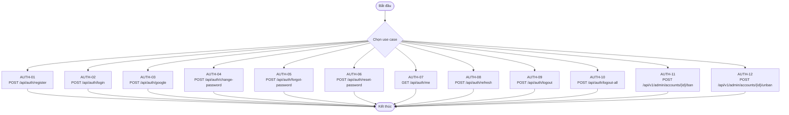

### PlantUML cho từng use case

#### AUTH-01 - Đăng ký tài khoản

| Field | Value |
|---|---|
| Actor | Guest |
| Endpoint | `POST /api/auth/register` |

**Sequence diagram (template)**

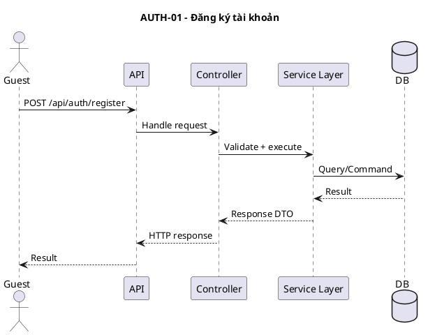

**Activity diagram (template)**

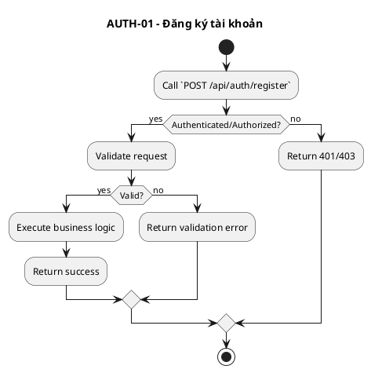

#### AUTH-02 - Đăng nhập bằng email/mật khẩu

| Field | Value |
|---|---|
| Actor | Guest |
| Endpoint | `POST /api/auth/login` |

**Sequence diagram (template)**

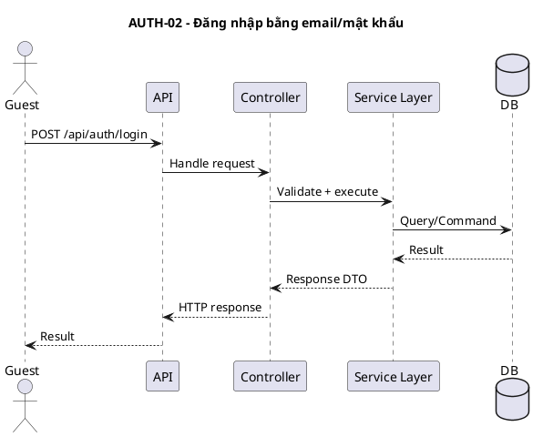

**Activity diagram (template)**

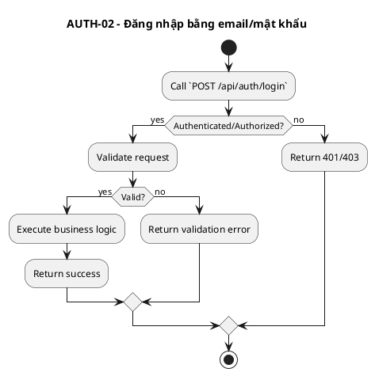

#### AUTH-03 - Đăng nhập bằng Google

| Field | Value |
|---|---|
| Actor | Guest |
| Endpoint | `POST /api/auth/google` |

**Sequence diagram (template)**

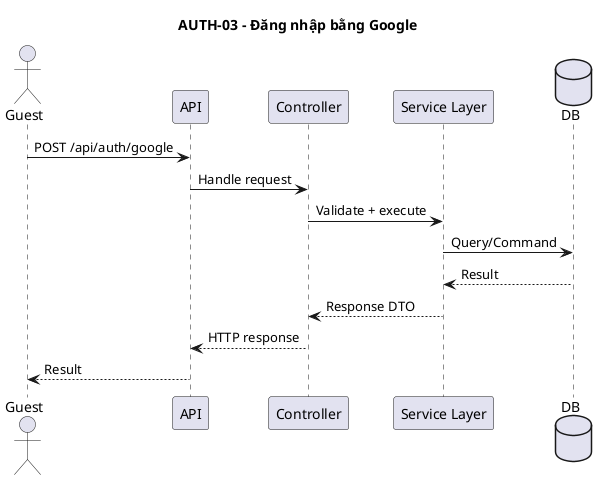

**Activity diagram (template)**

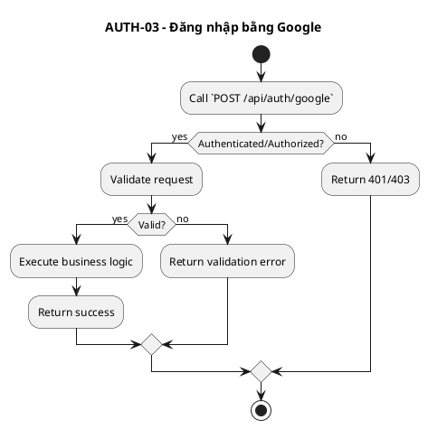

#### AUTH-04 - Đổi mật khẩu

| Field | Value |
|---|---|
| Actor | Authenticated User |
| Endpoint | `POST /api/auth/change-password` |

**Sequence diagram (template)**

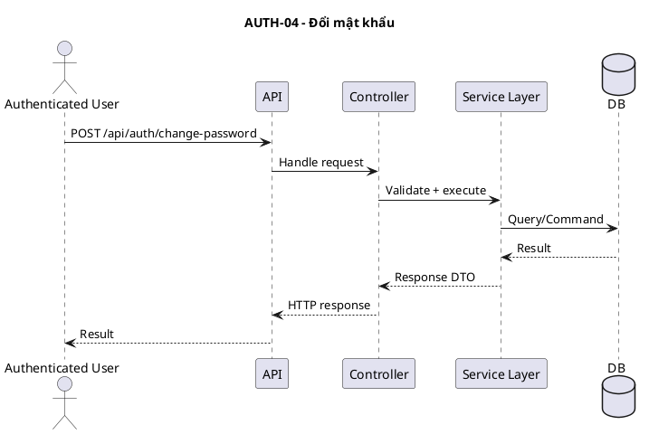

**Activity diagram (template)**

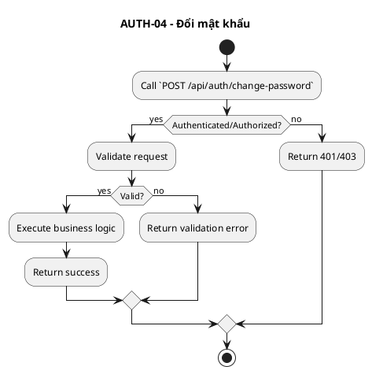

#### AUTH-05 - Gửi yêu cầu quên mật khẩu

| Field | Value |
|---|---|
| Actor | Guest |
| Endpoint | `POST /api/auth/forgot-password` |

**Sequence diagram (template)**

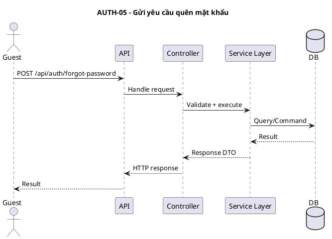

**Activity diagram (template)**

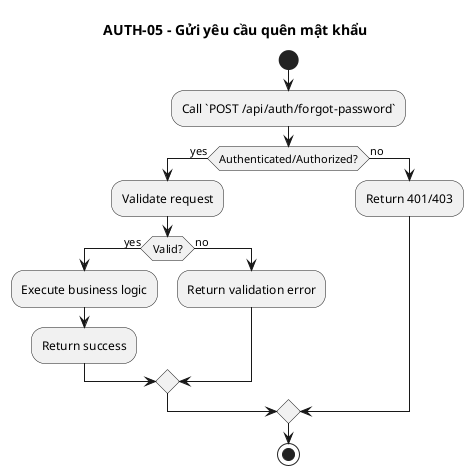

#### AUTH-06 - Đặt lại mật khẩu

| Field | Value |
|---|---|
| Actor | Guest |
| Endpoint | `POST /api/auth/reset-password` |

**Sequence diagram (template)**

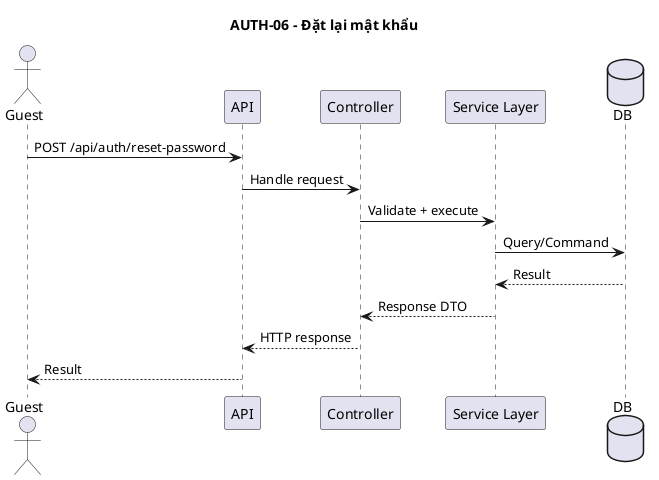

**Activity diagram (template)**


#### AUTH-07 - Lấy thông tin tài khoản hiện tại

| Field | Value |
|---|---|
| Actor | Authenticated User |
| Endpoint | `GET /api/auth/me` |

**Sequence diagram (template)**

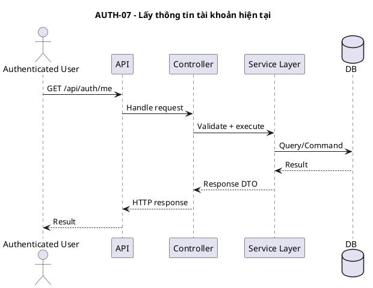

**Activity diagram (template)**

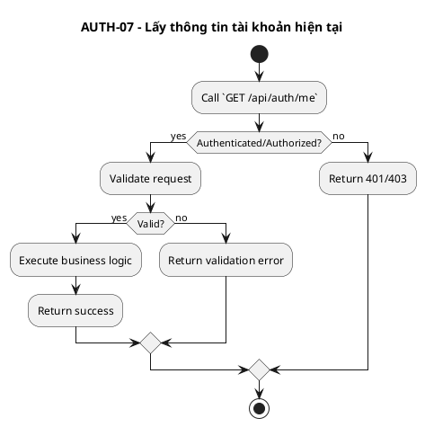

#### AUTH-08 - Làm mới access token

| Field | Value |
|---|---|
| Actor | Guest/User |
| Endpoint | `POST /api/auth/refresh` |

**Sequence diagram (template)**

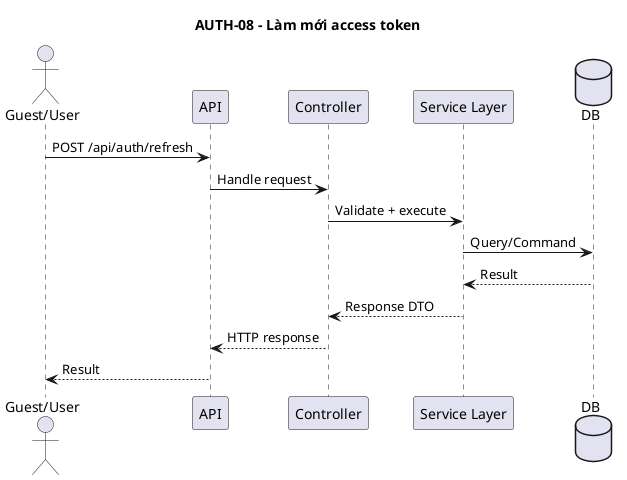

**Activity diagram (template)**

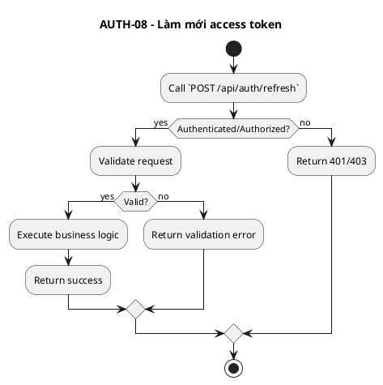

#### AUTH-09 - Đăng xuất phiên hiện tại

| Field | Value |
|---|---|
| Actor | Authenticated User |
| Endpoint | `POST /api/auth/logout` |

**Sequence diagram (template)**

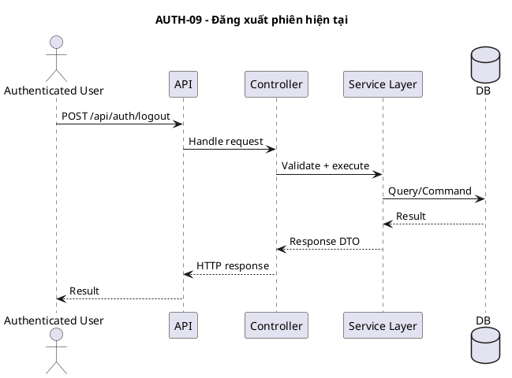

**Activity diagram (template)**

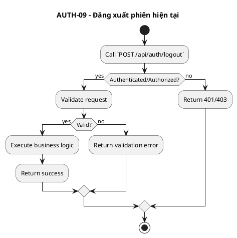

#### AUTH-10 - Đăng xuất tất cả phiên

| Field | Value |
|---|---|
| Actor | Authenticated User |
| Endpoint | `POST /api/auth/logout-all` |

**Sequence diagram (template)**

```puml
@startuml
title AUTH-10 - Đăng xuất tất cả phiên
actor "Authenticated User" as User
participant "API" as API
participant "Controller" as C
participant "Service Layer" as S
database "DB" as DB

User -> API: POST /api/auth/logout-all
API -> C: Handle request
C -> S: Validate + execute
S -> DB: Query/Command
DB --> S: Result
S --> C: Response DTO
C --> API: HTTP response
API --> User: Result
@enduml
```

**Activity diagram (template)**

```puml
@startuml
title AUTH-10 - Đăng xuất tất cả phiên
start
:Call `POST /api/auth/logout-all`;
if (Authenticated/Authorized?) then (yes)
  :Validate request;
  if (Valid?) then (yes)
    :Execute business logic;
    :Return success;
  else (no)
    :Return validation error;
  endif
else (no)
  :Return 401/403;
endif
stop
@enduml
```

#### AUTH-11 - Admin khóa tài khoản

| Field | Value |
|---|---|
| Actor | Admin |
| Endpoint | `POST /api/v1/admin/accounts/{id}/ban` |

**Sequence diagram (template)**

```puml
@startuml
title AUTH-11 - Admin khóa tài khoản
actor "Admin" as User
participant "API" as API
participant "Controller" as C
participant "Service Layer" as S
database "DB" as DB

User -> API: POST /api/v1/admin/accounts/{id}/ban
API -> C: Handle request
C -> S: Validate + execute
S -> DB: Query/Command
DB --> S: Result
S --> C: Response DTO
C --> API: HTTP response
API --> User: Result
@enduml
```

**Activity diagram (template)**

```puml
@startuml
title AUTH-11 - Admin khóa tài khoản
start
:Call `POST /api/v1/admin/accounts/{id}/ban`;
if (Authenticated/Authorized?) then (yes)
  :Validate request;
  if (Valid?) then (yes)
    :Execute business logic;
    :Return success;
  else (no)
    :Return validation error;
  endif
else (no)
  :Return 401/403;
endif
stop
@enduml
```

#### AUTH-12 - Admin mở khóa tài khoản

| Field | Value |
|---|---|
| Actor | Admin |
| Endpoint | `POST /api/v1/admin/accounts/{id}/unban` |

**Sequence diagram (template)**

```puml
@startuml
title AUTH-12 - Admin mở khóa tài khoản
actor "Admin" as User
participant "API" as API
participant "Controller" as C
participant "Service Layer" as S
database "DB" as DB

User -> API: POST /api/v1/admin/accounts/{id}/unban
API -> C: Handle request
C -> S: Validate + execute
S -> DB: Query/Command
DB --> S: Result
S --> C: Response DTO
C --> API: HTTP response
API --> User: Result
@enduml
```

**Activity diagram (template)**

```puml
@startuml
title AUTH-12 - Admin mở khóa tài khoản
start
:Call `POST /api/v1/admin/accounts/{id}/unban`;
if (Authenticated/Authorized?) then (yes)
  :Validate request;
  if (Valid?) then (yes)
    :Execute business logic;
    :Return success;
  else (no)
    :Return validation error;
  endif
else (no)
  :Return 401/403;
endif
stop
@enduml
```

## Nội dung công khai

### Use case (mindmap)

```mermaid
mindmap
  root((Nội dung công khai))
    Guest
      PUB-01: Xem trang nội dung tĩnh theo slug (GET /api/public/pages/{slug})
      PUB-02: Xem danh sách FAQ (GET /api/public/faqs)
      PUB-03: Xem danh sách blog (GET /api/public/blogs)
      PUB-04: Xem danh mục ngành nghề (GET /api/public/categories/industries)
      PUB-05: Xem danh mục kỹ năng (GET /api/public/categories/skills)
      PUB-06: Xem danh mục địa điểm (GET /api/public/categories/locations)
      PUB-07: Xem danh mục theo loại (GET /api/public/categories/{type})
      PUB-08: Xem thống kê công khai của hệ thống (GET /api/public/stats)
```

### Activity (chọn use case)

```mermaid
flowchart TD
  start([Bắt đầu]) --> choose{Chọn use case}
  choose --> UC_PUB_01["PUB-01
GET /api/public/pages/{slug}"]
  UC_PUB_01 --> finish([Kết thúc])
  choose --> UC_PUB_02["PUB-02
GET /api/public/faqs"]
  UC_PUB_02 --> finish([Kết thúc])
  choose --> UC_PUB_03["PUB-03
GET /api/public/blogs"]
  UC_PUB_03 --> finish([Kết thúc])
  choose --> UC_PUB_04["PUB-04
GET /api/public/categories/industries"]
  UC_PUB_04 --> finish([Kết thúc])
  choose --> UC_PUB_05["PUB-05
GET /api/public/categories/skills"]
  UC_PUB_05 --> finish([Kết thúc])
  choose --> UC_PUB_06["PUB-06
GET /api/public/categories/locations"]
  UC_PUB_06 --> finish([Kết thúc])
  choose --> UC_PUB_07["PUB-07
GET /api/public/categories/{type}"]
  UC_PUB_07 --> finish([Kết thúc])
  choose --> UC_PUB_08["PUB-08
GET /api/public/stats"]
  UC_PUB_08 --> finish([Kết thúc])
```

### PlantUML cho từng use case

#### PUB-01 - Xem trang nội dung tĩnh theo slug

| Field | Value |
|---|---|
| Actor | Guest |
| Endpoint | `GET /api/public/pages/{slug}` |

**Sequence diagram (template)**

```puml
@startuml
title PUB-01 - Xem trang nội dung tĩnh theo slug
actor "Guest" as User
participant "API" as API
participant "Controller" as C
participant "Service Layer" as S
database "DB" as DB

User -> API: GET /api/public/pages/{slug}
API -> C: Handle request
C -> S: Validate + execute
S -> DB: Query/Command
DB --> S: Result
S --> C: Response DTO
C --> API: HTTP response
API --> User: Result
@enduml
```

**Activity diagram (template)**

```puml
@startuml
title PUB-01 - Xem trang nội dung tĩnh theo slug
start
:Call `GET /api/public/pages/{slug}`;
if (Authenticated/Authorized?) then (yes)
  :Validate request;
  if (Valid?) then (yes)
    :Execute business logic;
    :Return success;
  else (no)
    :Return validation error;
  endif
else (no)
  :Return 401/403;
endif
stop
@enduml
```

#### PUB-02 - Xem danh sách FAQ

| Field | Value |
|---|---|
| Actor | Guest |
| Endpoint | `GET /api/public/faqs` |

**Sequence diagram (template)**

```puml
@startuml
title PUB-02 - Xem danh sách FAQ
actor "Guest" as User
participant "API" as API
participant "Controller" as C
participant "Service Layer" as S
database "DB" as DB

User -> API: GET /api/public/faqs
API -> C: Handle request
C -> S: Validate + execute
S -> DB: Query/Command
DB --> S: Result
S --> C: Response DTO
C --> API: HTTP response
API --> User: Result
@enduml
```

**Activity diagram (template)**

```puml
@startuml
title PUB-02 - Xem danh sách FAQ
start
:Call `GET /api/public/faqs`;
if (Authenticated/Authorized?) then (yes)
  :Validate request;
  if (Valid?) then (yes)
    :Execute business logic;
    :Return success;
  else (no)
    :Return validation error;
  endif
else (no)
  :Return 401/403;
endif
stop
@enduml
```

#### PUB-03 - Xem danh sách blog

| Field | Value |
|---|---|
| Actor | Guest |
| Endpoint | `GET /api/public/blogs` |

**Sequence diagram (template)**

```puml
@startuml
title PUB-03 - Xem danh sách blog
actor "Guest" as User
participant "API" as API
participant "Controller" as C
participant "Service Layer" as S
database "DB" as DB

User -> API: GET /api/public/blogs
API -> C: Handle request
C -> S: Validate + execute
S -> DB: Query/Command
DB --> S: Result
S --> C: Response DTO
C --> API: HTTP response
API --> User: Result
@enduml
```

**Activity diagram (template)**

```puml
@startuml
title PUB-03 - Xem danh sách blog
start
:Call `GET /api/public/blogs`;
if (Authenticated/Authorized?) then (yes)
  :Validate request;
  if (Valid?) then (yes)
    :Execute business logic;
    :Return success;
  else (no)
    :Return validation error;
  endif
else (no)
  :Return 401/403;
endif
stop
@enduml
```

#### PUB-04 - Xem danh mục ngành nghề

| Field | Value |
|---|---|
| Actor | Guest |
| Endpoint | `GET /api/public/categories/industries` |

**Sequence diagram (template)**

```puml
@startuml
title PUB-04 - Xem danh mục ngành nghề
actor "Guest" as User
participant "API" as API
participant "Controller" as C
participant "Service Layer" as S
database "DB" as DB

User -> API: GET /api/public/categories/industries
API -> C: Handle request
C -> S: Validate + execute
S -> DB: Query/Command
DB --> S: Result
S --> C: Response DTO
C --> API: HTTP response
API --> User: Result
@enduml
```

**Activity diagram (template)**

```puml
@startuml
title PUB-04 - Xem danh mục ngành nghề
start
:Call `GET /api/public/categories/industries`;
if (Authenticated/Authorized?) then (yes)
  :Validate request;
  if (Valid?) then (yes)
    :Execute business logic;
    :Return success;
  else (no)
    :Return validation error;
  endif
else (no)
  :Return 401/403;
endif
stop
@enduml
```

#### PUB-05 - Xem danh mục kỹ năng

| Field | Value |
|---|---|
| Actor | Guest |
| Endpoint | `GET /api/public/categories/skills` |

**Sequence diagram (template)**

```puml
@startuml
title PUB-05 - Xem danh mục kỹ năng
actor "Guest" as User
participant "API" as API
participant "Controller" as C
participant "Service Layer" as S
database "DB" as DB

User -> API: GET /api/public/categories/skills
API -> C: Handle request
C -> S: Validate + execute
S -> DB: Query/Command
DB --> S: Result
S --> C: Response DTO
C --> API: HTTP response
API --> User: Result
@enduml
```

**Activity diagram (template)**

```puml
@startuml
title PUB-05 - Xem danh mục kỹ năng
start
:Call `GET /api/public/categories/skills`;
if (Authenticated/Authorized?) then (yes)
  :Validate request;
  if (Valid?) then (yes)
    :Execute business logic;
    :Return success;
  else (no)
    :Return validation error;
  endif
else (no)
  :Return 401/403;
endif
stop
@enduml
```

#### PUB-06 - Xem danh mục địa điểm

| Field | Value |
|---|---|
| Actor | Guest |
| Endpoint | `GET /api/public/categories/locations` |

**Sequence diagram (template)**

```puml
@startuml
title PUB-06 - Xem danh mục địa điểm
actor "Guest" as User
participant "API" as API
participant "Controller" as C
participant "Service Layer" as S
database "DB" as DB

User -> API: GET /api/public/categories/locations
API -> C: Handle request
C -> S: Validate + execute
S -> DB: Query/Command
DB --> S: Result
S --> C: Response DTO
C --> API: HTTP response
API --> User: Result
@enduml
```

**Activity diagram (template)**

```puml
@startuml
title PUB-06 - Xem danh mục địa điểm
start
:Call `GET /api/public/categories/locations`;
if (Authenticated/Authorized?) then (yes)
  :Validate request;
  if (Valid?) then (yes)
    :Execute business logic;
    :Return success;
  else (no)
    :Return validation error;
  endif
else (no)
  :Return 401/403;
endif
stop
@enduml
```

#### PUB-07 - Xem danh mục theo loại

| Field | Value |
|---|---|
| Actor | Guest |
| Endpoint | `GET /api/public/categories/{type}` |

**Sequence diagram (template)**

```puml
@startuml
title PUB-07 - Xem danh mục theo loại
actor "Guest" as User
participant "API" as API
participant "Controller" as C
participant "Service Layer" as S
database "DB" as DB

User -> API: GET /api/public/categories/{type}
API -> C: Handle request
C -> S: Validate + execute
S -> DB: Query/Command
DB --> S: Result
S --> C: Response DTO
C --> API: HTTP response
API --> User: Result
@enduml
```

**Activity diagram (template)**

```puml
@startuml
title PUB-07 - Xem danh mục theo loại
start
:Call `GET /api/public/categories/{type}`;
if (Authenticated/Authorized?) then (yes)
  :Validate request;
  if (Valid?) then (yes)
    :Execute business logic;
    :Return success;
  else (no)
    :Return validation error;
  endif
else (no)
  :Return 401/403;
endif
stop
@enduml
```

#### PUB-08 - Xem thống kê công khai của hệ thống

| Field | Value |
|---|---|
| Actor | Guest |
| Endpoint | `GET /api/public/stats` |

**Sequence diagram (template)**

```puml
@startuml
title PUB-08 - Xem thống kê công khai của hệ thống
actor "Guest" as User
participant "API" as API
participant "Controller" as C
participant "Service Layer" as S
database "DB" as DB

User -> API: GET /api/public/stats
API -> C: Handle request
C -> S: Validate + execute
S -> DB: Query/Command
DB --> S: Result
S --> C: Response DTO
C --> API: HTTP response
API --> User: Result
@enduml
```

**Activity diagram (template)**

```puml
@startuml
title PUB-08 - Xem thống kê công khai của hệ thống
start
:Call `GET /api/public/stats`;
if (Authenticated/Authorized?) then (yes)
  :Validate request;
  if (Valid?) then (yes)
    :Execute business logic;
    :Return success;
  else (no)
    :Return validation error;
  endif
else (no)
  :Return 401/403;
endif
stop
@enduml
```

## Việc làm công khai

### Use case (mindmap)

```mermaid
mindmap
  root((Việc làm công khai))
    Guest/Candidate
      JOB-PUB-01: Tìm kiếm/lọc việc làm (GET /api/jobs/search)
      JOB-PUB-02: Xem chi tiết việc làm (GET /api/jobs/{id})
      JOB-PUB-03: Xem việc làm mới nhất (GET /api/jobs/latest)
      JOB-PUB-04: Xem việc làm nổi bật/hot (GET /api/jobs/hot)
```

### Activity (chọn use case)

```mermaid
flowchart TD
  start([Bắt đầu]) --> choose{Chọn use case}
  choose --> UC_JOB_PUB_01["JOB-PUB-01
GET /api/jobs/search"]
  UC_JOB_PUB_01 --> finish([Kết thúc])
  choose --> UC_JOB_PUB_02["JOB-PUB-02
GET /api/jobs/{id}"]
  UC_JOB_PUB_02 --> finish([Kết thúc])
  choose --> UC_JOB_PUB_03["JOB-PUB-03
GET /api/jobs/latest"]
  UC_JOB_PUB_03 --> finish([Kết thúc])
  choose --> UC_JOB_PUB_04["JOB-PUB-04
GET /api/jobs/hot"]
  UC_JOB_PUB_04 --> finish([Kết thúc])
```

### PlantUML cho từng use case

#### JOB-PUB-01 - Tìm kiếm/lọc việc làm

| Field | Value |
|---|---|
| Actor | Guest/Candidate |
| Endpoint | `GET /api/jobs/search` |

**Sequence diagram (template)**

```puml
@startuml
title JOB-PUB-01 - Tìm kiếm/lọc việc làm
actor "Guest/Candidate" as User
participant "API" as API
participant "Controller" as C
participant "Service Layer" as S
database "DB" as DB

User -> API: GET /api/jobs/search
API -> C: Handle request
C -> S: Validate + execute
S -> DB: Query/Command
DB --> S: Result
S --> C: Response DTO
C --> API: HTTP response
API --> User: Result
@enduml
```

**Activity diagram (template)**

```puml
@startuml
title JOB-PUB-01 - Tìm kiếm/lọc việc làm
start
:Call `GET /api/jobs/search`;
if (Authenticated/Authorized?) then (yes)
  :Validate request;
  if (Valid?) then (yes)
    :Execute business logic;
    :Return success;
  else (no)
    :Return validation error;
  endif
else (no)
  :Return 401/403;
endif
stop
@enduml
```

#### JOB-PUB-02 - Xem chi tiết việc làm

| Field | Value |
|---|---|
| Actor | Guest/Candidate |
| Endpoint | `GET /api/jobs/{id}` |

**Sequence diagram (template)**

```puml
@startuml
title JOB-PUB-02 - Xem chi tiết việc làm
actor "Guest/Candidate" as User
participant "API" as API
participant "Controller" as C
participant "Service Layer" as S
database "DB" as DB

User -> API: GET /api/jobs/{id}
API -> C: Handle request
C -> S: Validate + execute
S -> DB: Query/Command
DB --> S: Result
S --> C: Response DTO
C --> API: HTTP response
API --> User: Result
@enduml
```

**Activity diagram (template)**

```puml
@startuml
title JOB-PUB-02 - Xem chi tiết việc làm
start
:Call `GET /api/jobs/{id}`;
if (Authenticated/Authorized?) then (yes)
  :Validate request;
  if (Valid?) then (yes)
    :Execute business logic;
    :Return success;
  else (no)
    :Return validation error;
  endif
else (no)
  :Return 401/403;
endif
stop
@enduml
```

#### JOB-PUB-03 - Xem việc làm mới nhất

| Field | Value |
|---|---|
| Actor | Guest/Candidate |
| Endpoint | `GET /api/jobs/latest` |

**Sequence diagram (template)**

```puml
@startuml
title JOB-PUB-03 - Xem việc làm mới nhất
actor "Guest/Candidate" as User
participant "API" as API
participant "Controller" as C
participant "Service Layer" as S
database "DB" as DB

User -> API: GET /api/jobs/latest
API -> C: Handle request
C -> S: Validate + execute
S -> DB: Query/Command
DB --> S: Result
S --> C: Response DTO
C --> API: HTTP response
API --> User: Result
@enduml
```

**Activity diagram (template)**

```puml
@startuml
title JOB-PUB-03 - Xem việc làm mới nhất
start
:Call `GET /api/jobs/latest`;
if (Authenticated/Authorized?) then (yes)
  :Validate request;
  if (Valid?) then (yes)
    :Execute business logic;
    :Return success;
  else (no)
    :Return validation error;
  endif
else (no)
  :Return 401/403;
endif
stop
@enduml
```

#### JOB-PUB-04 - Xem việc làm nổi bật/hot

| Field | Value |
|---|---|
| Actor | Guest/Candidate |
| Endpoint | `GET /api/jobs/hot` |

**Sequence diagram (template)**

```puml
@startuml
title JOB-PUB-04 - Xem việc làm nổi bật/hot
actor "Guest/Candidate" as User
participant "API" as API
participant "Controller" as C
participant "Service Layer" as S
database "DB" as DB

User -> API: GET /api/jobs/hot
API -> C: Handle request
C -> S: Validate + execute
S -> DB: Query/Command
DB --> S: Result
S --> C: Response DTO
C --> API: HTTP response
API --> User: Result
@enduml
```

**Activity diagram (template)**

```puml
@startuml
title JOB-PUB-04 - Xem việc làm nổi bật/hot
start
:Call `GET /api/jobs/hot`;
if (Authenticated/Authorized?) then (yes)
  :Validate request;
  if (Valid?) then (yes)
    :Execute business logic;
    :Return success;
  else (no)
    :Return validation error;
  endif
else (no)
  :Return 401/403;
endif
stop
@enduml
```

## Công ty công khai

### Use case (mindmap)

```mermaid
mindmap
  root((Công ty công khai))
    Guest/Candidate
      COMPANY-PUB-01: Tìm kiếm/lọc công ty (GET /api/public/companies)
      COMPANY-PUB-02: Xem chi tiết công ty (GET /api/public/companies/{id})
```

### Activity (chọn use case)

```mermaid
flowchart TD
  start([Bắt đầu]) --> choose{Chọn use case}
  choose --> UC_COMPANY_PUB_01["COMPANY-PUB-01
GET /api/public/companies"]
  UC_COMPANY_PUB_01 --> finish([Kết thúc])
  choose --> UC_COMPANY_PUB_02["COMPANY-PUB-02
GET /api/public/companies/{id}"]
  UC_COMPANY_PUB_02 --> finish([Kết thúc])
```

### PlantUML cho từng use case

#### COMPANY-PUB-01 - Tìm kiếm/lọc công ty

| Field | Value |
|---|---|
| Actor | Guest/Candidate |
| Endpoint | `GET /api/public/companies` |

**Sequence diagram (template)**

```puml
@startuml
title COMPANY-PUB-01 - Tìm kiếm/lọc công ty
actor "Guest/Candidate" as User
participant "API" as API
participant "Controller" as C
participant "Service Layer" as S
database "DB" as DB

User -> API: GET /api/public/companies
API -> C: Handle request
C -> S: Validate + execute
S -> DB: Query/Command
DB --> S: Result
S --> C: Response DTO
C --> API: HTTP response
API --> User: Result
@enduml
```

**Activity diagram (template)**

```puml
@startuml
title COMPANY-PUB-01 - Tìm kiếm/lọc công ty
start
:Call `GET /api/public/companies`;
if (Authenticated/Authorized?) then (yes)
  :Validate request;
  if (Valid?) then (yes)
    :Execute business logic;
    :Return success;
  else (no)
    :Return validation error;
  endif
else (no)
  :Return 401/403;
endif
stop
@enduml
```

#### COMPANY-PUB-02 - Xem chi tiết công ty

| Field | Value |
|---|---|
| Actor | Guest/Candidate |
| Endpoint | `GET /api/public/companies/{id}` |

**Sequence diagram (template)**

```puml
@startuml
title COMPANY-PUB-02 - Xem chi tiết công ty
actor "Guest/Candidate" as User
participant "API" as API
participant "Controller" as C
participant "Service Layer" as S
database "DB" as DB

User -> API: GET /api/public/companies/{id}
API -> C: Handle request
C -> S: Validate + execute
S -> DB: Query/Command
DB --> S: Result
S --> C: Response DTO
C --> API: HTTP response
API --> User: Result
@enduml
```

**Activity diagram (template)**

```puml
@startuml
title COMPANY-PUB-02 - Xem chi tiết công ty
start
:Call `GET /api/public/companies/{id}`;
if (Authenticated/Authorized?) then (yes)
  :Validate request;
  if (Valid?) then (yes)
    :Execute business logic;
    :Return success;
  else (no)
    :Return validation error;
  endif
else (no)
  :Return 401/403;
endif
stop
@enduml
```

## Hồ sơ cá nhân người dùng

### Use case (mindmap)

```mermaid
mindmap
  root((Hồ sơ cá nhân người dùng))
    Authenticated User
      USER-01: Xem hồ sơ cá nhân (GET /api/user/profile)
      USER-02: Cập nhật thông tin cơ bản (PUT /api/user/profile/basic)
      USER-03: Cập nhật avatar bằng URL/thông tin ảnh (PUT /api/user/profile/avatar)
      USER-04: Upload avatar (POST /api/user/profile/avatar/upload)
      USER-05: Xóa avatar (DELETE /api/user/profile/avatar)
      USER-06: Cập nhật thông tin cá nhân (PUT /api/user/profile/personal)
      USER-08: Xem liên kết mạng xã hội (GET /api/user/social-links)
      USER-09: Lưu/cập nhật liên kết mạng xã hội dạng bulk (PUT /api/user/social-links)
    Candidate
      USER-07: Cập nhật hồ sơ cơ bản ứng viên (PUT /api/candidate/profile/basic)
```

### Activity (chọn use case)

```mermaid
flowchart TD
  start([Bắt đầu]) --> choose{Chọn use case}
  choose --> UC_USER_01["USER-01
GET /api/user/profile"]
  UC_USER_01 --> finish([Kết thúc])
  choose --> UC_USER_02["USER-02
PUT /api/user/profile/basic"]
  UC_USER_02 --> finish([Kết thúc])
  choose --> UC_USER_03["USER-03
PUT /api/user/profile/avatar"]
  UC_USER_03 --> finish([Kết thúc])
  choose --> UC_USER_04["USER-04
POST /api/user/profile/avatar/upload"]
  UC_USER_04 --> finish([Kết thúc])
  choose --> UC_USER_05["USER-05
DELETE /api/user/profile/avatar"]
  UC_USER_05 --> finish([Kết thúc])
  choose --> UC_USER_06["USER-06
PUT /api/user/profile/personal"]
  UC_USER_06 --> finish([Kết thúc])
  choose --> UC_USER_07["USER-07
PUT /api/candidate/profile/basic"]
  UC_USER_07 --> finish([Kết thúc])
  choose --> UC_USER_08["USER-08
GET /api/user/social-links"]
  UC_USER_08 --> finish([Kết thúc])
  choose --> UC_USER_09["USER-09
PUT /api/user/social-links"]
  UC_USER_09 --> finish([Kết thúc])
```

### PlantUML cho từng use case

#### USER-01 - Xem hồ sơ cá nhân

| Field | Value |
|---|---|
| Actor | Authenticated User |
| Endpoint | `GET /api/user/profile` |

**Sequence diagram (template)**

```puml
@startuml
title USER-01 - Xem hồ sơ cá nhân
actor "Authenticated User" as User
participant "API" as API
participant "Controller" as C
participant "Service Layer" as S
database "DB" as DB

User -> API: GET /api/user/profile
API -> C: Handle request
C -> S: Validate + execute
S -> DB: Query/Command
DB --> S: Result
S --> C: Response DTO
C --> API: HTTP response
API --> User: Result
@enduml
```

**Activity diagram (template)**

```puml
@startuml
title USER-01 - Xem hồ sơ cá nhân
start
:Call `GET /api/user/profile`;
if (Authenticated/Authorized?) then (yes)
  :Validate request;
  if (Valid?) then (yes)
    :Execute business logic;
    :Return success;
  else (no)
    :Return validation error;
  endif
else (no)
  :Return 401/403;
endif
stop
@enduml
```

#### USER-02 - Cập nhật thông tin cơ bản

| Field | Value |
|---|---|
| Actor | Authenticated User |
| Endpoint | `PUT /api/user/profile/basic` |

**Sequence diagram (template)**

```puml
@startuml
title USER-02 - Cập nhật thông tin cơ bản
actor "Authenticated User" as User
participant "API" as API
participant "Controller" as C
participant "Service Layer" as S
database "DB" as DB

User -> API: PUT /api/user/profile/basic
API -> C: Handle request
C -> S: Validate + execute
S -> DB: Query/Command
DB --> S: Result
S --> C: Response DTO
C --> API: HTTP response
API --> User: Result
@enduml
```

**Activity diagram (template)**

```puml
@startuml
title USER-02 - Cập nhật thông tin cơ bản
start
:Call `PUT /api/user/profile/basic`;
if (Authenticated/Authorized?) then (yes)
  :Validate request;
  if (Valid?) then (yes)
    :Execute business logic;
    :Return success;
  else (no)
    :Return validation error;
  endif
else (no)
  :Return 401/403;
endif
stop
@enduml
```

#### USER-03 - Cập nhật avatar bằng URL/thông tin ảnh

| Field | Value |
|---|---|
| Actor | Authenticated User |
| Endpoint | `PUT /api/user/profile/avatar` |

**Sequence diagram (template)**

```puml
@startuml
title USER-03 - Cập nhật avatar bằng URL/thông tin ảnh
actor "Authenticated User" as User
participant "API" as API
participant "Controller" as C
participant "Service Layer" as S
database "DB" as DB

User -> API: PUT /api/user/profile/avatar
API -> C: Handle request
C -> S: Validate + execute
S -> DB: Query/Command
DB --> S: Result
S --> C: Response DTO
C --> API: HTTP response
API --> User: Result
@enduml
```

**Activity diagram (template)**

```puml
@startuml
title USER-03 - Cập nhật avatar bằng URL/thông tin ảnh
start
:Call `PUT /api/user/profile/avatar`;
if (Authenticated/Authorized?) then (yes)
  :Validate request;
  if (Valid?) then (yes)
    :Execute business logic;
    :Return success;
  else (no)
    :Return validation error;
  endif
else (no)
  :Return 401/403;
endif
stop
@enduml
```

#### USER-04 - Upload avatar

| Field | Value |
|---|---|
| Actor | Authenticated User |
| Endpoint | `POST /api/user/profile/avatar/upload` |

**Sequence diagram (template)**

```puml
@startuml
title USER-04 - Upload avatar
actor "Authenticated User" as User
participant "API" as API
participant "Controller" as C
participant "Service Layer" as S
database "DB" as DB

User -> API: POST /api/user/profile/avatar/upload
API -> C: Handle request
C -> S: Validate + execute
S -> DB: Query/Command
DB --> S: Result
S --> C: Response DTO
C --> API: HTTP response
API --> User: Result
@enduml
```

**Activity diagram (template)**

```puml
@startuml
title USER-04 - Upload avatar
start
:Call `POST /api/user/profile/avatar/upload`;
if (Authenticated/Authorized?) then (yes)
  :Validate request;
  if (Valid?) then (yes)
    :Execute business logic;
    :Return success;
  else (no)
    :Return validation error;
  endif
else (no)
  :Return 401/403;
endif
stop
@enduml
```

#### USER-05 - Xóa avatar

| Field | Value |
|---|---|
| Actor | Authenticated User |
| Endpoint | `DELETE /api/user/profile/avatar` |

**Sequence diagram (template)**

```puml
@startuml
title USER-05 - Xóa avatar
actor "Authenticated User" as User
participant "API" as API
participant "Controller" as C
participant "Service Layer" as S
database "DB" as DB

User -> API: DELETE /api/user/profile/avatar
API -> C: Handle request
C -> S: Validate + execute
S -> DB: Query/Command
DB --> S: Result
S --> C: Response DTO
C --> API: HTTP response
API --> User: Result
@enduml
```

**Activity diagram (template)**

```puml
@startuml
title USER-05 - Xóa avatar
start
:Call `DELETE /api/user/profile/avatar`;
if (Authenticated/Authorized?) then (yes)
  :Validate request;
  if (Valid?) then (yes)
    :Execute business logic;
    :Return success;
  else (no)
    :Return validation error;
  endif
else (no)
  :Return 401/403;
endif
stop
@enduml
```

#### USER-06 - Cập nhật thông tin cá nhân

| Field | Value |
|---|---|
| Actor | Authenticated User |
| Endpoint | `PUT /api/user/profile/personal` |

**Sequence diagram (template)**

```puml
@startuml
title USER-06 - Cập nhật thông tin cá nhân
actor "Authenticated User" as User
participant "API" as API
participant "Controller" as C
participant "Service Layer" as S
database "DB" as DB

User -> API: PUT /api/user/profile/personal
API -> C: Handle request
C -> S: Validate + execute
S -> DB: Query/Command
DB --> S: Result
S --> C: Response DTO
C --> API: HTTP response
API --> User: Result
@enduml
```

**Activity diagram (template)**

```puml
@startuml
title USER-06 - Cập nhật thông tin cá nhân
start
:Call `PUT /api/user/profile/personal`;
if (Authenticated/Authorized?) then (yes)
  :Validate request;
  if (Valid?) then (yes)
    :Execute business logic;
    :Return success;
  else (no)
    :Return validation error;
  endif
else (no)
  :Return 401/403;
endif
stop
@enduml
```

#### USER-07 - Cập nhật hồ sơ cơ bản ứng viên

| Field | Value |
|---|---|
| Actor | Candidate |
| Endpoint | `PUT /api/candidate/profile/basic` |

**Sequence diagram (template)**

```puml
@startuml
title USER-07 - Cập nhật hồ sơ cơ bản ứng viên
actor "Candidate" as User
participant "API" as API
participant "Controller" as C
participant "Service Layer" as S
database "DB" as DB

User -> API: PUT /api/candidate/profile/basic
API -> C: Handle request
C -> S: Validate + execute
S -> DB: Query/Command
DB --> S: Result
S --> C: Response DTO
C --> API: HTTP response
API --> User: Result
@enduml
```

**Activity diagram (template)**

```puml
@startuml
title USER-07 - Cập nhật hồ sơ cơ bản ứng viên
start
:Call `PUT /api/candidate/profile/basic`;
if (Authenticated/Authorized?) then (yes)
  :Validate request;
  if (Valid?) then (yes)
    :Execute business logic;
    :Return success;
  else (no)
    :Return validation error;
  endif
else (no)
  :Return 401/403;
endif
stop
@enduml
```

#### USER-08 - Xem liên kết mạng xã hội

| Field | Value |
|---|---|
| Actor | Authenticated User |
| Endpoint | `GET /api/user/social-links` |

**Sequence diagram (template)**

```puml
@startuml
title USER-08 - Xem liên kết mạng xã hội
actor "Authenticated User" as User
participant "API" as API
participant "Controller" as C
participant "Service Layer" as S
database "DB" as DB

User -> API: GET /api/user/social-links
API -> C: Handle request
C -> S: Validate + execute
S -> DB: Query/Command
DB --> S: Result
S --> C: Response DTO
C --> API: HTTP response
API --> User: Result
@enduml
```

**Activity diagram (template)**

```puml
@startuml
title USER-08 - Xem liên kết mạng xã hội
start
:Call `GET /api/user/social-links`;
if (Authenticated/Authorized?) then (yes)
  :Validate request;
  if (Valid?) then (yes)
    :Execute business logic;
    :Return success;
  else (no)
    :Return validation error;
  endif
else (no)
  :Return 401/403;
endif
stop
@enduml
```

#### USER-09 - Lưu/cập nhật liên kết mạng xã hội dạng bulk

| Field | Value |
|---|---|
| Actor | Authenticated User |
| Endpoint | `PUT /api/user/social-links` |

**Sequence diagram (template)**

```puml
@startuml
title USER-09 - Lưu/cập nhật liên kết mạng xã hội dạng bulk
actor "Authenticated User" as User
participant "API" as API
participant "Controller" as C
participant "Service Layer" as S
database "DB" as DB

User -> API: PUT /api/user/social-links
API -> C: Handle request
C -> S: Validate + execute
S -> DB: Query/Command
DB --> S: Result
S --> C: Response DTO
C --> API: HTTP response
API --> User: Result
@enduml
```

**Activity diagram (template)**

```puml
@startuml
title USER-09 - Lưu/cập nhật liên kết mạng xã hội dạng bulk
start
:Call `PUT /api/user/social-links`;
if (Authenticated/Authorized?) then (yes)
  :Validate request;
  if (Valid?) then (yes)
    :Execute business logic;
    :Return success;
  else (no)
    :Return validation error;
  endif
else (no)
  :Return 401/403;
endif
stop
@enduml
```

## Hồ sơ nghề nghiệp ứng viên

### Use case (mindmap)

```mermaid
mindmap
  root((Hồ sơ nghề nghiệp ứng viên))
    Candidate
      PROFILE-01: Xem hồ sơ nghề nghiệp (GET /api/user/professional-profile)
      PROFILE-02: Cập nhật hồ sơ nghề nghiệp (PUT /api/user/professional-profile)
      PROFILE-03: Xem danh sách học vấn (GET /api/user/professional-profile/education)
      PROFILE-04: Thêm học vấn (POST /api/user/professional-profile/education)
      PROFILE-05: Cập nhật học vấn (PUT /api/user/professional-profile/education/{id})
      PROFILE-06: Xóa học vấn (DELETE /api/user/professional-profile/education/{id})
      PROFILE-07: Xem danh sách kỹ năng (GET /api/user/professional-profile/skills)
      PROFILE-08: Thêm kỹ năng (POST /api/user/professional-profile/skills)
      PROFILE-09: Cập nhật kỹ năng (PUT /api/user/professional-profile/skills/{id})
      PROFILE-10: Xóa kỹ năng (DELETE /api/user/professional-profile/skills/{id})
      PROFILE-11: Xem danh sách chứng chỉ (GET /api/user/professional-profile/certificates)
      PROFILE-12: Thêm chứng chỉ (POST /api/user/professional-profile/certificates)
      PROFILE-13: Cập nhật chứng chỉ (PUT /api/user/professional-profile/certificates/{id})
      PROFILE-14: Xóa chứng chỉ (DELETE /api/user/professional-profile/certificates/{id})
      PROFILE-15: Xem danh sách kinh nghiệm (GET /api/user/professional-profile/experience)
      PROFILE-16: Thêm kinh nghiệm (POST /api/user/professional-profile/experience)
      PROFILE-17: Cập nhật kinh nghiệm (PUT /api/user/professional-profile/experience/{id})
      PROFILE-18: Xóa kinh nghiệm (DELETE /api/user/professional-profile/experience/{id})
      PROFILE-19: Xem danh sách portfolio (GET /api/user/professional-profile/portfolios)
      PROFILE-20: Thêm portfolio (POST /api/user/professional-profile/portfolio)
      PROFILE-21: Cập nhật portfolio (PUT /api/user/professional-profile/portfolio/{id})
      PROFILE-22: Xóa portfolio (DELETE /api/user/professional-profile/portfolio/{id})
      PROFILE-23: Xem danh sách CV trong hồ sơ (GET /api/user/professional-profile/cv)
      PROFILE-24: Thêm CV vào hồ sơ (POST /api/user/professional-profile/cv)
      PROFILE-25: Đổi tiêu đề CV (PATCH /api/user/professional-profile/cv/{id}/title)
      PROFILE-26: Đặt CV mặc định (PATCH /api/user/professional-profile/cv/{id}/default)
      PROFILE-27: Xóa CV (DELETE /api/user/professional-profile/cv/{id})
      PROFILE-28: Xem social link trong hồ sơ nghề nghiệp (GET /api/user/professional-profile/social-links)
      PROFILE-29: Thêm social link vào hồ sơ nghề nghiệp (POST /api/user/professional-profile/social-link)
      PROFILE-30: Xóa social link khỏi hồ sơ nghề nghiệp (DELETE /api/user/professional-profile/social-link/{id})
```

### Activity (chọn use case)

```mermaid
flowchart TD
  start([Bắt đầu]) --> choose{Chọn use case}
  choose --> UC_PROFILE_01["PROFILE-01
GET /api/user/professional-profile"]
  UC_PROFILE_01 --> finish([Kết thúc])
  choose --> UC_PROFILE_02["PROFILE-02
PUT /api/user/professional-profile"]
  UC_PROFILE_02 --> finish([Kết thúc])
  choose --> UC_PROFILE_03["PROFILE-03
GET /api/user/professional-profile/education"]
  UC_PROFILE_03 --> finish([Kết thúc])
  choose --> UC_PROFILE_04["PROFILE-04
POST /api/user/professional-profile/education"]
  UC_PROFILE_04 --> finish([Kết thúc])
  choose --> UC_PROFILE_05["PROFILE-05
PUT /api/user/professional-profile/education/{id}"]
  UC_PROFILE_05 --> finish([Kết thúc])
  choose --> UC_PROFILE_06["PROFILE-06
DELETE /api/user/professional-profile/education/{id}"]
  UC_PROFILE_06 --> finish([Kết thúc])
  choose --> UC_PROFILE_07["PROFILE-07
GET /api/user/professional-profile/skills"]
  UC_PROFILE_07 --> finish([Kết thúc])
  choose --> UC_PROFILE_08["PROFILE-08
POST /api/user/professional-profile/skills"]
  UC_PROFILE_08 --> finish([Kết thúc])
  choose --> UC_PROFILE_09["PROFILE-09
PUT /api/user/professional-profile/skills/{id}"]
  UC_PROFILE_09 --> finish([Kết thúc])
  choose --> UC_PROFILE_10["PROFILE-10
DELETE /api/user/professional-profile/skills/{id}"]
  UC_PROFILE_10 --> finish([Kết thúc])
  choose --> UC_PROFILE_11["PROFILE-11
GET /api/user/professional-profile/certificates"]
  UC_PROFILE_11 --> finish([Kết thúc])
  choose --> UC_PROFILE_12["PROFILE-12
POST /api/user/professional-profile/certificates"]
  UC_PROFILE_12 --> finish([Kết thúc])
  choose --> UC_PROFILE_13["PROFILE-13
PUT /api/user/professional-profile/certificates/{id}"]
  UC_PROFILE_13 --> finish([Kết thúc])
  choose --> UC_PROFILE_14["PROFILE-14
DELETE /api/user/professional-profile/certificates/{id}"]
  UC_PROFILE_14 --> finish([Kết thúc])
  choose --> UC_PROFILE_15["PROFILE-15
GET /api/user/professional-profile/experience"]
  UC_PROFILE_15 --> finish([Kết thúc])
  choose --> UC_PROFILE_16["PROFILE-16
POST /api/user/professional-profile/experience"]
  UC_PROFILE_16 --> finish([Kết thúc])
  choose --> UC_PROFILE_17["PROFILE-17
PUT /api/user/professional-profile/experience/{id}"]
  UC_PROFILE_17 --> finish([Kết thúc])
  choose --> UC_PROFILE_18["PROFILE-18
DELETE /api/user/professional-profile/experience/{id}"]
  UC_PROFILE_18 --> finish([Kết thúc])
  choose --> UC_PROFILE_19["PROFILE-19
GET /api/user/professional-profile/portfolios"]
  UC_PROFILE_19 --> finish([Kết thúc])
  choose --> UC_PROFILE_20["PROFILE-20
POST /api/user/professional-profile/portfolio"]
  UC_PROFILE_20 --> finish([Kết thúc])
  choose --> UC_PROFILE_21["PROFILE-21
PUT /api/user/professional-profile/portfolio/{id}"]
  UC_PROFILE_21 --> finish([Kết thúc])
  choose --> UC_PROFILE_22["PROFILE-22
DELETE /api/user/professional-profile/portfolio/{id}"]
  UC_PROFILE_22 --> finish([Kết thúc])
  choose --> UC_PROFILE_23["PROFILE-23
GET /api/user/professional-profile/cv"]
  UC_PROFILE_23 --> finish([Kết thúc])
  choose --> UC_PROFILE_24["PROFILE-24
POST /api/user/professional-profile/cv"]
  UC_PROFILE_24 --> finish([Kết thúc])
  choose --> UC_PROFILE_25["PROFILE-25
PATCH /api/user/professional-profile/cv/{id}/title"]
  UC_PROFILE_25 --> finish([Kết thúc])
  choose --> UC_PROFILE_26["PROFILE-26
PATCH /api/user/professional-profile/cv/{id}/default"]
  UC_PROFILE_26 --> finish([Kết thúc])
  choose --> UC_PROFILE_27["PROFILE-27
DELETE /api/user/professional-profile/cv/{id}"]
  UC_PROFILE_27 --> finish([Kết thúc])
  choose --> UC_PROFILE_28["PROFILE-28
GET /api/user/professional-profile/social-links"]
  UC_PROFILE_28 --> finish([Kết thúc])
  choose --> UC_PROFILE_29["PROFILE-29
POST /api/user/professional-profile/social-link"]
  UC_PROFILE_29 --> finish([Kết thúc])
  choose --> UC_PROFILE_30["PROFILE-30
DELETE /api/user/professional-profile/social-link/{id}"]
  UC_PROFILE_30 --> finish([Kết thúc])
```

### PlantUML cho từng use case

#### PROFILE-01 - Xem hồ sơ nghề nghiệp

| Field | Value |
|---|---|
| Actor | Candidate |
| Endpoint | `GET /api/user/professional-profile` |

**Sequence diagram (template)**

```puml
@startuml
title PROFILE-01 - Xem hồ sơ nghề nghiệp
actor "Candidate" as User
participant "API" as API
participant "Controller" as C
participant "Service Layer" as S
database "DB" as DB

User -> API: GET /api/user/professional-profile
API -> C: Handle request
C -> S: Validate + execute
S -> DB: Query/Command
DB --> S: Result
S --> C: Response DTO
C --> API: HTTP response
API --> User: Result
@enduml
```

**Activity diagram (template)**

```puml
@startuml
title PROFILE-01 - Xem hồ sơ nghề nghiệp
start
:Call `GET /api/user/professional-profile`;
if (Authenticated/Authorized?) then (yes)
  :Validate request;
  if (Valid?) then (yes)
    :Execute business logic;
    :Return success;
  else (no)
    :Return validation error;
  endif
else (no)
  :Return 401/403;
endif
stop
@enduml
```

#### PROFILE-02 - Cập nhật hồ sơ nghề nghiệp

| Field | Value |
|---|---|
| Actor | Candidate |
| Endpoint | `PUT /api/user/professional-profile` |

**Sequence diagram (template)**

```puml
@startuml
title PROFILE-02 - Cập nhật hồ sơ nghề nghiệp
actor "Candidate" as User
participant "API" as API
participant "Controller" as C
participant "Service Layer" as S
database "DB" as DB

User -> API: PUT /api/user/professional-profile
API -> C: Handle request
C -> S: Validate + execute
S -> DB: Query/Command
DB --> S: Result
S --> C: Response DTO
C --> API: HTTP response
API --> User: Result
@enduml
```

**Activity diagram (template)**

```puml
@startuml
title PROFILE-02 - Cập nhật hồ sơ nghề nghiệp
start
:Call `PUT /api/user/professional-profile`;
if (Authenticated/Authorized?) then (yes)
  :Validate request;
  if (Valid?) then (yes)
    :Execute business logic;
    :Return success;
  else (no)
    :Return validation error;
  endif
else (no)
  :Return 401/403;
endif
stop
@enduml
```

#### PROFILE-03 - Xem danh sách học vấn

| Field | Value |
|---|---|
| Actor | Candidate |
| Endpoint | `GET /api/user/professional-profile/education` |

**Sequence diagram (template)**

```puml
@startuml
title PROFILE-03 - Xem danh sách học vấn
actor "Candidate" as User
participant "API" as API
participant "Controller" as C
participant "Service Layer" as S
database "DB" as DB

User -> API: GET /api/user/professional-profile/education
API -> C: Handle request
C -> S: Validate + execute
S -> DB: Query/Command
DB --> S: Result
S --> C: Response DTO
C --> API: HTTP response
API --> User: Result
@enduml
```

**Activity diagram (template)**

```puml
@startuml
title PROFILE-03 - Xem danh sách học vấn
start
:Call `GET /api/user/professional-profile/education`;
if (Authenticated/Authorized?) then (yes)
  :Validate request;
  if (Valid?) then (yes)
    :Execute business logic;
    :Return success;
  else (no)
    :Return validation error;
  endif
else (no)
  :Return 401/403;
endif
stop
@enduml
```

#### PROFILE-04 - Thêm học vấn

| Field | Value |
|---|---|
| Actor | Candidate |
| Endpoint | `POST /api/user/professional-profile/education` |

**Sequence diagram (template)**

```puml
@startuml
title PROFILE-04 - Thêm học vấn
actor "Candidate" as User
participant "API" as API
participant "Controller" as C
participant "Service Layer" as S
database "DB" as DB

User -> API: POST /api/user/professional-profile/education
API -> C: Handle request
C -> S: Validate + execute
S -> DB: Query/Command
DB --> S: Result
S --> C: Response DTO
C --> API: HTTP response
API --> User: Result
@enduml
```

**Activity diagram (template)**

```puml
@startuml
title PROFILE-04 - Thêm học vấn
start
:Call `POST /api/user/professional-profile/education`;
if (Authenticated/Authorized?) then (yes)
  :Validate request;
  if (Valid?) then (yes)
    :Execute business logic;
    :Return success;
  else (no)
    :Return validation error;
  endif
else (no)
  :Return 401/403;
endif
stop
@enduml
```

#### PROFILE-05 - Cập nhật học vấn

| Field | Value |
|---|---|
| Actor | Candidate |
| Endpoint | `PUT /api/user/professional-profile/education/{id}` |

**Sequence diagram (template)**

```puml
@startuml
title PROFILE-05 - Cập nhật học vấn
actor "Candidate" as User
participant "API" as API
participant "Controller" as C
participant "Service Layer" as S
database "DB" as DB

User -> API: PUT /api/user/professional-profile/education/{id}
API -> C: Handle request
C -> S: Validate + execute
S -> DB: Query/Command
DB --> S: Result
S --> C: Response DTO
C --> API: HTTP response
API --> User: Result
@enduml
```

**Activity diagram (template)**

```puml
@startuml
title PROFILE-05 - Cập nhật học vấn
start
:Call `PUT /api/user/professional-profile/education/{id}`;
if (Authenticated/Authorized?) then (yes)
  :Validate request;
  if (Valid?) then (yes)
    :Execute business logic;
    :Return success;
  else (no)
    :Return validation error;
  endif
else (no)
  :Return 401/403;
endif
stop
@enduml
```

#### PROFILE-06 - Xóa học vấn

| Field | Value |
|---|---|
| Actor | Candidate |
| Endpoint | `DELETE /api/user/professional-profile/education/{id}` |

**Sequence diagram (template)**

```puml
@startuml
title PROFILE-06 - Xóa học vấn
actor "Candidate" as User
participant "API" as API
participant "Controller" as C
participant "Service Layer" as S
database "DB" as DB

User -> API: DELETE /api/user/professional-profile/education/{id}
API -> C: Handle request
C -> S: Validate + execute
S -> DB: Query/Command
DB --> S: Result
S --> C: Response DTO
C --> API: HTTP response
API --> User: Result
@enduml
```

**Activity diagram (template)**

```puml
@startuml
title PROFILE-06 - Xóa học vấn
start
:Call `DELETE /api/user/professional-profile/education/{id}`;
if (Authenticated/Authorized?) then (yes)
  :Validate request;
  if (Valid?) then (yes)
    :Execute business logic;
    :Return success;
  else (no)
    :Return validation error;
  endif
else (no)
  :Return 401/403;
endif
stop
@enduml
```

#### PROFILE-07 - Xem danh sách kỹ năng

| Field | Value |
|---|---|
| Actor | Candidate |
| Endpoint | `GET /api/user/professional-profile/skills` |

**Sequence diagram (template)**

```puml
@startuml
title PROFILE-07 - Xem danh sách kỹ năng
actor "Candidate" as User
participant "API" as API
participant "Controller" as C
participant "Service Layer" as S
database "DB" as DB

User -> API: GET /api/user/professional-profile/skills
API -> C: Handle request
C -> S: Validate + execute
S -> DB: Query/Command
DB --> S: Result
S --> C: Response DTO
C --> API: HTTP response
API --> User: Result
@enduml
```

**Activity diagram (template)**

```puml
@startuml
title PROFILE-07 - Xem danh sách kỹ năng
start
:Call `GET /api/user/professional-profile/skills`;
if (Authenticated/Authorized?) then (yes)
  :Validate request;
  if (Valid?) then (yes)
    :Execute business logic;
    :Return success;
  else (no)
    :Return validation error;
  endif
else (no)
  :Return 401/403;
endif
stop
@enduml
```

#### PROFILE-08 - Thêm kỹ năng

| Field | Value |
|---|---|
| Actor | Candidate |
| Endpoint | `POST /api/user/professional-profile/skills` |

**Sequence diagram (template)**

```puml
@startuml
title PROFILE-08 - Thêm kỹ năng
actor "Candidate" as User
participant "API" as API
participant "Controller" as C
participant "Service Layer" as S
database "DB" as DB

User -> API: POST /api/user/professional-profile/skills
API -> C: Handle request
C -> S: Validate + execute
S -> DB: Query/Command
DB --> S: Result
S --> C: Response DTO
C --> API: HTTP response
API --> User: Result
@enduml
```

**Activity diagram (template)**

```puml
@startuml
title PROFILE-08 - Thêm kỹ năng
start
:Call `POST /api/user/professional-profile/skills`;
if (Authenticated/Authorized?) then (yes)
  :Validate request;
  if (Valid?) then (yes)
    :Execute business logic;
    :Return success;
  else (no)
    :Return validation error;
  endif
else (no)
  :Return 401/403;
endif
stop
@enduml
```

#### PROFILE-09 - Cập nhật kỹ năng

| Field | Value |
|---|---|
| Actor | Candidate |
| Endpoint | `PUT /api/user/professional-profile/skills/{id}` |

**Sequence diagram (template)**

```puml
@startuml
title PROFILE-09 - Cập nhật kỹ năng
actor "Candidate" as User
participant "API" as API
participant "Controller" as C
participant "Service Layer" as S
database "DB" as DB

User -> API: PUT /api/user/professional-profile/skills/{id}
API -> C: Handle request
C -> S: Validate + execute
S -> DB: Query/Command
DB --> S: Result
S --> C: Response DTO
C --> API: HTTP response
API --> User: Result
@enduml
```

**Activity diagram (template)**

```puml
@startuml
title PROFILE-09 - Cập nhật kỹ năng
start
:Call `PUT /api/user/professional-profile/skills/{id}`;
if (Authenticated/Authorized?) then (yes)
  :Validate request;
  if (Valid?) then (yes)
    :Execute business logic;
    :Return success;
  else (no)
    :Return validation error;
  endif
else (no)
  :Return 401/403;
endif
stop
@enduml
```

#### PROFILE-10 - Xóa kỹ năng

| Field | Value |
|---|---|
| Actor | Candidate |
| Endpoint | `DELETE /api/user/professional-profile/skills/{id}` |

**Sequence diagram (template)**

```puml
@startuml
title PROFILE-10 - Xóa kỹ năng
actor "Candidate" as User
participant "API" as API
participant "Controller" as C
participant "Service Layer" as S
database "DB" as DB

User -> API: DELETE /api/user/professional-profile/skills/{id}
API -> C: Handle request
C -> S: Validate + execute
S -> DB: Query/Command
DB --> S: Result
S --> C: Response DTO
C --> API: HTTP response
API --> User: Result
@enduml
```

**Activity diagram (template)**

```puml
@startuml
title PROFILE-10 - Xóa kỹ năng
start
:Call `DELETE /api/user/professional-profile/skills/{id}`;
if (Authenticated/Authorized?) then (yes)
  :Validate request;
  if (Valid?) then (yes)
    :Execute business logic;
    :Return success;
  else (no)
    :Return validation error;
  endif
else (no)
  :Return 401/403;
endif
stop
@enduml
```

#### PROFILE-11 - Xem danh sách chứng chỉ

| Field | Value |
|---|---|
| Actor | Candidate |
| Endpoint | `GET /api/user/professional-profile/certificates` |

**Sequence diagram (template)**

```puml
@startuml
title PROFILE-11 - Xem danh sách chứng chỉ
actor "Candidate" as User
participant "API" as API
participant "Controller" as C
participant "Service Layer" as S
database "DB" as DB

User -> API: GET /api/user/professional-profile/certificates
API -> C: Handle request
C -> S: Validate + execute
S -> DB: Query/Command
DB --> S: Result
S --> C: Response DTO
C --> API: HTTP response
API --> User: Result
@enduml
```

**Activity diagram (template)**

```puml
@startuml
title PROFILE-11 - Xem danh sách chứng chỉ
start
:Call `GET /api/user/professional-profile/certificates`;
if (Authenticated/Authorized?) then (yes)
  :Validate request;
  if (Valid?) then (yes)
    :Execute business logic;
    :Return success;
  else (no)
    :Return validation error;
  endif
else (no)
  :Return 401/403;
endif
stop
@enduml
```

#### PROFILE-12 - Thêm chứng chỉ

| Field | Value |
|---|---|
| Actor | Candidate |
| Endpoint | `POST /api/user/professional-profile/certificates` |

**Sequence diagram (template)**

```puml
@startuml
title PROFILE-12 - Thêm chứng chỉ
actor "Candidate" as User
participant "API" as API
participant "Controller" as C
participant "Service Layer" as S
database "DB" as DB

User -> API: POST /api/user/professional-profile/certificates
API -> C: Handle request
C -> S: Validate + execute
S -> DB: Query/Command
DB --> S: Result
S --> C: Response DTO
C --> API: HTTP response
API --> User: Result
@enduml
```

**Activity diagram (template)**

```puml
@startuml
title PROFILE-12 - Thêm chứng chỉ
start
:Call `POST /api/user/professional-profile/certificates`;
if (Authenticated/Authorized?) then (yes)
  :Validate request;
  if (Valid?) then (yes)
    :Execute business logic;
    :Return success;
  else (no)
    :Return validation error;
  endif
else (no)
  :Return 401/403;
endif
stop
@enduml
```

#### PROFILE-13 - Cập nhật chứng chỉ

| Field | Value |
|---|---|
| Actor | Candidate |
| Endpoint | `PUT /api/user/professional-profile/certificates/{id}` |

**Sequence diagram (template)**

```puml
@startuml
title PROFILE-13 - Cập nhật chứng chỉ
actor "Candidate" as User
participant "API" as API
participant "Controller" as C
participant "Service Layer" as S
database "DB" as DB

User -> API: PUT /api/user/professional-profile/certificates/{id}
API -> C: Handle request
C -> S: Validate + execute
S -> DB: Query/Command
DB --> S: Result
S --> C: Response DTO
C --> API: HTTP response
API --> User: Result
@enduml
```

**Activity diagram (template)**

```puml
@startuml
title PROFILE-13 - Cập nhật chứng chỉ
start
:Call `PUT /api/user/professional-profile/certificates/{id}`;
if (Authenticated/Authorized?) then (yes)
  :Validate request;
  if (Valid?) then (yes)
    :Execute business logic;
    :Return success;
  else (no)
    :Return validation error;
  endif
else (no)
  :Return 401/403;
endif
stop
@enduml
```

#### PROFILE-14 - Xóa chứng chỉ

| Field | Value |
|---|---|
| Actor | Candidate |
| Endpoint | `DELETE /api/user/professional-profile/certificates/{id}` |

**Sequence diagram (template)**

```puml
@startuml
title PROFILE-14 - Xóa chứng chỉ
actor "Candidate" as User
participant "API" as API
participant "Controller" as C
participant "Service Layer" as S
database "DB" as DB

User -> API: DELETE /api/user/professional-profile/certificates/{id}
API -> C: Handle request
C -> S: Validate + execute
S -> DB: Query/Command
DB --> S: Result
S --> C: Response DTO
C --> API: HTTP response
API --> User: Result
@enduml
```

**Activity diagram (template)**

```puml
@startuml
title PROFILE-14 - Xóa chứng chỉ
start
:Call `DELETE /api/user/professional-profile/certificates/{id}`;
if (Authenticated/Authorized?) then (yes)
  :Validate request;
  if (Valid?) then (yes)
    :Execute business logic;
    :Return success;
  else (no)
    :Return validation error;
  endif
else (no)
  :Return 401/403;
endif
stop
@enduml
```

#### PROFILE-15 - Xem danh sách kinh nghiệm

| Field | Value |
|---|---|
| Actor | Candidate |
| Endpoint | `GET /api/user/professional-profile/experience` |

**Sequence diagram (template)**

```puml
@startuml
title PROFILE-15 - Xem danh sách kinh nghiệm
actor "Candidate" as User
participant "API" as API
participant "Controller" as C
participant "Service Layer" as S
database "DB" as DB

User -> API: GET /api/user/professional-profile/experience
API -> C: Handle request
C -> S: Validate + execute
S -> DB: Query/Command
DB --> S: Result
S --> C: Response DTO
C --> API: HTTP response
API --> User: Result
@enduml
```

**Activity diagram (template)**

```puml
@startuml
title PROFILE-15 - Xem danh sách kinh nghiệm
start
:Call `GET /api/user/professional-profile/experience`;
if (Authenticated/Authorized?) then (yes)
  :Validate request;
  if (Valid?) then (yes)
    :Execute business logic;
    :Return success;
  else (no)
    :Return validation error;
  endif
else (no)
  :Return 401/403;
endif
stop
@enduml
```

#### PROFILE-16 - Thêm kinh nghiệm

| Field | Value |
|---|---|
| Actor | Candidate |
| Endpoint | `POST /api/user/professional-profile/experience` |

**Sequence diagram (template)**

```puml
@startuml
title PROFILE-16 - Thêm kinh nghiệm
actor "Candidate" as User
participant "API" as API
participant "Controller" as C
participant "Service Layer" as S
database "DB" as DB

User -> API: POST /api/user/professional-profile/experience
API -> C: Handle request
C -> S: Validate + execute
S -> DB: Query/Command
DB --> S: Result
S --> C: Response DTO
C --> API: HTTP response
API --> User: Result
@enduml
```

**Activity diagram (template)**

```puml
@startuml
title PROFILE-16 - Thêm kinh nghiệm
start
:Call `POST /api/user/professional-profile/experience`;
if (Authenticated/Authorized?) then (yes)
  :Validate request;
  if (Valid?) then (yes)
    :Execute business logic;
    :Return success;
  else (no)
    :Return validation error;
  endif
else (no)
  :Return 401/403;
endif
stop
@enduml
```

#### PROFILE-17 - Cập nhật kinh nghiệm

| Field | Value |
|---|---|
| Actor | Candidate |
| Endpoint | `PUT /api/user/professional-profile/experience/{id}` |

**Sequence diagram (template)**

```puml
@startuml
title PROFILE-17 - Cập nhật kinh nghiệm
actor "Candidate" as User
participant "API" as API
participant "Controller" as C
participant "Service Layer" as S
database "DB" as DB

User -> API: PUT /api/user/professional-profile/experience/{id}
API -> C: Handle request
C -> S: Validate + execute
S -> DB: Query/Command
DB --> S: Result
S --> C: Response DTO
C --> API: HTTP response
API --> User: Result
@enduml
```

**Activity diagram (template)**

```puml
@startuml
title PROFILE-17 - Cập nhật kinh nghiệm
start
:Call `PUT /api/user/professional-profile/experience/{id}`;
if (Authenticated/Authorized?) then (yes)
  :Validate request;
  if (Valid?) then (yes)
    :Execute business logic;
    :Return success;
  else (no)
    :Return validation error;
  endif
else (no)
  :Return 401/403;
endif
stop
@enduml
```

#### PROFILE-18 - Xóa kinh nghiệm

| Field | Value |
|---|---|
| Actor | Candidate |
| Endpoint | `DELETE /api/user/professional-profile/experience/{id}` |

**Sequence diagram (template)**

```puml
@startuml
title PROFILE-18 - Xóa kinh nghiệm
actor "Candidate" as User
participant "API" as API
participant "Controller" as C
participant "Service Layer" as S
database "DB" as DB

User -> API: DELETE /api/user/professional-profile/experience/{id}
API -> C: Handle request
C -> S: Validate + execute
S -> DB: Query/Command
DB --> S: Result
S --> C: Response DTO
C --> API: HTTP response
API --> User: Result
@enduml
```

**Activity diagram (template)**

```puml
@startuml
title PROFILE-18 - Xóa kinh nghiệm
start
:Call `DELETE /api/user/professional-profile/experience/{id}`;
if (Authenticated/Authorized?) then (yes)
  :Validate request;
  if (Valid?) then (yes)
    :Execute business logic;
    :Return success;
  else (no)
    :Return validation error;
  endif
else (no)
  :Return 401/403;
endif
stop
@enduml
```

#### PROFILE-19 - Xem danh sách portfolio

| Field | Value |
|---|---|
| Actor | Candidate |
| Endpoint | `GET /api/user/professional-profile/portfolios` |

**Sequence diagram (template)**

```puml
@startuml
title PROFILE-19 - Xem danh sách portfolio
actor "Candidate" as User
participant "API" as API
participant "Controller" as C
participant "Service Layer" as S
database "DB" as DB

User -> API: GET /api/user/professional-profile/portfolios
API -> C: Handle request
C -> S: Validate + execute
S -> DB: Query/Command
DB --> S: Result
S --> C: Response DTO
C --> API: HTTP response
API --> User: Result
@enduml
```

**Activity diagram (template)**

```puml
@startuml
title PROFILE-19 - Xem danh sách portfolio
start
:Call `GET /api/user/professional-profile/portfolios`;
if (Authenticated/Authorized?) then (yes)
  :Validate request;
  if (Valid?) then (yes)
    :Execute business logic;
    :Return success;
  else (no)
    :Return validation error;
  endif
else (no)
  :Return 401/403;
endif
stop
@enduml
```

#### PROFILE-20 - Thêm portfolio

| Field | Value |
|---|---|
| Actor | Candidate |
| Endpoint | `POST /api/user/professional-profile/portfolio` |

**Sequence diagram (template)**

```puml
@startuml
title PROFILE-20 - Thêm portfolio
actor "Candidate" as User
participant "API" as API
participant "Controller" as C
participant "Service Layer" as S
database "DB" as DB

User -> API: POST /api/user/professional-profile/portfolio
API -> C: Handle request
C -> S: Validate + execute
S -> DB: Query/Command
DB --> S: Result
S --> C: Response DTO
C --> API: HTTP response
API --> User: Result
@enduml
```

**Activity diagram (template)**

```puml
@startuml
title PROFILE-20 - Thêm portfolio
start
:Call `POST /api/user/professional-profile/portfolio`;
if (Authenticated/Authorized?) then (yes)
  :Validate request;
  if (Valid?) then (yes)
    :Execute business logic;
    :Return success;
  else (no)
    :Return validation error;
  endif
else (no)
  :Return 401/403;
endif
stop
@enduml
```

#### PROFILE-21 - Cập nhật portfolio

| Field | Value |
|---|---|
| Actor | Candidate |
| Endpoint | `PUT /api/user/professional-profile/portfolio/{id}` |

**Sequence diagram (template)**

```puml
@startuml
title PROFILE-21 - Cập nhật portfolio
actor "Candidate" as User
participant "API" as API
participant "Controller" as C
participant "Service Layer" as S
database "DB" as DB

User -> API: PUT /api/user/professional-profile/portfolio/{id}
API -> C: Handle request
C -> S: Validate + execute
S -> DB: Query/Command
DB --> S: Result
S --> C: Response DTO
C --> API: HTTP response
API --> User: Result
@enduml
```

**Activity diagram (template)**

```puml
@startuml
title PROFILE-21 - Cập nhật portfolio
start
:Call `PUT /api/user/professional-profile/portfolio/{id}`;
if (Authenticated/Authorized?) then (yes)
  :Validate request;
  if (Valid?) then (yes)
    :Execute business logic;
    :Return success;
  else (no)
    :Return validation error;
  endif
else (no)
  :Return 401/403;
endif
stop
@enduml
```

#### PROFILE-22 - Xóa portfolio

| Field | Value |
|---|---|
| Actor | Candidate |
| Endpoint | `DELETE /api/user/professional-profile/portfolio/{id}` |

**Sequence diagram (template)**

```puml
@startuml
title PROFILE-22 - Xóa portfolio
actor "Candidate" as User
participant "API" as API
participant "Controller" as C
participant "Service Layer" as S
database "DB" as DB

User -> API: DELETE /api/user/professional-profile/portfolio/{id}
API -> C: Handle request
C -> S: Validate + execute
S -> DB: Query/Command
DB --> S: Result
S --> C: Response DTO
C --> API: HTTP response
API --> User: Result
@enduml
```

**Activity diagram (template)**

```puml
@startuml
title PROFILE-22 - Xóa portfolio
start
:Call `DELETE /api/user/professional-profile/portfolio/{id}`;
if (Authenticated/Authorized?) then (yes)
  :Validate request;
  if (Valid?) then (yes)
    :Execute business logic;
    :Return success;
  else (no)
    :Return validation error;
  endif
else (no)
  :Return 401/403;
endif
stop
@enduml
```

#### PROFILE-23 - Xem danh sách CV trong hồ sơ

| Field | Value |
|---|---|
| Actor | Candidate |
| Endpoint | `GET /api/user/professional-profile/cv` |

**Sequence diagram (template)**

```puml
@startuml
title PROFILE-23 - Xem danh sách CV trong hồ sơ
actor "Candidate" as User
participant "API" as API
participant "Controller" as C
participant "Service Layer" as S
database "DB" as DB

User -> API: GET /api/user/professional-profile/cv
API -> C: Handle request
C -> S: Validate + execute
S -> DB: Query/Command
DB --> S: Result
S --> C: Response DTO
C --> API: HTTP response
API --> User: Result
@enduml
```

**Activity diagram (template)**

```puml
@startuml
title PROFILE-23 - Xem danh sách CV trong hồ sơ
start
:Call `GET /api/user/professional-profile/cv`;
if (Authenticated/Authorized?) then (yes)
  :Validate request;
  if (Valid?) then (yes)
    :Execute business logic;
    :Return success;
  else (no)
    :Return validation error;
  endif
else (no)
  :Return 401/403;
endif
stop
@enduml
```

#### PROFILE-24 - Thêm CV vào hồ sơ

| Field | Value |
|---|---|
| Actor | Candidate |
| Endpoint | `POST /api/user/professional-profile/cv` |

**Sequence diagram (template)**

```puml
@startuml
title PROFILE-24 - Thêm CV vào hồ sơ
actor "Candidate" as User
participant "API" as API
participant "Controller" as C
participant "Service Layer" as S
database "DB" as DB

User -> API: POST /api/user/professional-profile/cv
API -> C: Handle request
C -> S: Validate + execute
S -> DB: Query/Command
DB --> S: Result
S --> C: Response DTO
C --> API: HTTP response
API --> User: Result
@enduml
```

**Activity diagram (template)**

```puml
@startuml
title PROFILE-24 - Thêm CV vào hồ sơ
start
:Call `POST /api/user/professional-profile/cv`;
if (Authenticated/Authorized?) then (yes)
  :Validate request;
  if (Valid?) then (yes)
    :Execute business logic;
    :Return success;
  else (no)
    :Return validation error;
  endif
else (no)
  :Return 401/403;
endif
stop
@enduml
```

#### PROFILE-25 - Đổi tiêu đề CV

| Field | Value |
|---|---|
| Actor | Candidate |
| Endpoint | `PATCH /api/user/professional-profile/cv/{id}/title` |

**Sequence diagram (template)**

```puml
@startuml
title PROFILE-25 - Đổi tiêu đề CV
actor "Candidate" as User
participant "API" as API
participant "Controller" as C
participant "Service Layer" as S
database "DB" as DB

User -> API: PATCH /api/user/professional-profile/cv/{id}/title
API -> C: Handle request
C -> S: Validate + execute
S -> DB: Query/Command
DB --> S: Result
S --> C: Response DTO
C --> API: HTTP response
API --> User: Result
@enduml
```

**Activity diagram (template)**

```puml
@startuml
title PROFILE-25 - Đổi tiêu đề CV
start
:Call `PATCH /api/user/professional-profile/cv/{id}/title`;
if (Authenticated/Authorized?) then (yes)
  :Validate request;
  if (Valid?) then (yes)
    :Execute business logic;
    :Return success;
  else (no)
    :Return validation error;
  endif
else (no)
  :Return 401/403;
endif
stop
@enduml
```

#### PROFILE-26 - Đặt CV mặc định

| Field | Value |
|---|---|
| Actor | Candidate |
| Endpoint | `PATCH /api/user/professional-profile/cv/{id}/default` |

**Sequence diagram (template)**

```puml
@startuml
title PROFILE-26 - Đặt CV mặc định
actor "Candidate" as User
participant "API" as API
participant "Controller" as C
participant "Service Layer" as S
database "DB" as DB

User -> API: PATCH /api/user/professional-profile/cv/{id}/default
API -> C: Handle request
C -> S: Validate + execute
S -> DB: Query/Command
DB --> S: Result
S --> C: Response DTO
C --> API: HTTP response
API --> User: Result
@enduml
```

**Activity diagram (template)**

```puml
@startuml
title PROFILE-26 - Đặt CV mặc định
start
:Call `PATCH /api/user/professional-profile/cv/{id}/default`;
if (Authenticated/Authorized?) then (yes)
  :Validate request;
  if (Valid?) then (yes)
    :Execute business logic;
    :Return success;
  else (no)
    :Return validation error;
  endif
else (no)
  :Return 401/403;
endif
stop
@enduml
```

#### PROFILE-27 - Xóa CV

| Field | Value |
|---|---|
| Actor | Candidate |
| Endpoint | `DELETE /api/user/professional-profile/cv/{id}` |

**Sequence diagram (template)**

```puml
@startuml
title PROFILE-27 - Xóa CV
actor "Candidate" as User
participant "API" as API
participant "Controller" as C
participant "Service Layer" as S
database "DB" as DB

User -> API: DELETE /api/user/professional-profile/cv/{id}
API -> C: Handle request
C -> S: Validate + execute
S -> DB: Query/Command
DB --> S: Result
S --> C: Response DTO
C --> API: HTTP response
API --> User: Result
@enduml
```

**Activity diagram (template)**

```puml
@startuml
title PROFILE-27 - Xóa CV
start
:Call `DELETE /api/user/professional-profile/cv/{id}`;
if (Authenticated/Authorized?) then (yes)
  :Validate request;
  if (Valid?) then (yes)
    :Execute business logic;
    :Return success;
  else (no)
    :Return validation error;
  endif
else (no)
  :Return 401/403;
endif
stop
@enduml
```

#### PROFILE-28 - Xem social link trong hồ sơ nghề nghiệp

| Field | Value |
|---|---|
| Actor | Candidate |
| Endpoint | `GET /api/user/professional-profile/social-links` |

**Sequence diagram (template)**

```puml
@startuml
title PROFILE-28 - Xem social link trong hồ sơ nghề nghiệp
actor "Candidate" as User
participant "API" as API
participant "Controller" as C
participant "Service Layer" as S
database "DB" as DB

User -> API: GET /api/user/professional-profile/social-links
API -> C: Handle request
C -> S: Validate + execute
S -> DB: Query/Command
DB --> S: Result
S --> C: Response DTO
C --> API: HTTP response
API --> User: Result
@enduml
```

**Activity diagram (template)**

```puml
@startuml
title PROFILE-28 - Xem social link trong hồ sơ nghề nghiệp
start
:Call `GET /api/user/professional-profile/social-links`;
if (Authenticated/Authorized?) then (yes)
  :Validate request;
  if (Valid?) then (yes)
    :Execute business logic;
    :Return success;
  else (no)
    :Return validation error;
  endif
else (no)
  :Return 401/403;
endif
stop
@enduml
```

#### PROFILE-29 - Thêm social link vào hồ sơ nghề nghiệp

| Field | Value |
|---|---|
| Actor | Candidate |
| Endpoint | `POST /api/user/professional-profile/social-link` |

**Sequence diagram (template)**

```puml
@startuml
title PROFILE-29 - Thêm social link vào hồ sơ nghề nghiệp
actor "Candidate" as User
participant "API" as API
participant "Controller" as C
participant "Service Layer" as S
database "DB" as DB

User -> API: POST /api/user/professional-profile/social-link
API -> C: Handle request
C -> S: Validate + execute
S -> DB: Query/Command
DB --> S: Result
S --> C: Response DTO
C --> API: HTTP response
API --> User: Result
@enduml
```

**Activity diagram (template)**

```puml
@startuml
title PROFILE-29 - Thêm social link vào hồ sơ nghề nghiệp
start
:Call `POST /api/user/professional-profile/social-link`;
if (Authenticated/Authorized?) then (yes)
  :Validate request;
  if (Valid?) then (yes)
    :Execute business logic;
    :Return success;
  else (no)
    :Return validation error;
  endif
else (no)
  :Return 401/403;
endif
stop
@enduml
```

#### PROFILE-30 - Xóa social link khỏi hồ sơ nghề nghiệp

| Field | Value |
|---|---|
| Actor | Candidate |
| Endpoint | `DELETE /api/user/professional-profile/social-link/{id}` |

**Sequence diagram (template)**

```puml
@startuml
title PROFILE-30 - Xóa social link khỏi hồ sơ nghề nghiệp
actor "Candidate" as User
participant "API" as API
participant "Controller" as C
participant "Service Layer" as S
database "DB" as DB

User -> API: DELETE /api/user/professional-profile/social-link/{id}
API -> C: Handle request
C -> S: Validate + execute
S -> DB: Query/Command
DB --> S: Result
S --> C: Response DTO
C --> API: HTTP response
API --> User: Result
@enduml
```

**Activity diagram (template)**

```puml
@startuml
title PROFILE-30 - Xóa social link khỏi hồ sơ nghề nghiệp
start
:Call `DELETE /api/user/professional-profile/social-link/{id}`;
if (Authenticated/Authorized?) then (yes)
  :Validate request;
  if (Valid?) then (yes)
    :Execute business logic;
    :Return success;
  else (no)
    :Return validation error;
  endif
else (no)
  :Return 401/403;
endif
stop
@enduml
```

## CV ứng viên

### Use case (mindmap)

```mermaid
mindmap
  root((CV ứng viên))
    Candidate
      CV-01: Xem các CV gần đây (GET /api/candidates/cvs/recent)
      CV-02: Upload CV dạng file (POST /api/candidates/cvs/upload)
      CV-03: Đếm số lượng CV (GET /api/candidates/cvs/count)
```

### Activity (chọn use case)

```mermaid
flowchart TD
  start([Bắt đầu]) --> choose{Chọn use case}
  choose --> UC_CV_01["CV-01
GET /api/candidates/cvs/recent"]
  UC_CV_01 --> finish([Kết thúc])
  choose --> UC_CV_02["CV-02
POST /api/candidates/cvs/upload"]
  UC_CV_02 --> finish([Kết thúc])
  choose --> UC_CV_03["CV-03
GET /api/candidates/cvs/count"]
  UC_CV_03 --> finish([Kết thúc])
```

### PlantUML cho từng use case

#### CV-01 - Xem các CV gần đây

| Field | Value |
|---|---|
| Actor | Candidate |
| Endpoint | `GET /api/candidates/cvs/recent` |

**Sequence diagram (template)**

```puml
@startuml
title CV-01 - Xem các CV gần đây
actor "Candidate" as User
participant "API" as API
participant "Controller" as C
participant "Service Layer" as S
database "DB" as DB

User -> API: GET /api/candidates/cvs/recent
API -> C: Handle request
C -> S: Validate + execute
S -> DB: Query/Command
DB --> S: Result
S --> C: Response DTO
C --> API: HTTP response
API --> User: Result
@enduml
```

**Activity diagram (template)**

```puml
@startuml
title CV-01 - Xem các CV gần đây
start
:Call `GET /api/candidates/cvs/recent`;
if (Authenticated/Authorized?) then (yes)
  :Validate request;
  if (Valid?) then (yes)
    :Execute business logic;
    :Return success;
  else (no)
    :Return validation error;
  endif
else (no)
  :Return 401/403;
endif
stop
@enduml
```

#### CV-02 - Upload CV dạng file

| Field | Value |
|---|---|
| Actor | Candidate |
| Endpoint | `POST /api/candidates/cvs/upload` |

**Sequence diagram (template)**

```puml
@startuml
title CV-02 - Upload CV dạng file
actor "Candidate" as User
participant "API" as API
participant "Controller" as C
participant "Service Layer" as S
database "DB" as DB

User -> API: POST /api/candidates/cvs/upload
API -> C: Handle request
C -> S: Validate + execute
S -> DB: Query/Command
DB --> S: Result
S --> C: Response DTO
C --> API: HTTP response
API --> User: Result
@enduml
```

**Activity diagram (template)**

```puml
@startuml
title CV-02 - Upload CV dạng file
start
:Call `POST /api/candidates/cvs/upload`;
if (Authenticated/Authorized?) then (yes)
  :Validate request;
  if (Valid?) then (yes)
    :Execute business logic;
    :Return success;
  else (no)
    :Return validation error;
  endif
else (no)
  :Return 401/403;
endif
stop
@enduml
```

#### CV-03 - Đếm số lượng CV

| Field | Value |
|---|---|
| Actor | Candidate |
| Endpoint | `GET /api/candidates/cvs/count` |

**Sequence diagram (template)**

```puml
@startuml
title CV-03 - Đếm số lượng CV
actor "Candidate" as User
participant "API" as API
participant "Controller" as C
participant "Service Layer" as S
database "DB" as DB

User -> API: GET /api/candidates/cvs/count
API -> C: Handle request
C -> S: Validate + execute
S -> DB: Query/Command
DB --> S: Result
S --> C: Response DTO
C --> API: HTTP response
API --> User: Result
@enduml
```

**Activity diagram (template)**

```puml
@startuml
title CV-03 - Đếm số lượng CV
start
:Call `GET /api/candidates/cvs/count`;
if (Authenticated/Authorized?) then (yes)
  :Validate request;
  if (Valid?) then (yes)
    :Execute business logic;
    :Return success;
  else (no)
    :Return validation error;
  endif
else (no)
  :Return 401/403;
endif
stop
@enduml
```

## Ứng tuyển của Candidate

### Use case (mindmap)

```mermaid
mindmap
  root((Ứng tuyển của Candidate))
    Candidate
      APP-CAN-01: Nộp đơn ứng tuyển vào việc làm (POST /api/candidates/applications/apply)
      APP-CAN-02: Rút đơn ứng tuyển (POST /api/candidates/applications/{id}/withdraw)
      APP-CAN-03: Xem danh sách đơn ứng tuyển của tôi (GET /api/candidates/applications/my-applications)
      APP-CAN-04: Kiểm tra đã ứng tuyển một job chưa (GET /api/candidates/applications/check/{jobId})
```

### Activity (chọn use case)

```mermaid
flowchart TD
  start([Bắt đầu]) --> choose{Chọn use case}
  choose --> UC_APP_CAN_01["APP-CAN-01
POST /api/candidates/applications/apply"]
  UC_APP_CAN_01 --> finish([Kết thúc])
  choose --> UC_APP_CAN_02["APP-CAN-02
POST /api/candidates/applications/{id}/withdraw"]
  UC_APP_CAN_02 --> finish([Kết thúc])
  choose --> UC_APP_CAN_03["APP-CAN-03
GET /api/candidates/applications/my-applications"]
  UC_APP_CAN_03 --> finish([Kết thúc])
  choose --> UC_APP_CAN_04["APP-CAN-04
GET /api/candidates/applications/check/{jobId}"]
  UC_APP_CAN_04 --> finish([Kết thúc])
```

### PlantUML cho từng use case

#### APP-CAN-01 - Nộp đơn ứng tuyển vào việc làm

| Field | Value |
|---|---|
| Actor | Candidate |
| Endpoint | `POST /api/candidates/applications/apply` |

**Sequence diagram (template)**

```puml
@startuml
title APP-CAN-01 - Nộp đơn ứng tuyển vào việc làm
actor "Candidate" as User
participant "API" as API
participant "Controller" as C
participant "Service Layer" as S
database "DB" as DB

User -> API: POST /api/candidates/applications/apply
API -> C: Handle request
C -> S: Validate + execute
S -> DB: Query/Command
DB --> S: Result
S --> C: Response DTO
C --> API: HTTP response
API --> User: Result
@enduml
```

**Activity diagram (template)**

```puml
@startuml
title APP-CAN-01 - Nộp đơn ứng tuyển vào việc làm
start
:Call `POST /api/candidates/applications/apply`;
if (Authenticated/Authorized?) then (yes)
  :Validate request;
  if (Valid?) then (yes)
    :Execute business logic;
    :Return success;
  else (no)
    :Return validation error;
  endif
else (no)
  :Return 401/403;
endif
stop
@enduml
```

#### APP-CAN-02 - Rút đơn ứng tuyển

| Field | Value |
|---|---|
| Actor | Candidate |
| Endpoint | `POST /api/candidates/applications/{id}/withdraw` |

**Sequence diagram (template)**

```puml
@startuml
title APP-CAN-02 - Rút đơn ứng tuyển
actor "Candidate" as User
participant "API" as API
participant "Controller" as C
participant "Service Layer" as S
database "DB" as DB

User -> API: POST /api/candidates/applications/{id}/withdraw
API -> C: Handle request
C -> S: Validate + execute
S -> DB: Query/Command
DB --> S: Result
S --> C: Response DTO
C --> API: HTTP response
API --> User: Result
@enduml
```

**Activity diagram (template)**

```puml
@startuml
title APP-CAN-02 - Rút đơn ứng tuyển
start
:Call `POST /api/candidates/applications/{id}/withdraw`;
if (Authenticated/Authorized?) then (yes)
  :Validate request;
  if (Valid?) then (yes)
    :Execute business logic;
    :Return success;
  else (no)
    :Return validation error;
  endif
else (no)
  :Return 401/403;
endif
stop
@enduml
```

#### APP-CAN-03 - Xem danh sách đơn ứng tuyển của tôi

| Field | Value |
|---|---|
| Actor | Candidate |
| Endpoint | `GET /api/candidates/applications/my-applications` |

**Sequence diagram (template)**

```puml
@startuml
title APP-CAN-03 - Xem danh sách đơn ứng tuyển của tôi
actor "Candidate" as User
participant "API" as API
participant "Controller" as C
participant "Service Layer" as S
database "DB" as DB

User -> API: GET /api/candidates/applications/my-applications
API -> C: Handle request
C -> S: Validate + execute
S -> DB: Query/Command
DB --> S: Result
S --> C: Response DTO
C --> API: HTTP response
API --> User: Result
@enduml
```

**Activity diagram (template)**

```puml
@startuml
title APP-CAN-03 - Xem danh sách đơn ứng tuyển của tôi
start
:Call `GET /api/candidates/applications/my-applications`;
if (Authenticated/Authorized?) then (yes)
  :Validate request;
  if (Valid?) then (yes)
    :Execute business logic;
    :Return success;
  else (no)
    :Return validation error;
  endif
else (no)
  :Return 401/403;
endif
stop
@enduml
```

#### APP-CAN-04 - Kiểm tra đã ứng tuyển một job chưa

| Field | Value |
|---|---|
| Actor | Candidate |
| Endpoint | `GET /api/candidates/applications/check/{jobId}` |

**Sequence diagram (template)**

```puml
@startuml
title APP-CAN-04 - Kiểm tra đã ứng tuyển một job chưa
actor "Candidate" as User
participant "API" as API
participant "Controller" as C
participant "Service Layer" as S
database "DB" as DB

User -> API: GET /api/candidates/applications/check/{jobId}
API -> C: Handle request
C -> S: Validate + execute
S -> DB: Query/Command
DB --> S: Result
S --> C: Response DTO
C --> API: HTTP response
API --> User: Result
@enduml
```

**Activity diagram (template)**

```puml
@startuml
title APP-CAN-04 - Kiểm tra đã ứng tuyển một job chưa
start
:Call `GET /api/candidates/applications/check/{jobId}`;
if (Authenticated/Authorized?) then (yes)
  :Validate request;
  if (Valid?) then (yes)
    :Execute business logic;
    :Return success;
  else (no)
    :Return validation error;
  endif
else (no)
  :Return 401/403;
endif
stop
@enduml
```

## Việc đã lưu và job alert của Candidate

### Use case (mindmap)

```mermaid
mindmap
  root((Việc đã lưu và job alert của Candidate))
    Candidate
      SAVE-01: Xem danh sách việc đã lưu (GET /api/candidates/saved-jobs)
      SAVE-02: Lưu việc làm (POST /api/candidates/saved-jobs/{jobId})
      SAVE-03: Bỏ lưu việc làm (DELETE /api/candidates/saved-jobs/{jobId})
      SAVE-04: Kiểm tra một việc đã được lưu chưa (GET /api/candidates/saved-jobs/{jobId}/check)
      SAVE-05: Đếm số việc đã lưu (GET /api/candidates/saved-jobs/count)
      ALERT-01: Xem job alert từ công ty đã theo dõi (GET /api/candidates/job-alerts)
      DASH-CAN-01: Xem thống kê dashboard ứng viên (GET /api/candidates/dashboard/stats)
```

### Activity (chọn use case)

```mermaid
flowchart TD
  start([Bắt đầu]) --> choose{Chọn use case}
  choose --> UC_SAVE_01["SAVE-01
GET /api/candidates/saved-jobs"]
  UC_SAVE_01 --> finish([Kết thúc])
  choose --> UC_SAVE_02["SAVE-02
POST /api/candidates/saved-jobs/{jobId}"]
  UC_SAVE_02 --> finish([Kết thúc])
  choose --> UC_SAVE_03["SAVE-03
DELETE /api/candidates/saved-jobs/{jobId}"]
  UC_SAVE_03 --> finish([Kết thúc])
  choose --> UC_SAVE_04["SAVE-04
GET /api/candidates/saved-jobs/{jobId}/check"]
  UC_SAVE_04 --> finish([Kết thúc])
  choose --> UC_SAVE_05["SAVE-05
GET /api/candidates/saved-jobs/count"]
  UC_SAVE_05 --> finish([Kết thúc])
  choose --> UC_ALERT_01["ALERT-01
GET /api/candidates/job-alerts"]
  UC_ALERT_01 --> finish([Kết thúc])
  choose --> UC_DASH_CAN_01["DASH-CAN-01
GET /api/candidates/dashboard/stats"]
  UC_DASH_CAN_01 --> finish([Kết thúc])
```

### PlantUML cho từng use case

#### SAVE-01 - Xem danh sách việc đã lưu

| Field | Value |
|---|---|
| Actor | Candidate |
| Endpoint | `GET /api/candidates/saved-jobs` |

**Sequence diagram (template)**

```puml
@startuml
title SAVE-01 - Xem danh sách việc đã lưu
actor "Candidate" as User
participant "API" as API
participant "Controller" as C
participant "Service Layer" as S
database "DB" as DB

User -> API: GET /api/candidates/saved-jobs
API -> C: Handle request
C -> S: Validate + execute
S -> DB: Query/Command
DB --> S: Result
S --> C: Response DTO
C --> API: HTTP response
API --> User: Result
@enduml
```

**Activity diagram (template)**

```puml
@startuml
title SAVE-01 - Xem danh sách việc đã lưu
start
:Call `GET /api/candidates/saved-jobs`;
if (Authenticated/Authorized?) then (yes)
  :Validate request;
  if (Valid?) then (yes)
    :Execute business logic;
    :Return success;
  else (no)
    :Return validation error;
  endif
else (no)
  :Return 401/403;
endif
stop
@enduml
```

#### SAVE-02 - Lưu việc làm

| Field | Value |
|---|---|
| Actor | Candidate |
| Endpoint | `POST /api/candidates/saved-jobs/{jobId}` |

**Sequence diagram (template)**

```puml
@startuml
title SAVE-02 - Lưu việc làm
actor "Candidate" as User
participant "API" as API
participant "Controller" as C
participant "Service Layer" as S
database "DB" as DB

User -> API: POST /api/candidates/saved-jobs/{jobId}
API -> C: Handle request
C -> S: Validate + execute
S -> DB: Query/Command
DB --> S: Result
S --> C: Response DTO
C --> API: HTTP response
API --> User: Result
@enduml
```

**Activity diagram (template)**

```puml
@startuml
title SAVE-02 - Lưu việc làm
start
:Call `POST /api/candidates/saved-jobs/{jobId}`;
if (Authenticated/Authorized?) then (yes)
  :Validate request;
  if (Valid?) then (yes)
    :Execute business logic;
    :Return success;
  else (no)
    :Return validation error;
  endif
else (no)
  :Return 401/403;
endif
stop
@enduml
```

#### SAVE-03 - Bỏ lưu việc làm

| Field | Value |
|---|---|
| Actor | Candidate |
| Endpoint | `DELETE /api/candidates/saved-jobs/{jobId}` |

**Sequence diagram (template)**

```puml
@startuml
title SAVE-03 - Bỏ lưu việc làm
actor "Candidate" as User
participant "API" as API
participant "Controller" as C
participant "Service Layer" as S
database "DB" as DB

User -> API: DELETE /api/candidates/saved-jobs/{jobId}
API -> C: Handle request
C -> S: Validate + execute
S -> DB: Query/Command
DB --> S: Result
S --> C: Response DTO
C --> API: HTTP response
API --> User: Result
@enduml
```

**Activity diagram (template)**

```puml
@startuml
title SAVE-03 - Bỏ lưu việc làm
start
:Call `DELETE /api/candidates/saved-jobs/{jobId}`;
if (Authenticated/Authorized?) then (yes)
  :Validate request;
  if (Valid?) then (yes)
    :Execute business logic;
    :Return success;
  else (no)
    :Return validation error;
  endif
else (no)
  :Return 401/403;
endif
stop
@enduml
```

#### SAVE-04 - Kiểm tra một việc đã được lưu chưa

| Field | Value |
|---|---|
| Actor | Candidate |
| Endpoint | `GET /api/candidates/saved-jobs/{jobId}/check` |

**Sequence diagram (template)**

```puml
@startuml
title SAVE-04 - Kiểm tra một việc đã được lưu chưa
actor "Candidate" as User
participant "API" as API
participant "Controller" as C
participant "Service Layer" as S
database "DB" as DB

User -> API: GET /api/candidates/saved-jobs/{jobId}/check
API -> C: Handle request
C -> S: Validate + execute
S -> DB: Query/Command
DB --> S: Result
S --> C: Response DTO
C --> API: HTTP response
API --> User: Result
@enduml
```

**Activity diagram (template)**

```puml
@startuml
title SAVE-04 - Kiểm tra một việc đã được lưu chưa
start
:Call `GET /api/candidates/saved-jobs/{jobId}/check`;
if (Authenticated/Authorized?) then (yes)
  :Validate request;
  if (Valid?) then (yes)
    :Execute business logic;
    :Return success;
  else (no)
    :Return validation error;
  endif
else (no)
  :Return 401/403;
endif
stop
@enduml
```

#### SAVE-05 - Đếm số việc đã lưu

| Field | Value |
|---|---|
| Actor | Candidate |
| Endpoint | `GET /api/candidates/saved-jobs/count` |

**Sequence diagram (template)**

```puml
@startuml
title SAVE-05 - Đếm số việc đã lưu
actor "Candidate" as User
participant "API" as API
participant "Controller" as C
participant "Service Layer" as S
database "DB" as DB

User -> API: GET /api/candidates/saved-jobs/count
API -> C: Handle request
C -> S: Validate + execute
S -> DB: Query/Command
DB --> S: Result
S --> C: Response DTO
C --> API: HTTP response
API --> User: Result
@enduml
```

**Activity diagram (template)**

```puml
@startuml
title SAVE-05 - Đếm số việc đã lưu
start
:Call `GET /api/candidates/saved-jobs/count`;
if (Authenticated/Authorized?) then (yes)
  :Validate request;
  if (Valid?) then (yes)
    :Execute business logic;
    :Return success;
  else (no)
    :Return validation error;
  endif
else (no)
  :Return 401/403;
endif
stop
@enduml
```

#### ALERT-01 - Xem job alert từ công ty đã theo dõi

| Field | Value |
|---|---|
| Actor | Candidate |
| Endpoint | `GET /api/candidates/job-alerts` |

**Sequence diagram (template)**

```puml
@startuml
title ALERT-01 - Xem job alert từ công ty đã theo dõi
actor "Candidate" as User
participant "API" as API
participant "Controller" as C
participant "Service Layer" as S
database "DB" as DB

User -> API: GET /api/candidates/job-alerts
API -> C: Handle request
C -> S: Validate + execute
S -> DB: Query/Command
DB --> S: Result
S --> C: Response DTO
C --> API: HTTP response
API --> User: Result
@enduml
```

**Activity diagram (template)**

```puml
@startuml
title ALERT-01 - Xem job alert từ công ty đã theo dõi
start
:Call `GET /api/candidates/job-alerts`;
if (Authenticated/Authorized?) then (yes)
  :Validate request;
  if (Valid?) then (yes)
    :Execute business logic;
    :Return success;
  else (no)
    :Return validation error;
  endif
else (no)
  :Return 401/403;
endif
stop
@enduml
```

#### DASH-CAN-01 - Xem thống kê dashboard ứng viên

| Field | Value |
|---|---|
| Actor | Candidate |
| Endpoint | `GET /api/candidates/dashboard/stats` |

**Sequence diagram (template)**

```puml
@startuml
title DASH-CAN-01 - Xem thống kê dashboard ứng viên
actor "Candidate" as User
participant "API" as API
participant "Controller" as C
participant "Service Layer" as S
database "DB" as DB

User -> API: GET /api/candidates/dashboard/stats
API -> C: Handle request
C -> S: Validate + execute
S -> DB: Query/Command
DB --> S: Result
S --> C: Response DTO
C --> API: HTTP response
API --> User: Result
@enduml
```

**Activity diagram (template)**

```puml
@startuml
title DASH-CAN-01 - Xem thống kê dashboard ứng viên
start
:Call `GET /api/candidates/dashboard/stats`;
if (Authenticated/Authorized?) then (yes)
  :Validate request;
  if (Valid?) then (yes)
    :Execute business logic;
    :Return success;
  else (no)
    :Return validation error;
  endif
else (no)
  :Return 401/403;
endif
stop
@enduml
```

## Theo dõi công ty

### Use case (mindmap)

```mermaid
mindmap
  root((Theo dõi công ty))
    Candidate
      FOLLOW-01: Theo dõi công ty (POST /api/companies/follow)
      FOLLOW-02: Bỏ theo dõi công ty (DELETE /api/companies/follow/{companyId})
      FOLLOW-03: Kiểm tra trạng thái theo dõi công ty (GET /api/companies/follow/check/{companyId})
      FOLLOW-04: Xem danh sách công ty đã theo dõi (GET /api/companies/follow/my-followed)
```

### Activity (chọn use case)

```mermaid
flowchart TD
  start([Bắt đầu]) --> choose{Chọn use case}
  choose --> UC_FOLLOW_01["FOLLOW-01
POST /api/companies/follow"]
  UC_FOLLOW_01 --> finish([Kết thúc])
  choose --> UC_FOLLOW_02["FOLLOW-02
DELETE /api/companies/follow/{companyId}"]
  UC_FOLLOW_02 --> finish([Kết thúc])
  choose --> UC_FOLLOW_03["FOLLOW-03
GET /api/companies/follow/check/{companyId}"]
  UC_FOLLOW_03 --> finish([Kết thúc])
  choose --> UC_FOLLOW_04["FOLLOW-04
GET /api/companies/follow/my-followed"]
  UC_FOLLOW_04 --> finish([Kết thúc])
```

### PlantUML cho từng use case

#### FOLLOW-01 - Theo dõi công ty

| Field | Value |
|---|---|
| Actor | Candidate |
| Endpoint | `POST /api/companies/follow` |

**Sequence diagram (template)**

```puml
@startuml
title FOLLOW-01 - Theo dõi công ty
actor "Candidate" as User
participant "API" as API
participant "Controller" as C
participant "Service Layer" as S
database "DB" as DB

User -> API: POST /api/companies/follow
API -> C: Handle request
C -> S: Validate + execute
S -> DB: Query/Command
DB --> S: Result
S --> C: Response DTO
C --> API: HTTP response
API --> User: Result
@enduml
```

**Activity diagram (template)**

```puml
@startuml
title FOLLOW-01 - Theo dõi công ty
start
:Call `POST /api/companies/follow`;
if (Authenticated/Authorized?) then (yes)
  :Validate request;
  if (Valid?) then (yes)
    :Execute business logic;
    :Return success;
  else (no)
    :Return validation error;
  endif
else (no)
  :Return 401/403;
endif
stop
@enduml
```

#### FOLLOW-02 - Bỏ theo dõi công ty

| Field | Value |
|---|---|
| Actor | Candidate |
| Endpoint | `DELETE /api/companies/follow/{companyId}` |

**Sequence diagram (template)**

```puml
@startuml
title FOLLOW-02 - Bỏ theo dõi công ty
actor "Candidate" as User
participant "API" as API
participant "Controller" as C
participant "Service Layer" as S
database "DB" as DB

User -> API: DELETE /api/companies/follow/{companyId}
API -> C: Handle request
C -> S: Validate + execute
S -> DB: Query/Command
DB --> S: Result
S --> C: Response DTO
C --> API: HTTP response
API --> User: Result
@enduml
```

**Activity diagram (template)**

```puml
@startuml
title FOLLOW-02 - Bỏ theo dõi công ty
start
:Call `DELETE /api/companies/follow/{companyId}`;
if (Authenticated/Authorized?) then (yes)
  :Validate request;
  if (Valid?) then (yes)
    :Execute business logic;
    :Return success;
  else (no)
    :Return validation error;
  endif
else (no)
  :Return 401/403;
endif
stop
@enduml
```

#### FOLLOW-03 - Kiểm tra trạng thái theo dõi công ty

| Field | Value |
|---|---|
| Actor | Candidate |
| Endpoint | `GET /api/companies/follow/check/{companyId}` |

**Sequence diagram (template)**

```puml
@startuml
title FOLLOW-03 - Kiểm tra trạng thái theo dõi công ty
actor "Candidate" as User
participant "API" as API
participant "Controller" as C
participant "Service Layer" as S
database "DB" as DB

User -> API: GET /api/companies/follow/check/{companyId}
API -> C: Handle request
C -> S: Validate + execute
S -> DB: Query/Command
DB --> S: Result
S --> C: Response DTO
C --> API: HTTP response
API --> User: Result
@enduml
```

**Activity diagram (template)**

```puml
@startuml
title FOLLOW-03 - Kiểm tra trạng thái theo dõi công ty
start
:Call `GET /api/companies/follow/check/{companyId}`;
if (Authenticated/Authorized?) then (yes)
  :Validate request;
  if (Valid?) then (yes)
    :Execute business logic;
    :Return success;
  else (no)
    :Return validation error;
  endif
else (no)
  :Return 401/403;
endif
stop
@enduml
```

#### FOLLOW-04 - Xem danh sách công ty đã theo dõi

| Field | Value |
|---|---|
| Actor | Candidate |
| Endpoint | `GET /api/companies/follow/my-followed` |

**Sequence diagram (template)**

```puml
@startuml
title FOLLOW-04 - Xem danh sách công ty đã theo dõi
actor "Candidate" as User
participant "API" as API
participant "Controller" as C
participant "Service Layer" as S
database "DB" as DB

User -> API: GET /api/companies/follow/my-followed
API -> C: Handle request
C -> S: Validate + execute
S -> DB: Query/Command
DB --> S: Result
S --> C: Response DTO
C --> API: HTTP response
API --> User: Result
@enduml
```

**Activity diagram (template)**

```puml
@startuml
title FOLLOW-04 - Xem danh sách công ty đã theo dõi
start
:Call `GET /api/companies/follow/my-followed`;
if (Authenticated/Authorized?) then (yes)
  :Validate request;
  if (Valid?) then (yes)
    :Execute business logic;
    :Return success;
  else (no)
    :Return validation error;
  endif
else (no)
  :Return 401/403;
endif
stop
@enduml
```

## Hồ sơ công ty của Employer

### Use case (mindmap)

```mermaid
mindmap
  root((Hồ sơ công ty của Employer))
    Employer
      COMPANY-EMP-01: Xem hồ sơ công ty của tôi (GET /api/companies/me)
      COMPANY-EMP-02: Cập nhật thông tin cơ bản công ty (PUT /api/companies/me/basic-info)
      COMPANY-EMP-03: Cập nhật thông tin người đại diện (PUT /api/companies/me/representative)
      COMPANY-EMP-04: Xem form giấy phép kinh doanh (GET /api/companies/me/business-license)
      COMPANY-EMP-05: Xem file giấy phép kinh doanh (GET /api/companies/me/business-license/view)
      COMPANY-EMP-06: Upload/cập nhật giấy phép kinh doanh (PUT /api/companies/me/business-license)
      COMPANY-EMP-07: Upload giấy ủy quyền/consent document dạng multipart (POST /api/companies/me/consent-document)
      COMPANY-EMP-08: Upload giấy ủy quyền/consent document dạng JSON/service request (POST /api/companies/me/consent-document)
      COMPANY-EMP-09: Xác minh số điện thoại công ty (POST /api/companies/me/verify-phone)
      COMPANY-EMP-10: Xác minh giấy phép kinh doanh (POST /api/companies/me/verify-license)
      COMPANY-EMP-11: Xem số người theo dõi công ty (GET /api/companies/my-followers/count)
      COMPANY-EMP-12: Gửi thông tin công ty để duyệt (POST /api/companies/me/submit-info-review)
      COMPANY-EMP-13: Gửi bộ tài liệu công ty để duyệt (POST /api/companies/me/submit-document-review)
      COMPANY-EMP-14: Gửi giấy phép kinh doanh để duyệt (POST /api/companies/me/submit-business-license-review)
      COMPANY-EMP-15: Gửi giấy ủy quyền để duyệt (POST /api/companies/me/submit-consent-document-review)
      COMPANY-EMP-16: Upload logo công ty (POST /api/companies/me/logo/upload)
```

### Activity (chọn use case)

```mermaid
flowchart TD
  start([Bắt đầu]) --> choose{Chọn use case}
  choose --> UC_COMPANY_EMP_01["COMPANY-EMP-01
GET /api/companies/me"]
  UC_COMPANY_EMP_01 --> finish([Kết thúc])
  choose --> UC_COMPANY_EMP_02["COMPANY-EMP-02
PUT /api/companies/me/basic-info"]
  UC_COMPANY_EMP_02 --> finish([Kết thúc])
  choose --> UC_COMPANY_EMP_03["COMPANY-EMP-03
PUT /api/companies/me/representative"]
  UC_COMPANY_EMP_03 --> finish([Kết thúc])
  choose --> UC_COMPANY_EMP_04["COMPANY-EMP-04
GET /api/companies/me/business-license"]
  UC_COMPANY_EMP_04 --> finish([Kết thúc])
  choose --> UC_COMPANY_EMP_05["COMPANY-EMP-05
GET /api/companies/me/business-license/view"]
  UC_COMPANY_EMP_05 --> finish([Kết thúc])
  choose --> UC_COMPANY_EMP_06["COMPANY-EMP-06
PUT /api/companies/me/business-license"]
  UC_COMPANY_EMP_06 --> finish([Kết thúc])
  choose --> UC_COMPANY_EMP_07["COMPANY-EMP-07
POST /api/companies/me/consent-document"]
  UC_COMPANY_EMP_07 --> finish([Kết thúc])
  choose --> UC_COMPANY_EMP_08["COMPANY-EMP-08
POST /api/companies/me/consent-document"]
  UC_COMPANY_EMP_08 --> finish([Kết thúc])
  choose --> UC_COMPANY_EMP_09["COMPANY-EMP-09
POST /api/companies/me/verify-phone"]
  UC_COMPANY_EMP_09 --> finish([Kết thúc])
  choose --> UC_COMPANY_EMP_10["COMPANY-EMP-10
POST /api/companies/me/verify-license"]
  UC_COMPANY_EMP_10 --> finish([Kết thúc])
  choose --> UC_COMPANY_EMP_11["COMPANY-EMP-11
GET /api/companies/my-followers/count"]
  UC_COMPANY_EMP_11 --> finish([Kết thúc])
  choose --> UC_COMPANY_EMP_12["COMPANY-EMP-12
POST /api/companies/me/submit-info-review"]
  UC_COMPANY_EMP_12 --> finish([Kết thúc])
  choose --> UC_COMPANY_EMP_13["COMPANY-EMP-13
POST /api/companies/me/submit-document-review"]
  UC_COMPANY_EMP_13 --> finish([Kết thúc])
  choose --> UC_COMPANY_EMP_14["COMPANY-EMP-14
POST /api/companies/me/submit-business-license-review"]
  UC_COMPANY_EMP_14 --> finish([Kết thúc])
  choose --> UC_COMPANY_EMP_15["COMPANY-EMP-15
POST /api/companies/me/submit-consent-document-review"]
  UC_COMPANY_EMP_15 --> finish([Kết thúc])
  choose --> UC_COMPANY_EMP_16["COMPANY-EMP-16
POST /api/companies/me/logo/upload"]
  UC_COMPANY_EMP_16 --> finish([Kết thúc])
```

### PlantUML cho từng use case

#### COMPANY-EMP-01 - Xem hồ sơ công ty của tôi

| Field | Value |
|---|---|
| Actor | Employer |
| Endpoint | `GET /api/companies/me` |

**Sequence diagram (template)**

```puml
@startuml
title COMPANY-EMP-01 - Xem hồ sơ công ty của tôi
actor "Employer" as User
participant "API" as API
participant "Controller" as C
participant "Service Layer" as S
database "DB" as DB

User -> API: GET /api/companies/me
API -> C: Handle request
C -> S: Validate + execute
S -> DB: Query/Command
DB --> S: Result
S --> C: Response DTO
C --> API: HTTP response
API --> User: Result
@enduml
```

**Activity diagram (template)**

```puml
@startuml
title COMPANY-EMP-01 - Xem hồ sơ công ty của tôi
start
:Call `GET /api/companies/me`;
if (Authenticated/Authorized?) then (yes)
  :Validate request;
  if (Valid?) then (yes)
    :Execute business logic;
    :Return success;
  else (no)
    :Return validation error;
  endif
else (no)
  :Return 401/403;
endif
stop
@enduml
```

#### COMPANY-EMP-02 - Cập nhật thông tin cơ bản công ty

| Field | Value |
|---|---|
| Actor | Employer |
| Endpoint | `PUT /api/companies/me/basic-info` |

**Sequence diagram (template)**

```puml
@startuml
title COMPANY-EMP-02 - Cập nhật thông tin cơ bản công ty
actor "Employer" as User
participant "API" as API
participant "Controller" as C
participant "Service Layer" as S
database "DB" as DB

User -> API: PUT /api/companies/me/basic-info
API -> C: Handle request
C -> S: Validate + execute
S -> DB: Query/Command
DB --> S: Result
S --> C: Response DTO
C --> API: HTTP response
API --> User: Result
@enduml
```

**Activity diagram (template)**

```puml
@startuml
title COMPANY-EMP-02 - Cập nhật thông tin cơ bản công ty
start
:Call `PUT /api/companies/me/basic-info`;
if (Authenticated/Authorized?) then (yes)
  :Validate request;
  if (Valid?) then (yes)
    :Execute business logic;
    :Return success;
  else (no)
    :Return validation error;
  endif
else (no)
  :Return 401/403;
endif
stop
@enduml
```

#### COMPANY-EMP-03 - Cập nhật thông tin người đại diện

| Field | Value |
|---|---|
| Actor | Employer |
| Endpoint | `PUT /api/companies/me/representative` |

**Sequence diagram (template)**

```puml
@startuml
title COMPANY-EMP-03 - Cập nhật thông tin người đại diện
actor "Employer" as User
participant "API" as API
participant "Controller" as C
participant "Service Layer" as S
database "DB" as DB

User -> API: PUT /api/companies/me/representative
API -> C: Handle request
C -> S: Validate + execute
S -> DB: Query/Command
DB --> S: Result
S --> C: Response DTO
C --> API: HTTP response
API --> User: Result
@enduml
```

**Activity diagram (template)**

```puml
@startuml
title COMPANY-EMP-03 - Cập nhật thông tin người đại diện
start
:Call `PUT /api/companies/me/representative`;
if (Authenticated/Authorized?) then (yes)
  :Validate request;
  if (Valid?) then (yes)
    :Execute business logic;
    :Return success;
  else (no)
    :Return validation error;
  endif
else (no)
  :Return 401/403;
endif
stop
@enduml
```

#### COMPANY-EMP-04 - Xem form giấy phép kinh doanh

| Field | Value |
|---|---|
| Actor | Employer |
| Endpoint | `GET /api/companies/me/business-license` |

**Sequence diagram (template)**

```puml
@startuml
title COMPANY-EMP-04 - Xem form giấy phép kinh doanh
actor "Employer" as User
participant "API" as API
participant "Controller" as C
participant "Service Layer" as S
database "DB" as DB

User -> API: GET /api/companies/me/business-license
API -> C: Handle request
C -> S: Validate + execute
S -> DB: Query/Command
DB --> S: Result
S --> C: Response DTO
C --> API: HTTP response
API --> User: Result
@enduml
```

**Activity diagram (template)**

```puml
@startuml
title COMPANY-EMP-04 - Xem form giấy phép kinh doanh
start
:Call `GET /api/companies/me/business-license`;
if (Authenticated/Authorized?) then (yes)
  :Validate request;
  if (Valid?) then (yes)
    :Execute business logic;
    :Return success;
  else (no)
    :Return validation error;
  endif
else (no)
  :Return 401/403;
endif
stop
@enduml
```

#### COMPANY-EMP-05 - Xem file giấy phép kinh doanh

| Field | Value |
|---|---|
| Actor | Employer |
| Endpoint | `GET /api/companies/me/business-license/view` |

**Sequence diagram (template)**

```puml
@startuml
title COMPANY-EMP-05 - Xem file giấy phép kinh doanh
actor "Employer" as User
participant "API" as API
participant "Controller" as C
participant "Service Layer" as S
database "DB" as DB

User -> API: GET /api/companies/me/business-license/view
API -> C: Handle request
C -> S: Validate + execute
S -> DB: Query/Command
DB --> S: Result
S --> C: Response DTO
C --> API: HTTP response
API --> User: Result
@enduml
```

**Activity diagram (template)**

```puml
@startuml
title COMPANY-EMP-05 - Xem file giấy phép kinh doanh
start
:Call `GET /api/companies/me/business-license/view`;
if (Authenticated/Authorized?) then (yes)
  :Validate request;
  if (Valid?) then (yes)
    :Execute business logic;
    :Return success;
  else (no)
    :Return validation error;
  endif
else (no)
  :Return 401/403;
endif
stop
@enduml
```

#### COMPANY-EMP-06 - Upload/cập nhật giấy phép kinh doanh

| Field | Value |
|---|---|
| Actor | Employer |
| Endpoint | `PUT /api/companies/me/business-license` |

**Sequence diagram (template)**

```puml
@startuml
title COMPANY-EMP-06 - Upload/cập nhật giấy phép kinh doanh
actor "Employer" as User
participant "API" as API
participant "Controller" as C
participant "Service Layer" as S
database "DB" as DB

User -> API: PUT /api/companies/me/business-license
API -> C: Handle request
C -> S: Validate + execute
S -> DB: Query/Command
DB --> S: Result
S --> C: Response DTO
C --> API: HTTP response
API --> User: Result
@enduml
```

**Activity diagram (template)**

```puml
@startuml
title COMPANY-EMP-06 - Upload/cập nhật giấy phép kinh doanh
start
:Call `PUT /api/companies/me/business-license`;
if (Authenticated/Authorized?) then (yes)
  :Validate request;
  if (Valid?) then (yes)
    :Execute business logic;
    :Return success;
  else (no)
    :Return validation error;
  endif
else (no)
  :Return 401/403;
endif
stop
@enduml
```

#### COMPANY-EMP-07 - Upload giấy ủy quyền/consent document dạng multipart

| Field | Value |
|---|---|
| Actor | Employer |
| Endpoint | `POST /api/companies/me/consent-document` |

**Sequence diagram (template)**

```puml
@startuml
title COMPANY-EMP-07 - Upload giấy ủy quyền/consent document dạng multipart
actor "Employer" as User
participant "API" as API
participant "Controller" as C
participant "Service Layer" as S
database "DB" as DB

User -> API: POST /api/companies/me/consent-document
API -> C: Handle request
C -> S: Validate + execute
S -> DB: Query/Command
DB --> S: Result
S --> C: Response DTO
C --> API: HTTP response
API --> User: Result
@enduml
```

**Activity diagram (template)**

```puml
@startuml
title COMPANY-EMP-07 - Upload giấy ủy quyền/consent document dạng multipart
start
:Call `POST /api/companies/me/consent-document`;
if (Authenticated/Authorized?) then (yes)
  :Validate request;
  if (Valid?) then (yes)
    :Execute business logic;
    :Return success;
  else (no)
    :Return validation error;
  endif
else (no)
  :Return 401/403;
endif
stop
@enduml
```

#### COMPANY-EMP-08 - Upload giấy ủy quyền/consent document dạng JSON/service request

| Field | Value |
|---|---|
| Actor | Employer |
| Endpoint | `POST /api/companies/me/consent-document` |

**Sequence diagram (template)**

```puml
@startuml
title COMPANY-EMP-08 - Upload giấy ủy quyền/consent document dạng JSON/service request
actor "Employer" as User
participant "API" as API
participant "Controller" as C
participant "Service Layer" as S
database "DB" as DB

User -> API: POST /api/companies/me/consent-document
API -> C: Handle request
C -> S: Validate + execute
S -> DB: Query/Command
DB --> S: Result
S --> C: Response DTO
C --> API: HTTP response
API --> User: Result
@enduml
```

**Activity diagram (template)**

```puml
@startuml
title COMPANY-EMP-08 - Upload giấy ủy quyền/consent document dạng JSON/service request
start
:Call `POST /api/companies/me/consent-document`;
if (Authenticated/Authorized?) then (yes)
  :Validate request;
  if (Valid?) then (yes)
    :Execute business logic;
    :Return success;
  else (no)
    :Return validation error;
  endif
else (no)
  :Return 401/403;
endif
stop
@enduml
```

#### COMPANY-EMP-09 - Xác minh số điện thoại công ty

| Field | Value |
|---|---|
| Actor | Employer |
| Endpoint | `POST /api/companies/me/verify-phone` |

**Sequence diagram (template)**

```puml
@startuml
title COMPANY-EMP-09 - Xác minh số điện thoại công ty
actor "Employer" as User
participant "API" as API
participant "Controller" as C
participant "Service Layer" as S
database "DB" as DB

User -> API: POST /api/companies/me/verify-phone
API -> C: Handle request
C -> S: Validate + execute
S -> DB: Query/Command
DB --> S: Result
S --> C: Response DTO
C --> API: HTTP response
API --> User: Result
@enduml
```

**Activity diagram (template)**

```puml
@startuml
title COMPANY-EMP-09 - Xác minh số điện thoại công ty
start
:Call `POST /api/companies/me/verify-phone`;
if (Authenticated/Authorized?) then (yes)
  :Validate request;
  if (Valid?) then (yes)
    :Execute business logic;
    :Return success;
  else (no)
    :Return validation error;
  endif
else (no)
  :Return 401/403;
endif
stop
@enduml
```

#### COMPANY-EMP-10 - Xác minh giấy phép kinh doanh

| Field | Value |
|---|---|
| Actor | Employer |
| Endpoint | `POST /api/companies/me/verify-license` |

**Sequence diagram (template)**

```puml
@startuml
title COMPANY-EMP-10 - Xác minh giấy phép kinh doanh
actor "Employer" as User
participant "API" as API
participant "Controller" as C
participant "Service Layer" as S
database "DB" as DB

User -> API: POST /api/companies/me/verify-license
API -> C: Handle request
C -> S: Validate + execute
S -> DB: Query/Command
DB --> S: Result
S --> C: Response DTO
C --> API: HTTP response
API --> User: Result
@enduml
```

**Activity diagram (template)**

```puml
@startuml
title COMPANY-EMP-10 - Xác minh giấy phép kinh doanh
start
:Call `POST /api/companies/me/verify-license`;
if (Authenticated/Authorized?) then (yes)
  :Validate request;
  if (Valid?) then (yes)
    :Execute business logic;
    :Return success;
  else (no)
    :Return validation error;
  endif
else (no)
  :Return 401/403;
endif
stop
@enduml
```

#### COMPANY-EMP-11 - Xem số người theo dõi công ty

| Field | Value |
|---|---|
| Actor | Employer |
| Endpoint | `GET /api/companies/my-followers/count` |

**Sequence diagram (template)**

```puml
@startuml
title COMPANY-EMP-11 - Xem số người theo dõi công ty
actor "Employer" as User
participant "API" as API
participant "Controller" as C
participant "Service Layer" as S
database "DB" as DB

User -> API: GET /api/companies/my-followers/count
API -> C: Handle request
C -> S: Validate + execute
S -> DB: Query/Command
DB --> S: Result
S --> C: Response DTO
C --> API: HTTP response
API --> User: Result
@enduml
```

**Activity diagram (template)**

```puml
@startuml
title COMPANY-EMP-11 - Xem số người theo dõi công ty
start
:Call `GET /api/companies/my-followers/count`;
if (Authenticated/Authorized?) then (yes)
  :Validate request;
  if (Valid?) then (yes)
    :Execute business logic;
    :Return success;
  else (no)
    :Return validation error;
  endif
else (no)
  :Return 401/403;
endif
stop
@enduml
```

#### COMPANY-EMP-12 - Gửi thông tin công ty để duyệt

| Field | Value |
|---|---|
| Actor | Employer |
| Endpoint | `POST /api/companies/me/submit-info-review` |

**Sequence diagram (template)**

```puml
@startuml
title COMPANY-EMP-12 - Gửi thông tin công ty để duyệt
actor "Employer" as User
participant "API" as API
participant "Controller" as C
participant "Service Layer" as S
database "DB" as DB

User -> API: POST /api/companies/me/submit-info-review
API -> C: Handle request
C -> S: Validate + execute
S -> DB: Query/Command
DB --> S: Result
S --> C: Response DTO
C --> API: HTTP response
API --> User: Result
@enduml
```

**Activity diagram (template)**

```puml
@startuml
title COMPANY-EMP-12 - Gửi thông tin công ty để duyệt
start
:Call `POST /api/companies/me/submit-info-review`;
if (Authenticated/Authorized?) then (yes)
  :Validate request;
  if (Valid?) then (yes)
    :Execute business logic;
    :Return success;
  else (no)
    :Return validation error;
  endif
else (no)
  :Return 401/403;
endif
stop
@enduml
```

#### COMPANY-EMP-13 - Gửi bộ tài liệu công ty để duyệt

| Field | Value |
|---|---|
| Actor | Employer |
| Endpoint | `POST /api/companies/me/submit-document-review` |

**Sequence diagram (template)**

```puml
@startuml
title COMPANY-EMP-13 - Gửi bộ tài liệu công ty để duyệt
actor "Employer" as User
participant "API" as API
participant "Controller" as C
participant "Service Layer" as S
database "DB" as DB

User -> API: POST /api/companies/me/submit-document-review
API -> C: Handle request
C -> S: Validate + execute
S -> DB: Query/Command
DB --> S: Result
S --> C: Response DTO
C --> API: HTTP response
API --> User: Result
@enduml
```

**Activity diagram (template)**

```puml
@startuml
title COMPANY-EMP-13 - Gửi bộ tài liệu công ty để duyệt
start
:Call `POST /api/companies/me/submit-document-review`;
if (Authenticated/Authorized?) then (yes)
  :Validate request;
  if (Valid?) then (yes)
    :Execute business logic;
    :Return success;
  else (no)
    :Return validation error;
  endif
else (no)
  :Return 401/403;
endif
stop
@enduml
```

#### COMPANY-EMP-14 - Gửi giấy phép kinh doanh để duyệt

| Field | Value |
|---|---|
| Actor | Employer |
| Endpoint | `POST /api/companies/me/submit-business-license-review` |

**Sequence diagram (template)**

```puml
@startuml
title COMPANY-EMP-14 - Gửi giấy phép kinh doanh để duyệt
actor "Employer" as User
participant "API" as API
participant "Controller" as C
participant "Service Layer" as S
database "DB" as DB

User -> API: POST /api/companies/me/submit-business-license-review
API -> C: Handle request
C -> S: Validate + execute
S -> DB: Query/Command
DB --> S: Result
S --> C: Response DTO
C --> API: HTTP response
API --> User: Result
@enduml
```

**Activity diagram (template)**

```puml
@startuml
title COMPANY-EMP-14 - Gửi giấy phép kinh doanh để duyệt
start
:Call `POST /api/companies/me/submit-business-license-review`;
if (Authenticated/Authorized?) then (yes)
  :Validate request;
  if (Valid?) then (yes)
    :Execute business logic;
    :Return success;
  else (no)
    :Return validation error;
  endif
else (no)
  :Return 401/403;
endif
stop
@enduml
```

#### COMPANY-EMP-15 - Gửi giấy ủy quyền để duyệt

| Field | Value |
|---|---|
| Actor | Employer |
| Endpoint | `POST /api/companies/me/submit-consent-document-review` |

**Sequence diagram (template)**

```puml
@startuml
title COMPANY-EMP-15 - Gửi giấy ủy quyền để duyệt
actor "Employer" as User
participant "API" as API
participant "Controller" as C
participant "Service Layer" as S
database "DB" as DB

User -> API: POST /api/companies/me/submit-consent-document-review
API -> C: Handle request
C -> S: Validate + execute
S -> DB: Query/Command
DB --> S: Result
S --> C: Response DTO
C --> API: HTTP response
API --> User: Result
@enduml
```

**Activity diagram (template)**

```puml
@startuml
title COMPANY-EMP-15 - Gửi giấy ủy quyền để duyệt
start
:Call `POST /api/companies/me/submit-consent-document-review`;
if (Authenticated/Authorized?) then (yes)
  :Validate request;
  if (Valid?) then (yes)
    :Execute business logic;
    :Return success;
  else (no)
    :Return validation error;
  endif
else (no)
  :Return 401/403;
endif
stop
@enduml
```

#### COMPANY-EMP-16 - Upload logo công ty

| Field | Value |
|---|---|
| Actor | Employer |
| Endpoint | `POST /api/companies/me/logo/upload` |

**Sequence diagram (template)**

```puml
@startuml
title COMPANY-EMP-16 - Upload logo công ty
actor "Employer" as User
participant "API" as API
participant "Controller" as C
participant "Service Layer" as S
database "DB" as DB

User -> API: POST /api/companies/me/logo/upload
API -> C: Handle request
C -> S: Validate + execute
S -> DB: Query/Command
DB --> S: Result
S --> C: Response DTO
C --> API: HTTP response
API --> User: Result
@enduml
```

**Activity diagram (template)**

```puml
@startuml
title COMPANY-EMP-16 - Upload logo công ty
start
:Call `POST /api/companies/me/logo/upload`;
if (Authenticated/Authorized?) then (yes)
  :Validate request;
  if (Valid?) then (yes)
    :Execute business logic;
    :Return success;
  else (no)
    :Return validation error;
  endif
else (no)
  :Return 401/403;
endif
stop
@enduml
```

## Quản lý job của Employer

### Use case (mindmap)

```mermaid
mindmap
  root((Quản lý job của Employer))
    Employer
      JOB-EMP-01: Tạo tin tuyển dụng (POST /api/employer/jobs)
      JOB-EMP-02: Cập nhật tin tuyển dụng (PUT /api/employer/jobs/{id})
      JOB-EMP-03: Xóa tin tuyển dụng (DELETE /api/employer/jobs/{id})
      JOB-EMP-04: Gia hạn tin tuyển dụng (POST /api/employer/jobs/{id}/extend)
      JOB-EMP-05: Đóng tin tuyển dụng (POST /api/employer/jobs/{id}/close)
      JOB-EMP-06: Mở lại tin tuyển dụng (POST /api/employer/jobs/{id}/reopen)
      JOB-EMP-07: Xem danh sách job của tôi (GET /api/employer/jobs/my-jobs)
      JOB-EMP-08: Gửi job để admin duyệt (POST /api/employer/jobs/{id}/submit-review)
      JOB-EMP-09: Xóa nhiều job (POST /api/employer/jobs/bulk-delete)
      JOB-EMP-10: Đóng nhiều job (POST /api/employer/jobs/bulk-close)
```

### Activity (chọn use case)

```mermaid
flowchart TD
  start([Bắt đầu]) --> choose{Chọn use case}
  choose --> UC_JOB_EMP_01["JOB-EMP-01
POST /api/employer/jobs"]
  UC_JOB_EMP_01 --> finish([Kết thúc])
  choose --> UC_JOB_EMP_02["JOB-EMP-02
PUT /api/employer/jobs/{id}"]
  UC_JOB_EMP_02 --> finish([Kết thúc])
  choose --> UC_JOB_EMP_03["JOB-EMP-03
DELETE /api/employer/jobs/{id}"]
  UC_JOB_EMP_03 --> finish([Kết thúc])
  choose --> UC_JOB_EMP_04["JOB-EMP-04
POST /api/employer/jobs/{id}/extend"]
  UC_JOB_EMP_04 --> finish([Kết thúc])
  choose --> UC_JOB_EMP_05["JOB-EMP-05
POST /api/employer/jobs/{id}/close"]
  UC_JOB_EMP_05 --> finish([Kết thúc])
  choose --> UC_JOB_EMP_06["JOB-EMP-06
POST /api/employer/jobs/{id}/reopen"]
  UC_JOB_EMP_06 --> finish([Kết thúc])
  choose --> UC_JOB_EMP_07["JOB-EMP-07
GET /api/employer/jobs/my-jobs"]
  UC_JOB_EMP_07 --> finish([Kết thúc])
  choose --> UC_JOB_EMP_08["JOB-EMP-08
POST /api/employer/jobs/{id}/submit-review"]
  UC_JOB_EMP_08 --> finish([Kết thúc])
  choose --> UC_JOB_EMP_09["JOB-EMP-09
POST /api/employer/jobs/bulk-delete"]
  UC_JOB_EMP_09 --> finish([Kết thúc])
  choose --> UC_JOB_EMP_10["JOB-EMP-10
POST /api/employer/jobs/bulk-close"]
  UC_JOB_EMP_10 --> finish([Kết thúc])
```

### PlantUML cho từng use case

#### JOB-EMP-01 - Tạo tin tuyển dụng

| Field | Value |
|---|---|
| Actor | Employer |
| Endpoint | `POST /api/employer/jobs` |

**Sequence diagram (template)**

```puml
@startuml
title JOB-EMP-01 - Tạo tin tuyển dụng
actor "Employer" as User
participant "API" as API
participant "Controller" as C
participant "Service Layer" as S
database "DB" as DB

User -> API: POST /api/employer/jobs
API -> C: Handle request
C -> S: Validate + execute
S -> DB: Query/Command
DB --> S: Result
S --> C: Response DTO
C --> API: HTTP response
API --> User: Result
@enduml
```

**Activity diagram (template)**

```puml
@startuml
title JOB-EMP-01 - Tạo tin tuyển dụng
start
:Call `POST /api/employer/jobs`;
if (Authenticated/Authorized?) then (yes)
  :Validate request;
  if (Valid?) then (yes)
    :Execute business logic;
    :Return success;
  else (no)
    :Return validation error;
  endif
else (no)
  :Return 401/403;
endif
stop
@enduml
```

#### JOB-EMP-02 - Cập nhật tin tuyển dụng

| Field | Value |
|---|---|
| Actor | Employer |
| Endpoint | `PUT /api/employer/jobs/{id}` |

**Sequence diagram (template)**

```puml
@startuml
title JOB-EMP-02 - Cập nhật tin tuyển dụng
actor "Employer" as User
participant "API" as API
participant "Controller" as C
participant "Service Layer" as S
database "DB" as DB

User -> API: PUT /api/employer/jobs/{id}
API -> C: Handle request
C -> S: Validate + execute
S -> DB: Query/Command
DB --> S: Result
S --> C: Response DTO
C --> API: HTTP response
API --> User: Result
@enduml
```

**Activity diagram (template)**

```puml
@startuml
title JOB-EMP-02 - Cập nhật tin tuyển dụng
start
:Call `PUT /api/employer/jobs/{id}`;
if (Authenticated/Authorized?) then (yes)
  :Validate request;
  if (Valid?) then (yes)
    :Execute business logic;
    :Return success;
  else (no)
    :Return validation error;
  endif
else (no)
  :Return 401/403;
endif
stop
@enduml
```

#### JOB-EMP-03 - Xóa tin tuyển dụng

| Field | Value |
|---|---|
| Actor | Employer |
| Endpoint | `DELETE /api/employer/jobs/{id}` |

**Sequence diagram (template)**

```puml
@startuml
title JOB-EMP-03 - Xóa tin tuyển dụng
actor "Employer" as User
participant "API" as API
participant "Controller" as C
participant "Service Layer" as S
database "DB" as DB

User -> API: DELETE /api/employer/jobs/{id}
API -> C: Handle request
C -> S: Validate + execute
S -> DB: Query/Command
DB --> S: Result
S --> C: Response DTO
C --> API: HTTP response
API --> User: Result
@enduml
```

**Activity diagram (template)**

```puml
@startuml
title JOB-EMP-03 - Xóa tin tuyển dụng
start
:Call `DELETE /api/employer/jobs/{id}`;
if (Authenticated/Authorized?) then (yes)
  :Validate request;
  if (Valid?) then (yes)
    :Execute business logic;
    :Return success;
  else (no)
    :Return validation error;
  endif
else (no)
  :Return 401/403;
endif
stop
@enduml
```

#### JOB-EMP-04 - Gia hạn tin tuyển dụng

| Field | Value |
|---|---|
| Actor | Employer |
| Endpoint | `POST /api/employer/jobs/{id}/extend` |

**Sequence diagram (template)**

```puml
@startuml
title JOB-EMP-04 - Gia hạn tin tuyển dụng
actor "Employer" as User
participant "API" as API
participant "Controller" as C
participant "Service Layer" as S
database "DB" as DB

User -> API: POST /api/employer/jobs/{id}/extend
API -> C: Handle request
C -> S: Validate + execute
S -> DB: Query/Command
DB --> S: Result
S --> C: Response DTO
C --> API: HTTP response
API --> User: Result
@enduml
```

**Activity diagram (template)**

```puml
@startuml
title JOB-EMP-04 - Gia hạn tin tuyển dụng
start
:Call `POST /api/employer/jobs/{id}/extend`;
if (Authenticated/Authorized?) then (yes)
  :Validate request;
  if (Valid?) then (yes)
    :Execute business logic;
    :Return success;
  else (no)
    :Return validation error;
  endif
else (no)
  :Return 401/403;
endif
stop
@enduml
```

#### JOB-EMP-05 - Đóng tin tuyển dụng

| Field | Value |
|---|---|
| Actor | Employer |
| Endpoint | `POST /api/employer/jobs/{id}/close` |

**Sequence diagram (template)**

```puml
@startuml
title JOB-EMP-05 - Đóng tin tuyển dụng
actor "Employer" as User
participant "API" as API
participant "Controller" as C
participant "Service Layer" as S
database "DB" as DB

User -> API: POST /api/employer/jobs/{id}/close
API -> C: Handle request
C -> S: Validate + execute
S -> DB: Query/Command
DB --> S: Result
S --> C: Response DTO
C --> API: HTTP response
API --> User: Result
@enduml
```

**Activity diagram (template)**

```puml
@startuml
title JOB-EMP-05 - Đóng tin tuyển dụng
start
:Call `POST /api/employer/jobs/{id}/close`;
if (Authenticated/Authorized?) then (yes)
  :Validate request;
  if (Valid?) then (yes)
    :Execute business logic;
    :Return success;
  else (no)
    :Return validation error;
  endif
else (no)
  :Return 401/403;
endif
stop
@enduml
```

#### JOB-EMP-06 - Mở lại tin tuyển dụng

| Field | Value |
|---|---|
| Actor | Employer |
| Endpoint | `POST /api/employer/jobs/{id}/reopen` |

**Sequence diagram (template)**

```puml
@startuml
title JOB-EMP-06 - Mở lại tin tuyển dụng
actor "Employer" as User
participant "API" as API
participant "Controller" as C
participant "Service Layer" as S
database "DB" as DB

User -> API: POST /api/employer/jobs/{id}/reopen
API -> C: Handle request
C -> S: Validate + execute
S -> DB: Query/Command
DB --> S: Result
S --> C: Response DTO
C --> API: HTTP response
API --> User: Result
@enduml
```

**Activity diagram (template)**

```puml
@startuml
title JOB-EMP-06 - Mở lại tin tuyển dụng
start
:Call `POST /api/employer/jobs/{id}/reopen`;
if (Authenticated/Authorized?) then (yes)
  :Validate request;
  if (Valid?) then (yes)
    :Execute business logic;
    :Return success;
  else (no)
    :Return validation error;
  endif
else (no)
  :Return 401/403;
endif
stop
@enduml
```

#### JOB-EMP-07 - Xem danh sách job của tôi

| Field | Value |
|---|---|
| Actor | Employer |
| Endpoint | `GET /api/employer/jobs/my-jobs` |

**Sequence diagram (template)**

```puml
@startuml
title JOB-EMP-07 - Xem danh sách job của tôi
actor "Employer" as User
participant "API" as API
participant "Controller" as C
participant "Service Layer" as S
database "DB" as DB

User -> API: GET /api/employer/jobs/my-jobs
API -> C: Handle request
C -> S: Validate + execute
S -> DB: Query/Command
DB --> S: Result
S --> C: Response DTO
C --> API: HTTP response
API --> User: Result
@enduml
```

**Activity diagram (template)**

```puml
@startuml
title JOB-EMP-07 - Xem danh sách job của tôi
start
:Call `GET /api/employer/jobs/my-jobs`;
if (Authenticated/Authorized?) then (yes)
  :Validate request;
  if (Valid?) then (yes)
    :Execute business logic;
    :Return success;
  else (no)
    :Return validation error;
  endif
else (no)
  :Return 401/403;
endif
stop
@enduml
```

#### JOB-EMP-08 - Gửi job để admin duyệt

| Field | Value |
|---|---|
| Actor | Employer |
| Endpoint | `POST /api/employer/jobs/{id}/submit-review` |

**Sequence diagram (template)**

```puml
@startuml
title JOB-EMP-08 - Gửi job để admin duyệt
actor "Employer" as User
participant "API" as API
participant "Controller" as C
participant "Service Layer" as S
database "DB" as DB

User -> API: POST /api/employer/jobs/{id}/submit-review
API -> C: Handle request
C -> S: Validate + execute
S -> DB: Query/Command
DB --> S: Result
S --> C: Response DTO
C --> API: HTTP response
API --> User: Result
@enduml
```

**Activity diagram (template)**

```puml
@startuml
title JOB-EMP-08 - Gửi job để admin duyệt
start
:Call `POST /api/employer/jobs/{id}/submit-review`;
if (Authenticated/Authorized?) then (yes)
  :Validate request;
  if (Valid?) then (yes)
    :Execute business logic;
    :Return success;
  else (no)
    :Return validation error;
  endif
else (no)
  :Return 401/403;
endif
stop
@enduml
```

#### JOB-EMP-09 - Xóa nhiều job

| Field | Value |
|---|---|
| Actor | Employer |
| Endpoint | `POST /api/employer/jobs/bulk-delete` |

**Sequence diagram (template)**

```puml
@startuml
title JOB-EMP-09 - Xóa nhiều job
actor "Employer" as User
participant "API" as API
participant "Controller" as C
participant "Service Layer" as S
database "DB" as DB

User -> API: POST /api/employer/jobs/bulk-delete
API -> C: Handle request
C -> S: Validate + execute
S -> DB: Query/Command
DB --> S: Result
S --> C: Response DTO
C --> API: HTTP response
API --> User: Result
@enduml
```

**Activity diagram (template)**

```puml
@startuml
title JOB-EMP-09 - Xóa nhiều job
start
:Call `POST /api/employer/jobs/bulk-delete`;
if (Authenticated/Authorized?) then (yes)
  :Validate request;
  if (Valid?) then (yes)
    :Execute business logic;
    :Return success;
  else (no)
    :Return validation error;
  endif
else (no)
  :Return 401/403;
endif
stop
@enduml
```

#### JOB-EMP-10 - Đóng nhiều job

| Field | Value |
|---|---|
| Actor | Employer |
| Endpoint | `POST /api/employer/jobs/bulk-close` |

**Sequence diagram (template)**

```puml
@startuml
title JOB-EMP-10 - Đóng nhiều job
actor "Employer" as User
participant "API" as API
participant "Controller" as C
participant "Service Layer" as S
database "DB" as DB

User -> API: POST /api/employer/jobs/bulk-close
API -> C: Handle request
C -> S: Validate + execute
S -> DB: Query/Command
DB --> S: Result
S --> C: Response DTO
C --> API: HTTP response
API --> User: Result
@enduml
```

**Activity diagram (template)**

```puml
@startuml
title JOB-EMP-10 - Đóng nhiều job
start
:Call `POST /api/employer/jobs/bulk-close`;
if (Authenticated/Authorized?) then (yes)
  :Validate request;
  if (Valid?) then (yes)
    :Execute business logic;
    :Return success;
  else (no)
    :Return validation error;
  endif
else (no)
  :Return 401/403;
endif
stop
@enduml
```

## Quản lý đơn ứng tuyển của Employer

### Use case (mindmap)

```mermaid
mindmap
  root((Quản lý đơn ứng tuyển của Employer))
    Employer
      APP-EMP-01: Xem đơn ứng tuyển theo job (GET /api/employer/applications/job/{jobId})
      APP-EMP-02: Xem tất cả đơn ứng tuyển thuộc employer (GET /api/employer/applications)
      APP-EMP-03: Tìm kiếm/lọc đơn ứng tuyển (GET /api/employer/applications/search)
      APP-EMP-04: Xem chi tiết đơn ứng tuyển (GET /api/employer/applications/{id})
      APP-EMP-05: Đánh dấu đã xem đơn ứng tuyển (POST /api/employer/applications/{id}/view)
      APP-EMP-06: Cập nhật trạng thái đơn ứng tuyển (PUT /api/employer/applications/{id}/status)
      APP-EMP-07: Chấp nhận ứng viên (POST /api/employer/applications/{id}/accept)
      APP-EMP-08: Từ chối ứng viên (POST /api/employer/applications/{id}/reject)
      APP-EMP-09: Xem thống kê ứng tuyển (GET /api/employer/applications/stats)
      APP-EMP-10: Tìm ứng viên bằng CV upload (POST /api/employer/applications/search/cv-upload)
      APP-EMP-11: Tìm ứng viên bằng từ khóa trong CV (GET /api/employer/applications/search/cv-keyword)
```

### Activity (chọn use case)

```mermaid
flowchart TD
  start([Bắt đầu]) --> choose{Chọn use case}
  choose --> UC_APP_EMP_01["APP-EMP-01
GET /api/employer/applications/job/{jobId}"]
  UC_APP_EMP_01 --> finish([Kết thúc])
  choose --> UC_APP_EMP_02["APP-EMP-02
GET /api/employer/applications"]
  UC_APP_EMP_02 --> finish([Kết thúc])
  choose --> UC_APP_EMP_03["APP-EMP-03
GET /api/employer/applications/search"]
  UC_APP_EMP_03 --> finish([Kết thúc])
  choose --> UC_APP_EMP_04["APP-EMP-04
GET /api/employer/applications/{id}"]
  UC_APP_EMP_04 --> finish([Kết thúc])
  choose --> UC_APP_EMP_05["APP-EMP-05
POST /api/employer/applications/{id}/view"]
  UC_APP_EMP_05 --> finish([Kết thúc])
  choose --> UC_APP_EMP_06["APP-EMP-06
PUT /api/employer/applications/{id}/status"]
  UC_APP_EMP_06 --> finish([Kết thúc])
  choose --> UC_APP_EMP_07["APP-EMP-07
POST /api/employer/applications/{id}/accept"]
  UC_APP_EMP_07 --> finish([Kết thúc])
  choose --> UC_APP_EMP_08["APP-EMP-08
POST /api/employer/applications/{id}/reject"]
  UC_APP_EMP_08 --> finish([Kết thúc])
  choose --> UC_APP_EMP_09["APP-EMP-09
GET /api/employer/applications/stats"]
  UC_APP_EMP_09 --> finish([Kết thúc])
  choose --> UC_APP_EMP_10["APP-EMP-10
POST /api/employer/applications/search/cv-upload"]
  UC_APP_EMP_10 --> finish([Kết thúc])
  choose --> UC_APP_EMP_11["APP-EMP-11
GET /api/employer/applications/search/cv-keyword"]
  UC_APP_EMP_11 --> finish([Kết thúc])
```

### PlantUML cho từng use case

#### APP-EMP-01 - Xem đơn ứng tuyển theo job

| Field | Value |
|---|---|
| Actor | Employer |
| Endpoint | `GET /api/employer/applications/job/{jobId}` |

**Sequence diagram (template)**

```puml
@startuml
title APP-EMP-01 - Xem đơn ứng tuyển theo job
actor "Employer" as User
participant "API" as API
participant "Controller" as C
participant "Service Layer" as S
database "DB" as DB

User -> API: GET /api/employer/applications/job/{jobId}
API -> C: Handle request
C -> S: Validate + execute
S -> DB: Query/Command
DB --> S: Result
S --> C: Response DTO
C --> API: HTTP response
API --> User: Result
@enduml
```

**Activity diagram (template)**

```puml
@startuml
title APP-EMP-01 - Xem đơn ứng tuyển theo job
start
:Call `GET /api/employer/applications/job/{jobId}`;
if (Authenticated/Authorized?) then (yes)
  :Validate request;
  if (Valid?) then (yes)
    :Execute business logic;
    :Return success;
  else (no)
    :Return validation error;
  endif
else (no)
  :Return 401/403;
endif
stop
@enduml
```

#### APP-EMP-02 - Xem tất cả đơn ứng tuyển thuộc employer

| Field | Value |
|---|---|
| Actor | Employer |
| Endpoint | `GET /api/employer/applications` |

**Sequence diagram (template)**

```puml
@startuml
title APP-EMP-02 - Xem tất cả đơn ứng tuyển thuộc employer
actor "Employer" as User
participant "API" as API
participant "Controller" as C
participant "Service Layer" as S
database "DB" as DB

User -> API: GET /api/employer/applications
API -> C: Handle request
C -> S: Validate + execute
S -> DB: Query/Command
DB --> S: Result
S --> C: Response DTO
C --> API: HTTP response
API --> User: Result
@enduml
```

**Activity diagram (template)**

```puml
@startuml
title APP-EMP-02 - Xem tất cả đơn ứng tuyển thuộc employer
start
:Call `GET /api/employer/applications`;
if (Authenticated/Authorized?) then (yes)
  :Validate request;
  if (Valid?) then (yes)
    :Execute business logic;
    :Return success;
  else (no)
    :Return validation error;
  endif
else (no)
  :Return 401/403;
endif
stop
@enduml
```

#### APP-EMP-03 - Tìm kiếm/lọc đơn ứng tuyển

| Field | Value |
|---|---|
| Actor | Employer |
| Endpoint | `GET /api/employer/applications/search` |

**Sequence diagram (template)**

```puml
@startuml
title APP-EMP-03 - Tìm kiếm/lọc đơn ứng tuyển
actor "Employer" as User
participant "API" as API
participant "Controller" as C
participant "Service Layer" as S
database "DB" as DB

User -> API: GET /api/employer/applications/search
API -> C: Handle request
C -> S: Validate + execute
S -> DB: Query/Command
DB --> S: Result
S --> C: Response DTO
C --> API: HTTP response
API --> User: Result
@enduml
```

**Activity diagram (template)**

```puml
@startuml
title APP-EMP-03 - Tìm kiếm/lọc đơn ứng tuyển
start
:Call `GET /api/employer/applications/search`;
if (Authenticated/Authorized?) then (yes)
  :Validate request;
  if (Valid?) then (yes)
    :Execute business logic;
    :Return success;
  else (no)
    :Return validation error;
  endif
else (no)
  :Return 401/403;
endif
stop
@enduml
```

#### APP-EMP-04 - Xem chi tiết đơn ứng tuyển

| Field | Value |
|---|---|
| Actor | Employer |
| Endpoint | `GET /api/employer/applications/{id}` |

**Sequence diagram (template)**

```puml
@startuml
title APP-EMP-04 - Xem chi tiết đơn ứng tuyển
actor "Employer" as User
participant "API" as API
participant "Controller" as C
participant "Service Layer" as S
database "DB" as DB

User -> API: GET /api/employer/applications/{id}
API -> C: Handle request
C -> S: Validate + execute
S -> DB: Query/Command
DB --> S: Result
S --> C: Response DTO
C --> API: HTTP response
API --> User: Result
@enduml
```

**Activity diagram (template)**

```puml
@startuml
title APP-EMP-04 - Xem chi tiết đơn ứng tuyển
start
:Call `GET /api/employer/applications/{id}`;
if (Authenticated/Authorized?) then (yes)
  :Validate request;
  if (Valid?) then (yes)
    :Execute business logic;
    :Return success;
  else (no)
    :Return validation error;
  endif
else (no)
  :Return 401/403;
endif
stop
@enduml
```

#### APP-EMP-05 - Đánh dấu đã xem đơn ứng tuyển

| Field | Value |
|---|---|
| Actor | Employer |
| Endpoint | `POST /api/employer/applications/{id}/view` |

**Sequence diagram (template)**

```puml
@startuml
title APP-EMP-05 - Đánh dấu đã xem đơn ứng tuyển
actor "Employer" as User
participant "API" as API
participant "Controller" as C
participant "Service Layer" as S
database "DB" as DB

User -> API: POST /api/employer/applications/{id}/view
API -> C: Handle request
C -> S: Validate + execute
S -> DB: Query/Command
DB --> S: Result
S --> C: Response DTO
C --> API: HTTP response
API --> User: Result
@enduml
```

**Activity diagram (template)**

```puml
@startuml
title APP-EMP-05 - Đánh dấu đã xem đơn ứng tuyển
start
:Call `POST /api/employer/applications/{id}/view`;
if (Authenticated/Authorized?) then (yes)
  :Validate request;
  if (Valid?) then (yes)
    :Execute business logic;
    :Return success;
  else (no)
    :Return validation error;
  endif
else (no)
  :Return 401/403;
endif
stop
@enduml
```

#### APP-EMP-06 - Cập nhật trạng thái đơn ứng tuyển

| Field | Value |
|---|---|
| Actor | Employer |
| Endpoint | `PUT /api/employer/applications/{id}/status` |

**Sequence diagram (template)**

```puml
@startuml
title APP-EMP-06 - Cập nhật trạng thái đơn ứng tuyển
actor "Employer" as User
participant "API" as API
participant "Controller" as C
participant "Service Layer" as S
database "DB" as DB

User -> API: PUT /api/employer/applications/{id}/status
API -> C: Handle request
C -> S: Validate + execute
S -> DB: Query/Command
DB --> S: Result
S --> C: Response DTO
C --> API: HTTP response
API --> User: Result
@enduml
```

**Activity diagram (template)**

```puml
@startuml
title APP-EMP-06 - Cập nhật trạng thái đơn ứng tuyển
start
:Call `PUT /api/employer/applications/{id}/status`;
if (Authenticated/Authorized?) then (yes)
  :Validate request;
  if (Valid?) then (yes)
    :Execute business logic;
    :Return success;
  else (no)
    :Return validation error;
  endif
else (no)
  :Return 401/403;
endif
stop
@enduml
```

#### APP-EMP-07 - Chấp nhận ứng viên

| Field | Value |
|---|---|
| Actor | Employer |
| Endpoint | `POST /api/employer/applications/{id}/accept` |

**Sequence diagram (template)**

```puml
@startuml
title APP-EMP-07 - Chấp nhận ứng viên
actor "Employer" as User
participant "API" as API
participant "Controller" as C
participant "Service Layer" as S
database "DB" as DB

User -> API: POST /api/employer/applications/{id}/accept
API -> C: Handle request
C -> S: Validate + execute
S -> DB: Query/Command
DB --> S: Result
S --> C: Response DTO
C --> API: HTTP response
API --> User: Result
@enduml
```

**Activity diagram (template)**

```puml
@startuml
title APP-EMP-07 - Chấp nhận ứng viên
start
:Call `POST /api/employer/applications/{id}/accept`;
if (Authenticated/Authorized?) then (yes)
  :Validate request;
  if (Valid?) then (yes)
    :Execute business logic;
    :Return success;
  else (no)
    :Return validation error;
  endif
else (no)
  :Return 401/403;
endif
stop
@enduml
```

#### APP-EMP-08 - Từ chối ứng viên

| Field | Value |
|---|---|
| Actor | Employer |
| Endpoint | `POST /api/employer/applications/{id}/reject` |

**Sequence diagram (template)**

```puml
@startuml
title APP-EMP-08 - Từ chối ứng viên
actor "Employer" as User
participant "API" as API
participant "Controller" as C
participant "Service Layer" as S
database "DB" as DB

User -> API: POST /api/employer/applications/{id}/reject
API -> C: Handle request
C -> S: Validate + execute
S -> DB: Query/Command
DB --> S: Result
S --> C: Response DTO
C --> API: HTTP response
API --> User: Result
@enduml
```

**Activity diagram (template)**

```puml
@startuml
title APP-EMP-08 - Từ chối ứng viên
start
:Call `POST /api/employer/applications/{id}/reject`;
if (Authenticated/Authorized?) then (yes)
  :Validate request;
  if (Valid?) then (yes)
    :Execute business logic;
    :Return success;
  else (no)
    :Return validation error;
  endif
else (no)
  :Return 401/403;
endif
stop
@enduml
```

#### APP-EMP-09 - Xem thống kê ứng tuyển

| Field | Value |
|---|---|
| Actor | Employer |
| Endpoint | `GET /api/employer/applications/stats` |

**Sequence diagram (template)**

```puml
@startuml
title APP-EMP-09 - Xem thống kê ứng tuyển
actor "Employer" as User
participant "API" as API
participant "Controller" as C
participant "Service Layer" as S
database "DB" as DB

User -> API: GET /api/employer/applications/stats
API -> C: Handle request
C -> S: Validate + execute
S -> DB: Query/Command
DB --> S: Result
S --> C: Response DTO
C --> API: HTTP response
API --> User: Result
@enduml
```

**Activity diagram (template)**

```puml
@startuml
title APP-EMP-09 - Xem thống kê ứng tuyển
start
:Call `GET /api/employer/applications/stats`;
if (Authenticated/Authorized?) then (yes)
  :Validate request;
  if (Valid?) then (yes)
    :Execute business logic;
    :Return success;
  else (no)
    :Return validation error;
  endif
else (no)
  :Return 401/403;
endif
stop
@enduml
```

#### APP-EMP-10 - Tìm ứng viên bằng CV upload

| Field | Value |
|---|---|
| Actor | Employer |
| Endpoint | `POST /api/employer/applications/search/cv-upload` |

**Sequence diagram (template)**

```puml
@startuml
title APP-EMP-10 - Tìm ứng viên bằng CV upload
actor "Employer" as User
participant "API" as API
participant "Controller" as C
participant "Service Layer" as S
database "DB" as DB

User -> API: POST /api/employer/applications/search/cv-upload
API -> C: Handle request
C -> S: Validate + execute
S -> DB: Query/Command
DB --> S: Result
S --> C: Response DTO
C --> API: HTTP response
API --> User: Result
@enduml
```

**Activity diagram (template)**

```puml
@startuml
title APP-EMP-10 - Tìm ứng viên bằng CV upload
start
:Call `POST /api/employer/applications/search/cv-upload`;
if (Authenticated/Authorized?) then (yes)
  :Validate request;
  if (Valid?) then (yes)
    :Execute business logic;
    :Return success;
  else (no)
    :Return validation error;
  endif
else (no)
  :Return 401/403;
endif
stop
@enduml
```

#### APP-EMP-11 - Tìm ứng viên bằng từ khóa trong CV

| Field | Value |
|---|---|
| Actor | Employer |
| Endpoint | `GET /api/employer/applications/search/cv-keyword` |

**Sequence diagram (template)**

```puml
@startuml
title APP-EMP-11 - Tìm ứng viên bằng từ khóa trong CV
actor "Employer" as User
participant "API" as API
participant "Controller" as C
participant "Service Layer" as S
database "DB" as DB

User -> API: GET /api/employer/applications/search/cv-keyword
API -> C: Handle request
C -> S: Validate + execute
S -> DB: Query/Command
DB --> S: Result
S --> C: Response DTO
C --> API: HTTP response
API --> User: Result
@enduml
```

**Activity diagram (template)**

```puml
@startuml
title APP-EMP-11 - Tìm ứng viên bằng từ khóa trong CV
start
:Call `GET /api/employer/applications/search/cv-keyword`;
if (Authenticated/Authorized?) then (yes)
  :Validate request;
  if (Valid?) then (yes)
    :Execute business logic;
    :Return success;
  else (no)
    :Return validation error;
  endif
else (no)
  :Return 401/403;
endif
stop
@enduml
```

## Tin nhắn

### Use case (mindmap)

```mermaid
mindmap
  root((Tin nhắn))
    Authenticated User
      MSG-01: Gửi tin nhắn (POST /api/messages)
      MSG-02: Xem danh sách cuộc trò chuyện (GET /api/messages/conversations)
      MSG-03: Xem chi tiết cuộc trò chuyện (GET /api/messages/conversations/{conversationId})
      MSG-04: Xóa cuộc trò chuyện (DELETE /api/messages/conversations/{conversationId})
      MSG-05: Xem tin nhắn trong cuộc trò chuyện dạng phân trang (GET /api/messages/conversations/{conversationId}/messages)
      MSG-06: Xem toàn bộ tin nhắn trong cuộc trò chuyện (GET /api/messages/conversations/{conversationId}/messages/all)
      MSG-07: Đánh dấu một tin nhắn đã đọc (PATCH /api/messages/{messageId}/read)
      MSG-08: Đánh dấu toàn bộ tin nhắn trong cuộc trò chuyện đã đọc (PATCH /api/messages/conversations/{conversationId}/read)
      MSG-09: Đếm tin nhắn chưa đọc (GET /api/messages/unread/count)
      MSG-10: Xem danh sách tin nhắn chưa đọc (GET /api/messages/unread)
```

### Activity (chọn use case)

```mermaid
flowchart TD
  start([Bắt đầu]) --> choose{Chọn use case}
  choose --> UC_MSG_01["MSG-01
POST /api/messages"]
  UC_MSG_01 --> finish([Kết thúc])
  choose --> UC_MSG_02["MSG-02
GET /api/messages/conversations"]
  UC_MSG_02 --> finish([Kết thúc])
  choose --> UC_MSG_03["MSG-03
GET /api/messages/conversations/{conversationId}"]
  UC_MSG_03 --> finish([Kết thúc])
  choose --> UC_MSG_04["MSG-04
DELETE /api/messages/conversations/{conversationId}"]
  UC_MSG_04 --> finish([Kết thúc])
  choose --> UC_MSG_05["MSG-05
GET /api/messages/conversations/{conversationId}/messages"]
  UC_MSG_05 --> finish([Kết thúc])
  choose --> UC_MSG_06["MSG-06
GET /api/messages/conversations/{conversationId}/messages/all"]
  UC_MSG_06 --> finish([Kết thúc])
  choose --> UC_MSG_07["MSG-07
PATCH /api/messages/{messageId}/read"]
  UC_MSG_07 --> finish([Kết thúc])
  choose --> UC_MSG_08["MSG-08
PATCH /api/messages/conversations/{conversationId}/read"]
  UC_MSG_08 --> finish([Kết thúc])
  choose --> UC_MSG_09["MSG-09
GET /api/messages/unread/count"]
  UC_MSG_09 --> finish([Kết thúc])
  choose --> UC_MSG_10["MSG-10
GET /api/messages/unread"]
  UC_MSG_10 --> finish([Kết thúc])
```

### PlantUML cho từng use case

#### MSG-01 - Gửi tin nhắn

| Field | Value |
|---|---|
| Actor | Authenticated User |
| Endpoint | `POST /api/messages` |

**Sequence diagram (template)**

```puml
@startuml
title MSG-01 - Gửi tin nhắn
actor "Authenticated User" as User
participant "API" as API
participant "Controller" as C
participant "Service Layer" as S
database "DB" as DB

User -> API: POST /api/messages
API -> C: Handle request
C -> S: Validate + execute
S -> DB: Query/Command
DB --> S: Result
S --> C: Response DTO
C --> API: HTTP response
API --> User: Result
@enduml
```

**Activity diagram (template)**

```puml
@startuml
title MSG-01 - Gửi tin nhắn
start
:Call `POST /api/messages`;
if (Authenticated/Authorized?) then (yes)
  :Validate request;
  if (Valid?) then (yes)
    :Execute business logic;
    :Return success;
  else (no)
    :Return validation error;
  endif
else (no)
  :Return 401/403;
endif
stop
@enduml
```

#### MSG-02 - Xem danh sách cuộc trò chuyện

| Field | Value |
|---|---|
| Actor | Authenticated User |
| Endpoint | `GET /api/messages/conversations` |

**Sequence diagram (template)**

```puml
@startuml
title MSG-02 - Xem danh sách cuộc trò chuyện
actor "Authenticated User" as User
participant "API" as API
participant "Controller" as C
participant "Service Layer" as S
database "DB" as DB

User -> API: GET /api/messages/conversations
API -> C: Handle request
C -> S: Validate + execute
S -> DB: Query/Command
DB --> S: Result
S --> C: Response DTO
C --> API: HTTP response
API --> User: Result
@enduml
```

**Activity diagram (template)**

```puml
@startuml
title MSG-02 - Xem danh sách cuộc trò chuyện
start
:Call `GET /api/messages/conversations`;
if (Authenticated/Authorized?) then (yes)
  :Validate request;
  if (Valid?) then (yes)
    :Execute business logic;
    :Return success;
  else (no)
    :Return validation error;
  endif
else (no)
  :Return 401/403;
endif
stop
@enduml
```

#### MSG-03 - Xem chi tiết cuộc trò chuyện

| Field | Value |
|---|---|
| Actor | Authenticated User |
| Endpoint | `GET /api/messages/conversations/{conversationId}` |

**Sequence diagram (template)**

```puml
@startuml
title MSG-03 - Xem chi tiết cuộc trò chuyện
actor "Authenticated User" as User
participant "API" as API
participant "Controller" as C
participant "Service Layer" as S
database "DB" as DB

User -> API: GET /api/messages/conversations/{conversationId}
API -> C: Handle request
C -> S: Validate + execute
S -> DB: Query/Command
DB --> S: Result
S --> C: Response DTO
C --> API: HTTP response
API --> User: Result
@enduml
```

**Activity diagram (template)**

```puml
@startuml
title MSG-03 - Xem chi tiết cuộc trò chuyện
start
:Call `GET /api/messages/conversations/{conversationId}`;
if (Authenticated/Authorized?) then (yes)
  :Validate request;
  if (Valid?) then (yes)
    :Execute business logic;
    :Return success;
  else (no)
    :Return validation error;
  endif
else (no)
  :Return 401/403;
endif
stop
@enduml
```

#### MSG-04 - Xóa cuộc trò chuyện

| Field | Value |
|---|---|
| Actor | Authenticated User |
| Endpoint | `DELETE /api/messages/conversations/{conversationId}` |

**Sequence diagram (template)**

```puml
@startuml
title MSG-04 - Xóa cuộc trò chuyện
actor "Authenticated User" as User
participant "API" as API
participant "Controller" as C
participant "Service Layer" as S
database "DB" as DB

User -> API: DELETE /api/messages/conversations/{conversationId}
API -> C: Handle request
C -> S: Validate + execute
S -> DB: Query/Command
DB --> S: Result
S --> C: Response DTO
C --> API: HTTP response
API --> User: Result
@enduml
```

**Activity diagram (template)**

```puml
@startuml
title MSG-04 - Xóa cuộc trò chuyện
start
:Call `DELETE /api/messages/conversations/{conversationId}`;
if (Authenticated/Authorized?) then (yes)
  :Validate request;
  if (Valid?) then (yes)
    :Execute business logic;
    :Return success;
  else (no)
    :Return validation error;
  endif
else (no)
  :Return 401/403;
endif
stop
@enduml
```

#### MSG-05 - Xem tin nhắn trong cuộc trò chuyện dạng phân trang

| Field | Value |
|---|---|
| Actor | Authenticated User |
| Endpoint | `GET /api/messages/conversations/{conversationId}/messages` |

**Sequence diagram (template)**

```puml
@startuml
title MSG-05 - Xem tin nhắn trong cuộc trò chuyện dạng phân trang
actor "Authenticated User" as User
participant "API" as API
participant "Controller" as C
participant "Service Layer" as S
database "DB" as DB

User -> API: GET /api/messages/conversations/{conversationId}/messages
API -> C: Handle request
C -> S: Validate + execute
S -> DB: Query/Command
DB --> S: Result
S --> C: Response DTO
C --> API: HTTP response
API --> User: Result
@enduml
```

**Activity diagram (template)**

```puml
@startuml
title MSG-05 - Xem tin nhắn trong cuộc trò chuyện dạng phân trang
start
:Call `GET /api/messages/conversations/{conversationId}/messages`;
if (Authenticated/Authorized?) then (yes)
  :Validate request;
  if (Valid?) then (yes)
    :Execute business logic;
    :Return success;
  else (no)
    :Return validation error;
  endif
else (no)
  :Return 401/403;
endif
stop
@enduml
```

#### MSG-06 - Xem toàn bộ tin nhắn trong cuộc trò chuyện

| Field | Value |
|---|---|
| Actor | Authenticated User |
| Endpoint | `GET /api/messages/conversations/{conversationId}/messages/all` |

**Sequence diagram (template)**

```puml
@startuml
title MSG-06 - Xem toàn bộ tin nhắn trong cuộc trò chuyện
actor "Authenticated User" as User
participant "API" as API
participant "Controller" as C
participant "Service Layer" as S
database "DB" as DB

User -> API: GET /api/messages/conversations/{conversationId}/messages/all
API -> C: Handle request
C -> S: Validate + execute
S -> DB: Query/Command
DB --> S: Result
S --> C: Response DTO
C --> API: HTTP response
API --> User: Result
@enduml
```

**Activity diagram (template)**

```puml
@startuml
title MSG-06 - Xem toàn bộ tin nhắn trong cuộc trò chuyện
start
:Call `GET /api/messages/conversations/{conversationId}/messages/all`;
if (Authenticated/Authorized?) then (yes)
  :Validate request;
  if (Valid?) then (yes)
    :Execute business logic;
    :Return success;
  else (no)
    :Return validation error;
  endif
else (no)
  :Return 401/403;
endif
stop
@enduml
```

#### MSG-07 - Đánh dấu một tin nhắn đã đọc

| Field | Value |
|---|---|
| Actor | Authenticated User |
| Endpoint | `PATCH /api/messages/{messageId}/read` |

**Sequence diagram (template)**

```puml
@startuml
title MSG-07 - Đánh dấu một tin nhắn đã đọc
actor "Authenticated User" as User
participant "API" as API
participant "Controller" as C
participant "Service Layer" as S
database "DB" as DB

User -> API: PATCH /api/messages/{messageId}/read
API -> C: Handle request
C -> S: Validate + execute
S -> DB: Query/Command
DB --> S: Result
S --> C: Response DTO
C --> API: HTTP response
API --> User: Result
@enduml
```

**Activity diagram (template)**

```puml
@startuml
title MSG-07 - Đánh dấu một tin nhắn đã đọc
start
:Call `PATCH /api/messages/{messageId}/read`;
if (Authenticated/Authorized?) then (yes)
  :Validate request;
  if (Valid?) then (yes)
    :Execute business logic;
    :Return success;
  else (no)
    :Return validation error;
  endif
else (no)
  :Return 401/403;
endif
stop
@enduml
```

#### MSG-08 - Đánh dấu toàn bộ tin nhắn trong cuộc trò chuyện đã đọc

| Field | Value |
|---|---|
| Actor | Authenticated User |
| Endpoint | `PATCH /api/messages/conversations/{conversationId}/read` |

**Sequence diagram (template)**

```puml
@startuml
title MSG-08 - Đánh dấu toàn bộ tin nhắn trong cuộc trò chuyện đã đọc
actor "Authenticated User" as User
participant "API" as API
participant "Controller" as C
participant "Service Layer" as S
database "DB" as DB

User -> API: PATCH /api/messages/conversations/{conversationId}/read
API -> C: Handle request
C -> S: Validate + execute
S -> DB: Query/Command
DB --> S: Result
S --> C: Response DTO
C --> API: HTTP response
API --> User: Result
@enduml
```

**Activity diagram (template)**

```puml
@startuml
title MSG-08 - Đánh dấu toàn bộ tin nhắn trong cuộc trò chuyện đã đọc
start
:Call `PATCH /api/messages/conversations/{conversationId}/read`;
if (Authenticated/Authorized?) then (yes)
  :Validate request;
  if (Valid?) then (yes)
    :Execute business logic;
    :Return success;
  else (no)
    :Return validation error;
  endif
else (no)
  :Return 401/403;
endif
stop
@enduml
```

#### MSG-09 - Đếm tin nhắn chưa đọc

| Field | Value |
|---|---|
| Actor | Authenticated User |
| Endpoint | `GET /api/messages/unread/count` |

**Sequence diagram (template)**

```puml
@startuml
title MSG-09 - Đếm tin nhắn chưa đọc
actor "Authenticated User" as User
participant "API" as API
participant "Controller" as C
participant "Service Layer" as S
database "DB" as DB

User -> API: GET /api/messages/unread/count
API -> C: Handle request
C -> S: Validate + execute
S -> DB: Query/Command
DB --> S: Result
S --> C: Response DTO
C --> API: HTTP response
API --> User: Result
@enduml
```

**Activity diagram (template)**

```puml
@startuml
title MSG-09 - Đếm tin nhắn chưa đọc
start
:Call `GET /api/messages/unread/count`;
if (Authenticated/Authorized?) then (yes)
  :Validate request;
  if (Valid?) then (yes)
    :Execute business logic;
    :Return success;
  else (no)
    :Return validation error;
  endif
else (no)
  :Return 401/403;
endif
stop
@enduml
```

#### MSG-10 - Xem danh sách tin nhắn chưa đọc

| Field | Value |
|---|---|
| Actor | Authenticated User |
| Endpoint | `GET /api/messages/unread` |

**Sequence diagram (template)**

```puml
@startuml
title MSG-10 - Xem danh sách tin nhắn chưa đọc
actor "Authenticated User" as User
participant "API" as API
participant "Controller" as C
participant "Service Layer" as S
database "DB" as DB

User -> API: GET /api/messages/unread
API -> C: Handle request
C -> S: Validate + execute
S -> DB: Query/Command
DB --> S: Result
S --> C: Response DTO
C --> API: HTTP response
API --> User: Result
@enduml
```

**Activity diagram (template)**

```puml
@startuml
title MSG-10 - Xem danh sách tin nhắn chưa đọc
start
:Call `GET /api/messages/unread`;
if (Authenticated/Authorized?) then (yes)
  :Validate request;
  if (Valid?) then (yes)
    :Execute business logic;
    :Return success;
  else (no)
    :Return validation error;
  endif
else (no)
  :Return 401/403;
endif
stop
@enduml
```

## Thông báo

### Use case (mindmap)

```mermaid
mindmap
  root((Thông báo))
    Authenticated User/System
      NOTI-01: Tạo thông báo (POST /api/notifications)
    Authenticated User
      NOTI-02: Xem danh sách thông báo (GET /api/notifications)
      NOTI-03: Xem danh sách thông báo chưa đọc (GET /api/notifications/unread)
      NOTI-04: Đếm thông báo chưa đọc (GET /api/notifications/unread/count)
      NOTI-05: Đánh dấu một thông báo đã đọc (PATCH /api/notifications/{notificationId}/read)
      NOTI-06: Đánh dấu tất cả thông báo đã đọc (PATCH /api/notifications/read-all)
      NOTI-07: Xóa thông báo (DELETE /api/notifications/{notificationId})
```

### Activity (chọn use case)

```mermaid
flowchart TD
  start([Bắt đầu]) --> choose{Chọn use case}
  choose --> UC_NOTI_01["NOTI-01
POST /api/notifications"]
  UC_NOTI_01 --> finish([Kết thúc])
  choose --> UC_NOTI_02["NOTI-02
GET /api/notifications"]
  UC_NOTI_02 --> finish([Kết thúc])
  choose --> UC_NOTI_03["NOTI-03
GET /api/notifications/unread"]
  UC_NOTI_03 --> finish([Kết thúc])
  choose --> UC_NOTI_04["NOTI-04
GET /api/notifications/unread/count"]
  UC_NOTI_04 --> finish([Kết thúc])
  choose --> UC_NOTI_05["NOTI-05
PATCH /api/notifications/{notificationId}/read"]
  UC_NOTI_05 --> finish([Kết thúc])
  choose --> UC_NOTI_06["NOTI-06
PATCH /api/notifications/read-all"]
  UC_NOTI_06 --> finish([Kết thúc])
  choose --> UC_NOTI_07["NOTI-07
DELETE /api/notifications/{notificationId}"]
  UC_NOTI_07 --> finish([Kết thúc])
```

### PlantUML cho từng use case

#### NOTI-01 - Tạo thông báo

| Field | Value |
|---|---|
| Actor | Authenticated User/System |
| Endpoint | `POST /api/notifications` |

**Sequence diagram (template)**

```puml
@startuml
title NOTI-01 - Tạo thông báo
actor "Authenticated User/System" as User
participant "API" as API
participant "Controller" as C
participant "Service Layer" as S
database "DB" as DB

User -> API: POST /api/notifications
API -> C: Handle request
C -> S: Validate + execute
S -> DB: Query/Command
DB --> S: Result
S --> C: Response DTO
C --> API: HTTP response
API --> User: Result
@enduml
```

**Activity diagram (template)**

```puml
@startuml
title NOTI-01 - Tạo thông báo
start
:Call `POST /api/notifications`;
if (Authenticated/Authorized?) then (yes)
  :Validate request;
  if (Valid?) then (yes)
    :Execute business logic;
    :Return success;
  else (no)
    :Return validation error;
  endif
else (no)
  :Return 401/403;
endif
stop
@enduml
```

#### NOTI-02 - Xem danh sách thông báo

| Field | Value |
|---|---|
| Actor | Authenticated User |
| Endpoint | `GET /api/notifications` |

**Sequence diagram (template)**

```puml
@startuml
title NOTI-02 - Xem danh sách thông báo
actor "Authenticated User" as User
participant "API" as API
participant "Controller" as C
participant "Service Layer" as S
database "DB" as DB

User -> API: GET /api/notifications
API -> C: Handle request
C -> S: Validate + execute
S -> DB: Query/Command
DB --> S: Result
S --> C: Response DTO
C --> API: HTTP response
API --> User: Result
@enduml
```

**Activity diagram (template)**

```puml
@startuml
title NOTI-02 - Xem danh sách thông báo
start
:Call `GET /api/notifications`;
if (Authenticated/Authorized?) then (yes)
  :Validate request;
  if (Valid?) then (yes)
    :Execute business logic;
    :Return success;
  else (no)
    :Return validation error;
  endif
else (no)
  :Return 401/403;
endif
stop
@enduml
```

#### NOTI-03 - Xem danh sách thông báo chưa đọc

| Field | Value |
|---|---|
| Actor | Authenticated User |
| Endpoint | `GET /api/notifications/unread` |

**Sequence diagram (template)**

```puml
@startuml
title NOTI-03 - Xem danh sách thông báo chưa đọc
actor "Authenticated User" as User
participant "API" as API
participant "Controller" as C
participant "Service Layer" as S
database "DB" as DB

User -> API: GET /api/notifications/unread
API -> C: Handle request
C -> S: Validate + execute
S -> DB: Query/Command
DB --> S: Result
S --> C: Response DTO
C --> API: HTTP response
API --> User: Result
@enduml
```

**Activity diagram (template)**

```puml
@startuml
title NOTI-03 - Xem danh sách thông báo chưa đọc
start
:Call `GET /api/notifications/unread`;
if (Authenticated/Authorized?) then (yes)
  :Validate request;
  if (Valid?) then (yes)
    :Execute business logic;
    :Return success;
  else (no)
    :Return validation error;
  endif
else (no)
  :Return 401/403;
endif
stop
@enduml
```

#### NOTI-04 - Đếm thông báo chưa đọc

| Field | Value |
|---|---|
| Actor | Authenticated User |
| Endpoint | `GET /api/notifications/unread/count` |

**Sequence diagram (template)**

```puml
@startuml
title NOTI-04 - Đếm thông báo chưa đọc
actor "Authenticated User" as User
participant "API" as API
participant "Controller" as C
participant "Service Layer" as S
database "DB" as DB

User -> API: GET /api/notifications/unread/count
API -> C: Handle request
C -> S: Validate + execute
S -> DB: Query/Command
DB --> S: Result
S --> C: Response DTO
C --> API: HTTP response
API --> User: Result
@enduml
```

**Activity diagram (template)**

```puml
@startuml
title NOTI-04 - Đếm thông báo chưa đọc
start
:Call `GET /api/notifications/unread/count`;
if (Authenticated/Authorized?) then (yes)
  :Validate request;
  if (Valid?) then (yes)
    :Execute business logic;
    :Return success;
  else (no)
    :Return validation error;
  endif
else (no)
  :Return 401/403;
endif
stop
@enduml
```

#### NOTI-05 - Đánh dấu một thông báo đã đọc

| Field | Value |
|---|---|
| Actor | Authenticated User |
| Endpoint | `PATCH /api/notifications/{notificationId}/read` |

**Sequence diagram (template)**

```puml
@startuml
title NOTI-05 - Đánh dấu một thông báo đã đọc
actor "Authenticated User" as User
participant "API" as API
participant "Controller" as C
participant "Service Layer" as S
database "DB" as DB

User -> API: PATCH /api/notifications/{notificationId}/read
API -> C: Handle request
C -> S: Validate + execute
S -> DB: Query/Command
DB --> S: Result
S --> C: Response DTO
C --> API: HTTP response
API --> User: Result
@enduml
```

**Activity diagram (template)**

```puml
@startuml
title NOTI-05 - Đánh dấu một thông báo đã đọc
start
:Call `PATCH /api/notifications/{notificationId}/read`;
if (Authenticated/Authorized?) then (yes)
  :Validate request;
  if (Valid?) then (yes)
    :Execute business logic;
    :Return success;
  else (no)
    :Return validation error;
  endif
else (no)
  :Return 401/403;
endif
stop
@enduml
```

#### NOTI-06 - Đánh dấu tất cả thông báo đã đọc

| Field | Value |
|---|---|
| Actor | Authenticated User |
| Endpoint | `PATCH /api/notifications/read-all` |

**Sequence diagram (template)**

```puml
@startuml
title NOTI-06 - Đánh dấu tất cả thông báo đã đọc
actor "Authenticated User" as User
participant "API" as API
participant "Controller" as C
participant "Service Layer" as S
database "DB" as DB

User -> API: PATCH /api/notifications/read-all
API -> C: Handle request
C -> S: Validate + execute
S -> DB: Query/Command
DB --> S: Result
S --> C: Response DTO
C --> API: HTTP response
API --> User: Result
@enduml
```

**Activity diagram (template)**

```puml
@startuml
title NOTI-06 - Đánh dấu tất cả thông báo đã đọc
start
:Call `PATCH /api/notifications/read-all`;
if (Authenticated/Authorized?) then (yes)
  :Validate request;
  if (Valid?) then (yes)
    :Execute business logic;
    :Return success;
  else (no)
    :Return validation error;
  endif
else (no)
  :Return 401/403;
endif
stop
@enduml
```

#### NOTI-07 - Xóa thông báo

| Field | Value |
|---|---|
| Actor | Authenticated User |
| Endpoint | `DELETE /api/notifications/{notificationId}` |

**Sequence diagram (template)**

```puml
@startuml
title NOTI-07 - Xóa thông báo
actor "Authenticated User" as User
participant "API" as API
participant "Controller" as C
participant "Service Layer" as S
database "DB" as DB

User -> API: DELETE /api/notifications/{notificationId}
API -> C: Handle request
C -> S: Validate + execute
S -> DB: Query/Command
DB --> S: Result
S --> C: Response DTO
C --> API: HTTP response
API --> User: Result
@enduml
```

**Activity diagram (template)**

```puml
@startuml
title NOTI-07 - Xóa thông báo
start
:Call `DELETE /api/notifications/{notificationId}`;
if (Authenticated/Authorized?) then (yes)
  :Validate request;
  if (Valid?) then (yes)
    :Execute business logic;
    :Return success;
  else (no)
    :Return validation error;
  endif
else (no)
  :Return 401/403;
endif
stop
@enduml
```

## Báo cáo vi phạm của User

### Use case (mindmap)

```mermaid
mindmap
  root((Báo cáo vi phạm của User))
    Authenticated User
      REPORT-USER-01: Tạo báo cáo vi phạm (POST /api/reports)
```

### Activity (chọn use case)

```mermaid
flowchart TD
  start([Bắt đầu]) --> choose{Chọn use case}
  choose --> UC_REPORT_USER_01["REPORT-USER-01
POST /api/reports"]
  UC_REPORT_USER_01 --> finish([Kết thúc])
```

### PlantUML cho từng use case

#### REPORT-USER-01 - Tạo báo cáo vi phạm

| Field | Value |
|---|---|
| Actor | Authenticated User |
| Endpoint | `POST /api/reports` |

**Sequence diagram (template)**

```puml
@startuml
title REPORT-USER-01 - Tạo báo cáo vi phạm
actor "Authenticated User" as User
participant "API" as API
participant "Controller" as C
participant "Service Layer" as S
database "DB" as DB

User -> API: POST /api/reports
API -> C: Handle request
C -> S: Validate + execute
S -> DB: Query/Command
DB --> S: Result
S --> C: Response DTO
C --> API: HTTP response
API --> User: Result
@enduml
```

**Activity diagram (template)**

```puml
@startuml
title REPORT-USER-01 - Tạo báo cáo vi phạm
start
:Call `POST /api/reports`;
if (Authenticated/Authorized?) then (yes)
  :Validate request;
  if (Valid?) then (yes)
    :Execute business logic;
    :Return success;
  else (no)
    :Return validation error;
  endif
else (no)
  :Return 401/403;
endif
stop
@enduml
```

## Dashboard và trạng thái Admin

### Use case (mindmap)

```mermaid
mindmap
  root((Dashboard và trạng thái Admin))
    Admin
      ADMIN-DASH-01: Kiểm tra trạng thái admin API (GET /api/admin/status)
      ADMIN-DASH-02: Xem thống kê dashboard admin (GET /api/admin/dashboard/stats)
```

### Activity (chọn use case)

```mermaid
flowchart TD
  start([Bắt đầu]) --> choose{Chọn use case}
  choose --> UC_ADMIN_DASH_01["ADMIN-DASH-01
GET /api/admin/status"]
  UC_ADMIN_DASH_01 --> finish([Kết thúc])
  choose --> UC_ADMIN_DASH_02["ADMIN-DASH-02
GET /api/admin/dashboard/stats"]
  UC_ADMIN_DASH_02 --> finish([Kết thúc])
```

### PlantUML cho từng use case

#### ADMIN-DASH-01 - Kiểm tra trạng thái admin API

| Field | Value |
|---|---|
| Actor | Admin |
| Endpoint | `GET /api/admin/status` |

**Sequence diagram (template)**

```puml
@startuml
title ADMIN-DASH-01 - Kiểm tra trạng thái admin API
actor "Admin" as User
participant "API" as API
participant "Controller" as C
participant "Service Layer" as S
database "DB" as DB

User -> API: GET /api/admin/status
API -> C: Handle request
C -> S: Validate + execute
S -> DB: Query/Command
DB --> S: Result
S --> C: Response DTO
C --> API: HTTP response
API --> User: Result
@enduml
```

**Activity diagram (template)**

```puml
@startuml
title ADMIN-DASH-01 - Kiểm tra trạng thái admin API
start
:Call `GET /api/admin/status`;
if (Authenticated/Authorized?) then (yes)
  :Validate request;
  if (Valid?) then (yes)
    :Execute business logic;
    :Return success;
  else (no)
    :Return validation error;
  endif
else (no)
  :Return 401/403;
endif
stop
@enduml
```

#### ADMIN-DASH-02 - Xem thống kê dashboard admin

| Field | Value |
|---|---|
| Actor | Admin |
| Endpoint | `GET /api/admin/dashboard/stats` |

**Sequence diagram (template)**

```puml
@startuml
title ADMIN-DASH-02 - Xem thống kê dashboard admin
actor "Admin" as User
participant "API" as API
participant "Controller" as C
participant "Service Layer" as S
database "DB" as DB

User -> API: GET /api/admin/dashboard/stats
API -> C: Handle request
C -> S: Validate + execute
S -> DB: Query/Command
DB --> S: Result
S --> C: Response DTO
C --> API: HTTP response
API --> User: Result
@enduml
```

**Activity diagram (template)**

```puml
@startuml
title ADMIN-DASH-02 - Xem thống kê dashboard admin
start
:Call `GET /api/admin/dashboard/stats`;
if (Authenticated/Authorized?) then (yes)
  :Validate request;
  if (Valid?) then (yes)
    :Execute business logic;
    :Return success;
  else (no)
    :Return validation error;
  endif
else (no)
  :Return 401/403;
endif
stop
@enduml
```

## Quản trị User

### Use case (mindmap)

```mermaid
mindmap
  root((Quản trị User))
    Admin
      ADMIN-USER-01: Xem danh sách user (GET /api/admin/users)
      ADMIN-USER-02: Xem chi tiết user (GET /api/admin/users/{id})
      ADMIN-USER-03: Cập nhật user (PUT /api/admin/users/{id})
      ADMIN-USER-04: Khóa user (POST /api/admin/users/{id}/ban)
      ADMIN-USER-05: Mở khóa user (POST /api/admin/users/{id}/unban)
      ADMIN-USER-06: Xóa user (DELETE /api/admin/users/{id})
      ADMIN-USER-07: Khóa nhiều user (POST /api/admin/users/bulk-ban)
      ADMIN-USER-08: Mở khóa nhiều user (POST /api/admin/users/bulk-unban)
      ADMIN-USER-09: Xóa nhiều user (POST /api/admin/users/bulk-delete)
      ADMIN-USER-10: Export danh sách user (GET /api/admin/users/export)
      ADMIN-USER-11: Import danh sách user (POST /api/admin/users/import)
      ADMIN-USER-12: Tải template import user (GET /api/admin/users/template)
```

### Activity (chọn use case)

```mermaid
flowchart TD
  start([Bắt đầu]) --> choose{Chọn use case}
  choose --> UC_ADMIN_USER_01["ADMIN-USER-01
GET /api/admin/users"]
  UC_ADMIN_USER_01 --> finish([Kết thúc])
  choose --> UC_ADMIN_USER_02["ADMIN-USER-02
GET /api/admin/users/{id}"]
  UC_ADMIN_USER_02 --> finish([Kết thúc])
  choose --> UC_ADMIN_USER_03["ADMIN-USER-03
PUT /api/admin/users/{id}"]
  UC_ADMIN_USER_03 --> finish([Kết thúc])
  choose --> UC_ADMIN_USER_04["ADMIN-USER-04
POST /api/admin/users/{id}/ban"]
  UC_ADMIN_USER_04 --> finish([Kết thúc])
  choose --> UC_ADMIN_USER_05["ADMIN-USER-05
POST /api/admin/users/{id}/unban"]
  UC_ADMIN_USER_05 --> finish([Kết thúc])
  choose --> UC_ADMIN_USER_06["ADMIN-USER-06
DELETE /api/admin/users/{id}"]
  UC_ADMIN_USER_06 --> finish([Kết thúc])
  choose --> UC_ADMIN_USER_07["ADMIN-USER-07
POST /api/admin/users/bulk-ban"]
  UC_ADMIN_USER_07 --> finish([Kết thúc])
  choose --> UC_ADMIN_USER_08["ADMIN-USER-08
POST /api/admin/users/bulk-unban"]
  UC_ADMIN_USER_08 --> finish([Kết thúc])
  choose --> UC_ADMIN_USER_09["ADMIN-USER-09
POST /api/admin/users/bulk-delete"]
  UC_ADMIN_USER_09 --> finish([Kết thúc])
  choose --> UC_ADMIN_USER_10["ADMIN-USER-10
GET /api/admin/users/export"]
  UC_ADMIN_USER_10 --> finish([Kết thúc])
  choose --> UC_ADMIN_USER_11["ADMIN-USER-11
POST /api/admin/users/import"]
  UC_ADMIN_USER_11 --> finish([Kết thúc])
  choose --> UC_ADMIN_USER_12["ADMIN-USER-12
GET /api/admin/users/template"]
  UC_ADMIN_USER_12 --> finish([Kết thúc])
```

### PlantUML cho từng use case

#### ADMIN-USER-01 - Xem danh sách user

| Field | Value |
|---|---|
| Actor | Admin |
| Endpoint | `GET /api/admin/users` |

**Sequence diagram (template)**

```puml
@startuml
title ADMIN-USER-01 - Xem danh sách user
actor "Admin" as User
participant "API" as API
participant "Controller" as C
participant "Service Layer" as S
database "DB" as DB

User -> API: GET /api/admin/users
API -> C: Handle request
C -> S: Validate + execute
S -> DB: Query/Command
DB --> S: Result
S --> C: Response DTO
C --> API: HTTP response
API --> User: Result
@enduml
```

**Activity diagram (template)**

```puml
@startuml
title ADMIN-USER-01 - Xem danh sách user
start
:Call `GET /api/admin/users`;
if (Authenticated/Authorized?) then (yes)
  :Validate request;
  if (Valid?) then (yes)
    :Execute business logic;
    :Return success;
  else (no)
    :Return validation error;
  endif
else (no)
  :Return 401/403;
endif
stop
@enduml
```

#### ADMIN-USER-02 - Xem chi tiết user

| Field | Value |
|---|---|
| Actor | Admin |
| Endpoint | `GET /api/admin/users/{id}` |

**Sequence diagram (template)**

```puml
@startuml
title ADMIN-USER-02 - Xem chi tiết user
actor "Admin" as User
participant "API" as API
participant "Controller" as C
participant "Service Layer" as S
database "DB" as DB

User -> API: GET /api/admin/users/{id}
API -> C: Handle request
C -> S: Validate + execute
S -> DB: Query/Command
DB --> S: Result
S --> C: Response DTO
C --> API: HTTP response
API --> User: Result
@enduml
```

**Activity diagram (template)**

```puml
@startuml
title ADMIN-USER-02 - Xem chi tiết user
start
:Call `GET /api/admin/users/{id}`;
if (Authenticated/Authorized?) then (yes)
  :Validate request;
  if (Valid?) then (yes)
    :Execute business logic;
    :Return success;
  else (no)
    :Return validation error;
  endif
else (no)
  :Return 401/403;
endif
stop
@enduml
```

#### ADMIN-USER-03 - Cập nhật user

| Field | Value |
|---|---|
| Actor | Admin |
| Endpoint | `PUT /api/admin/users/{id}` |

**Sequence diagram (template)**

```puml
@startuml
title ADMIN-USER-03 - Cập nhật user
actor "Admin" as User
participant "API" as API
participant "Controller" as C
participant "Service Layer" as S
database "DB" as DB

User -> API: PUT /api/admin/users/{id}
API -> C: Handle request
C -> S: Validate + execute
S -> DB: Query/Command
DB --> S: Result
S --> C: Response DTO
C --> API: HTTP response
API --> User: Result
@enduml
```

**Activity diagram (template)**

```puml
@startuml
title ADMIN-USER-03 - Cập nhật user
start
:Call `PUT /api/admin/users/{id}`;
if (Authenticated/Authorized?) then (yes)
  :Validate request;
  if (Valid?) then (yes)
    :Execute business logic;
    :Return success;
  else (no)
    :Return validation error;
  endif
else (no)
  :Return 401/403;
endif
stop
@enduml
```

#### ADMIN-USER-04 - Khóa user

| Field | Value |
|---|---|
| Actor | Admin |
| Endpoint | `POST /api/admin/users/{id}/ban` |

**Sequence diagram (template)**

```puml
@startuml
title ADMIN-USER-04 - Khóa user
actor "Admin" as User
participant "API" as API
participant "Controller" as C
participant "Service Layer" as S
database "DB" as DB

User -> API: POST /api/admin/users/{id}/ban
API -> C: Handle request
C -> S: Validate + execute
S -> DB: Query/Command
DB --> S: Result
S --> C: Response DTO
C --> API: HTTP response
API --> User: Result
@enduml
```

**Activity diagram (template)**

```puml
@startuml
title ADMIN-USER-04 - Khóa user
start
:Call `POST /api/admin/users/{id}/ban`;
if (Authenticated/Authorized?) then (yes)
  :Validate request;
  if (Valid?) then (yes)
    :Execute business logic;
    :Return success;
  else (no)
    :Return validation error;
  endif
else (no)
  :Return 401/403;
endif
stop
@enduml
```

#### ADMIN-USER-05 - Mở khóa user

| Field | Value |
|---|---|
| Actor | Admin |
| Endpoint | `POST /api/admin/users/{id}/unban` |

**Sequence diagram (template)**

```puml
@startuml
title ADMIN-USER-05 - Mở khóa user
actor "Admin" as User
participant "API" as API
participant "Controller" as C
participant "Service Layer" as S
database "DB" as DB

User -> API: POST /api/admin/users/{id}/unban
API -> C: Handle request
C -> S: Validate + execute
S -> DB: Query/Command
DB --> S: Result
S --> C: Response DTO
C --> API: HTTP response
API --> User: Result
@enduml
```

**Activity diagram (template)**

```puml
@startuml
title ADMIN-USER-05 - Mở khóa user
start
:Call `POST /api/admin/users/{id}/unban`;
if (Authenticated/Authorized?) then (yes)
  :Validate request;
  if (Valid?) then (yes)
    :Execute business logic;
    :Return success;
  else (no)
    :Return validation error;
  endif
else (no)
  :Return 401/403;
endif
stop
@enduml
```

#### ADMIN-USER-06 - Xóa user

| Field | Value |
|---|---|
| Actor | Admin |
| Endpoint | `DELETE /api/admin/users/{id}` |

**Sequence diagram (template)**

```puml
@startuml
title ADMIN-USER-06 - Xóa user
actor "Admin" as User
participant "API" as API
participant "Controller" as C
participant "Service Layer" as S
database "DB" as DB

User -> API: DELETE /api/admin/users/{id}
API -> C: Handle request
C -> S: Validate + execute
S -> DB: Query/Command
DB --> S: Result
S --> C: Response DTO
C --> API: HTTP response
API --> User: Result
@enduml
```

**Activity diagram (template)**

```puml
@startuml
title ADMIN-USER-06 - Xóa user
start
:Call `DELETE /api/admin/users/{id}`;
if (Authenticated/Authorized?) then (yes)
  :Validate request;
  if (Valid?) then (yes)
    :Execute business logic;
    :Return success;
  else (no)
    :Return validation error;
  endif
else (no)
  :Return 401/403;
endif
stop
@enduml
```

#### ADMIN-USER-07 - Khóa nhiều user

| Field | Value |
|---|---|
| Actor | Admin |
| Endpoint | `POST /api/admin/users/bulk-ban` |

**Sequence diagram (template)**

```puml
@startuml
title ADMIN-USER-07 - Khóa nhiều user
actor "Admin" as User
participant "API" as API
participant "Controller" as C
participant "Service Layer" as S
database "DB" as DB

User -> API: POST /api/admin/users/bulk-ban
API -> C: Handle request
C -> S: Validate + execute
S -> DB: Query/Command
DB --> S: Result
S --> C: Response DTO
C --> API: HTTP response
API --> User: Result
@enduml
```

**Activity diagram (template)**

```puml
@startuml
title ADMIN-USER-07 - Khóa nhiều user
start
:Call `POST /api/admin/users/bulk-ban`;
if (Authenticated/Authorized?) then (yes)
  :Validate request;
  if (Valid?) then (yes)
    :Execute business logic;
    :Return success;
  else (no)
    :Return validation error;
  endif
else (no)
  :Return 401/403;
endif
stop
@enduml
```

#### ADMIN-USER-08 - Mở khóa nhiều user

| Field | Value |
|---|---|
| Actor | Admin |
| Endpoint | `POST /api/admin/users/bulk-unban` |

**Sequence diagram (template)**

```puml
@startuml
title ADMIN-USER-08 - Mở khóa nhiều user
actor "Admin" as User
participant "API" as API
participant "Controller" as C
participant "Service Layer" as S
database "DB" as DB

User -> API: POST /api/admin/users/bulk-unban
API -> C: Handle request
C -> S: Validate + execute
S -> DB: Query/Command
DB --> S: Result
S --> C: Response DTO
C --> API: HTTP response
API --> User: Result
@enduml
```

**Activity diagram (template)**

```puml
@startuml
title ADMIN-USER-08 - Mở khóa nhiều user
start
:Call `POST /api/admin/users/bulk-unban`;
if (Authenticated/Authorized?) then (yes)
  :Validate request;
  if (Valid?) then (yes)
    :Execute business logic;
    :Return success;
  else (no)
    :Return validation error;
  endif
else (no)
  :Return 401/403;
endif
stop
@enduml
```

#### ADMIN-USER-09 - Xóa nhiều user

| Field | Value |
|---|---|
| Actor | Admin |
| Endpoint | `POST /api/admin/users/bulk-delete` |

**Sequence diagram (template)**

```puml
@startuml
title ADMIN-USER-09 - Xóa nhiều user
actor "Admin" as User
participant "API" as API
participant "Controller" as C
participant "Service Layer" as S
database "DB" as DB

User -> API: POST /api/admin/users/bulk-delete
API -> C: Handle request
C -> S: Validate + execute
S -> DB: Query/Command
DB --> S: Result
S --> C: Response DTO
C --> API: HTTP response
API --> User: Result
@enduml
```

**Activity diagram (template)**

```puml
@startuml
title ADMIN-USER-09 - Xóa nhiều user
start
:Call `POST /api/admin/users/bulk-delete`;
if (Authenticated/Authorized?) then (yes)
  :Validate request;
  if (Valid?) then (yes)
    :Execute business logic;
    :Return success;
  else (no)
    :Return validation error;
  endif
else (no)
  :Return 401/403;
endif
stop
@enduml
```

#### ADMIN-USER-10 - Export danh sách user

| Field | Value |
|---|---|
| Actor | Admin |
| Endpoint | `GET /api/admin/users/export` |

**Sequence diagram (template)**

```puml
@startuml
title ADMIN-USER-10 - Export danh sách user
actor "Admin" as User
participant "API" as API
participant "Controller" as C
participant "Service Layer" as S
database "DB" as DB

User -> API: GET /api/admin/users/export
API -> C: Handle request
C -> S: Validate + execute
S -> DB: Query/Command
DB --> S: Result
S --> C: Response DTO
C --> API: HTTP response
API --> User: Result
@enduml
```

**Activity diagram (template)**

```puml
@startuml
title ADMIN-USER-10 - Export danh sách user
start
:Call `GET /api/admin/users/export`;
if (Authenticated/Authorized?) then (yes)
  :Validate request;
  if (Valid?) then (yes)
    :Execute business logic;
    :Return success;
  else (no)
    :Return validation error;
  endif
else (no)
  :Return 401/403;
endif
stop
@enduml
```

#### ADMIN-USER-11 - Import danh sách user

| Field | Value |
|---|---|
| Actor | Admin |
| Endpoint | `POST /api/admin/users/import` |

**Sequence diagram (template)**

```puml
@startuml
title ADMIN-USER-11 - Import danh sách user
actor "Admin" as User
participant "API" as API
participant "Controller" as C
participant "Service Layer" as S
database "DB" as DB

User -> API: POST /api/admin/users/import
API -> C: Handle request
C -> S: Validate + execute
S -> DB: Query/Command
DB --> S: Result
S --> C: Response DTO
C --> API: HTTP response
API --> User: Result
@enduml
```

**Activity diagram (template)**

```puml
@startuml
title ADMIN-USER-11 - Import danh sách user
start
:Call `POST /api/admin/users/import`;
if (Authenticated/Authorized?) then (yes)
  :Validate request;
  if (Valid?) then (yes)
    :Execute business logic;
    :Return success;
  else (no)
    :Return validation error;
  endif
else (no)
  :Return 401/403;
endif
stop
@enduml
```

#### ADMIN-USER-12 - Tải template import user

| Field | Value |
|---|---|
| Actor | Admin |
| Endpoint | `GET /api/admin/users/template` |

**Sequence diagram (template)**

```puml
@startuml
title ADMIN-USER-12 - Tải template import user
actor "Admin" as User
participant "API" as API
participant "Controller" as C
participant "Service Layer" as S
database "DB" as DB

User -> API: GET /api/admin/users/template
API -> C: Handle request
C -> S: Validate + execute
S -> DB: Query/Command
DB --> S: Result
S --> C: Response DTO
C --> API: HTTP response
API --> User: Result
@enduml
```

**Activity diagram (template)**

```puml
@startuml
title ADMIN-USER-12 - Tải template import user
start
:Call `GET /api/admin/users/template`;
if (Authenticated/Authorized?) then (yes)
  :Validate request;
  if (Valid?) then (yes)
    :Execute business logic;
    :Return success;
  else (no)
    :Return validation error;
  endif
else (no)
  :Return 401/403;
endif
stop
@enduml
```

## Quản trị Company

### Use case (mindmap)

```mermaid
mindmap
  root((Quản trị Company))
    Admin
      ADMIN-COMPANY-01: Xem danh sách công ty (GET /api/admin/companies)
      ADMIN-COMPANY-02: Xem danh sách công ty chờ duyệt (GET /api/admin/companies/pending-reviews)
      ADMIN-COMPANY-03: Xem ghi chú KYB của công ty (GET /api/admin/companies/{id}/notes)
      ADMIN-COMPANY-04: Thêm ghi chú KYB cho công ty (POST /api/admin/companies/{id}/notes)
      ADMIN-COMPANY-05: Xem chi tiết công ty (GET /api/admin/companies/{id})
      ADMIN-COMPANY-06: Lọc/tìm kiếm công ty (GET /api/admin/companies/filter)
      ADMIN-COMPANY-07: Duyệt công ty (POST /api/admin/companies/{id}/approve)
      ADMIN-COMPANY-08: Duyệt thông tin công ty (POST /api/admin/companies/{id}/approve-info)
      ADMIN-COMPANY-09: Duyệt tài liệu công ty (POST /api/admin/companies/{id}/approve-documents)
      ADMIN-COMPANY-10: Từ chối công ty (POST /api/admin/companies/{id}/reject)
      ADMIN-COMPANY-11: Từ chối thông tin công ty (POST /api/admin/companies/{id}/reject-info)
      ADMIN-COMPANY-12: Từ chối tài liệu công ty (POST /api/admin/companies/{id}/reject-documents)
      ADMIN-COMPANY-13: Yêu cầu công ty nộp lại hồ sơ (POST /api/admin/companies/{id}/request-resubmission)
      ADMIN-COMPANY-14: Tạm ngưng công ty (POST /api/admin/companies/{id}/suspend)
      ADMIN-COMPANY-15: Gỡ tạm ngưng công ty (POST /api/admin/companies/{id}/unsuspend)
      ADMIN-COMPANY-16: Xem giấy phép kinh doanh công ty (GET /api/admin/companies/{id}/business-license/view)
      ADMIN-COMPANY-17: Xem giấy ủy quyền/consent document công ty (GET /api/admin/companies/{id}/consent-document/view)
      ADMIN-COMPANY-18: Xóa công ty (DELETE /api/admin/companies/{id})
      ADMIN-COMPANY-19: Duyệt nhiều công ty (POST /api/admin/companies/bulk-approve)
      ADMIN-COMPANY-20: Từ chối nhiều công ty (POST /api/admin/companies/bulk-reject)
      ADMIN-COMPANY-21: Tạm ngưng nhiều công ty (POST /api/admin/companies/bulk-suspend)
      ADMIN-COMPANY-22: Xóa nhiều công ty (POST /api/admin/companies/bulk-delete)
      ADMIN-COMPANY-23: Xem audit log của một công ty (GET /api/admin/companies/{id}/audit-logs)
      ADMIN-COMPANY-24: Xem toàn bộ audit log công ty (GET /api/admin/companies/audit-logs)
      ADMIN-COMPANY-25: Export danh sách công ty (GET /api/admin/companies/export)
      ADMIN-COMPANY-26: Import danh sách công ty (POST /api/admin/companies/import)
      ADMIN-COMPANY-27: Tải template import công ty (GET /api/admin/companies/template)
```

### Activity (chọn use case)

```mermaid
flowchart TD
  start([Bắt đầu]) --> choose{Chọn use case}
  choose --> UC_ADMIN_COMPANY_01["ADMIN-COMPANY-01
GET /api/admin/companies"]
  UC_ADMIN_COMPANY_01 --> finish([Kết thúc])
  choose --> UC_ADMIN_COMPANY_02["ADMIN-COMPANY-02
GET /api/admin/companies/pending-reviews"]
  UC_ADMIN_COMPANY_02 --> finish([Kết thúc])
  choose --> UC_ADMIN_COMPANY_03["ADMIN-COMPANY-03
GET /api/admin/companies/{id}/notes"]
  UC_ADMIN_COMPANY_03 --> finish([Kết thúc])
  choose --> UC_ADMIN_COMPANY_04["ADMIN-COMPANY-04
POST /api/admin/companies/{id}/notes"]
  UC_ADMIN_COMPANY_04 --> finish([Kết thúc])
  choose --> UC_ADMIN_COMPANY_05["ADMIN-COMPANY-05
GET /api/admin/companies/{id}"]
  UC_ADMIN_COMPANY_05 --> finish([Kết thúc])
  choose --> UC_ADMIN_COMPANY_06["ADMIN-COMPANY-06
GET /api/admin/companies/filter"]
  UC_ADMIN_COMPANY_06 --> finish([Kết thúc])
  choose --> UC_ADMIN_COMPANY_07["ADMIN-COMPANY-07
POST /api/admin/companies/{id}/approve"]
  UC_ADMIN_COMPANY_07 --> finish([Kết thúc])
  choose --> UC_ADMIN_COMPANY_08["ADMIN-COMPANY-08
POST /api/admin/companies/{id}/approve-info"]
  UC_ADMIN_COMPANY_08 --> finish([Kết thúc])
  choose --> UC_ADMIN_COMPANY_09["ADMIN-COMPANY-09
POST /api/admin/companies/{id}/approve-documents"]
  UC_ADMIN_COMPANY_09 --> finish([Kết thúc])
  choose --> UC_ADMIN_COMPANY_10["ADMIN-COMPANY-10
POST /api/admin/companies/{id}/reject"]
  UC_ADMIN_COMPANY_10 --> finish([Kết thúc])
  choose --> UC_ADMIN_COMPANY_11["ADMIN-COMPANY-11
POST /api/admin/companies/{id}/reject-info"]
  UC_ADMIN_COMPANY_11 --> finish([Kết thúc])
  choose --> UC_ADMIN_COMPANY_12["ADMIN-COMPANY-12
POST /api/admin/companies/{id}/reject-documents"]
  UC_ADMIN_COMPANY_12 --> finish([Kết thúc])
  choose --> UC_ADMIN_COMPANY_13["ADMIN-COMPANY-13
POST /api/admin/companies/{id}/request-resubmission"]
  UC_ADMIN_COMPANY_13 --> finish([Kết thúc])
  choose --> UC_ADMIN_COMPANY_14["ADMIN-COMPANY-14
POST /api/admin/companies/{id}/suspend"]
  UC_ADMIN_COMPANY_14 --> finish([Kết thúc])
  choose --> UC_ADMIN_COMPANY_15["ADMIN-COMPANY-15
POST /api/admin/companies/{id}/unsuspend"]
  UC_ADMIN_COMPANY_15 --> finish([Kết thúc])
  choose --> UC_ADMIN_COMPANY_16["ADMIN-COMPANY-16
GET /api/admin/companies/{id}/business-license/view"]
  UC_ADMIN_COMPANY_16 --> finish([Kết thúc])
  choose --> UC_ADMIN_COMPANY_17["ADMIN-COMPANY-17
GET /api/admin/companies/{id}/consent-document/view"]
  UC_ADMIN_COMPANY_17 --> finish([Kết thúc])
  choose --> UC_ADMIN_COMPANY_18["ADMIN-COMPANY-18
DELETE /api/admin/companies/{id}"]
  UC_ADMIN_COMPANY_18 --> finish([Kết thúc])
  choose --> UC_ADMIN_COMPANY_19["ADMIN-COMPANY-19
POST /api/admin/companies/bulk-approve"]
  UC_ADMIN_COMPANY_19 --> finish([Kết thúc])
  choose --> UC_ADMIN_COMPANY_20["ADMIN-COMPANY-20
POST /api/admin/companies/bulk-reject"]
  UC_ADMIN_COMPANY_20 --> finish([Kết thúc])
  choose --> UC_ADMIN_COMPANY_21["ADMIN-COMPANY-21
POST /api/admin/companies/bulk-suspend"]
  UC_ADMIN_COMPANY_21 --> finish([Kết thúc])
  choose --> UC_ADMIN_COMPANY_22["ADMIN-COMPANY-22
POST /api/admin/companies/bulk-delete"]
  UC_ADMIN_COMPANY_22 --> finish([Kết thúc])
  choose --> UC_ADMIN_COMPANY_23["ADMIN-COMPANY-23
GET /api/admin/companies/{id}/audit-logs"]
  UC_ADMIN_COMPANY_23 --> finish([Kết thúc])
  choose --> UC_ADMIN_COMPANY_24["ADMIN-COMPANY-24
GET /api/admin/companies/audit-logs"]
  UC_ADMIN_COMPANY_24 --> finish([Kết thúc])
  choose --> UC_ADMIN_COMPANY_25["ADMIN-COMPANY-25
GET /api/admin/companies/export"]
  UC_ADMIN_COMPANY_25 --> finish([Kết thúc])
  choose --> UC_ADMIN_COMPANY_26["ADMIN-COMPANY-26
POST /api/admin/companies/import"]
  UC_ADMIN_COMPANY_26 --> finish([Kết thúc])
  choose --> UC_ADMIN_COMPANY_27["ADMIN-COMPANY-27
GET /api/admin/companies/template"]
  UC_ADMIN_COMPANY_27 --> finish([Kết thúc])
```

### PlantUML cho từng use case

#### ADMIN-COMPANY-01 - Xem danh sách công ty

| Field | Value |
|---|---|
| Actor | Admin |
| Endpoint | `GET /api/admin/companies` |

**Sequence diagram (template)**

```puml
@startuml
title ADMIN-COMPANY-01 - Xem danh sách công ty
actor "Admin" as User
participant "API" as API
participant "Controller" as C
participant "Service Layer" as S
database "DB" as DB

User -> API: GET /api/admin/companies
API -> C: Handle request
C -> S: Validate + execute
S -> DB: Query/Command
DB --> S: Result
S --> C: Response DTO
C --> API: HTTP response
API --> User: Result
@enduml
```

**Activity diagram (template)**

```puml
@startuml
title ADMIN-COMPANY-01 - Xem danh sách công ty
start
:Call `GET /api/admin/companies`;
if (Authenticated/Authorized?) then (yes)
  :Validate request;
  if (Valid?) then (yes)
    :Execute business logic;
    :Return success;
  else (no)
    :Return validation error;
  endif
else (no)
  :Return 401/403;
endif
stop
@enduml
```

#### ADMIN-COMPANY-02 - Xem danh sách công ty chờ duyệt

| Field | Value |
|---|---|
| Actor | Admin |
| Endpoint | `GET /api/admin/companies/pending-reviews` |

**Sequence diagram (template)**

```puml
@startuml
title ADMIN-COMPANY-02 - Xem danh sách công ty chờ duyệt
actor "Admin" as User
participant "API" as API
participant "Controller" as C
participant "Service Layer" as S
database "DB" as DB

User -> API: GET /api/admin/companies/pending-reviews
API -> C: Handle request
C -> S: Validate + execute
S -> DB: Query/Command
DB --> S: Result
S --> C: Response DTO
C --> API: HTTP response
API --> User: Result
@enduml
```

**Activity diagram (template)**

```puml
@startuml
title ADMIN-COMPANY-02 - Xem danh sách công ty chờ duyệt
start
:Call `GET /api/admin/companies/pending-reviews`;
if (Authenticated/Authorized?) then (yes)
  :Validate request;
  if (Valid?) then (yes)
    :Execute business logic;
    :Return success;
  else (no)
    :Return validation error;
  endif
else (no)
  :Return 401/403;
endif
stop
@enduml
```

#### ADMIN-COMPANY-03 - Xem ghi chú KYB của công ty

| Field | Value |
|---|---|
| Actor | Admin |
| Endpoint | `GET /api/admin/companies/{id}/notes` |

**Sequence diagram (template)**

```puml
@startuml
title ADMIN-COMPANY-03 - Xem ghi chú KYB của công ty
actor "Admin" as User
participant "API" as API
participant "Controller" as C
participant "Service Layer" as S
database "DB" as DB

User -> API: GET /api/admin/companies/{id}/notes
API -> C: Handle request
C -> S: Validate + execute
S -> DB: Query/Command
DB --> S: Result
S --> C: Response DTO
C --> API: HTTP response
API --> User: Result
@enduml
```

**Activity diagram (template)**

```puml
@startuml
title ADMIN-COMPANY-03 - Xem ghi chú KYB của công ty
start
:Call `GET /api/admin/companies/{id}/notes`;
if (Authenticated/Authorized?) then (yes)
  :Validate request;
  if (Valid?) then (yes)
    :Execute business logic;
    :Return success;
  else (no)
    :Return validation error;
  endif
else (no)
  :Return 401/403;
endif
stop
@enduml
```

#### ADMIN-COMPANY-04 - Thêm ghi chú KYB cho công ty

| Field | Value |
|---|---|
| Actor | Admin |
| Endpoint | `POST /api/admin/companies/{id}/notes` |

**Sequence diagram (template)**

```puml
@startuml
title ADMIN-COMPANY-04 - Thêm ghi chú KYB cho công ty
actor "Admin" as User
participant "API" as API
participant "Controller" as C
participant "Service Layer" as S
database "DB" as DB

User -> API: POST /api/admin/companies/{id}/notes
API -> C: Handle request
C -> S: Validate + execute
S -> DB: Query/Command
DB --> S: Result
S --> C: Response DTO
C --> API: HTTP response
API --> User: Result
@enduml
```

**Activity diagram (template)**

```puml
@startuml
title ADMIN-COMPANY-04 - Thêm ghi chú KYB cho công ty
start
:Call `POST /api/admin/companies/{id}/notes`;
if (Authenticated/Authorized?) then (yes)
  :Validate request;
  if (Valid?) then (yes)
    :Execute business logic;
    :Return success;
  else (no)
    :Return validation error;
  endif
else (no)
  :Return 401/403;
endif
stop
@enduml
```

#### ADMIN-COMPANY-05 - Xem chi tiết công ty

| Field | Value |
|---|---|
| Actor | Admin |
| Endpoint | `GET /api/admin/companies/{id}` |

**Sequence diagram (template)**

```puml
@startuml
title ADMIN-COMPANY-05 - Xem chi tiết công ty
actor "Admin" as User
participant "API" as API
participant "Controller" as C
participant "Service Layer" as S
database "DB" as DB

User -> API: GET /api/admin/companies/{id}
API -> C: Handle request
C -> S: Validate + execute
S -> DB: Query/Command
DB --> S: Result
S --> C: Response DTO
C --> API: HTTP response
API --> User: Result
@enduml
```

**Activity diagram (template)**

```puml
@startuml
title ADMIN-COMPANY-05 - Xem chi tiết công ty
start
:Call `GET /api/admin/companies/{id}`;
if (Authenticated/Authorized?) then (yes)
  :Validate request;
  if (Valid?) then (yes)
    :Execute business logic;
    :Return success;
  else (no)
    :Return validation error;
  endif
else (no)
  :Return 401/403;
endif
stop
@enduml
```

#### ADMIN-COMPANY-06 - Lọc/tìm kiếm công ty

| Field | Value |
|---|---|
| Actor | Admin |
| Endpoint | `GET /api/admin/companies/filter` |

**Sequence diagram (template)**

```puml
@startuml
title ADMIN-COMPANY-06 - Lọc/tìm kiếm công ty
actor "Admin" as User
participant "API" as API
participant "Controller" as C
participant "Service Layer" as S
database "DB" as DB

User -> API: GET /api/admin/companies/filter
API -> C: Handle request
C -> S: Validate + execute
S -> DB: Query/Command
DB --> S: Result
S --> C: Response DTO
C --> API: HTTP response
API --> User: Result
@enduml
```

**Activity diagram (template)**

```puml
@startuml
title ADMIN-COMPANY-06 - Lọc/tìm kiếm công ty
start
:Call `GET /api/admin/companies/filter`;
if (Authenticated/Authorized?) then (yes)
  :Validate request;
  if (Valid?) then (yes)
    :Execute business logic;
    :Return success;
  else (no)
    :Return validation error;
  endif
else (no)
  :Return 401/403;
endif
stop
@enduml
```

#### ADMIN-COMPANY-07 - Duyệt công ty

| Field | Value |
|---|---|
| Actor | Admin |
| Endpoint | `POST /api/admin/companies/{id}/approve` |

**Sequence diagram (template)**

```puml
@startuml
title ADMIN-COMPANY-07 - Duyệt công ty
actor "Admin" as User
participant "API" as API
participant "Controller" as C
participant "Service Layer" as S
database "DB" as DB

User -> API: POST /api/admin/companies/{id}/approve
API -> C: Handle request
C -> S: Validate + execute
S -> DB: Query/Command
DB --> S: Result
S --> C: Response DTO
C --> API: HTTP response
API --> User: Result
@enduml
```

**Activity diagram (template)**

```puml
@startuml
title ADMIN-COMPANY-07 - Duyệt công ty
start
:Call `POST /api/admin/companies/{id}/approve`;
if (Authenticated/Authorized?) then (yes)
  :Validate request;
  if (Valid?) then (yes)
    :Execute business logic;
    :Return success;
  else (no)
    :Return validation error;
  endif
else (no)
  :Return 401/403;
endif
stop
@enduml
```

#### ADMIN-COMPANY-08 - Duyệt thông tin công ty

| Field | Value |
|---|---|
| Actor | Admin |
| Endpoint | `POST /api/admin/companies/{id}/approve-info` |

**Sequence diagram (template)**

```puml
@startuml
title ADMIN-COMPANY-08 - Duyệt thông tin công ty
actor "Admin" as User
participant "API" as API
participant "Controller" as C
participant "Service Layer" as S
database "DB" as DB

User -> API: POST /api/admin/companies/{id}/approve-info
API -> C: Handle request
C -> S: Validate + execute
S -> DB: Query/Command
DB --> S: Result
S --> C: Response DTO
C --> API: HTTP response
API --> User: Result
@enduml
```

**Activity diagram (template)**

```puml
@startuml
title ADMIN-COMPANY-08 - Duyệt thông tin công ty
start
:Call `POST /api/admin/companies/{id}/approve-info`;
if (Authenticated/Authorized?) then (yes)
  :Validate request;
  if (Valid?) then (yes)
    :Execute business logic;
    :Return success;
  else (no)
    :Return validation error;
  endif
else (no)
  :Return 401/403;
endif
stop
@enduml
```

#### ADMIN-COMPANY-09 - Duyệt tài liệu công ty

| Field | Value |
|---|---|
| Actor | Admin |
| Endpoint | `POST /api/admin/companies/{id}/approve-documents` |

**Sequence diagram (template)**

```puml
@startuml
title ADMIN-COMPANY-09 - Duyệt tài liệu công ty
actor "Admin" as User
participant "API" as API
participant "Controller" as C
participant "Service Layer" as S
database "DB" as DB

User -> API: POST /api/admin/companies/{id}/approve-documents
API -> C: Handle request
C -> S: Validate + execute
S -> DB: Query/Command
DB --> S: Result
S --> C: Response DTO
C --> API: HTTP response
API --> User: Result
@enduml
```

**Activity diagram (template)**

```puml
@startuml
title ADMIN-COMPANY-09 - Duyệt tài liệu công ty
start
:Call `POST /api/admin/companies/{id}/approve-documents`;
if (Authenticated/Authorized?) then (yes)
  :Validate request;
  if (Valid?) then (yes)
    :Execute business logic;
    :Return success;
  else (no)
    :Return validation error;
  endif
else (no)
  :Return 401/403;
endif
stop
@enduml
```

#### ADMIN-COMPANY-10 - Từ chối công ty

| Field | Value |
|---|---|
| Actor | Admin |
| Endpoint | `POST /api/admin/companies/{id}/reject` |

**Sequence diagram (template)**

```puml
@startuml
title ADMIN-COMPANY-10 - Từ chối công ty
actor "Admin" as User
participant "API" as API
participant "Controller" as C
participant "Service Layer" as S
database "DB" as DB

User -> API: POST /api/admin/companies/{id}/reject
API -> C: Handle request
C -> S: Validate + execute
S -> DB: Query/Command
DB --> S: Result
S --> C: Response DTO
C --> API: HTTP response
API --> User: Result
@enduml
```

**Activity diagram (template)**

```puml
@startuml
title ADMIN-COMPANY-10 - Từ chối công ty
start
:Call `POST /api/admin/companies/{id}/reject`;
if (Authenticated/Authorized?) then (yes)
  :Validate request;
  if (Valid?) then (yes)
    :Execute business logic;
    :Return success;
  else (no)
    :Return validation error;
  endif
else (no)
  :Return 401/403;
endif
stop
@enduml
```

#### ADMIN-COMPANY-11 - Từ chối thông tin công ty

| Field | Value |
|---|---|
| Actor | Admin |
| Endpoint | `POST /api/admin/companies/{id}/reject-info` |

**Sequence diagram (template)**

```puml
@startuml
title ADMIN-COMPANY-11 - Từ chối thông tin công ty
actor "Admin" as User
participant "API" as API
participant "Controller" as C
participant "Service Layer" as S
database "DB" as DB

User -> API: POST /api/admin/companies/{id}/reject-info
API -> C: Handle request
C -> S: Validate + execute
S -> DB: Query/Command
DB --> S: Result
S --> C: Response DTO
C --> API: HTTP response
API --> User: Result
@enduml
```

**Activity diagram (template)**

```puml
@startuml
title ADMIN-COMPANY-11 - Từ chối thông tin công ty
start
:Call `POST /api/admin/companies/{id}/reject-info`;
if (Authenticated/Authorized?) then (yes)
  :Validate request;
  if (Valid?) then (yes)
    :Execute business logic;
    :Return success;
  else (no)
    :Return validation error;
  endif
else (no)
  :Return 401/403;
endif
stop
@enduml
```

#### ADMIN-COMPANY-12 - Từ chối tài liệu công ty

| Field | Value |
|---|---|
| Actor | Admin |
| Endpoint | `POST /api/admin/companies/{id}/reject-documents` |

**Sequence diagram (template)**

```puml
@startuml
title ADMIN-COMPANY-12 - Từ chối tài liệu công ty
actor "Admin" as User
participant "API" as API
participant "Controller" as C
participant "Service Layer" as S
database "DB" as DB

User -> API: POST /api/admin/companies/{id}/reject-documents
API -> C: Handle request
C -> S: Validate + execute
S -> DB: Query/Command
DB --> S: Result
S --> C: Response DTO
C --> API: HTTP response
API --> User: Result
@enduml
```

**Activity diagram (template)**

```puml
@startuml
title ADMIN-COMPANY-12 - Từ chối tài liệu công ty
start
:Call `POST /api/admin/companies/{id}/reject-documents`;
if (Authenticated/Authorized?) then (yes)
  :Validate request;
  if (Valid?) then (yes)
    :Execute business logic;
    :Return success;
  else (no)
    :Return validation error;
  endif
else (no)
  :Return 401/403;
endif
stop
@enduml
```

#### ADMIN-COMPANY-13 - Yêu cầu công ty nộp lại hồ sơ

| Field | Value |
|---|---|
| Actor | Admin |
| Endpoint | `POST /api/admin/companies/{id}/request-resubmission` |

**Sequence diagram (template)**

```puml
@startuml
title ADMIN-COMPANY-13 - Yêu cầu công ty nộp lại hồ sơ
actor "Admin" as User
participant "API" as API
participant "Controller" as C
participant "Service Layer" as S
database "DB" as DB

User -> API: POST /api/admin/companies/{id}/request-resubmission
API -> C: Handle request
C -> S: Validate + execute
S -> DB: Query/Command
DB --> S: Result
S --> C: Response DTO
C --> API: HTTP response
API --> User: Result
@enduml
```

**Activity diagram (template)**

```puml
@startuml
title ADMIN-COMPANY-13 - Yêu cầu công ty nộp lại hồ sơ
start
:Call `POST /api/admin/companies/{id}/request-resubmission`;
if (Authenticated/Authorized?) then (yes)
  :Validate request;
  if (Valid?) then (yes)
    :Execute business logic;
    :Return success;
  else (no)
    :Return validation error;
  endif
else (no)
  :Return 401/403;
endif
stop
@enduml
```

#### ADMIN-COMPANY-14 - Tạm ngưng công ty

| Field | Value |
|---|---|
| Actor | Admin |
| Endpoint | `POST /api/admin/companies/{id}/suspend` |

**Sequence diagram (template)**

```puml
@startuml
title ADMIN-COMPANY-14 - Tạm ngưng công ty
actor "Admin" as User
participant "API" as API
participant "Controller" as C
participant "Service Layer" as S
database "DB" as DB

User -> API: POST /api/admin/companies/{id}/suspend
API -> C: Handle request
C -> S: Validate + execute
S -> DB: Query/Command
DB --> S: Result
S --> C: Response DTO
C --> API: HTTP response
API --> User: Result
@enduml
```

**Activity diagram (template)**

```puml
@startuml
title ADMIN-COMPANY-14 - Tạm ngưng công ty
start
:Call `POST /api/admin/companies/{id}/suspend`;
if (Authenticated/Authorized?) then (yes)
  :Validate request;
  if (Valid?) then (yes)
    :Execute business logic;
    :Return success;
  else (no)
    :Return validation error;
  endif
else (no)
  :Return 401/403;
endif
stop
@enduml
```

#### ADMIN-COMPANY-15 - Gỡ tạm ngưng công ty

| Field | Value |
|---|---|
| Actor | Admin |
| Endpoint | `POST /api/admin/companies/{id}/unsuspend` |

**Sequence diagram (template)**

```puml
@startuml
title ADMIN-COMPANY-15 - Gỡ tạm ngưng công ty
actor "Admin" as User
participant "API" as API
participant "Controller" as C
participant "Service Layer" as S
database "DB" as DB

User -> API: POST /api/admin/companies/{id}/unsuspend
API -> C: Handle request
C -> S: Validate + execute
S -> DB: Query/Command
DB --> S: Result
S --> C: Response DTO
C --> API: HTTP response
API --> User: Result
@enduml
```

**Activity diagram (template)**

```puml
@startuml
title ADMIN-COMPANY-15 - Gỡ tạm ngưng công ty
start
:Call `POST /api/admin/companies/{id}/unsuspend`;
if (Authenticated/Authorized?) then (yes)
  :Validate request;
  if (Valid?) then (yes)
    :Execute business logic;
    :Return success;
  else (no)
    :Return validation error;
  endif
else (no)
  :Return 401/403;
endif
stop
@enduml
```

#### ADMIN-COMPANY-16 - Xem giấy phép kinh doanh công ty

| Field | Value |
|---|---|
| Actor | Admin |
| Endpoint | `GET /api/admin/companies/{id}/business-license/view` |

**Sequence diagram (template)**

```puml
@startuml
title ADMIN-COMPANY-16 - Xem giấy phép kinh doanh công ty
actor "Admin" as User
participant "API" as API
participant "Controller" as C
participant "Service Layer" as S
database "DB" as DB

User -> API: GET /api/admin/companies/{id}/business-license/view
API -> C: Handle request
C -> S: Validate + execute
S -> DB: Query/Command
DB --> S: Result
S --> C: Response DTO
C --> API: HTTP response
API --> User: Result
@enduml
```

**Activity diagram (template)**

```puml
@startuml
title ADMIN-COMPANY-16 - Xem giấy phép kinh doanh công ty
start
:Call `GET /api/admin/companies/{id}/business-license/view`;
if (Authenticated/Authorized?) then (yes)
  :Validate request;
  if (Valid?) then (yes)
    :Execute business logic;
    :Return success;
  else (no)
    :Return validation error;
  endif
else (no)
  :Return 401/403;
endif
stop
@enduml
```

#### ADMIN-COMPANY-17 - Xem giấy ủy quyền/consent document công ty

| Field | Value |
|---|---|
| Actor | Admin |
| Endpoint | `GET /api/admin/companies/{id}/consent-document/view` |

**Sequence diagram (template)**

```puml
@startuml
title ADMIN-COMPANY-17 - Xem giấy ủy quyền/consent document công ty
actor "Admin" as User
participant "API" as API
participant "Controller" as C
participant "Service Layer" as S
database "DB" as DB

User -> API: GET /api/admin/companies/{id}/consent-document/view
API -> C: Handle request
C -> S: Validate + execute
S -> DB: Query/Command
DB --> S: Result
S --> C: Response DTO
C --> API: HTTP response
API --> User: Result
@enduml
```

**Activity diagram (template)**

```puml
@startuml
title ADMIN-COMPANY-17 - Xem giấy ủy quyền/consent document công ty
start
:Call `GET /api/admin/companies/{id}/consent-document/view`;
if (Authenticated/Authorized?) then (yes)
  :Validate request;
  if (Valid?) then (yes)
    :Execute business logic;
    :Return success;
  else (no)
    :Return validation error;
  endif
else (no)
  :Return 401/403;
endif
stop
@enduml
```

#### ADMIN-COMPANY-18 - Xóa công ty

| Field | Value |
|---|---|
| Actor | Admin |
| Endpoint | `DELETE /api/admin/companies/{id}` |

**Sequence diagram (template)**

```puml
@startuml
title ADMIN-COMPANY-18 - Xóa công ty
actor "Admin" as User
participant "API" as API
participant "Controller" as C
participant "Service Layer" as S
database "DB" as DB

User -> API: DELETE /api/admin/companies/{id}
API -> C: Handle request
C -> S: Validate + execute
S -> DB: Query/Command
DB --> S: Result
S --> C: Response DTO
C --> API: HTTP response
API --> User: Result
@enduml
```

**Activity diagram (template)**

```puml
@startuml
title ADMIN-COMPANY-18 - Xóa công ty
start
:Call `DELETE /api/admin/companies/{id}`;
if (Authenticated/Authorized?) then (yes)
  :Validate request;
  if (Valid?) then (yes)
    :Execute business logic;
    :Return success;
  else (no)
    :Return validation error;
  endif
else (no)
  :Return 401/403;
endif
stop
@enduml
```

#### ADMIN-COMPANY-19 - Duyệt nhiều công ty

| Field | Value |
|---|---|
| Actor | Admin |
| Endpoint | `POST /api/admin/companies/bulk-approve` |

**Sequence diagram (template)**

```puml
@startuml
title ADMIN-COMPANY-19 - Duyệt nhiều công ty
actor "Admin" as User
participant "API" as API
participant "Controller" as C
participant "Service Layer" as S
database "DB" as DB

User -> API: POST /api/admin/companies/bulk-approve
API -> C: Handle request
C -> S: Validate + execute
S -> DB: Query/Command
DB --> S: Result
S --> C: Response DTO
C --> API: HTTP response
API --> User: Result
@enduml
```

**Activity diagram (template)**

```puml
@startuml
title ADMIN-COMPANY-19 - Duyệt nhiều công ty
start
:Call `POST /api/admin/companies/bulk-approve`;
if (Authenticated/Authorized?) then (yes)
  :Validate request;
  if (Valid?) then (yes)
    :Execute business logic;
    :Return success;
  else (no)
    :Return validation error;
  endif
else (no)
  :Return 401/403;
endif
stop
@enduml
```

#### ADMIN-COMPANY-20 - Từ chối nhiều công ty

| Field | Value |
|---|---|
| Actor | Admin |
| Endpoint | `POST /api/admin/companies/bulk-reject` |

**Sequence diagram (template)**

```puml
@startuml
title ADMIN-COMPANY-20 - Từ chối nhiều công ty
actor "Admin" as User
participant "API" as API
participant "Controller" as C
participant "Service Layer" as S
database "DB" as DB

User -> API: POST /api/admin/companies/bulk-reject
API -> C: Handle request
C -> S: Validate + execute
S -> DB: Query/Command
DB --> S: Result
S --> C: Response DTO
C --> API: HTTP response
API --> User: Result
@enduml
```

**Activity diagram (template)**

```puml
@startuml
title ADMIN-COMPANY-20 - Từ chối nhiều công ty
start
:Call `POST /api/admin/companies/bulk-reject`;
if (Authenticated/Authorized?) then (yes)
  :Validate request;
  if (Valid?) then (yes)
    :Execute business logic;
    :Return success;
  else (no)
    :Return validation error;
  endif
else (no)
  :Return 401/403;
endif
stop
@enduml
```

#### ADMIN-COMPANY-21 - Tạm ngưng nhiều công ty

| Field | Value |
|---|---|
| Actor | Admin |
| Endpoint | `POST /api/admin/companies/bulk-suspend` |

**Sequence diagram (template)**

```puml
@startuml
title ADMIN-COMPANY-21 - Tạm ngưng nhiều công ty
actor "Admin" as User
participant "API" as API
participant "Controller" as C
participant "Service Layer" as S
database "DB" as DB

User -> API: POST /api/admin/companies/bulk-suspend
API -> C: Handle request
C -> S: Validate + execute
S -> DB: Query/Command
DB --> S: Result
S --> C: Response DTO
C --> API: HTTP response
API --> User: Result
@enduml
```

**Activity diagram (template)**

```puml
@startuml
title ADMIN-COMPANY-21 - Tạm ngưng nhiều công ty
start
:Call `POST /api/admin/companies/bulk-suspend`;
if (Authenticated/Authorized?) then (yes)
  :Validate request;
  if (Valid?) then (yes)
    :Execute business logic;
    :Return success;
  else (no)
    :Return validation error;
  endif
else (no)
  :Return 401/403;
endif
stop
@enduml
```

#### ADMIN-COMPANY-22 - Xóa nhiều công ty

| Field | Value |
|---|---|
| Actor | Admin |
| Endpoint | `POST /api/admin/companies/bulk-delete` |

**Sequence diagram (template)**

```puml
@startuml
title ADMIN-COMPANY-22 - Xóa nhiều công ty
actor "Admin" as User
participant "API" as API
participant "Controller" as C
participant "Service Layer" as S
database "DB" as DB

User -> API: POST /api/admin/companies/bulk-delete
API -> C: Handle request
C -> S: Validate + execute
S -> DB: Query/Command
DB --> S: Result
S --> C: Response DTO
C --> API: HTTP response
API --> User: Result
@enduml
```

**Activity diagram (template)**

```puml
@startuml
title ADMIN-COMPANY-22 - Xóa nhiều công ty
start
:Call `POST /api/admin/companies/bulk-delete`;
if (Authenticated/Authorized?) then (yes)
  :Validate request;
  if (Valid?) then (yes)
    :Execute business logic;
    :Return success;
  else (no)
    :Return validation error;
  endif
else (no)
  :Return 401/403;
endif
stop
@enduml
```

#### ADMIN-COMPANY-23 - Xem audit log của một công ty

| Field | Value |
|---|---|
| Actor | Admin |
| Endpoint | `GET /api/admin/companies/{id}/audit-logs` |

**Sequence diagram (template)**

```puml
@startuml
title ADMIN-COMPANY-23 - Xem audit log của một công ty
actor "Admin" as User
participant "API" as API
participant "Controller" as C
participant "Service Layer" as S
database "DB" as DB

User -> API: GET /api/admin/companies/{id}/audit-logs
API -> C: Handle request
C -> S: Validate + execute
S -> DB: Query/Command
DB --> S: Result
S --> C: Response DTO
C --> API: HTTP response
API --> User: Result
@enduml
```

**Activity diagram (template)**

```puml
@startuml
title ADMIN-COMPANY-23 - Xem audit log của một công ty
start
:Call `GET /api/admin/companies/{id}/audit-logs`;
if (Authenticated/Authorized?) then (yes)
  :Validate request;
  if (Valid?) then (yes)
    :Execute business logic;
    :Return success;
  else (no)
    :Return validation error;
  endif
else (no)
  :Return 401/403;
endif
stop
@enduml
```

#### ADMIN-COMPANY-24 - Xem toàn bộ audit log công ty

| Field | Value |
|---|---|
| Actor | Admin |
| Endpoint | `GET /api/admin/companies/audit-logs` |

**Sequence diagram (template)**

```puml
@startuml
title ADMIN-COMPANY-24 - Xem toàn bộ audit log công ty
actor "Admin" as User
participant "API" as API
participant "Controller" as C
participant "Service Layer" as S
database "DB" as DB

User -> API: GET /api/admin/companies/audit-logs
API -> C: Handle request
C -> S: Validate + execute
S -> DB: Query/Command
DB --> S: Result
S --> C: Response DTO
C --> API: HTTP response
API --> User: Result
@enduml
```

**Activity diagram (template)**

```puml
@startuml
title ADMIN-COMPANY-24 - Xem toàn bộ audit log công ty
start
:Call `GET /api/admin/companies/audit-logs`;
if (Authenticated/Authorized?) then (yes)
  :Validate request;
  if (Valid?) then (yes)
    :Execute business logic;
    :Return success;
  else (no)
    :Return validation error;
  endif
else (no)
  :Return 401/403;
endif
stop
@enduml
```

#### ADMIN-COMPANY-25 - Export danh sách công ty

| Field | Value |
|---|---|
| Actor | Admin |
| Endpoint | `GET /api/admin/companies/export` |

**Sequence diagram (template)**

```puml
@startuml
title ADMIN-COMPANY-25 - Export danh sách công ty
actor "Admin" as User
participant "API" as API
participant "Controller" as C
participant "Service Layer" as S
database "DB" as DB

User -> API: GET /api/admin/companies/export
API -> C: Handle request
C -> S: Validate + execute
S -> DB: Query/Command
DB --> S: Result
S --> C: Response DTO
C --> API: HTTP response
API --> User: Result
@enduml
```

**Activity diagram (template)**

```puml
@startuml
title ADMIN-COMPANY-25 - Export danh sách công ty
start
:Call `GET /api/admin/companies/export`;
if (Authenticated/Authorized?) then (yes)
  :Validate request;
  if (Valid?) then (yes)
    :Execute business logic;
    :Return success;
  else (no)
    :Return validation error;
  endif
else (no)
  :Return 401/403;
endif
stop
@enduml
```

#### ADMIN-COMPANY-26 - Import danh sách công ty

| Field | Value |
|---|---|
| Actor | Admin |
| Endpoint | `POST /api/admin/companies/import` |

**Sequence diagram (template)**

```puml
@startuml
title ADMIN-COMPANY-26 - Import danh sách công ty
actor "Admin" as User
participant "API" as API
participant "Controller" as C
participant "Service Layer" as S
database "DB" as DB

User -> API: POST /api/admin/companies/import
API -> C: Handle request
C -> S: Validate + execute
S -> DB: Query/Command
DB --> S: Result
S --> C: Response DTO
C --> API: HTTP response
API --> User: Result
@enduml
```

**Activity diagram (template)**

```puml
@startuml
title ADMIN-COMPANY-26 - Import danh sách công ty
start
:Call `POST /api/admin/companies/import`;
if (Authenticated/Authorized?) then (yes)
  :Validate request;
  if (Valid?) then (yes)
    :Execute business logic;
    :Return success;
  else (no)
    :Return validation error;
  endif
else (no)
  :Return 401/403;
endif
stop
@enduml
```

#### ADMIN-COMPANY-27 - Tải template import công ty

| Field | Value |
|---|---|
| Actor | Admin |
| Endpoint | `GET /api/admin/companies/template` |

**Sequence diagram (template)**

```puml
@startuml
title ADMIN-COMPANY-27 - Tải template import công ty
actor "Admin" as User
participant "API" as API
participant "Controller" as C
participant "Service Layer" as S
database "DB" as DB

User -> API: GET /api/admin/companies/template
API -> C: Handle request
C -> S: Validate + execute
S -> DB: Query/Command
DB --> S: Result
S --> C: Response DTO
C --> API: HTTP response
API --> User: Result
@enduml
```

**Activity diagram (template)**

```puml
@startuml
title ADMIN-COMPANY-27 - Tải template import công ty
start
:Call `GET /api/admin/companies/template`;
if (Authenticated/Authorized?) then (yes)
  :Validate request;
  if (Valid?) then (yes)
    :Execute business logic;
    :Return success;
  else (no)
    :Return validation error;
  endif
else (no)
  :Return 401/403;
endif
stop
@enduml
```

## Quản trị Job

### Use case (mindmap)

```mermaid
mindmap
  root((Quản trị Job))
    Admin
      ADMIN-JOB-01: Xem danh sách job (GET /api/admin/jobs)
      ADMIN-JOB-02: Lọc/tìm kiếm job (GET /api/admin/jobs/filter)
      ADMIN-JOB-03: Xem chi tiết job (GET /api/admin/jobs/{id})
      ADMIN-JOB-04: Xóa job (DELETE /api/admin/jobs/{id})
      ADMIN-JOB-05: Duyệt job (POST /api/admin/jobs/{id}/approve)
      ADMIN-JOB-06: Từ chối job (POST /api/admin/jobs/{id}/reject)
      ADMIN-JOB-07: Tạm ngưng job (POST /api/admin/jobs/{id}/suspend)
      ADMIN-JOB-08: Gỡ tạm ngưng job (POST /api/admin/jobs/{id}/unsuspend)
      ADMIN-JOB-09: Đóng job (POST /api/admin/jobs/{id}/close)
      ADMIN-JOB-10: Gỡ nổi bật job (POST /api/admin/jobs/{id}/unfeature)
      ADMIN-JOB-11: Duyệt nhiều job (POST /api/admin/jobs/bulk-approve)
      ADMIN-JOB-12: Từ chối nhiều job (POST /api/admin/jobs/bulk-reject)
      ADMIN-JOB-13: Tạm ngưng nhiều job (POST /api/admin/jobs/bulk-suspend)
      ADMIN-JOB-14: Đóng nhiều job (POST /api/admin/jobs/bulk-close)
      ADMIN-JOB-15: Xóa nhiều job (POST /api/admin/jobs/bulk-delete)
      ADMIN-JOB-16: Export danh sách job (GET /api/admin/jobs/export)
      ADMIN-JOB-17: Import danh sách job (POST /api/admin/jobs/import)
      ADMIN-JOB-18: Tải template import job (GET /api/admin/jobs/template)
```

### Activity (chọn use case)

```mermaid
flowchart TD
  start([Bắt đầu]) --> choose{Chọn use case}
  choose --> UC_ADMIN_JOB_01["ADMIN-JOB-01
GET /api/admin/jobs"]
  UC_ADMIN_JOB_01 --> finish([Kết thúc])
  choose --> UC_ADMIN_JOB_02["ADMIN-JOB-02
GET /api/admin/jobs/filter"]
  UC_ADMIN_JOB_02 --> finish([Kết thúc])
  choose --> UC_ADMIN_JOB_03["ADMIN-JOB-03
GET /api/admin/jobs/{id}"]
  UC_ADMIN_JOB_03 --> finish([Kết thúc])
  choose --> UC_ADMIN_JOB_04["ADMIN-JOB-04
DELETE /api/admin/jobs/{id}"]
  UC_ADMIN_JOB_04 --> finish([Kết thúc])
  choose --> UC_ADMIN_JOB_05["ADMIN-JOB-05
POST /api/admin/jobs/{id}/approve"]
  UC_ADMIN_JOB_05 --> finish([Kết thúc])
  choose --> UC_ADMIN_JOB_06["ADMIN-JOB-06
POST /api/admin/jobs/{id}/reject"]
  UC_ADMIN_JOB_06 --> finish([Kết thúc])
  choose --> UC_ADMIN_JOB_07["ADMIN-JOB-07
POST /api/admin/jobs/{id}/suspend"]
  UC_ADMIN_JOB_07 --> finish([Kết thúc])
  choose --> UC_ADMIN_JOB_08["ADMIN-JOB-08
POST /api/admin/jobs/{id}/unsuspend"]
  UC_ADMIN_JOB_08 --> finish([Kết thúc])
  choose --> UC_ADMIN_JOB_09["ADMIN-JOB-09
POST /api/admin/jobs/{id}/close"]
  UC_ADMIN_JOB_09 --> finish([Kết thúc])
  choose --> UC_ADMIN_JOB_10["ADMIN-JOB-10
POST /api/admin/jobs/{id}/unfeature"]
  UC_ADMIN_JOB_10 --> finish([Kết thúc])
  choose --> UC_ADMIN_JOB_11["ADMIN-JOB-11
POST /api/admin/jobs/bulk-approve"]
  UC_ADMIN_JOB_11 --> finish([Kết thúc])
  choose --> UC_ADMIN_JOB_12["ADMIN-JOB-12
POST /api/admin/jobs/bulk-reject"]
  UC_ADMIN_JOB_12 --> finish([Kết thúc])
  choose --> UC_ADMIN_JOB_13["ADMIN-JOB-13
POST /api/admin/jobs/bulk-suspend"]
  UC_ADMIN_JOB_13 --> finish([Kết thúc])
  choose --> UC_ADMIN_JOB_14["ADMIN-JOB-14
POST /api/admin/jobs/bulk-close"]
  UC_ADMIN_JOB_14 --> finish([Kết thúc])
  choose --> UC_ADMIN_JOB_15["ADMIN-JOB-15
POST /api/admin/jobs/bulk-delete"]
  UC_ADMIN_JOB_15 --> finish([Kết thúc])
  choose --> UC_ADMIN_JOB_16["ADMIN-JOB-16
GET /api/admin/jobs/export"]
  UC_ADMIN_JOB_16 --> finish([Kết thúc])
  choose --> UC_ADMIN_JOB_17["ADMIN-JOB-17
POST /api/admin/jobs/import"]
  UC_ADMIN_JOB_17 --> finish([Kết thúc])
  choose --> UC_ADMIN_JOB_18["ADMIN-JOB-18
GET /api/admin/jobs/template"]
  UC_ADMIN_JOB_18 --> finish([Kết thúc])
```

### PlantUML cho từng use case

#### ADMIN-JOB-01 - Xem danh sách job

| Field | Value |
|---|---|
| Actor | Admin |
| Endpoint | `GET /api/admin/jobs` |

**Sequence diagram (template)**

```puml
@startuml
title ADMIN-JOB-01 - Xem danh sách job
actor "Admin" as User
participant "API" as API
participant "Controller" as C
participant "Service Layer" as S
database "DB" as DB

User -> API: GET /api/admin/jobs
API -> C: Handle request
C -> S: Validate + execute
S -> DB: Query/Command
DB --> S: Result
S --> C: Response DTO
C --> API: HTTP response
API --> User: Result
@enduml
```

**Activity diagram (template)**

```puml
@startuml
title ADMIN-JOB-01 - Xem danh sách job
start
:Call `GET /api/admin/jobs`;
if (Authenticated/Authorized?) then (yes)
  :Validate request;
  if (Valid?) then (yes)
    :Execute business logic;
    :Return success;
  else (no)
    :Return validation error;
  endif
else (no)
  :Return 401/403;
endif
stop
@enduml
```

#### ADMIN-JOB-02 - Lọc/tìm kiếm job

| Field | Value |
|---|---|
| Actor | Admin |
| Endpoint | `GET /api/admin/jobs/filter` |

**Sequence diagram (template)**

```puml
@startuml
title ADMIN-JOB-02 - Lọc/tìm kiếm job
actor "Admin" as User
participant "API" as API
participant "Controller" as C
participant "Service Layer" as S
database "DB" as DB

User -> API: GET /api/admin/jobs/filter
API -> C: Handle request
C -> S: Validate + execute
S -> DB: Query/Command
DB --> S: Result
S --> C: Response DTO
C --> API: HTTP response
API --> User: Result
@enduml
```

**Activity diagram (template)**

```puml
@startuml
title ADMIN-JOB-02 - Lọc/tìm kiếm job
start
:Call `GET /api/admin/jobs/filter`;
if (Authenticated/Authorized?) then (yes)
  :Validate request;
  if (Valid?) then (yes)
    :Execute business logic;
    :Return success;
  else (no)
    :Return validation error;
  endif
else (no)
  :Return 401/403;
endif
stop
@enduml
```

#### ADMIN-JOB-03 - Xem chi tiết job

| Field | Value |
|---|---|
| Actor | Admin |
| Endpoint | `GET /api/admin/jobs/{id}` |

**Sequence diagram (template)**

```puml
@startuml
title ADMIN-JOB-03 - Xem chi tiết job
actor "Admin" as User
participant "API" as API
participant "Controller" as C
participant "Service Layer" as S
database "DB" as DB

User -> API: GET /api/admin/jobs/{id}
API -> C: Handle request
C -> S: Validate + execute
S -> DB: Query/Command
DB --> S: Result
S --> C: Response DTO
C --> API: HTTP response
API --> User: Result
@enduml
```

**Activity diagram (template)**

```puml
@startuml
title ADMIN-JOB-03 - Xem chi tiết job
start
:Call `GET /api/admin/jobs/{id}`;
if (Authenticated/Authorized?) then (yes)
  :Validate request;
  if (Valid?) then (yes)
    :Execute business logic;
    :Return success;
  else (no)
    :Return validation error;
  endif
else (no)
  :Return 401/403;
endif
stop
@enduml
```

#### ADMIN-JOB-04 - Xóa job

| Field | Value |
|---|---|
| Actor | Admin |
| Endpoint | `DELETE /api/admin/jobs/{id}` |

**Sequence diagram (template)**

```puml
@startuml
title ADMIN-JOB-04 - Xóa job
actor "Admin" as User
participant "API" as API
participant "Controller" as C
participant "Service Layer" as S
database "DB" as DB

User -> API: DELETE /api/admin/jobs/{id}
API -> C: Handle request
C -> S: Validate + execute
S -> DB: Query/Command
DB --> S: Result
S --> C: Response DTO
C --> API: HTTP response
API --> User: Result
@enduml
```

**Activity diagram (template)**

```puml
@startuml
title ADMIN-JOB-04 - Xóa job
start
:Call `DELETE /api/admin/jobs/{id}`;
if (Authenticated/Authorized?) then (yes)
  :Validate request;
  if (Valid?) then (yes)
    :Execute business logic;
    :Return success;
  else (no)
    :Return validation error;
  endif
else (no)
  :Return 401/403;
endif
stop
@enduml
```

#### ADMIN-JOB-05 - Duyệt job

| Field | Value |
|---|---|
| Actor | Admin |
| Endpoint | `POST /api/admin/jobs/{id}/approve` |

**Sequence diagram (template)**

```puml
@startuml
title ADMIN-JOB-05 - Duyệt job
actor "Admin" as User
participant "API" as API
participant "Controller" as C
participant "Service Layer" as S
database "DB" as DB

User -> API: POST /api/admin/jobs/{id}/approve
API -> C: Handle request
C -> S: Validate + execute
S -> DB: Query/Command
DB --> S: Result
S --> C: Response DTO
C --> API: HTTP response
API --> User: Result
@enduml
```

**Activity diagram (template)**

```puml
@startuml
title ADMIN-JOB-05 - Duyệt job
start
:Call `POST /api/admin/jobs/{id}/approve`;
if (Authenticated/Authorized?) then (yes)
  :Validate request;
  if (Valid?) then (yes)
    :Execute business logic;
    :Return success;
  else (no)
    :Return validation error;
  endif
else (no)
  :Return 401/403;
endif
stop
@enduml
```

#### ADMIN-JOB-06 - Từ chối job

| Field | Value |
|---|---|
| Actor | Admin |
| Endpoint | `POST /api/admin/jobs/{id}/reject` |

**Sequence diagram (template)**

```puml
@startuml
title ADMIN-JOB-06 - Từ chối job
actor "Admin" as User
participant "API" as API
participant "Controller" as C
participant "Service Layer" as S
database "DB" as DB

User -> API: POST /api/admin/jobs/{id}/reject
API -> C: Handle request
C -> S: Validate + execute
S -> DB: Query/Command
DB --> S: Result
S --> C: Response DTO
C --> API: HTTP response
API --> User: Result
@enduml
```

**Activity diagram (template)**

```puml
@startuml
title ADMIN-JOB-06 - Từ chối job
start
:Call `POST /api/admin/jobs/{id}/reject`;
if (Authenticated/Authorized?) then (yes)
  :Validate request;
  if (Valid?) then (yes)
    :Execute business logic;
    :Return success;
  else (no)
    :Return validation error;
  endif
else (no)
  :Return 401/403;
endif
stop
@enduml
```

#### ADMIN-JOB-07 - Tạm ngưng job

| Field | Value |
|---|---|
| Actor | Admin |
| Endpoint | `POST /api/admin/jobs/{id}/suspend` |

**Sequence diagram (template)**

```puml
@startuml
title ADMIN-JOB-07 - Tạm ngưng job
actor "Admin" as User
participant "API" as API
participant "Controller" as C
participant "Service Layer" as S
database "DB" as DB

User -> API: POST /api/admin/jobs/{id}/suspend
API -> C: Handle request
C -> S: Validate + execute
S -> DB: Query/Command
DB --> S: Result
S --> C: Response DTO
C --> API: HTTP response
API --> User: Result
@enduml
```

**Activity diagram (template)**

```puml
@startuml
title ADMIN-JOB-07 - Tạm ngưng job
start
:Call `POST /api/admin/jobs/{id}/suspend`;
if (Authenticated/Authorized?) then (yes)
  :Validate request;
  if (Valid?) then (yes)
    :Execute business logic;
    :Return success;
  else (no)
    :Return validation error;
  endif
else (no)
  :Return 401/403;
endif
stop
@enduml
```

#### ADMIN-JOB-08 - Gỡ tạm ngưng job

| Field | Value |
|---|---|
| Actor | Admin |
| Endpoint | `POST /api/admin/jobs/{id}/unsuspend` |

**Sequence diagram (template)**

```puml
@startuml
title ADMIN-JOB-08 - Gỡ tạm ngưng job
actor "Admin" as User
participant "API" as API
participant "Controller" as C
participant "Service Layer" as S
database "DB" as DB

User -> API: POST /api/admin/jobs/{id}/unsuspend
API -> C: Handle request
C -> S: Validate + execute
S -> DB: Query/Command
DB --> S: Result
S --> C: Response DTO
C --> API: HTTP response
API --> User: Result
@enduml
```

**Activity diagram (template)**

```puml
@startuml
title ADMIN-JOB-08 - Gỡ tạm ngưng job
start
:Call `POST /api/admin/jobs/{id}/unsuspend`;
if (Authenticated/Authorized?) then (yes)
  :Validate request;
  if (Valid?) then (yes)
    :Execute business logic;
    :Return success;
  else (no)
    :Return validation error;
  endif
else (no)
  :Return 401/403;
endif
stop
@enduml
```

#### ADMIN-JOB-09 - Đóng job

| Field | Value |
|---|---|
| Actor | Admin |
| Endpoint | `POST /api/admin/jobs/{id}/close` |

**Sequence diagram (template)**

```puml
@startuml
title ADMIN-JOB-09 - Đóng job
actor "Admin" as User
participant "API" as API
participant "Controller" as C
participant "Service Layer" as S
database "DB" as DB

User -> API: POST /api/admin/jobs/{id}/close
API -> C: Handle request
C -> S: Validate + execute
S -> DB: Query/Command
DB --> S: Result
S --> C: Response DTO
C --> API: HTTP response
API --> User: Result
@enduml
```

**Activity diagram (template)**

```puml
@startuml
title ADMIN-JOB-09 - Đóng job
start
:Call `POST /api/admin/jobs/{id}/close`;
if (Authenticated/Authorized?) then (yes)
  :Validate request;
  if (Valid?) then (yes)
    :Execute business logic;
    :Return success;
  else (no)
    :Return validation error;
  endif
else (no)
  :Return 401/403;
endif
stop
@enduml
```

#### ADMIN-JOB-10 - Gỡ nổi bật job

| Field | Value |
|---|---|
| Actor | Admin |
| Endpoint | `POST /api/admin/jobs/{id}/unfeature` |

**Sequence diagram (template)**

```puml
@startuml
title ADMIN-JOB-10 - Gỡ nổi bật job
actor "Admin" as User
participant "API" as API
participant "Controller" as C
participant "Service Layer" as S
database "DB" as DB

User -> API: POST /api/admin/jobs/{id}/unfeature
API -> C: Handle request
C -> S: Validate + execute
S -> DB: Query/Command
DB --> S: Result
S --> C: Response DTO
C --> API: HTTP response
API --> User: Result
@enduml
```

**Activity diagram (template)**

```puml
@startuml
title ADMIN-JOB-10 - Gỡ nổi bật job
start
:Call `POST /api/admin/jobs/{id}/unfeature`;
if (Authenticated/Authorized?) then (yes)
  :Validate request;
  if (Valid?) then (yes)
    :Execute business logic;
    :Return success;
  else (no)
    :Return validation error;
  endif
else (no)
  :Return 401/403;
endif
stop
@enduml
```

#### ADMIN-JOB-11 - Duyệt nhiều job

| Field | Value |
|---|---|
| Actor | Admin |
| Endpoint | `POST /api/admin/jobs/bulk-approve` |

**Sequence diagram (template)**

```puml
@startuml
title ADMIN-JOB-11 - Duyệt nhiều job
actor "Admin" as User
participant "API" as API
participant "Controller" as C
participant "Service Layer" as S
database "DB" as DB

User -> API: POST /api/admin/jobs/bulk-approve
API -> C: Handle request
C -> S: Validate + execute
S -> DB: Query/Command
DB --> S: Result
S --> C: Response DTO
C --> API: HTTP response
API --> User: Result
@enduml
```

**Activity diagram (template)**

```puml
@startuml
title ADMIN-JOB-11 - Duyệt nhiều job
start
:Call `POST /api/admin/jobs/bulk-approve`;
if (Authenticated/Authorized?) then (yes)
  :Validate request;
  if (Valid?) then (yes)
    :Execute business logic;
    :Return success;
  else (no)
    :Return validation error;
  endif
else (no)
  :Return 401/403;
endif
stop
@enduml
```

#### ADMIN-JOB-12 - Từ chối nhiều job

| Field | Value |
|---|---|
| Actor | Admin |
| Endpoint | `POST /api/admin/jobs/bulk-reject` |

**Sequence diagram (template)**

```puml
@startuml
title ADMIN-JOB-12 - Từ chối nhiều job
actor "Admin" as User
participant "API" as API
participant "Controller" as C
participant "Service Layer" as S
database "DB" as DB

User -> API: POST /api/admin/jobs/bulk-reject
API -> C: Handle request
C -> S: Validate + execute
S -> DB: Query/Command
DB --> S: Result
S --> C: Response DTO
C --> API: HTTP response
API --> User: Result
@enduml
```

**Activity diagram (template)**

```puml
@startuml
title ADMIN-JOB-12 - Từ chối nhiều job
start
:Call `POST /api/admin/jobs/bulk-reject`;
if (Authenticated/Authorized?) then (yes)
  :Validate request;
  if (Valid?) then (yes)
    :Execute business logic;
    :Return success;
  else (no)
    :Return validation error;
  endif
else (no)
  :Return 401/403;
endif
stop
@enduml
```

#### ADMIN-JOB-13 - Tạm ngưng nhiều job

| Field | Value |
|---|---|
| Actor | Admin |
| Endpoint | `POST /api/admin/jobs/bulk-suspend` |

**Sequence diagram (template)**

```puml
@startuml
title ADMIN-JOB-13 - Tạm ngưng nhiều job
actor "Admin" as User
participant "API" as API
participant "Controller" as C
participant "Service Layer" as S
database "DB" as DB

User -> API: POST /api/admin/jobs/bulk-suspend
API -> C: Handle request
C -> S: Validate + execute
S -> DB: Query/Command
DB --> S: Result
S --> C: Response DTO
C --> API: HTTP response
API --> User: Result
@enduml
```

**Activity diagram (template)**

```puml
@startuml
title ADMIN-JOB-13 - Tạm ngưng nhiều job
start
:Call `POST /api/admin/jobs/bulk-suspend`;
if (Authenticated/Authorized?) then (yes)
  :Validate request;
  if (Valid?) then (yes)
    :Execute business logic;
    :Return success;
  else (no)
    :Return validation error;
  endif
else (no)
  :Return 401/403;
endif
stop
@enduml
```

#### ADMIN-JOB-14 - Đóng nhiều job

| Field | Value |
|---|---|
| Actor | Admin |
| Endpoint | `POST /api/admin/jobs/bulk-close` |

**Sequence diagram (template)**

```puml
@startuml
title ADMIN-JOB-14 - Đóng nhiều job
actor "Admin" as User
participant "API" as API
participant "Controller" as C
participant "Service Layer" as S
database "DB" as DB

User -> API: POST /api/admin/jobs/bulk-close
API -> C: Handle request
C -> S: Validate + execute
S -> DB: Query/Command
DB --> S: Result
S --> C: Response DTO
C --> API: HTTP response
API --> User: Result
@enduml
```

**Activity diagram (template)**

```puml
@startuml
title ADMIN-JOB-14 - Đóng nhiều job
start
:Call `POST /api/admin/jobs/bulk-close`;
if (Authenticated/Authorized?) then (yes)
  :Validate request;
  if (Valid?) then (yes)
    :Execute business logic;
    :Return success;
  else (no)
    :Return validation error;
  endif
else (no)
  :Return 401/403;
endif
stop
@enduml
```

#### ADMIN-JOB-15 - Xóa nhiều job

| Field | Value |
|---|---|
| Actor | Admin |
| Endpoint | `POST /api/admin/jobs/bulk-delete` |

**Sequence diagram (template)**

```puml
@startuml
title ADMIN-JOB-15 - Xóa nhiều job
actor "Admin" as User
participant "API" as API
participant "Controller" as C
participant "Service Layer" as S
database "DB" as DB

User -> API: POST /api/admin/jobs/bulk-delete
API -> C: Handle request
C -> S: Validate + execute
S -> DB: Query/Command
DB --> S: Result
S --> C: Response DTO
C --> API: HTTP response
API --> User: Result
@enduml
```

**Activity diagram (template)**

```puml
@startuml
title ADMIN-JOB-15 - Xóa nhiều job
start
:Call `POST /api/admin/jobs/bulk-delete`;
if (Authenticated/Authorized?) then (yes)
  :Validate request;
  if (Valid?) then (yes)
    :Execute business logic;
    :Return success;
  else (no)
    :Return validation error;
  endif
else (no)
  :Return 401/403;
endif
stop
@enduml
```

#### ADMIN-JOB-16 - Export danh sách job

| Field | Value |
|---|---|
| Actor | Admin |
| Endpoint | `GET /api/admin/jobs/export` |

**Sequence diagram (template)**

```puml
@startuml
title ADMIN-JOB-16 - Export danh sách job
actor "Admin" as User
participant "API" as API
participant "Controller" as C
participant "Service Layer" as S
database "DB" as DB

User -> API: GET /api/admin/jobs/export
API -> C: Handle request
C -> S: Validate + execute
S -> DB: Query/Command
DB --> S: Result
S --> C: Response DTO
C --> API: HTTP response
API --> User: Result
@enduml
```

**Activity diagram (template)**

```puml
@startuml
title ADMIN-JOB-16 - Export danh sách job
start
:Call `GET /api/admin/jobs/export`;
if (Authenticated/Authorized?) then (yes)
  :Validate request;
  if (Valid?) then (yes)
    :Execute business logic;
    :Return success;
  else (no)
    :Return validation error;
  endif
else (no)
  :Return 401/403;
endif
stop
@enduml
```

#### ADMIN-JOB-17 - Import danh sách job

| Field | Value |
|---|---|
| Actor | Admin |
| Endpoint | `POST /api/admin/jobs/import` |

**Sequence diagram (template)**

```puml
@startuml
title ADMIN-JOB-17 - Import danh sách job
actor "Admin" as User
participant "API" as API
participant "Controller" as C
participant "Service Layer" as S
database "DB" as DB

User -> API: POST /api/admin/jobs/import
API -> C: Handle request
C -> S: Validate + execute
S -> DB: Query/Command
DB --> S: Result
S --> C: Response DTO
C --> API: HTTP response
API --> User: Result
@enduml
```

**Activity diagram (template)**

```puml
@startuml
title ADMIN-JOB-17 - Import danh sách job
start
:Call `POST /api/admin/jobs/import`;
if (Authenticated/Authorized?) then (yes)
  :Validate request;
  if (Valid?) then (yes)
    :Execute business logic;
    :Return success;
  else (no)
    :Return validation error;
  endif
else (no)
  :Return 401/403;
endif
stop
@enduml
```

#### ADMIN-JOB-18 - Tải template import job

| Field | Value |
|---|---|
| Actor | Admin |
| Endpoint | `GET /api/admin/jobs/template` |

**Sequence diagram (template)**

```puml
@startuml
title ADMIN-JOB-18 - Tải template import job
actor "Admin" as User
participant "API" as API
participant "Controller" as C
participant "Service Layer" as S
database "DB" as DB

User -> API: GET /api/admin/jobs/template
API -> C: Handle request
C -> S: Validate + execute
S -> DB: Query/Command
DB --> S: Result
S --> C: Response DTO
C --> API: HTTP response
API --> User: Result
@enduml
```

**Activity diagram (template)**

```puml
@startuml
title ADMIN-JOB-18 - Tải template import job
start
:Call `GET /api/admin/jobs/template`;
if (Authenticated/Authorized?) then (yes)
  :Validate request;
  if (Valid?) then (yes)
    :Execute business logic;
    :Return success;
  else (no)
    :Return validation error;
  endif
else (no)
  :Return 401/403;
endif
stop
@enduml
```

## Quản trị Application

### Use case (mindmap)

```mermaid
mindmap
  root((Quản trị Application))
    Admin
      ADMIN-APP-01: Xem toàn bộ đơn ứng tuyển trong hệ thống (GET /api/admin/applications)
      ADMIN-APP-02: Xóa đơn ứng tuyển (DELETE /api/admin/applications/{id})
```

### Activity (chọn use case)

```mermaid
flowchart TD
  start([Bắt đầu]) --> choose{Chọn use case}
  choose --> UC_ADMIN_APP_01["ADMIN-APP-01
GET /api/admin/applications"]
  UC_ADMIN_APP_01 --> finish([Kết thúc])
  choose --> UC_ADMIN_APP_02["ADMIN-APP-02
DELETE /api/admin/applications/{id}"]
  UC_ADMIN_APP_02 --> finish([Kết thúc])
```

### PlantUML cho từng use case

#### ADMIN-APP-01 - Xem toàn bộ đơn ứng tuyển trong hệ thống

| Field | Value |
|---|---|
| Actor | Admin |
| Endpoint | `GET /api/admin/applications` |

**Sequence diagram (template)**

```puml
@startuml
title ADMIN-APP-01 - Xem toàn bộ đơn ứng tuyển trong hệ thống
actor "Admin" as User
participant "API" as API
participant "Controller" as C
participant "Service Layer" as S
database "DB" as DB

User -> API: GET /api/admin/applications
API -> C: Handle request
C -> S: Validate + execute
S -> DB: Query/Command
DB --> S: Result
S --> C: Response DTO
C --> API: HTTP response
API --> User: Result
@enduml
```

**Activity diagram (template)**

```puml
@startuml
title ADMIN-APP-01 - Xem toàn bộ đơn ứng tuyển trong hệ thống
start
:Call `GET /api/admin/applications`;
if (Authenticated/Authorized?) then (yes)
  :Validate request;
  if (Valid?) then (yes)
    :Execute business logic;
    :Return success;
  else (no)
    :Return validation error;
  endif
else (no)
  :Return 401/403;
endif
stop
@enduml
```

#### ADMIN-APP-02 - Xóa đơn ứng tuyển

| Field | Value |
|---|---|
| Actor | Admin |
| Endpoint | `DELETE /api/admin/applications/{id}` |

**Sequence diagram (template)**

```puml
@startuml
title ADMIN-APP-02 - Xóa đơn ứng tuyển
actor "Admin" as User
participant "API" as API
participant "Controller" as C
participant "Service Layer" as S
database "DB" as DB

User -> API: DELETE /api/admin/applications/{id}
API -> C: Handle request
C -> S: Validate + execute
S -> DB: Query/Command
DB --> S: Result
S --> C: Response DTO
C --> API: HTTP response
API --> User: Result
@enduml
```

**Activity diagram (template)**

```puml
@startuml
title ADMIN-APP-02 - Xóa đơn ứng tuyển
start
:Call `DELETE /api/admin/applications/{id}`;
if (Authenticated/Authorized?) then (yes)
  :Validate request;
  if (Valid?) then (yes)
    :Execute business logic;
    :Return success;
  else (no)
    :Return validation error;
  endif
else (no)
  :Return 401/403;
endif
stop
@enduml
```

## Quản trị Report

### Use case (mindmap)

```mermaid
mindmap
  root((Quản trị Report))
    Admin
      ADMIN-REPORT-01: Xem danh sách báo cáo vi phạm (GET /api/admin/reports)
      ADMIN-REPORT-02: Xem chi tiết báo cáo vi phạm (GET /api/admin/reports/{id})
      ADMIN-REPORT-03: Xem thống kê báo cáo vi phạm (GET /api/admin/reports/stats)
      ADMIN-REPORT-04: Xử lý báo cáo vi phạm (PUT /api/admin/reports/{id}/handle)
```

### Activity (chọn use case)

```mermaid
flowchart TD
  start([Bắt đầu]) --> choose{Chọn use case}
  choose --> UC_ADMIN_REPORT_01["ADMIN-REPORT-01
GET /api/admin/reports"]
  UC_ADMIN_REPORT_01 --> finish([Kết thúc])
  choose --> UC_ADMIN_REPORT_02["ADMIN-REPORT-02
GET /api/admin/reports/{id}"]
  UC_ADMIN_REPORT_02 --> finish([Kết thúc])
  choose --> UC_ADMIN_REPORT_03["ADMIN-REPORT-03
GET /api/admin/reports/stats"]
  UC_ADMIN_REPORT_03 --> finish([Kết thúc])
  choose --> UC_ADMIN_REPORT_04["ADMIN-REPORT-04
PUT /api/admin/reports/{id}/handle"]
  UC_ADMIN_REPORT_04 --> finish([Kết thúc])
```

### PlantUML cho từng use case

#### ADMIN-REPORT-01 - Xem danh sách báo cáo vi phạm

| Field | Value |
|---|---|
| Actor | Admin |
| Endpoint | `GET /api/admin/reports` |

**Sequence diagram (template)**

```puml
@startuml
title ADMIN-REPORT-01 - Xem danh sách báo cáo vi phạm
actor "Admin" as User
participant "API" as API
participant "Controller" as C
participant "Service Layer" as S
database "DB" as DB

User -> API: GET /api/admin/reports
API -> C: Handle request
C -> S: Validate + execute
S -> DB: Query/Command
DB --> S: Result
S --> C: Response DTO
C --> API: HTTP response
API --> User: Result
@enduml
```

**Activity diagram (template)**

```puml
@startuml
title ADMIN-REPORT-01 - Xem danh sách báo cáo vi phạm
start
:Call `GET /api/admin/reports`;
if (Authenticated/Authorized?) then (yes)
  :Validate request;
  if (Valid?) then (yes)
    :Execute business logic;
    :Return success;
  else (no)
    :Return validation error;
  endif
else (no)
  :Return 401/403;
endif
stop
@enduml
```

#### ADMIN-REPORT-02 - Xem chi tiết báo cáo vi phạm

| Field | Value |
|---|---|
| Actor | Admin |
| Endpoint | `GET /api/admin/reports/{id}` |

**Sequence diagram (template)**

```puml
@startuml
title ADMIN-REPORT-02 - Xem chi tiết báo cáo vi phạm
actor "Admin" as User
participant "API" as API
participant "Controller" as C
participant "Service Layer" as S
database "DB" as DB

User -> API: GET /api/admin/reports/{id}
API -> C: Handle request
C -> S: Validate + execute
S -> DB: Query/Command
DB --> S: Result
S --> C: Response DTO
C --> API: HTTP response
API --> User: Result
@enduml
```

**Activity diagram (template)**

```puml
@startuml
title ADMIN-REPORT-02 - Xem chi tiết báo cáo vi phạm
start
:Call `GET /api/admin/reports/{id}`;
if (Authenticated/Authorized?) then (yes)
  :Validate request;
  if (Valid?) then (yes)
    :Execute business logic;
    :Return success;
  else (no)
    :Return validation error;
  endif
else (no)
  :Return 401/403;
endif
stop
@enduml
```

#### ADMIN-REPORT-03 - Xem thống kê báo cáo vi phạm

| Field | Value |
|---|---|
| Actor | Admin |
| Endpoint | `GET /api/admin/reports/stats` |

**Sequence diagram (template)**

```puml
@startuml
title ADMIN-REPORT-03 - Xem thống kê báo cáo vi phạm
actor "Admin" as User
participant "API" as API
participant "Controller" as C
participant "Service Layer" as S
database "DB" as DB

User -> API: GET /api/admin/reports/stats
API -> C: Handle request
C -> S: Validate + execute
S -> DB: Query/Command
DB --> S: Result
S --> C: Response DTO
C --> API: HTTP response
API --> User: Result
@enduml
```

**Activity diagram (template)**

```puml
@startuml
title ADMIN-REPORT-03 - Xem thống kê báo cáo vi phạm
start
:Call `GET /api/admin/reports/stats`;
if (Authenticated/Authorized?) then (yes)
  :Validate request;
  if (Valid?) then (yes)
    :Execute business logic;
    :Return success;
  else (no)
    :Return validation error;
  endif
else (no)
  :Return 401/403;
endif
stop
@enduml
```

#### ADMIN-REPORT-04 - Xử lý báo cáo vi phạm

| Field | Value |
|---|---|
| Actor | Admin |
| Endpoint | `PUT /api/admin/reports/{id}/handle` |

**Sequence diagram (template)**

```puml
@startuml
title ADMIN-REPORT-04 - Xử lý báo cáo vi phạm
actor "Admin" as User
participant "API" as API
participant "Controller" as C
participant "Service Layer" as S
database "DB" as DB

User -> API: PUT /api/admin/reports/{id}/handle
API -> C: Handle request
C -> S: Validate + execute
S -> DB: Query/Command
DB --> S: Result
S --> C: Response DTO
C --> API: HTTP response
API --> User: Result
@enduml
```

**Activity diagram (template)**

```puml
@startuml
title ADMIN-REPORT-04 - Xử lý báo cáo vi phạm
start
:Call `PUT /api/admin/reports/{id}/handle`;
if (Authenticated/Authorized?) then (yes)
  :Validate request;
  if (Valid?) then (yes)
    :Execute business logic;
    :Return success;
  else (no)
    :Return validation error;
  endif
else (no)
  :Return 401/403;
endif
stop
@enduml
```

## Cấu hình và audit hệ thống

### Use case (mindmap)

```mermaid
mindmap
  root((Cấu hình và audit hệ thống))
    Admin
      ADMIN-CONFIG-01: Xem cấu hình hệ thống (GET /api/admin/config)
      ADMIN-CONFIG-02: Cập nhật cấu hình hệ thống (PUT /api/admin/config)
      ADMIN-CONFIG-03: Reset cấu hình hệ thống về mặc định (POST /api/admin/config/reset)
      ADMIN-AUDIT-01: Xem audit log hệ thống (GET /api/admin/audit)
```

### Activity (chọn use case)

```mermaid
flowchart TD
  start([Bắt đầu]) --> choose{Chọn use case}
  choose --> UC_ADMIN_CONFIG_01["ADMIN-CONFIG-01
GET /api/admin/config"]
  UC_ADMIN_CONFIG_01 --> finish([Kết thúc])
  choose --> UC_ADMIN_CONFIG_02["ADMIN-CONFIG-02
PUT /api/admin/config"]
  UC_ADMIN_CONFIG_02 --> finish([Kết thúc])
  choose --> UC_ADMIN_CONFIG_03["ADMIN-CONFIG-03
POST /api/admin/config/reset"]
  UC_ADMIN_CONFIG_03 --> finish([Kết thúc])
  choose --> UC_ADMIN_AUDIT_01["ADMIN-AUDIT-01
GET /api/admin/audit"]
  UC_ADMIN_AUDIT_01 --> finish([Kết thúc])
```

### PlantUML cho từng use case

#### ADMIN-CONFIG-01 - Xem cấu hình hệ thống

| Field | Value |
|---|---|
| Actor | Admin |
| Endpoint | `GET /api/admin/config` |

**Sequence diagram (template)**

```puml
@startuml
title ADMIN-CONFIG-01 - Xem cấu hình hệ thống
actor "Admin" as User
participant "API" as API
participant "Controller" as C
participant "Service Layer" as S
database "DB" as DB

User -> API: GET /api/admin/config
API -> C: Handle request
C -> S: Validate + execute
S -> DB: Query/Command
DB --> S: Result
S --> C: Response DTO
C --> API: HTTP response
API --> User: Result
@enduml
```

**Activity diagram (template)**

```puml
@startuml
title ADMIN-CONFIG-01 - Xem cấu hình hệ thống
start
:Call `GET /api/admin/config`;
if (Authenticated/Authorized?) then (yes)
  :Validate request;
  if (Valid?) then (yes)
    :Execute business logic;
    :Return success;
  else (no)
    :Return validation error;
  endif
else (no)
  :Return 401/403;
endif
stop
@enduml
```

#### ADMIN-CONFIG-02 - Cập nhật cấu hình hệ thống

| Field | Value |
|---|---|
| Actor | Admin |
| Endpoint | `PUT /api/admin/config` |

**Sequence diagram (template)**

```puml
@startuml
title ADMIN-CONFIG-02 - Cập nhật cấu hình hệ thống
actor "Admin" as User
participant "API" as API
participant "Controller" as C
participant "Service Layer" as S
database "DB" as DB

User -> API: PUT /api/admin/config
API -> C: Handle request
C -> S: Validate + execute
S -> DB: Query/Command
DB --> S: Result
S --> C: Response DTO
C --> API: HTTP response
API --> User: Result
@enduml
```

**Activity diagram (template)**

```puml
@startuml
title ADMIN-CONFIG-02 - Cập nhật cấu hình hệ thống
start
:Call `PUT /api/admin/config`;
if (Authenticated/Authorized?) then (yes)
  :Validate request;
  if (Valid?) then (yes)
    :Execute business logic;
    :Return success;
  else (no)
    :Return validation error;
  endif
else (no)
  :Return 401/403;
endif
stop
@enduml
```

#### ADMIN-CONFIG-03 - Reset cấu hình hệ thống về mặc định

| Field | Value |
|---|---|
| Actor | Admin |
| Endpoint | `POST /api/admin/config/reset` |

**Sequence diagram (template)**

```puml
@startuml
title ADMIN-CONFIG-03 - Reset cấu hình hệ thống về mặc định
actor "Admin" as User
participant "API" as API
participant "Controller" as C
participant "Service Layer" as S
database "DB" as DB

User -> API: POST /api/admin/config/reset
API -> C: Handle request
C -> S: Validate + execute
S -> DB: Query/Command
DB --> S: Result
S --> C: Response DTO
C --> API: HTTP response
API --> User: Result
@enduml
```

**Activity diagram (template)**

```puml
@startuml
title ADMIN-CONFIG-03 - Reset cấu hình hệ thống về mặc định
start
:Call `POST /api/admin/config/reset`;
if (Authenticated/Authorized?) then (yes)
  :Validate request;
  if (Valid?) then (yes)
    :Execute business logic;
    :Return success;
  else (no)
    :Return validation error;
  endif
else (no)
  :Return 401/403;
endif
stop
@enduml
```

#### ADMIN-AUDIT-01 - Xem audit log hệ thống

| Field | Value |
|---|---|
| Actor | Admin |
| Endpoint | `GET /api/admin/audit` |

**Sequence diagram (template)**

```puml
@startuml
title ADMIN-AUDIT-01 - Xem audit log hệ thống
actor "Admin" as User
participant "API" as API
participant "Controller" as C
participant "Service Layer" as S
database "DB" as DB

User -> API: GET /api/admin/audit
API -> C: Handle request
C -> S: Validate + execute
S -> DB: Query/Command
DB --> S: Result
S --> C: Response DTO
C --> API: HTTP response
API --> User: Result
@enduml
```

**Activity diagram (template)**

```puml
@startuml
title ADMIN-AUDIT-01 - Xem audit log hệ thống
start
:Call `GET /api/admin/audit`;
if (Authenticated/Authorized?) then (yes)
  :Validate request;
  if (Valid?) then (yes)
    :Execute business logic;
    :Return success;
  else (no)
    :Return validation error;
  endif
else (no)
  :Return 401/403;
endif
stop
@enduml
```

