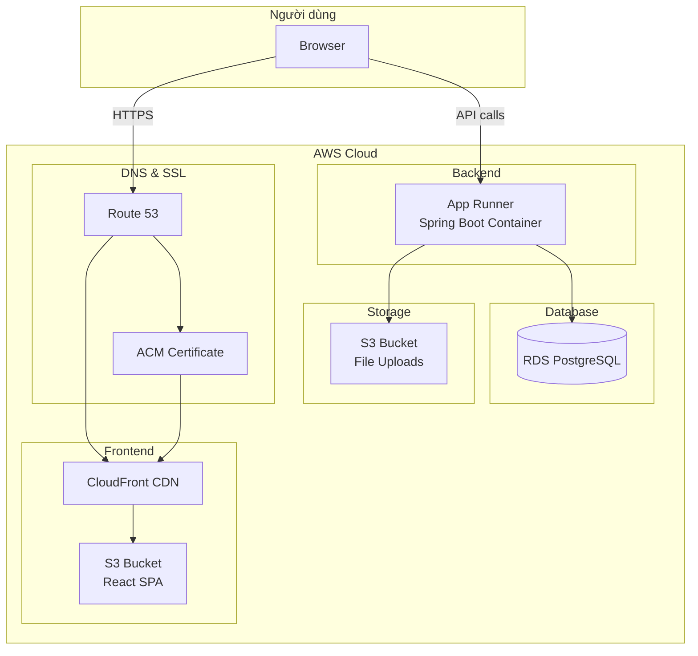

# 🚀 ITing – Hướng dẫn Deploy lên AWS

> Tài liệu triển khai hoàn chỉnh cho dự án ITing (Spring Boot + React + PostgreSQL)

## Sơ đồ kiến trúc



---

## Checklist tổng quan

| # | Bước | Trạng thái |
|---|------|------------|
| 1 | Container hóa backend | ✅ Đã có Dockerfile |
| 2 | Tạo `application-prod.properties` | ✅ Đã tạo |
| 3 | Frontend config động (env var) | ✅ Đã cập nhật |
| 4 | Push image lên ECR | ⬜ |
| 5 | Tạo RDS PostgreSQL | ⬜ |
| 6 | Deploy backend (App Runner) | ⬜ |
| 7 | Build & deploy frontend (S3 + CloudFront) | ⬜ |
| 8 | Gắn domain + HTTPS | ⬜ |
| 9 | Test end-to-end | ⬜ |

---

## Bước 1: Container hóa Backend

> [!NOTE]
> Dockerfile đã có sẵn tại [ITing-backend/Dockerfile](file:///c:/Users/Admin/Desktop/dacn/ITing/ITing-backend/Dockerfile). Dùng multi-stage build với Gradle + JRE 17 Alpine.

### Build image locally để test:

```bash
cd ITing-backend
docker build -t iting-backend:latest .
```

### Test chạy local:
```bash
docker run -p 8080:8080 \
  -e DB_HOST=host.docker.internal \
  -e DB_PORT=5432 \
  -e DB_NAME=iting_job_portal \
  -e DB_USERNAME=postgres \
  -e DB_PASSWORD=your_password \
  -e JWT_SECRET=404E635266556A586E3272357538782F413F4428472B4B6250645367566B5970 \
  -e JWT_REFRESH_SECRET=7134743777217A25432A462D4A614E645267556B58703272357538782F413F4428472B4B6250645367566B5970 \
  -e SPRING_PROFILES_ACTIVE=prod \
  iting-backend:latest
```

---

## Bước 2: Tạo ECR Repository & Push Image

```bash
# 1. Login vào ECR
aws ecr get-login-password --region ap-southeast-1 | \
  docker login --username AWS --password-stdin YOUR_ACCOUNT_ID.dkr.ecr.ap-southeast-1.amazonaws.com

# 2. Tạo repository
aws ecr create-repository --repository-name iting-backend --region ap-southeast-1

# 3. Tag image
docker tag iting-backend:latest \
  YOUR_ACCOUNT_ID.dkr.ecr.ap-southeast-1.amazonaws.com/iting-backend:latest

# 4. Push
docker push YOUR_ACCOUNT_ID.dkr.ecr.ap-southeast-1.amazonaws.com/iting-backend:latest
```

> [!IMPORTANT]
> Thay `YOUR_ACCOUNT_ID` bằng AWS Account ID thực tế (12 chữ số).

---

## Bước 3: Tạo RDS PostgreSQL

### Qua AWS Console:
1. Vào **RDS** → **Create database**
2. Chọn **PostgreSQL 16**
3. Template: **Free tier** (cho đồ án)
4. DB instance identifier: `iting-db`
5. Master username: `postgres`
6. Master password: **đặt password mạnh** → ghi lại
7. DB instance class: `db.t3.micro` (Free tier)
8. Storage: 20 GiB gp3
9. **Public access: No** (bảo mật hơn)
10. VPC security group: tạo mới, cho phép port `5432` từ App Runner

### Sau khi tạo xong:
- Copy **Endpoint** (VD: `iting-db.xxx.ap-southeast-1.rds.amazonaws.com`)
- Tạo database:

```bash
psql -h iting-db.xxx.ap-southeast-1.rds.amazonaws.com -U postgres -c "CREATE DATABASE iting_job_portal;"
```

> [!WARNING]
> Nhớ cấu hình **Security Group** cho RDS cho phép kết nối từ App Runner. Nếu dùng App Runner, cần tạo **VPC Connector**.

---

## Bước 4: Deploy Backend lên App Runner

### Qua AWS Console:
1. Vào **App Runner** → **Create service**
2. Source: **Container registry** → **Amazon ECR**
3. Chọn image `iting-backend:latest`
4. Port: `8080`
5. CPU: 1 vCPU, Memory: 2 GB
6. **Environment variables** — set tất cả các biến sau:

```
DB_HOST              = iting-db.xxx.ap-southeast-1.rds.amazonaws.com
DB_PORT              = 5432
DB_NAME              = iting_job_portal
DB_USERNAME          = postgres
DB_PASSWORD          = (mật khẩu RDS)
JWT_SECRET           = (tạo mới, random 64 hex chars)
JWT_REFRESH_SECRET   = (tạo mới, random 84 hex chars)
AWS_ACCESS_KEY       = AKIA...
AWS_SECRET_KEY       = (secret key)
AWS_REGION           = ap-southeast-1
AWS_S3_BUCKET        = datn-jobweb
MAIL_USERNAME        = your-email@gmail.com
MAIL_PASSWORD        = your-app-password
GOOGLE_CLIENT_ID     = 435696030871-xxx.apps.googleusercontent.com
GOOGLE_CLIENT_SECRET = (secret)
GEMINI_API_KEY       = (api key)
CORS_ORIGINS         = https://your-cloudfront-domain.cloudfront.net
SWAGGER_ENABLED      = false
```

7. **Networking**: Tạo VPC Connector nối đến VPC chứa RDS
8. Health check path: `/actuator/health`
9. Deploy!

### Sau khi chạy:
- Copy **App Runner URL** (VD: `https://xxx.ap-southeast-1.awsapprunner.com`)
- Test: `curl https://xxx.ap-southeast-1.awsapprunner.com/actuator/health`

---

## Bước 5: Build & Deploy Frontend

### 5.1 Build production
```bash
cd ITing-frontend

# Set API URL cho production build
set REACT_APP_API_BASE_URL=https://xxx.ap-southeast-1.awsapprunner.com/api

# Build
npm run build
```

> Output sẽ ở thư mục `dist/` (hoặc `build/`)

### 5.2 Tạo S3 Bucket

```bash
# Tạo bucket
aws s3 mb s3://iting-frontend --region ap-southeast-1

# Bật static website hosting
aws s3 website s3://iting-frontend \
  --index-document index.html \
  --error-document index.html

# Upload build files
aws s3 sync dist/ s3://iting-frontend --delete
```

### 5.3 Tạo CloudFront Distribution

1. Vào **CloudFront** → **Create distribution**
2. Origin domain: chọn S3 bucket `iting-frontend`
3. Origin access: **Origin access control (OAC)** — tạo mới
4. Viewer protocol policy: **Redirect HTTP to HTTPS**
5. Default root object: `index.html`
6. **Custom error responses** (quan trọng cho SPA React):
   - Error code `403` → Response page `/index.html` → Status `200`
   - Error code `404` → Response page `/index.html` → Status `200`
7. Deploy!

### 5.4 Cập nhật S3 Bucket Policy

Sau khi tạo CloudFront, update bucket policy cho phép OAC:

```json
{
    "Version": "2012-10-17",
    "Statement": [
        {
            "Sid": "AllowCloudFrontServicePrincipal",
            "Effect": "Allow",
            "Principal": {
                "Service": "cloudfront.amazonaws.com"
            },
            "Action": "s3:GetObject",
            "Resource": "arn:aws:s3:::iting-frontend/*",
            "Condition": {
                "StringEquals": {
                    "AWS:SourceArn": "arn:aws:cloudfront::YOUR_ACCOUNT_ID:distribution/YOUR_DISTRIBUTION_ID"
                }
            }
        }
    ]
}
```

---

## Bước 6: Gắn Domain + HTTPS

### 6.1 ACM Certificate
1. Vào **ACM** (region `us-east-1` cho CloudFront)
2. Request public certificate cho `iting.vn` và `*.iting.vn`
3. Verify bằng DNS (thêm CNAME record)

### 6.2 Route 53
1. Tạo Hosted Zone cho `iting.vn`
2. Thêm record:
   - `iting.vn` → Alias → CloudFront distribution
   - `api.iting.vn` → CNAME → App Runner URL

### 6.3 Cập nhật CORS
Sau khi có domain, update biến `CORS_ORIGINS` trên App Runner:
```
CORS_ORIGINS=https://iting.vn
```

---

## Bước 7: Những thứ phải sửa trước khi lên prod

> [!CAUTION]
> Đây là danh sách bắt buộc. Bỏ qua bất kỳ mục nào đều có thể gây lỗ hổng bảo mật.

### Backend

| Mục | File | Trạng thái |
|-----|------|------------|
| Tách password/secret ra env var | `application-prod.properties` | ✅ Đã làm |
| Tắt Swagger UI ở prod | `application-prod.properties` | ✅ Đã làm |
| Tắt debug security log | `application-prod.properties` | ✅ Đã làm |
| Cấu hình CORS đúng domain | `application-prod.properties` | ✅ Đã làm |
| Tạo JWT secret mới (không dùng lại dev) | `.env.production` | ⬜ Tự tạo |
| Cấu hình HTTPS redirect | App Runner tự lo | ✅ |

### Frontend

| Mục | File | Trạng thái |
|-----|------|------------|
| API URL đọc từ env var | `src/config/index.js` | ✅ Đã sửa |
| Sửa hardcoded `localhost:8080` trong `jobUrl.js` | `src/utils/jobUrl.js` | ⬜ Cần sửa |
| Build production bundle | `npm run build` | ⬜ |

---

## Bước 8: File cần sửa thêm

### `src/utils/jobUrl.js` — Xóa hardcoded localhost

Thay đổi dòng:
```diff
- const baseUrl = "http://localhost:8080";
+ import { API_BASE_URL } from "../config";
+ const baseUrl = API_BASE_URL.replace("/api", "");
```

---

## Chi phí ước tính (Free Tier eligible)

| Service | Ước tính/tháng |
|---------|---------------|
| RDS db.t3.micro | **Miễn phí** 12 tháng đầu |
| App Runner (1 vCPU, 2GB) | ~$5–15 (tùy traffic) |
| S3 + CloudFront | ~$1-2 |
| Route 53 Hosted Zone | $0.50 |
| **Tổng** | **~$7–18/tháng** |

---

## Lệnh deploy nhanh (sau lần đầu)

### Update backend
```bash
cd ITing-backend
docker build -t iting-backend:latest .
docker tag iting-backend:latest YOUR_ACCOUNT_ID.dkr.ecr.ap-southeast-1.amazonaws.com/iting-backend:latest
docker push YOUR_ACCOUNT_ID.dkr.ecr.ap-southeast-1.amazonaws.com/iting-backend:latest
# App Runner sẽ tự deploy lại nếu bật auto-deploy
```

### Update frontend
```bash
cd ITing-frontend
set REACT_APP_API_BASE_URL=https://api.iting.vn/api
npm run build
aws s3 sync dist/ s3://iting-frontend --delete
aws cloudfront create-invalidation --distribution-id YOUR_DIST_ID --paths "/*"
```

---

## Troubleshooting

| Vấn đề | Nguyên nhân | Giải pháp |
|--------|-------------|-----------|
| Backend không kết nối RDS | Security Group chặn | Mở port 5432 cho App Runner VPC Connector |
| Frontend trắng trang khi refresh | SPA routing | Thêm error response 403/404 → index.html trên CloudFront |
| CORS error | Domain frontend chưa được whitelist | Update `CORS_ORIGINS` env var |
| Health check fail | Path sai | Đảm bảo `/actuator/health` accessible |
| Image push ECR thất bại | Token hết hạn | Chạy lại `aws ecr get-login-password` |
