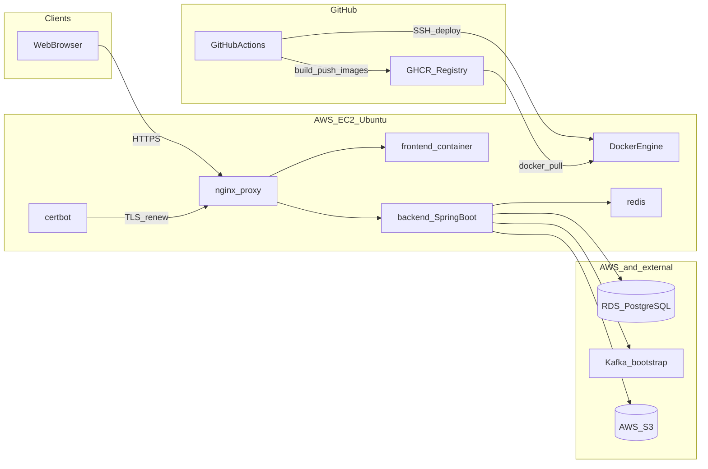
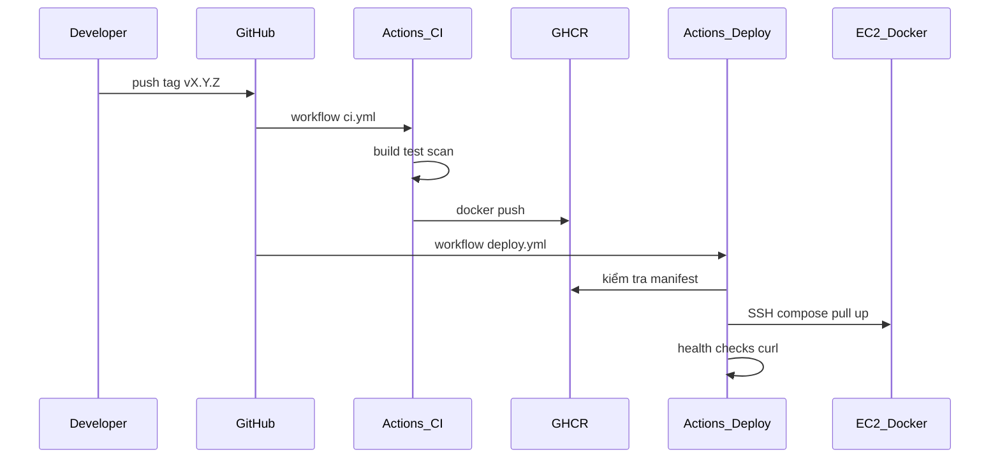

# Chương (phần) triển khai — hệ thống ITing

Tài liệu phục vụ đưa vào luận văn tốt nghiệp. Nội dung bám cấu trúc mã nguồn trong kho `ITing` tại thời điểm lập. **Sơ đồ UML Deployment** có bản PlantUML: [`deployment-diagram.puml`](deployment-diagram.puml).

---

## 1. Mục tiêu và phạm vi trình bày

Hệ thống ITing được triển khai theo hướng **container hóa** (Docker), **tự động hóa** quy trình xây dựng và phát hành (CI/CD với GitHub Actions), và **lưu trữ image** trên **GitHub Container Registry (GHCR)**. Môi trường chạy sản phẩm sử dụng **máy ảo AWS EC2 (Ubuntu)** với **Docker Compose**, reverse proxy **Nginx**, **TLS (Let’s Encrypt / Certbot)**. Cơ sở dữ liệu quan hệ nằm tại **Amazon RDS (PostgreSQL)** theo mẫu cấu hình trong kho; **Redis** chạy trong cùng stack Compose trên EC2; **Kafka** và **Amazon S3** được ứng dụng tích hợp qua biến môi trường (điểm kết nối tuỳ môi trường vận hành).

**Phân biệt thuật ngữ (yêu cầu tính khoa học):** *Docker* là nền tảng **đóng gói và thực thi container**, không tương đương với “dịch vụ hosting miễn phí”. Chi phí thực tế gồm máy chủ (ví dụ EC2), dịch vụ quản lý CSDL, lưu trữ đối tượng, và (tuỳ chính sách) **GitHub Actions / GHCR free tier** — cần đối chiếu điều khoản nhà cung cấp tại thời điểm viết luận.

---

## 2. Sơ đồ triển khai (UML Deployment Diagram)

### 2.1. Quy ước UML 2 (đoạn có thể đưa nguyên vào luận)

Trong **UML Deployment Diagram**:

- **Execution environment node**: mô tả nơi thực thi phần mềm — ví dụ node **AWS EC2 (Ubuntu)** chứa **Docker Engine**.
- **Artifact**: kết quả triển khai có thể đặt lên node — ví dụ các **Docker image** (`iting-backend`, `iting-frontend`, `nginx`, `redis`, `certbot`), được kéo từ GHCR hoặc build cục bộ.
- **Communication path**: quan hệ giao tiếp giữa các artifact/node — ví dụ HTTPS từ trình duyệt tới **nginx-proxy** (cổng 443); Nginx chuyển tiếp tới frontend (SPA) và backend API; backend kết nối **Redis**, **PostgreSQL (RDS)**, **Kafka**, **S3** thông qua giao thức tương ứng.

### 2.2. Thành phần theo cấu trúc dự án

| Vùng | Thành phần chính |
|------|-------------------|
| Internet | Trình duyệt người dùng |
| EC2 | Docker Compose: `nginx-proxy`, `frontend`, `backend`, `redis`, `certbot` (file [`deploy/docker-compose.yml`](../../deploy/docker-compose.yml)) |
| AWS (ngoài stack Compose chính) | **RDS PostgreSQL** (theo [`deploy/.env.local.example`](../../deploy/.env.local.example)); **Kafka** qua biến `KAFKA_BROKERS`; **S3** qua biến `AWS_*` |
| GitHub | Repository, GitHub Actions, GHCR |

### 2.3. File PlantUML

Render bằng PlantUML (CLI, VS Code, hoặc kết xuất PNG/SVG cho luận văn): [`deployment-diagram.puml`](deployment-diagram.puml).

### 2.4. Sơ đồ luồng tổng quát (Mermaid — tuỳ biên tập Word/LaTeX)

---

## 3. Xác nhận vị trí PostgreSQL và Kafka (căn cứ kho mã)

### 3.1. PostgreSQL — Amazon RDS

File [`deploy/.env.local.example`](../../deploy/.env.local.example) hướng dẫn endpoint dạng `your-rds.region.rds.amazonaws.com` và ghi rõ ngữ cảnh **RDS**, Security Group, kiểm tra cổng 5432. Backend trong Compose đặt chuỗi kết nối qua `SPRING_DATASOURCE_*` (tham chiếu `DB_HOST`, `DB_PORT`, … trong [`deploy/docker-compose.yml`](../../deploy/docker-compose.yml)).

**Kết luận cho sơ đồ và luận văn:** node CSDL quan hệ nên ghi **Amazon RDS (PostgreSQL)**, không gộp vào cùng Docker Compose production đã mô tả.

### 3.2. Kafka — bootstrap ngoài Compose

[`deploy/docker-compose.yml`](../../deploy/docker-compose.yml) thiết lập `SPRING_KAFKA_BOOTSTRAP_SERVERS: ${KAFKA_BROKERS:-localhost:9092}`. Trong môi trường production triển khai trên EC2, broker **không** xuất hiện như một service trong đoạn Compose đã dùng cho báo cáo; điểm kết nối do biến `KAFKA_BROKERS` cung cấp (ví dụ **Amazon MSK**, cụm Kafka trên EC2, hoặc dịch vụ tương đương — **cần ghi đúng theo file `/opt/iting/.env` và `.env.prod` trên máy chủ**, không suy diễn trong luận nếu chưa xác minh).

---

## 4. Nền tảng triển khai: Docker và Docker Compose

### 4.1. Khái niệm ngắn gọn

**Container** đóng gói ứng dụng cùng phụ thuộc, cách ly tiến trình, dùng chung kernel hệ điều hành host. **Dockerfile** định nghĩa image: backend dùng [`ITing-backend/Dockerfile.prod`](../../ITing-backend/Dockerfile.prod), frontend dùng [`ITing-frontend/Dockerfile`](../../ITing-frontend/Dockerfile).

**Docker Compose** điều phối đa container trên **một host**: khai báo service, mạng (`iting-net` kiểu external trong production), volume, healthcheck, giới hạn tài nguyên — xem [`deploy/docker-compose.yml`](../../deploy/docker-compose.yml).

### 4.2. Môi trường phát triển cục bộ

[`deploy/docker-compose.local.yml`](../../deploy/docker-compose.local.yml) build image tại máy dev, map cổng (ví dụ backend **8081**, frontend **3000**), dùng `env_file: .env.local` (mẫu: [`.env.local.example`](../../deploy/.env.local.example)).

### 4.3. Docker không đồng nghĩa “hosting miễn phí”

Docker là **công cụ mã nguồn mở**; chi phí chủ yếu là **tài nguyên máy chủ** và dịch vụ đám mây đi kèm. Lợi ích khoa học khi trình bày: **tái lập môi trường** giữa máy lập trình viên và máy chủ, giảm sai lệch “chạy được trên máy tôi”, hỗ trợ **triển khai lặp lại được** (reproducible deployment).

---

## 5. Kế hoạch CI/CD

### 5.1. Khung lý thuyết DevOps

- **Continuous Integration (CI):** tích hợp thường xuyên mã mới — biên dịch, chạy kiểm thử, quét bảo mật.
- **Continuous Delivery / Deployment (CD):** tự động hoá bước đưa bản dựng tới môi trường đích khi thỏa điều kiện (tag, kiểm tra sức khoẻ, …).

### 5.2. Pipeline CI — file [`.github/workflows/ci.yml`](../../.github/workflows/ci.yml)

| Thành phần | Mô tả |
|------------|--------|
| **Kích hoạt** | `push` nhánh `main`, `develop`; `pull_request` vào `main`; `push` tag `v*` |
| **Job `backend`** | JDK 17 (Temurin), `mvn -B clean package -DskipTests`, `mvn -B test`, lưu artifact JAR |
| **Job `frontend`** | Node 20, `npm ci`, `npm run build` với `APP_ENV=production`, biến build `VITE_API_BASE` trỏ API production, lưu artifact `dist` |
| **Job `security`** | Quét filesystem bằng **Trivy** (mức CRITICAL/HIGH), đưa kết quả SARIF (tích hợp GitHub Security) |
| **Job `docker`** | Chỉ khi `push` (không chạy trên PR): Docker Buildx, đăng nhập **GHCR**, build và push `iting-backend`, `iting-frontend` với tag commit `sha`, `latest`, và tag phiên bản khi có tag `v*` |

### 5.3. Pipeline CD — file [`.github/workflows/deploy.yml`](../../.github/workflows/deploy.yml)

| Thành phần | Mô tả |
|------------|--------|
| **Kích hoạt** | Chỉ `push` tag dạng `v*` |
| **Biến image** | `BACKEND_IMAGE`, `FRONTEND_IMAGE` trỏ tới `ghcr.io/<repo>/iting-backend:<tag>` và tương tự cho frontend |
| **Các bước chính** | Đăng nhập GHCR → chờ manifest image có tag → **SSH** lên EC2 (`appleboy/ssh-action`) → trong `/opt/iting/iting-repo` checkout đúng tag → `docker compose -f docker-compose.yml` với `--env-file /opt/iting/.env` và `.env.prod`: `pull`, `up -d`, recreate `nginx-proxy`, `docker image prune` |
| **Kiểm tra sau triển khai** | `curl` trang chủ HTTPS và endpoint `/actuator/health` của API |
| **Thông báo** | Webhook Discord (thành công / thất bại) |
| **Secrets / môi trường GitHub** | `EC2_HOST`, `EC2_SSH_KEY`, `GHCR_TOKEN`, `GHCR_USERNAME`, `DISCORD_WEBHOOK_URL`, protection **environment** `production` |

### 5.4. Triển khai thủ công và rollback

Script [`deploy/scripts/deploy.sh`](../../deploy/scripts/deploy.sh) hỗ trợ lệnh `deploy`, `restart`, `logs`, `status`; `rollback` hướng dẫn đổi tag image rồi chạy lại `deploy`.

### 5.5. Sơ đồ tuần tự CI/CD (Mermaid)

---

## 6. Cloud hosting và dịch vụ liên quan

### 6.1. Mô hình IaaS và dịch vụ đi kèm

**Amazon EC2** thuộc mô hình **IaaS**: người vận hành quản lý hệ điều hành (Ubuntu), cài Docker, cấu hình bảo mật, sao lưu. **Amazon RDS** cung cấp CSDL quan hệ được quản lý. **Amazon S3** dùng cho lưu trữ đối tượng (theo biến AWS trong ứng dụng). **GHCR** là registry container do GitHub cung cấp — luồng triển khai kéo image từ GHCR về EC2, không bắt buộc dùng Amazon ECR.

### 6.2. Ánh xạ cụ thể ITing

| Thành phần | Vai trò |
|------------|---------|
| **EC2** | Chạy Docker Compose; mã triển khai tham chiếu đường dẫn `/opt/iting/iting-repo/deploy` (xem [`deploy/scripts/deploy.sh`](../../deploy/scripts/deploy.sh)) |
| **GHCR** | Lưu trữ image `iting-backend`, `iting-frontend` sau CI |
| **Nginx + Certbot** | TLS termination, proxy; gia hạn Let’s Encrypt qua container certbot, volume chứng chỉ trên host |
| **Redis** | Container trong Compose trên EC2 — cache/cấu hình theo Spring |
| **RDS PostgreSQL** | CSDL chính — JDBC qua biến `DB_*` |
| **Kafka** | Bootstrap qua `KAFKA_BROKERS` — **ghi rõ kiến trúc thực tế** trong luận sau khi đối chiếu `.env.prod` |
| **S3** | Lưu file / đối tượng qua AWS SDK khi bật và cấu hình khóa |

### 6.3. Hạn chế và hướng mở rộng (đoạn kết có thể dùng trong luận)

Triển khai hiện tại tập trung trên **một máy EC2** chạy Compose: dễ vận hành cho đồ án, nhưng **điểm đơn lỗi (SPOF)** tại máy chủ nếu không có cơ chế dự phòng. Hướng mở rộng có thể nêu mang tính tham khảo: cân bằng tải đa AZ, cơ sở dữ liệu đa AZ, hoặc orchestrator **Kubernetes** khi quy mô tăng — **ngoài phạm vi bắt buộc** của mô tả hiện trạng mã.

---

## 7. Tài liệu tham chiếu nhanh (đường dẫn trong kho)

| Nội dung | Đường dẫn |
|----------|-----------|
| Compose production | `deploy/docker-compose.yml` |
| Compose local | `deploy/docker-compose.local.yml` |
| Mẫu biến môi trường local | `deploy/.env.local.example` |
| CI | `.github/workflows/ci.yml` |
| CD | `.github/workflows/deploy.yml` |
| Script triển khai EC2 | `deploy/scripts/deploy.sh` |

---

*Tài liệu này tổng hợp nội dung kế hoạch “Khung báo cáo: Triển khai, Docker, CI/CD, Cloud (ITing)”; không thay thế kiểm tra thực tế trên máy chủ khi cần mô tả chính xác endpoint Kafka hoặc chi tiết Free Tier AWS/GitHub tại thời điểm nộp luận.*
