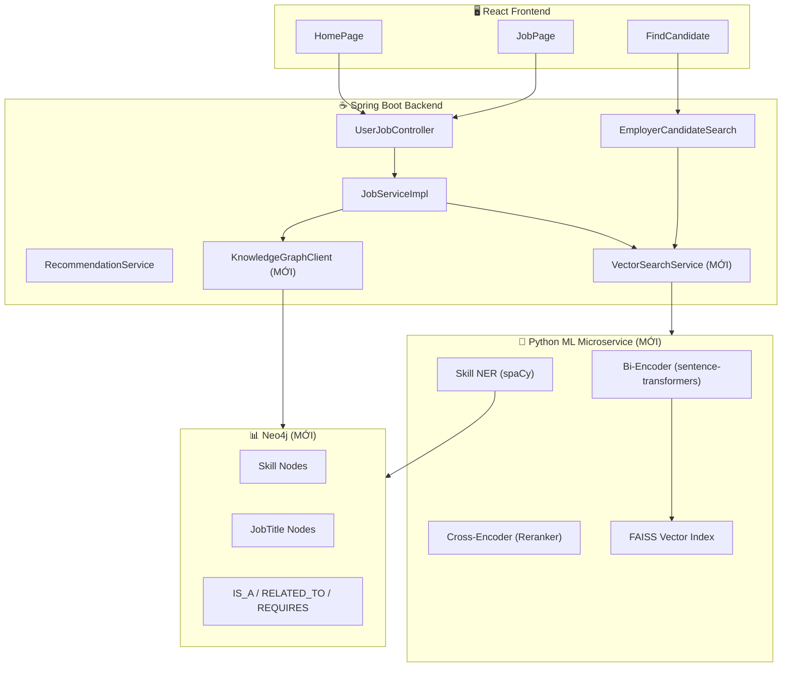
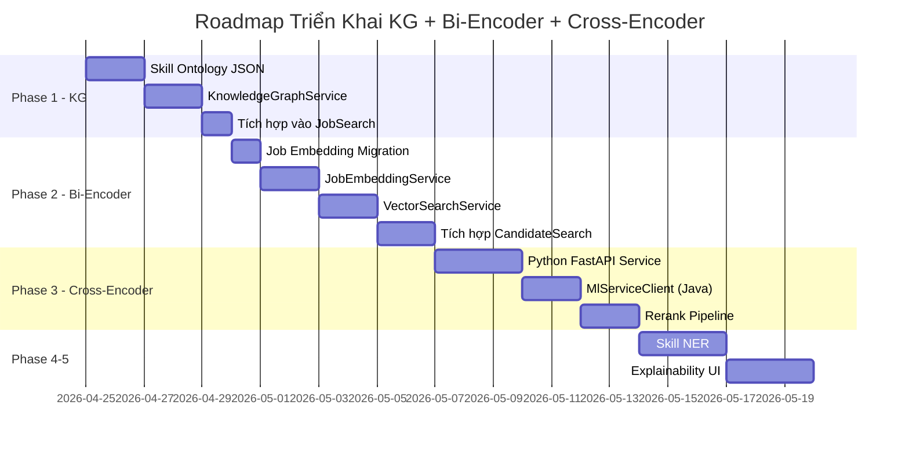

# 🧠 Kế Hoạch Triển Khai: Knowledge Graph + Bi-Encoder/Cross-Encoder

## Phân Tích Hiện Trạng Hệ Thống

### Những gì đã có sẵn

| Thành phần | Hiện trạng | File chính |
|---|---|---|
| **Gemini AI** | ✅ Đã tích hợp — dùng cho CV analysis, search expansion, job review | [GeminiService.java](file:///c:/Users/Admin/Desktop/dacn/ITing/ITing-backend/src/main/java/com/iting/jobportal/common/service/GeminiService.java) |
| **OpenAI Embedding** | ✅ Đã có — Bi-Encoder cơ bản cho candidate search (text-embedding-3-small) | [OpenAiEmbeddingClient.java](file:///c:/Users/Admin/Desktop/dacn/ITing/ITing-backend/src/main/java/com/iting/jobportal/userprofile/service/embedding/OpenAiEmbeddingClient.java) |
| **Cosine Similarity** | ✅ Đã triển khai trong EmployerCandidateSearchServiceImpl | [EmployerCandidateSearchServiceImpl.java](file:///c:/Users/Admin/Desktop/dacn/ITing/ITing-backend/src/main/java/com/iting/jobportal/userprofile/service/impl/EmployerCandidateSearchServiceImpl.java) |
| **Recommendation Engine** | ✅ Hybrid: Collaborative + Content + Trending (3 giai đoạn) | [RecommendationServiceImpl.java](file:///c:/Users/Admin/Desktop/dacn/ITing/ITing-backend/src/main/java/com/iting/jobportal/recommendation/service/impl/RecommendationServiceImpl.java) |
| **Search Expansion** | ✅ Gemini AI mở rộng từ khóa (isAiSearch flag) | [JobServiceImpl.java:490](file:///c:/Users/Admin/Desktop/dacn/ITing/ITing-backend/src/main/java/com/iting/jobportal/job/service/impl/JobServiceImpl.java#L490) |
| **Interaction Tracking** | ✅ Track VIEW, SEARCH history cho mỗi user | InteractionService |
| **Job Search (JPA Spec)** | ✅ Full-text LIKE search trên position, description, techRequired | [JobServiceImpl.java:486-560](file:///c:/Users/Admin/Desktop/dacn/ITing/ITing-backend/src/main/java/com/iting/jobportal/job/service/impl/JobServiceImpl.java#L486-L560) |

### Những gì chưa có (GAP Analysis)

| Thành phần | Trạng thái | Cần triển khai |
|---|---|---|
| **Knowledge Graph** | ❌ Chưa có | Cần thêm Neo4j hoặc in-memory graph |
| **Job Embedding (Vector DB)** | ❌ Chưa có cho Job — chỉ có cho CV | Cần embed tất cả Job vào vector store |
| **Cross-Encoder Reranking** | ❌ Chưa có | Cần Python microservice hoặc tích hợp ONNX |
| **Skill Entity Extraction** | ❌ Chưa có NER cho skill | Cần NLP pipeline trích xuất skill từ JD/CV |
| **Explainability** | ❌ Chưa có | KG-based explanation cho matching |

---

## Kiến Trúc Đề Xuất (The Big Picture)



---

## Phase 1: Knowledge Graph (In-Memory — Không cần Neo4j) 
> **Ưu tiên: CAO** · **Effort: 3-5 ngày** · **Không cần thêm dependency nặng**

### Lý do chọn In-Memory thay vì Neo4j
Hệ thống ITing hiện đang deploy trên AWS EC2/ECS. Thêm Neo4j sẽ tăng chi phí infra đáng kể. Thay vào đó, ta xây dựng **Static Knowledge Graph in-memory** bằng Java `HashMap`/`HashSet`, load từ file JSON khi ứng dụng khởi động.

### 1A. Tạo file skill ontology

```
ITing-backend/src/main/resources/kg/
├── skill_ontology.json      # Quan hệ IS_A, RELATED_TO
└── skill_synonyms.json      # Đồng nghĩa: "JS" -> "JavaScript"
```

**`skill_ontology.json`** (ví dụ):
```json
{
  "nodes": [
    { "id": "java", "type": "Skill", "label": "Java" },
    { "id": "spring_boot", "type": "Framework", "label": "Spring Boot" },
    { "id": "react", "type": "Framework", "label": "React" },
    { "id": "javascript", "type": "Skill", "label": "JavaScript" },
    { "id": "frontend", "type": "Domain", "label": "Frontend Development" },
    { "id": "backend", "type": "Domain", "label": "Backend Development" },
    { "id": "machine_learning", "type": "Skill", "label": "Machine Learning" },
    { "id": "deep_learning", "type": "Skill", "label": "Deep Learning" },
    { "id": "ai", "type": "Domain", "label": "Artificial Intelligence" }
  ],
  "edges": [
    { "from": "spring_boot", "to": "java", "relation": "REQUIRES" },
    { "from": "react", "to": "javascript", "relation": "REQUIRES" },
    { "from": "react", "to": "frontend", "relation": "IS_A" },
    { "from": "spring_boot", "to": "backend", "relation": "IS_A" },
    { "from": "deep_learning", "to": "machine_learning", "relation": "IS_A" },
    { "from": "machine_learning", "to": "ai", "relation": "IS_A" },
    { "from": "pytorch", "to": "deep_learning", "relation": "REQUIRES" },
    { "from": "tensorflow", "to": "deep_learning", "relation": "REQUIRES" }
  ]
}
```

### 1B. Tạo service Java

**File mới:** `common/service/KnowledgeGraphService.java`

```java
public interface KnowledgeGraphService {
    /** Mở rộng từ khóa: "React" -> ["React", "JavaScript", "Frontend"] */
    List<String> expandSkill(String skill);
    
    /** Tìm tất cả skill liên quan (depth 2): "AI" -> ["ML", "DL", "NLP", ...] */
    Set<String> getRelatedSkills(String skill, int depth);
    
    /** Giải thích matching: tại sao CV match JD */
    List<String> explainMatch(List<String> cvSkills, List<String> jdSkills);
}
```

### 1C. Tích hợp vào Job Search

Thay đổi trong [JobServiceImpl.java](file:///c:/Users/Admin/Desktop/dacn/ITing/ITing-backend/src/main/java/com/iting/jobportal/job/service/impl/JobServiceImpl.java):

```diff
 public Page<JobResponse> searchJobs(JobSearchRequest request, Long userId) {
     String originalKeyword = request.getKeyword();
     List<String> expandedKeywords = new ArrayList<>();
 
     if (request.getIsAiSearch() != null && request.getIsAiSearch()) {
         expandedKeywords = geminiService.expandSearchTerms(originalKeyword);
     }
+    
+    // Phase 1: Knowledge Graph expansion (ALWAYS active, không cần AI flag)
+    if (originalKeyword != null && !originalKeyword.isBlank()) {
+        Set<String> kgExpanded = knowledgeGraphService.getRelatedSkills(originalKeyword, 2);
+        expandedKeywords.addAll(kgExpanded);
+    }
```

---

## Phase 2: Bi-Encoder — Job Embedding + Vector Search
> **Ưu tiên: CAO** · **Effort: 5-7 ngày**

### 2A. Embed tất cả Job vào database

Hiện tại hệ thống đã có `cvEmbedding` trên `User` entity. Ta cần thêm tương tự cho `Job`:

**Database migration:**
```sql
-- V14__add_job_embedding.sql
ALTER TABLE jobs ADD COLUMN job_embedding TEXT;
ALTER TABLE jobs ADD COLUMN embedding_updated_at TIMESTAMP;
```

### 2B. Tận dụng OpenAI Embedding Client có sẵn

[OpenAiEmbeddingClient.java](file:///c:/Users/Admin/Desktop/dacn/ITing/ITing-backend/src/main/java/com/iting/jobportal/userprofile/service/embedding/OpenAiEmbeddingClient.java) đã sẵn sàng! Ta chỉ cần:

1. Di chuyển nó ra `common/service/embedding/` (share giữa job và userprofile)
2. Tạo `JobEmbeddingService` gọi nó để embed `title + position + techRequired + description`
3. Tạo Scheduled Job chạy hàng đêm để embed các job mới

### 2C. Vector Search Service

```java
public interface VectorSearchService {
    /** Tìm top-K job giống nhất với query text */
    List<ScoredJob> searchByVector(String queryText, int topK);
    
    /** Tìm top-K ứng viên giống nhất với JD */
    List<ScoredCandidate> findCandidatesByJd(String jdText, int topK);
}
```

**Cách hoạt động:**
1. Embed query text → vector (dùng OpenAI)
2. Load tất cả job embedding từ DB (hoặc cache in-memory)
3. Tính cosine similarity → sort → trả về top-K

> **Tối ưu sau:** Thay thế brute-force bằng FAISS (Python microservice) khi lượng job > 10,000

### 2D. Tích hợp vào Candidate Search

Cải tiến [EmployerCandidateSearchServiceImpl.java](file:///c:/Users/Admin/Desktop/dacn/ITing/ITing-backend/src/main/java/com/iting/jobportal/userprofile/service/impl/EmployerCandidateSearchServiceImpl.java):

```diff
 // Hiện tại: chỉ embed keyword → compare với cvEmbedding
 // Cải tiến: Employer paste toàn bộ JD → embed → tìm CV tương đồng nhất
+
+ // Bước 1: Bi-Encoder retrieval (nhanh, lấy top 100)
+ List<ScoredCandidate> biEncoderResults = vectorSearchService
+     .findCandidatesByJd(request.getKeyword(), 100);
```

---

## Phase 3: Cross-Encoder Reranking
> **Ưu tiên: TRUNG BÌNH** · **Effort: 5-7 ngày** · **Cần Python microservice**

### 3A. Python ML Microservice (FastAPI)

```
ITing-ml/
├── app/
│   ├── main.py              # FastAPI entry
│   ├── reranker.py           # Cross-Encoder logic
│   ├── embedder.py           # Bi-Encoder (alternative to OpenAI)
│   └── ner.py                # Skill entity extraction
├── models/                   # Downloaded model weights
├── requirements.txt
└── Dockerfile
```

**`main.py`:**
```python
from fastapi import FastAPI
from sentence_transformers import CrossEncoder
import torch

app = FastAPI()
reranker = CrossEncoder('cross-encoder/ms-marco-MiniLM-L-6-v2')

@app.post("/rerank")
async def rerank(request: RerankRequest):
    pairs = [[request.query, doc] for doc in request.documents]
    scores = reranker.predict(pairs)
    
    ranked = sorted(
        zip(request.doc_ids, scores), 
        key=lambda x: x[1], 
        reverse=True
    )
    return {"results": [{"id": id, "score": float(s)} for id, s in ranked]}
```

### 3B. Spring Boot Client

**File mới:** `common/service/MlServiceClient.java`

```java
@Service
public class MlServiceClient {
    @Value("${ml.service.url:http://localhost:8000}")
    private String mlServiceUrl;
    
    public List<RankedResult> rerank(String query, List<String> documents, List<Long> docIds) {
        // POST to Python microservice /rerank endpoint
    }
}
```

### 3C. Tích hợp vào Search Pipeline

```diff
 // JobServiceImpl.searchJobs()
 
 // Giai đoạn 1: JPA Spec + KG expansion (recall ~500 kết quả)
 Page<Job> jobPage = jobRepository.findAll(spec, pageable);
 
+// Giai đoạn 2: Cross-Encoder rerank (nếu có keyword)
+if (originalKeyword != null && !originalKeyword.isBlank() && jobPage.getContent().size() > 5) {
+    List<String> documents = jobPage.getContent().stream()
+        .map(j -> j.getTitle() + " " + j.getTechRequired() + " " + j.getDescription())
+        .toList();
+    List<Long> docIds = jobPage.getContent().stream().map(Job::getId).toList();
+    
+    List<RankedResult> reranked = mlServiceClient.rerank(originalKeyword, documents, docIds);
+    // Sắp xếp lại theo điểm Cross-Encoder
+}
```

---

## Phase 4: Skill NER (Entity Extraction)
> **Ưu tiên: THẤP** · **Effort: 3-5 ngày**

Tự động trích xuất kỹ năng từ JD/CV text thô để:
1. Tự động gắn tag kỹ năng cho job
2. Enriching Knowledge Graph
3. Matching CV-JD chính xác hơn

**Python endpoint:**
```python
@app.post("/extract-skills")
async def extract_skills(request: TextRequest):
    doc = nlp(request.text)
    skills = [ent.text for ent in doc.ents if ent.label_ == "SKILL"]
    return {"skills": skills}
```

---

## Phase 5: Explainability (Giải thích kết quả)
> **Ưu tiên: THẤP** · **Effort: 2-3 ngày**

Sử dụng Knowledge Graph để hiển thị lý do matching trên Frontend:

```
✅ "PyTorch" (trong CV) → IS_A → "Deep Learning" → IS_A → "AI" (trong JD)
✅ "Spring Boot" (trong CV) → REQUIRES → "Java" (trong JD)
```

**Frontend hiển thị:**
```jsx
<div className="bg-green-50 p-3 rounded-xl">
  <h4 className="font-bold text-green-700">Lý do phù hợp:</h4>
  {matchReasons.map(reason => (
    <div className="text-sm text-green-600">
      ✅ {reason.cvSkill} → {reason.relation} → {reason.jdSkill}
    </div>
  ))}
</div>
```

---

## Thứ Tự Triển Khai (Roadmap)



---

## Chi Phí Ước Tính

| Thành phần | Chi phí/tháng | Ghi chú |
|---|---|---|
| OpenAI Embedding (đã có) | ~$5-15 | text-embedding-3-small, ~$0.02/1M tokens |
| Gemini AI (đã có) | Free tier / ~$10 | Gemini 2.5 Flash |
| Python ML Service (EC2) | ~$15-30 | t3.medium (cho model inference) |
| Neo4j (KHÔNG cần) | $0 | Dùng in-memory graph thay thế |
| **Tổng thêm** | **~$15-30/tháng** | Chỉ thêm 1 EC2 instance cho Python |

---

## Quyết Định Cần Xác Nhận

> [!IMPORTANT]
> Trước khi bắt tay triển khai, bạn cần xác nhận:

1. **Bắt đầu từ Phase nào?** — Khuyến nghị Phase 1 (KG in-memory) vì ít effort nhất, không cần thêm infra, và cải thiện search ngay lập tức.

2. **Python microservice hay tích hợp trực tiếp?** — Phase 3 (Cross-Encoder) bắt buộc cần Python. Bạn có muốn deploy thêm 1 service riêng hay muốn tìm cách chạy model trong Java (ONNX Runtime)?

3. **OpenAI hay self-hosted Bi-Encoder?** — Hiện tại đã dùng OpenAI. Giữ nguyên hay muốn chuyển sang self-hosted (sentence-transformers) để tiết kiệm chi phí?

4. **Scope của Knowledge Graph?** — Bắt đầu với ~200 skill nodes (IT domain) hay muốn ontology lớn hơn?
