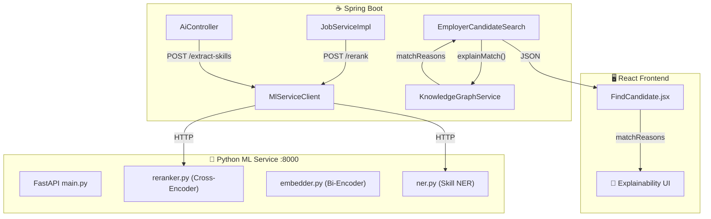

# ✅ Phase 3, 4, 5: Cross-Encoder + Skill NER + Explainability

## Build Status: ✅ JAVA COMPILE SUCCESS

---

## Tổng Quan Kiến Trúc



---

## Phase 3: Cross-Encoder Reranking

### Python ML Microservice (8 files mới)

| # | File | Mô tả |
|---|---|---|
| 1 | [requirements.txt](file:///c:/Users/Admin/Desktop/dacn/ITing/ITing-ml/requirements.txt) | FastAPI, sentence-transformers, torch, spaCy, pydantic |
| 2 | [app/main.py](file:///c:/Users/Admin/Desktop/dacn/ITing/ITing-ml/app/main.py) | FastAPI entry: 6 endpoints (rerank, embed, semantic-search, extract-skills, health) |
| 3 | [app/reranker.py](file:///c:/Users/Admin/Desktop/dacn/ITing/ITing-ml/app/reranker.py) | Cross-Encoder: `ms-marco-MiniLM-L-6-v2` (~80MB) |
| 4 | [app/embedder.py](file:///c:/Users/Admin/Desktop/dacn/ITing/ITing-ml/app/embedder.py) | Bi-Encoder: `all-MiniLM-L6-v2` (384 dims, self-hosted alternative to OpenAI) |
| 5 | [app/ner.py](file:///c:/Users/Admin/Desktop/dacn/ITing/ITing-ml/app/ner.py) | Rule-based Skill NER: ~200 IT skills dictionary + category classification |
| 6 | [app/\_\_init\_\_.py](file:///c:/Users/Admin/Desktop/dacn/ITing/ITing-ml/app/__init__.py) | Python package init |
| 7 | [Dockerfile](file:///c:/Users/Admin/Desktop/dacn/ITing/ITing-ml/Dockerfile) | Production Docker image with pre-downloaded models |
| 8 | [README.md](file:///c:/Users/Admin/Desktop/dacn/ITing/ITing-ml/README.md) | Quick start documentation |

### Spring Boot Client (2 files mới)

| # | File | Mô tả |
|---|---|---|
| 9 | [MlServiceClient.java](file:///c:/Users/Admin/Desktop/dacn/ITing/ITing-backend/src/main/java/com/iting/jobportal/common/service/MlServiceClient.java) | Interface: rerank(), extractSkills(), isAvailable() |
| 10 | [MlServiceClientImpl.java](file:///c:/Users/Admin/Desktop/dacn/ITing/ITing-backend/src/main/java/com/iting/jobportal/common/service/impl/MlServiceClientImpl.java) | Java HttpClient implementation, **graceful degradation** if ML service offline |

### Search Pipeline Integration

```diff:JobServiceImpl.java
package com.iting.jobportal.job.service.impl;

import com.iting.jobportal.company.entity.Company;
import com.iting.jobportal.company.entity.enums.CompanyReviewStatus;
import com.iting.jobportal.company.entity.enums.VerificationLevel;
import com.iting.jobportal.company.repository.CompanyRepository;
import com.iting.jobportal.job.dto.request.CreateJobRequest;
import com.iting.jobportal.job.dto.request.JobSearchRequest;
import com.iting.jobportal.job.dto.request.UpdateJobRequest;
import com.iting.jobportal.job.dto.response.JobResponse;
import com.iting.jobportal.job.dto.response.SalaryReportResponse;
import com.iting.jobportal.job.entity.Job;
import com.iting.jobportal.job.entity.enums.JobStatus;
import com.iting.jobportal.job.entity.enums.SalaryType;
import com.iting.jobportal.job.repository.JobRepository;
import com.iting.jobportal.job.repository.JobSpecification;
import com.iting.jobportal.job.service.JobService;
import com.iting.jobportal.recommendation.service.RecommendationService;
import com.iting.jobportal.common.service.GeminiService;
import org.springframework.context.annotation.Lazy;
import jakarta.persistence.EntityManager;
import jakarta.persistence.PersistenceContext;
import lombok.RequiredArgsConstructor;
import com.iting.jobportal.file.FileUploadService;
import org.springframework.context.ApplicationEventPublisher;
import org.springframework.data.domain.*;
import org.springframework.data.jpa.domain.Specification;
import jakarta.persistence.criteria.Predicate;
import java.util.ArrayList;
import org.springframework.http.HttpStatus;
import org.springframework.stereotype.Service;
import org.springframework.transaction.annotation.Transactional;
import org.springframework.web.server.ResponseStatusException;

import java.time.LocalDate;
import java.time.LocalDateTime;
import java.util.List;
import java.util.stream.Collectors;

@Service
@RequiredArgsConstructor
public class JobServiceImpl implements JobService {

    private final JobRepository jobRepository;
    private final CompanyRepository companyRepository;
    private final FileUploadService fileUploadService;
    private final ApplicationEventPublisher eventPublisher;
    private final GeminiService geminiService;

    @PersistenceContext
    private EntityManager entityManager;

    @Lazy
    private final RecommendationService recommendationService;

    // =========================================================
    // PRIVATE HELPERS
    // =========================================================

    private Job findJobOrThrow(Long jobId) {
        return jobRepository.findById(jobId)
                .orElseThrow(() ->
                        new ResponseStatusException(
                                HttpStatus.NOT_FOUND,
                                "Không tìm thấy tin tuyển dụng với id: " + jobId
                        )
                );
    }

    private Company findCompanyOrThrow(Long accountId) {
        return companyRepository.findByAccount_Id(accountId)
                .orElseThrow(() ->
                        new ResponseStatusException(
                                HttpStatus.BAD_REQUEST,
                                "Không tìm thấy công ty của tài khoản hiện tại"
                        )
                );
    }

    private void checkOwnership(Job job, Long employerId) {
        if (job.getCompany() == null || job.getCompany().getId() == null) {
            throw new ResponseStatusException(
                    HttpStatus.FORBIDDEN,
                    "Tin tuyển dụng chưa gắn với công ty hợp lệ"
            );
        }

        if (!job.getCompany().getId().equals(employerId)) {
            throw new ResponseStatusException(
                    HttpStatus.FORBIDDEN,
                    "Bạn không có quyền thực hiện thao tác này trên tin tuyển dụng này"
            );
        }
    }

    private void validateSalary(Job job) {
        if (job.getMinSalary() != null && job.getMaxSalary() != null
                && job.getMinSalary().compareTo(job.getMaxSalary()) > 0) {
            throw new ResponseStatusException(
                    HttpStatus.BAD_REQUEST,
                    "Lương tối thiểu không được lớn hơn lương tối đa"
            );
        }
    }

    private String buildLocation(String address, String ward, String province) {
        StringBuilder sb = new StringBuilder();

        if (address != null && !address.isBlank()) {
            sb.append(address.trim());
        }
        if (ward != null && !ward.isBlank()) {
            if (sb.length() > 0) sb.append(", ");
            sb.append(ward.trim());
        }
        if (province != null && !province.isBlank()) {
            if (sb.length() > 0) sb.append(", ");
            sb.append(province.trim());
        }

        return sb.toString();
    }

    private boolean isImportantFieldUpdated(UpdateJobRequest request) {
        return request.getTitle() != null
                || request.getPosition() != null
                || request.getDescription() != null
                || request.getResponsibilities() != null
                || request.getRequirements() != null
                || request.getBenefits() != null
                || request.getTechRequired() != null
                || request.getJobType() != null
                || request.getExperienceLevel() != null
                || request.getWorkingDays() != null
                || request.getMinSalary() != null
                || request.getMaxSalary() != null
                || request.getSalaryType() != null
                || request.getDueDate() != null
                || request.getMaxAccept() != null
                || request.getProvince() != null
                || request.getWard() != null
                || request.getAddress() != null
                || request.getLocation() != null
                || request.getLocId() != null;
    }

    private JobResponse enrichWithCompany(Job job) {
        if (job.getCompany() == null) {
            return JobResponse.fromEntity(job);
        }

        return companyRepository.findById(job.getCompany().getId())
                .map(company -> {
                    String logo = company.getLogoUrl();
                    if (logo != null && !logo.isBlank()) {
                        try {
                            logo = fileUploadService.generatePresignedUrl(logo, 120);
                        } catch (Exception e) {
                            // fallback to raw logo if presign fails
                        }
                    }
                    return JobResponse.fromEntityWithCompany(job, company.getName(), logo);
                })
                .orElseGet(() -> JobResponse.fromEntity(job));
    }

    private Sort buildSort(String sortBy, String sortOrder) {
        if (sortBy == null || sortBy.isBlank()) {
            return Sort.by("lastUpdate").descending();
        }

        return switch (sortBy) {
            case "salary" -> "asc".equalsIgnoreCase(sortOrder)
                    ? Sort.by("minSalary").ascending()
                    : Sort.by("maxSalary").descending();

            case "viewCount" -> Sort.by("viewCount").descending();
            case "applicationCount" -> Sort.by("applicationCount").descending();

            case "dueDate" -> "asc".equalsIgnoreCase(sortOrder)
                    ? Sort.by("dueDate").ascending()
                    : Sort.by("dueDate").descending();

            case "createdAt" -> "asc".equalsIgnoreCase(sortOrder)
                    ? Sort.by("createdAt").ascending()
                    : Sort.by("createdAt").descending();

            case "lastUpdate" -> "asc".equalsIgnoreCase(sortOrder)
                    ? Sort.by("lastUpdate").ascending()
                    : Sort.by("lastUpdate").descending();

            default -> Sort.by("lastUpdate").descending();
        };
    }

    @Override
    public JobSearchRequest analyzeCvForSearch(String cvText) {
        return geminiService.extractSearchCriteriaFromCv(cvText);
    }

    @Override
    @Transactional
    public JobResponse submitJobForReview(Long employerId, Long jobId) {
        Job job = findJobOrThrow(jobId);
        checkOwnership(job, employerId);

        Company company = findCompanyOrThrow(employerId);

        if (job.getStatus() != JobStatus.REJECTED) {
            throw new ResponseStatusException(
                    HttpStatus.BAD_REQUEST,
                    "Chỉ có thể gửi duyệt lại khi tin đang bị từ chối"
            );
        }

        validateJobBeforeSubmit(job, company);

        job.setReviewReason(null);
        job.setReviewedBy(null);
        job.setReviewedAt(null);
        job.setStatus(JobStatus.PENDING);
        job.setLastUpdate(LocalDateTime.now());

        Job saved = jobRepository.save(job);
        return JobResponse.fromEntityWithCompany(saved, company.getName(), company.getLogoUrl());
    }


    // =========================================================
    // CREATE
    // =========================================================

    @Override
    @Transactional
    public JobResponse createJob(Long employerId, CreateJobRequest request) {
        Company company = findCompanyOrThrow(employerId);

        JobStatus initialStatus = JobStatus.PENDING;

        // If company has highest verification level (PREMIUM), auto-activate job without pending
        if (company.getVerificationLevel() == VerificationLevel.PREMIUM) {
            initialStatus = JobStatus.ACTIVE;
        }

        Job job = Job.builder()
                .company(company)
                .title(request.getTitle())
                .position(request.getPosition())
                .techRequired(request.getTechRequired())
                .jobType(request.getJobType())
                .experienceLevel(request.getExperienceLevel())
                .workingDays(request.getWorkingDays())
                .minSalary(request.getMinSalary())
                .maxSalary(request.getMaxSalary())
                .salaryType(request.getSalaryType())
                .maxAccept(request.getMaxAccept())
                .dueDate(request.getDueDate())
                .province(request.getProvince())
                .ward(request.getWard())
                .address(request.getAddress())
                .location(request.getLocation()) // Map location from request
                .locId(request.getLocId())
                .description(request.getDescription())
                .responsibilities(request.getResponsibilities())
                .requirements(request.getRequirements())
                .benefits(request.getBenefits())
                .status(initialStatus)
                .build();

        validateJobBeforeSubmit(job, company);

        Job saved = jobRepository.save(job);

        // Sử dụng native query để lưu vào bảng trung gian
        entityManager.createNativeQuery(
                        "INSERT INTO company_upload_job (job_id, company_id, time) VALUES (:jobId, :companyId, CURRENT_TIMESTAMP)"
                )
                .setParameter("jobId", saved.getId())
                .setParameter("companyId", company.getId())
                .executeUpdate();

        return JobResponse.fromEntityWithCompany(saved, company.getName(), company.getLogoUrl());
    }

    // =========================================================
    // UPDATE
    // =========================================================

    @Override
    @Transactional
    public JobResponse updateJob(Long employerId, Long jobId, UpdateJobRequest request) {
        Job job = findJobOrThrow(jobId);
        checkOwnership(job, employerId);

        if (request.getTitle() != null) job.setTitle(request.getTitle());
        if (request.getPosition() != null) job.setPosition(request.getPosition());
        if (request.getDescription() != null) job.setDescription(request.getDescription());
        if (request.getResponsibilities() != null) job.setResponsibilities(request.getResponsibilities());
        if (request.getRequirements() != null) job.setRequirements(request.getRequirements());
        if (request.getBenefits() != null) job.setBenefits(request.getBenefits());
        if (request.getTechRequired() != null) job.setTechRequired(request.getTechRequired());
        if (request.getJobType() != null) job.setJobType(request.getJobType());
        if (request.getExperienceLevel() != null) job.setExperienceLevel(request.getExperienceLevel());
        if (request.getWorkingDays() != null) job.setWorkingDays(request.getWorkingDays());
//        if (request.getStatus() != null) job.setStatus(request.getStatus());
        if (request.getMaxAccept() != null) job.setMaxAccept(request.getMaxAccept());
        if (request.getMinSalary() != null) job.setMinSalary(request.getMinSalary());
        if (request.getMaxSalary() != null) job.setMaxSalary(request.getMaxSalary());
        if (request.getSalaryType() != null) job.setSalaryType(request.getSalaryType());
        if (request.getDueDate() != null) job.setDueDate(request.getDueDate());
        if (request.getProvince() != null) job.setProvince(request.getProvince());
        if (request.getWard() != null) job.setWard(request.getWard());
        if (request.getAddress() != null) job.setAddress(request.getAddress());
        if (request.getLocId() != null) job.setLocId(request.getLocId());

        if (request.getLocation() != null && !request.getLocation().isBlank()) {
            job.setLocation(request.getLocation());
        } else if (request.getProvince() != null || request.getProvince() != null || request.getAddress() != null) {
            job.setLocation(buildLocation(job.getAddress(), job.getWard(), job.getProvince()));
        }

        validateSalary(job);

        if (isImportantFieldUpdated(request)) {
            job.setStatus(JobStatus.PENDING);
            job.setReviewReason(null);
        }

        Job saved = jobRepository.save(job);
        Company company = findCompanyOrThrow(employerId);

        return JobResponse.fromEntityWithCompany(saved, company.getName(), company.getLogoUrl());
    }

    // =========================================================
    // DELETE
    // =========================================================

    @Override
    @Transactional
    public void deleteJob(Long employerId, Long jobId) {
        Job job = findJobOrThrow(jobId);
        checkOwnership(job, employerId);
        jobRepository.delete(job);
    }

    // =========================================================
    // EXTEND
    // =========================================================

    @Override
    @Transactional
    public JobResponse extendJob(Long employerId, Long jobId, int days) {
        if (days <= 0 || days > 365) {
            throw new ResponseStatusException(
                    HttpStatus.BAD_REQUEST,
                    "Số ngày gia hạn phải từ 1 đến 365"
            );
        }

        Job job = findJobOrThrow(jobId);
        checkOwnership(job, employerId);

        if (job.getStatus() == JobStatus.CLOSED) {
            throw new ResponseStatusException(
                    HttpStatus.BAD_REQUEST,
                    "Không thể gia hạn tin tuyển dụng đã đóng"
            );
        }

        LocalDate baseDate = (job.getDueDate() == null || job.getDueDate().isBefore(LocalDate.now()))
                ? LocalDate.now()
                : job.getDueDate();

        job.setDueDate(baseDate.plusDays(days));
        job.setStatus(JobStatus.ACTIVE);

        Job saved = jobRepository.save(job);

        return enrichWithCompany(saved);
    }

    // =========================================================
    // CLOSE
    // =========================================================

    @Override
    @Transactional
    public JobResponse closeJob(Long employerId, Long jobId) {
        Job job = findJobOrThrow(jobId);
        checkOwnership(job, employerId);

        if (job.getStatus() == JobStatus.CLOSED) {
            throw new ResponseStatusException(
                    HttpStatus.BAD_REQUEST,
                    "Tin tuyển dụng đã được đóng trước đó"
            );
        }

        job.setStatus(JobStatus.CLOSED);

        Job saved = jobRepository.save(job);
        Company company = findCompanyOrThrow(employerId);

        return JobResponse.fromEntityWithCompany(saved, company.getName(), company.getLogoUrl());
    }


    @Override
    @Transactional
    public JobResponse reopenJob(Long employerId, Long jobId) {
        Job job = findJobOrThrow(jobId);
        checkOwnership(job, employerId);

        // ✅ CHỈ cho reopen khi CLOSED
        if (job.getStatus() != JobStatus.CLOSED) {
            throw new ResponseStatusException(
                    HttpStatus.BAD_REQUEST,
                    "Chỉ có thể mở lại tin tuyển dụng đã đóng"
            );
        }

        // (optional) check hạn
        if (job.getDueDate() == null || job.getDueDate().isBefore(LocalDate.now())) {
            throw new ResponseStatusException(
                    HttpStatus.BAD_REQUEST,
                    "Tin tuyển dụng đã hết hạn, vui lòng gia hạn trước"
            );
        }

        job.setStatus(JobStatus.ACTIVE);
        job.setLastUpdate(LocalDateTime.now());

        Job saved = jobRepository.save(job);
        Company company = findCompanyOrThrow(employerId);

        return JobResponse.fromEntityWithCompany(
                saved,
                company.getName(),
                company.getLogoUrl()
        );
    }

    // =========================================================
    // GET BY ID
    // =========================================================

    @Override
    public JobResponse getJobById(Long jobId) {
        Job job = findJobOrThrow(jobId);
        return enrichWithCompany(job);
    }

    @Override
    @Transactional
    public JobResponse getJobByIdWithView(Long jobId) {
        Job job = findJobOrThrow(jobId);

        jobRepository.incrementViewCount(jobId);
        job.setViewCount((job.getViewCount() != null ? job.getViewCount() : 0) + 1);

        return enrichWithCompany(job);
    }

    // =========================================================
    // MY JOBS
    // =========================================================

    @Override
    public Page<JobResponse> getJobsByEmployer(Long employerId, int page, int size) {
        int safePage = Math.max(page, 0);
        int safeSize = Math.max(1, Math.min(size, 100));
        Pageable pageable = PageRequest.of(safePage, safeSize);

        Company company = findCompanyOrThrow(employerId);

        return jobRepository.findByCompany_Id(company.getId(), pageable)
                .map(this::enrichWithCompany);
    }

    // =========================================================
    // SEARCH / LATEST / HOT
    // =========================================================

    @Override
    public Page<JobResponse> searchJobs(JobSearchRequest request, Long userId) {
        String originalKeyword = request.getKeyword();
        List<String> expandedKeywords = new ArrayList<>();

        if (request.getIsAiSearch() != null && request.getIsAiSearch() && originalKeyword != null && !originalKeyword.isBlank()) {
            expandedKeywords = geminiService.expandSearchTerms(originalKeyword);
        }

        Sort sort = buildSort(request.getSortBy(), request.getSortOrder());

        Pageable pageable = PageRequest.of(
                request.getPage(),
                request.getSize(),
                sort
        );

        // Build base specification without keyword first
        request.setKeyword(null);
        Specification<Job> spec = JobSpecification.fromRequest(request);
        request.setKeyword(originalKeyword); // Restore original keyword
        
        // Build keyword specification (Original OR AI Expanded)
        List<String> allKeywords = new ArrayList<>();
        if (originalKeyword != null && !originalKeyword.isBlank()) {
            allKeywords.add(originalKeyword);
        }
        allKeywords.addAll(expandedKeywords);

        if (!allKeywords.isEmpty()) {
            Specification<Job> keywordSpec = (root, query, cb) -> {
                List<Predicate> outerPredicates = new ArrayList<>();
                for (String kw : allKeywords) {
                    // Đối với mỗi keyword/synonym, ta có thể tokenize hoặc search nguyên cụm
                    // Ở đây ta đơn giản search nguyên cụm hoặc từng từ (giống JobSpecification)
                    String[] tokens = kw.trim().toLowerCase().split("\\s+");
                    List<Predicate> tokenPredicates = new ArrayList<>();
                    for (String token : tokens) {
                        if (token.length() < 2) continue;
                        String pattern = "%" + token + "%";
                        tokenPredicates.add(cb.or(
                                cb.like(cb.lower(root.get("position")), pattern),
                                cb.like(cb.lower(root.get("description")), pattern),
                                cb.like(cb.lower(root.get("techRequired")), pattern)
                        ));
                    }
                    if (!tokenPredicates.isEmpty()) {
                        outerPredicates.add(cb.and(tokenPredicates.toArray(new Predicate[0])));
                    }
                }
                return cb.or(outerPredicates.toArray(new Predicate[0]));
            };
            spec = spec.and(keywordSpec);
        }

        Page<Job> jobPage = jobRepository.findAll(spec, pageable);
        
        // Phase 2/3: Nếu có userId và đang dùng default sort (lastUpdate), thực hiện re-rank dựa trên đề xuất
        if (userId != null && ("lastUpdate".equals(request.getSortBy()) || request.getSortBy() == null)) {
             List<JobResponse> content = jobPage.getContent().stream()
                     .map(this::enrichWithCompany)
                     .collect(Collectors.toList());
             
             // Gọi calculateScore từ RecommendationService (giả định helper logic)
             // Lưu ý: recommendationService cần method public double calculateScore(Job, userId) hoặc tương đương
             // Ở đây ta dùng stream sort đơn giản
             // Đánh dấu 3 kết quả đầu tiên là AI gợi ý nếu có keyword match
             for (int i = 0; i < Math.min(3, content.size()); i++) {
                 content.get(i).setIsAiSuggested(true);
             }

             return new PageImpl<>(content, pageable, jobPage.getTotalElements());
        }

        return jobPage.map(this::enrichWithCompany);
    }

    @Override
    public List<JobResponse> getLatestJobs(int limit) {
        int safeLimit = Math.max(1, Math.min(limit, 100));
        Pageable pageable = PageRequest.of(0, safeLimit, Sort.by("lastUpdate").descending());

        return jobRepository.findAllByStatus(JobStatus.ACTIVE, pageable)
                .map(this::enrichWithCompany)
                .getContent();
    }

    @Override
    public List<JobResponse> getHotJobs(int limit) {
        int safeLimit = Math.max(1, Math.min(limit, 100));
        Pageable pageable = PageRequest.of(0, safeLimit);

        return jobRepository.findHotJobs(JobStatus.ACTIVE, pageable)
                .map(this::enrichWithCompany)
                .getContent();
    }

    // =========================================================
    // SCHEDULER
    // =========================================================

    @Override
    @Transactional
    public void updateExpiredJobs() {
        List<Job> expiredJobs = jobRepository.findExpiredJobs();
        for (Job job : expiredJobs) {
            job.setStatus(JobStatus.EXPIRED);
        }
        jobRepository.saveAll(expiredJobs);
    }

    // =========================================================
    // SUBMIT FOR REVIEW
    // =========================================================

//    @Override
//    @Transactional
//    public JobResponse submitJobForReview(Long employerId, Long jobId) {
//        Job job = findJobOrThrow(jobId);
//        checkOwnership(job, employerId);
//
//        Company company = findCompanyOrThrow(employerId);
//
//        if (company.getCompanyInfoUpdateStatus() != CompanyReviewStatus.APPROVED) {
//            throw new ResponseStatusException(
//                    HttpStatus.BAD_REQUEST,
//                    "Công ty của bạn chưa được phê duyệt. Vui lòng hoàn tất hồ sơ công ty trước."
//            );
//        }
//
//        if (company.getActive() == null || !company.getActive()) {
//            throw new ResponseStatusException(
//                    HttpStatus.BAD_REQUEST,
//                    "Tài khoản công ty đang bị khóa."
//            );
//        }
//
//        if (job.getTitle() == null || job.getTitle().isBlank()) {
//            throw new ResponseStatusException(HttpStatus.BAD_REQUEST, "Tiêu đề công việc không được để trống");
//        }
//
//        if (job.getPosition() == null || job.getPosition().isBlank()) {
//            throw new ResponseStatusException(HttpStatus.BAD_REQUEST, "Vị trí tuyển dụng không được để trống");
//        }
//
//        if (job.getDescription() == null || job.getDescription().isBlank()) {
//            throw new ResponseStatusException(HttpStatus.BAD_REQUEST, "Mô tả công việc không được để trống");
//        }
//
//        if (job.getProvince() == null || job.getProvince().isBlank()) {
//            throw new ResponseStatusException(HttpStatus.BAD_REQUEST, "Thành phố không được để trống");
//        }
//
//        if (job.getAddress() == null || job.getAddress().isBlank()) {
//            throw new ResponseStatusException(HttpStatus.BAD_REQUEST, "Địa chỉ không được để trống");
//        }
//
//        if (job.getMinSalary() == null || job.getMaxSalary() == null) {
//            throw new ResponseStatusException(HttpStatus.BAD_REQUEST, "Thông tin lương không được để trống");
//        }
//
//        validateSalary(job);
//
//        if (job.getDueDate() == null || job.getDueDate().isBefore(LocalDate.now())) {
//            throw new ResponseStatusException(HttpStatus.BAD_REQUEST, "Hạn ứng tuyển không hợp lệ");
//        }
//
//        if (job.getMaxAccept() == null || job.getMaxAccept() <= 0) {
//            throw new ResponseStatusException(HttpStatus.BAD_REQUEST, "Số lượng tuyển phải lớn hơn 0");
//        }
//
//        job.setStatus(JobStatus.PENDING);
//        job.setLastUpdate(LocalDateTime.now());
//
//        Job saved = jobRepository.save(job);
//        return JobResponse.fromEntityWithCompany(saved, company.getName(), company.getLogoUrl());
//    }

    @Override
    @Transactional
    public void bulkDeleteJobs(Long employerId, java.util.List<Long> jobIds) {
        if (jobIds != null) {
            for (Long jobId : jobIds) {
                deleteJob(employerId, jobId);
            }
        }
    }

    @Override
    @Transactional
    public void bulkCloseJobs(Long employerId, java.util.List<Long> jobIds) {
        if (jobIds != null) {
            for (Long jobId : jobIds) {
                closeJob(employerId, jobId);
            }
        }
    }

    private void validateJobBeforeSubmit(Job job, Company company) {
        // 1. Kiểm tra từ khóa đen (Blacklist) cho các hành vi phạm pháp chuyên biệt
        String title = job.getTitle() != null ? job.getTitle().toLowerCase() : "";
        String description = job.getDescription() != null ? job.getDescription().toLowerCase() : "";
        
        List<String> blacklist = List.of("cướp", "lừa đảo", "đánh bạc", "ma túy", "buôn lậu", "tống tiền");
        for (String word : blacklist) {
            if (title.contains(word) || description.contains(word)) {
                job.setStatus(JobStatus.REJECTED);
                job.setReviewReason("Tin tuyển dụng vi phạm chính sách an toàn (chứa nội dung bị cấm).");
                throw new ResponseStatusException(
                        HttpStatus.BAD_REQUEST,
                        "Tin tuyển dụng bị hệ thống tự động từ chối do chứa nội dung không hợp lệ hoặc vi phạm pháp luật."
                );
            }
        }

        if (company.getCompanyInfoUpdateStatus() != CompanyReviewStatus.APPROVED) {
            throw new ResponseStatusException(
                    HttpStatus.BAD_REQUEST,
                    "Công ty của bạn chưa được phê duyệt. Vui lòng hoàn tất hồ sơ công ty trước."
            );
        }

        if (company.getActive() == null || !company.getActive()) {
            throw new ResponseStatusException(
                    HttpStatus.BAD_REQUEST,
                    "Tài khoản công ty đang bị khóa."
            );
        }

        if (job.getTitle() == null || job.getTitle().isBlank()) {
            throw new ResponseStatusException(HttpStatus.BAD_REQUEST, "Tiêu đề công việc không được để trống");
        }

        if (job.getPosition() == null || job.getPosition().isBlank()) {
            throw new ResponseStatusException(HttpStatus.BAD_REQUEST, "Vị trí tuyển dụng không được để trống");
        }

        if (job.getDescription() == null || job.getDescription().isBlank()) {
            throw new ResponseStatusException(HttpStatus.BAD_REQUEST, "Mô tả công việc không được để trống");
        }

        if (job.getProvince() == null || job.getProvince().isBlank()) {
            throw new ResponseStatusException(HttpStatus.BAD_REQUEST, "Thành phố không được để trống");
        }

        if (job.getAddress() == null || job.getAddress().isBlank()) {
            throw new ResponseStatusException(HttpStatus.BAD_REQUEST, "Địa chỉ không được để trống");
        }

        // Chỉ validate lương khi không phải Thỏa thuận
        if (job.getSalaryType() != SalaryType.NEGOTIABLE) {
            if (job.getMinSalary() == null || job.getMaxSalary() == null) {
                throw new ResponseStatusException(HttpStatus.BAD_REQUEST, "Thông tin lương không được để trống");
            }
            validateSalary(job);
        }

        if (job.getDueDate() == null || job.getDueDate().isBefore(LocalDate.now())) {
            throw new ResponseStatusException(HttpStatus.BAD_REQUEST, "Hạn ứng tuyển không hợp lệ");
        }

        if (job.getMaxAccept() == null || job.getMaxAccept() <= 0) {
            throw new ResponseStatusException(HttpStatus.BAD_REQUEST, "Số lượng tuyển phải lớn hơn 0");
        }
    }

    @Override
    public SalaryReportResponse getSalaryReport(String keyword, String location, String experience) {
        // Thuật toán tìm kiếm thông minh:
        // 1. Tokenize keyword thành các từ đơn
        // 2. Tìm kiếm các job chứa ít nhất 1 trong các từ đó (ưu tiên match nhiều từ hơn)
        // 3. Fallback: Nếu không có kết quả, mở rộng tìm kiếm theo related keywords (nếu có hệ thống mapping)
        
        List<Job> jobs;
        if (keyword != null && !keyword.isBlank()) {
            String[] tokens = keyword.trim().toLowerCase().split("\\s+");
            
            Specification<Job> spec = (root, query, cb) -> {
                List<Predicate> predicates = new ArrayList<>();
                predicates.add(cb.equal(root.get("status"), JobStatus.ACTIVE));
                
                if (location != null && !location.isBlank() && !location.contains("Tất cả")) {
                    predicates.add(cb.like(cb.lower(root.get("location")), "%" + location.toLowerCase() + "%"));
                }

                // Match ít nhất 1 token trong position hoặc title
                List<Predicate> tokenPredicates = new ArrayList<>();
                for (String token : tokens) {
                    if (token.length() < 2) continue; // Bỏ qua từ quá ngắn
                    tokenPredicates.add(cb.like(cb.lower(root.get("position")), "%" + token + "%"));
                    tokenPredicates.add(cb.like(cb.lower(root.get("title")), "%" + token + "%"));
                }
                
                if (!tokenPredicates.isEmpty()) {
                    predicates.add(cb.or(tokenPredicates.toArray(new Predicate[0])));
                }
                
                return cb.and(predicates.toArray(new Predicate[0]));
            };
            
            jobs = jobRepository.findAll(spec);
            
            // Xếp hạng thông minh: Job nào chứa nhiều tokens hơn thì ưu tiên lên đầu
            jobs.sort((a, b) -> {
                long countA = java.util.Arrays.stream(tokens).filter(t -> (a.getPosition() != null && a.getPosition().toLowerCase().contains(t)) || (a.getTitle() != null && a.getTitle().toLowerCase().contains(t))).count();
                long countB = java.util.Arrays.stream(tokens).filter(t -> (b.getPosition() != null && b.getPosition().toLowerCase().contains(t)) || (b.getTitle() != null && b.getTitle().toLowerCase().contains(t))).count();
                return Long.compare(countB, countA);
            });
        } else {
            JobSearchRequest request = new JobSearchRequest();
            if (location != null && !location.isBlank() && !location.contains("Tất cả")) {
                request.setLocation(location);
            }
            jobs = jobRepository.findAll(com.iting.jobportal.job.repository.JobSpecification.fromRequest(request));
        }
        
        // Chỉ tính toán trên các job có lương (không phải thỏa thuận)
        List<Job> salaryJobs = jobs.stream()
                .filter(j -> j.getMinSalary() != null && j.getMaxSalary() != null)
                .collect(Collectors.toList());

        if (salaryJobs.isEmpty()) {
            return SalaryReportResponse.builder()
                    .averageSalary(0.0)
                    .minSalary(0.0)
                    .maxSalary(0.0)
                    .experienceStats(java.util.Collections.emptyList())
                    .locationStats(java.util.Collections.emptyList())
                    .highSalaryJobs(java.util.Collections.emptyList())
                    .build();
        }

        // 1. Tính toán chung (triệu VNĐ)
        double totalAvg = salaryJobs.stream()
                .mapToDouble(j -> (j.getMinSalary().doubleValue() + j.getMaxSalary().doubleValue()) / 2.0 / 1_000_000.0)
                .average().orElse(0.0);
        
        double min = salaryJobs.stream()
                .mapToDouble(j -> j.getMinSalary().doubleValue() / 1_000_000.0)
                .min().orElse(0.0);
                
        double max = salaryJobs.stream()
                .mapToDouble(j -> j.getMaxSalary().doubleValue() / 1_000_000.0)
                .max().orElse(0.0);

        // 2. Thống kê theo kinh nghiệm
        java.util.Map<com.iting.jobportal.job.entity.enums.ExperienceLevel, Double> expMap = salaryJobs.stream()
                .collect(Collectors.groupingBy(
                        Job::getExperienceLevel,
                        Collectors.averagingDouble(j -> (j.getMinSalary().doubleValue() + j.getMaxSalary().doubleValue()) / 2.0 / 1_000_000.0)
                ));
        
        List<SalaryReportResponse.ChartData> experienceStats = expMap.entrySet().stream()
                .map(e -> new SalaryReportResponse.ChartData(formatExperienceLabel(e.getKey()), Math.round(e.getValue() * 10.0) / 10.0))
                .collect(Collectors.toList());

        // 3. Thống kê theo khu vực (Top 5)
        java.util.Map<String, Double> locMap = salaryJobs.stream()
                .filter(j -> j.getProvince() != null)
                .collect(Collectors.groupingBy(
                        Job::getProvince,
                        Collectors.averagingDouble(j -> (j.getMinSalary().doubleValue() + j.getMaxSalary().doubleValue()) / 2.0 / 1_000_000.0)
                ));

        List<SalaryReportResponse.ChartData> locationStats = locMap.entrySet().stream()
                .map(e -> new SalaryReportResponse.ChartData(e.getKey(), Math.round(e.getValue() * 10.0) / 10.0))
                .sorted((a, b) -> b.getValue().compareTo(a.getValue()))
                .limit(5)
                .collect(Collectors.toList());

        // 4. Top jobs lương cao (Top 4)
        List<JobResponse> highSalaryJobs = salaryJobs.stream()
                .sorted((a, b) -> b.getMaxSalary().compareTo(a.getMaxSalary()))
                .limit(4)
                .map(this::enrichWithCompany)
                .collect(Collectors.toList());

        // 5. Vị trí liên quan (Top 6)
        List<String> relatedPositions = jobs.stream()
                .map(j -> j.getPosition() != null ? j.getPosition() : j.getTitle())
                .filter(p -> p != null && (keyword == null || !p.toLowerCase().contains(keyword.toLowerCase())))
                .distinct()
                .limit(6)
                .collect(Collectors.toList());

        return SalaryReportResponse.builder()
                .averageSalary(Math.round(totalAvg * 10.0) / 10.0)
                .minSalary(Math.round(min * 10.0) / 10.0)
                .maxSalary(Math.round(max * 10.0) / 10.0)
                .experienceStats(experienceStats)
                .locationStats(locationStats)
                .highSalaryJobs(highSalaryJobs)
                .relatedPositions(relatedPositions)
                .build();
    }

    private String formatExperienceLabel(com.iting.jobportal.job.entity.enums.ExperienceLevel level) {
        if (level == null) return "Không yêu cầu";
        return switch (level) {
            case INTERN -> "Thực tập";
            case FRESHER -> "Mới ra trường";
            case JUNIOR -> "1-3 năm";
            case MIDDLE, MID_LEVEL -> "3-5 năm";
            case SENIOR -> "Trên 5 năm";
            default -> level.name();
        };
    }
}
===
package com.iting.jobportal.job.service.impl;

import com.iting.jobportal.company.entity.Company;
import com.iting.jobportal.company.entity.enums.CompanyReviewStatus;
import com.iting.jobportal.company.entity.enums.VerificationLevel;
import com.iting.jobportal.company.repository.CompanyRepository;
import com.iting.jobportal.job.dto.request.CreateJobRequest;
import com.iting.jobportal.job.dto.request.JobSearchRequest;
import com.iting.jobportal.job.dto.request.UpdateJobRequest;
import com.iting.jobportal.job.dto.response.JobResponse;
import com.iting.jobportal.job.dto.response.SalaryReportResponse;
import com.iting.jobportal.job.entity.Job;
import com.iting.jobportal.job.entity.enums.JobStatus;
import com.iting.jobportal.job.entity.enums.SalaryType;
import com.iting.jobportal.job.repository.JobRepository;
import com.iting.jobportal.job.repository.JobSpecification;
import com.iting.jobportal.job.service.JobService;
import com.iting.jobportal.job.service.VectorSearchService;
import com.iting.jobportal.recommendation.service.RecommendationService;
import com.iting.jobportal.common.service.GeminiService;
import com.iting.jobportal.common.service.KnowledgeGraphService;
import com.iting.jobportal.common.service.MlServiceClient;
import org.springframework.context.annotation.Lazy;
import jakarta.persistence.EntityManager;
import jakarta.persistence.PersistenceContext;
import lombok.RequiredArgsConstructor;
import com.iting.jobportal.file.FileUploadService;
import org.springframework.context.ApplicationEventPublisher;
import org.springframework.data.domain.*;
import org.springframework.data.jpa.domain.Specification;
import jakarta.persistence.criteria.Predicate;
import java.util.ArrayList;
import java.util.Set;
import java.util.HashSet;
import java.util.Map;
import java.util.HashMap;
import org.springframework.http.HttpStatus;
import org.springframework.stereotype.Service;
import org.springframework.transaction.annotation.Transactional;
import org.springframework.web.server.ResponseStatusException;

import java.time.LocalDate;
import java.time.LocalDateTime;
import java.util.List;
import java.util.stream.Collectors;
import lombok.extern.slf4j.Slf4j;

@Slf4j
@Service
@RequiredArgsConstructor
public class JobServiceImpl implements JobService {

    private final JobRepository jobRepository;
    private final CompanyRepository companyRepository;
    private final FileUploadService fileUploadService;
    private final ApplicationEventPublisher eventPublisher;
    private final GeminiService geminiService;
    private final KnowledgeGraphService knowledgeGraphService;
    private final VectorSearchService vectorSearchService;
    private final MlServiceClient mlServiceClient;

    @PersistenceContext
    private EntityManager entityManager;

    @Lazy
    private final RecommendationService recommendationService;

    // =========================================================
    // PRIVATE HELPERS
    // =========================================================

    private Job findJobOrThrow(Long jobId) {
        return jobRepository.findById(jobId)
                .orElseThrow(() ->
                        new ResponseStatusException(
                                HttpStatus.NOT_FOUND,
                                "Không tìm thấy tin tuyển dụng với id: " + jobId
                        )
                );
    }

    private Company findCompanyOrThrow(Long accountId) {
        return companyRepository.findByAccount_Id(accountId)
                .orElseThrow(() ->
                        new ResponseStatusException(
                                HttpStatus.BAD_REQUEST,
                                "Không tìm thấy công ty của tài khoản hiện tại"
                        )
                );
    }

    private void checkOwnership(Job job, Long employerId) {
        if (job.getCompany() == null || job.getCompany().getId() == null) {
            throw new ResponseStatusException(
                    HttpStatus.FORBIDDEN,
                    "Tin tuyển dụng chưa gắn với công ty hợp lệ"
            );
        }

        if (!job.getCompany().getId().equals(employerId)) {
            throw new ResponseStatusException(
                    HttpStatus.FORBIDDEN,
                    "Bạn không có quyền thực hiện thao tác này trên tin tuyển dụng này"
            );
        }
    }

    private void validateSalary(Job job) {
        if (job.getMinSalary() != null && job.getMaxSalary() != null
                && job.getMinSalary().compareTo(job.getMaxSalary()) > 0) {
            throw new ResponseStatusException(
                    HttpStatus.BAD_REQUEST,
                    "Lương tối thiểu không được lớn hơn lương tối đa"
            );
        }
    }

    private String buildLocation(String address, String ward, String province) {
        StringBuilder sb = new StringBuilder();

        if (address != null && !address.isBlank()) {
            sb.append(address.trim());
        }
        if (ward != null && !ward.isBlank()) {
            if (sb.length() > 0) sb.append(", ");
            sb.append(ward.trim());
        }
        if (province != null && !province.isBlank()) {
            if (sb.length() > 0) sb.append(", ");
            sb.append(province.trim());
        }

        return sb.toString();
    }

    private boolean isImportantFieldUpdated(UpdateJobRequest request) {
        return request.getTitle() != null
                || request.getPosition() != null
                || request.getDescription() != null
                || request.getResponsibilities() != null
                || request.getRequirements() != null
                || request.getBenefits() != null
                || request.getTechRequired() != null
                || request.getJobType() != null
                || request.getExperienceLevel() != null
                || request.getWorkingDays() != null
                || request.getMinSalary() != null
                || request.getMaxSalary() != null
                || request.getSalaryType() != null
                || request.getDueDate() != null
                || request.getMaxAccept() != null
                || request.getProvince() != null
                || request.getWard() != null
                || request.getAddress() != null
                || request.getLocation() != null
                || request.getLocId() != null;
    }

    private JobResponse enrichWithCompany(Job job) {
        if (job.getCompany() == null) {
            return JobResponse.fromEntity(job);
        }

        return companyRepository.findById(job.getCompany().getId())
                .map(company -> {
                    String logo = company.getLogoUrl();
                    if (logo != null && !logo.isBlank()) {
                        try {
                            logo = fileUploadService.generatePresignedUrl(logo, 120);
                        } catch (Exception e) {
                            // fallback to raw logo if presign fails
                        }
                    }
                    return JobResponse.fromEntityWithCompany(job, company.getName(), logo);
                })
                .orElseGet(() -> JobResponse.fromEntity(job));
    }

    private Sort buildSort(String sortBy, String sortOrder) {
        if (sortBy == null || sortBy.isBlank()) {
            return Sort.by("lastUpdate").descending();
        }

        return switch (sortBy) {
            case "salary" -> "asc".equalsIgnoreCase(sortOrder)
                    ? Sort.by("minSalary").ascending()
                    : Sort.by("maxSalary").descending();

            case "viewCount" -> Sort.by("viewCount").descending();
            case "applicationCount" -> Sort.by("applicationCount").descending();

            case "dueDate" -> "asc".equalsIgnoreCase(sortOrder)
                    ? Sort.by("dueDate").ascending()
                    : Sort.by("dueDate").descending();

            case "createdAt" -> "asc".equalsIgnoreCase(sortOrder)
                    ? Sort.by("createdAt").ascending()
                    : Sort.by("createdAt").descending();

            case "lastUpdate" -> "asc".equalsIgnoreCase(sortOrder)
                    ? Sort.by("lastUpdate").ascending()
                    : Sort.by("lastUpdate").descending();

            default -> Sort.by("lastUpdate").descending();
        };
    }

    /**
     * Build searchable text from a Job for Cross-Encoder reranking.
     * Combines title, position, tech stack, and truncated description.
     */
    private String buildSearchableText(Job job) {
        StringBuilder sb = new StringBuilder();
        if (job.getTitle() != null) sb.append(job.getTitle()).append(". ");
        if (job.getPosition() != null) sb.append(job.getPosition()).append(". ");
        if (job.getTechRequired() != null && !job.getTechRequired().isEmpty()) {
            sb.append(String.join(", ", job.getTechRequired())).append(". ");
        }
        if (job.getDescription() != null) {
            String desc = job.getDescription();
            sb.append(desc.length() > 300 ? desc.substring(0, 300) : desc);
        }
        return sb.toString().trim();
    }

    @Override
    public JobSearchRequest analyzeCvForSearch(String cvText) {
        return geminiService.extractSearchCriteriaFromCv(cvText);
    }

    @Override
    @Transactional
    public JobResponse submitJobForReview(Long employerId, Long jobId) {
        Job job = findJobOrThrow(jobId);
        checkOwnership(job, employerId);

        Company company = findCompanyOrThrow(employerId);

        if (job.getStatus() != JobStatus.REJECTED) {
            throw new ResponseStatusException(
                    HttpStatus.BAD_REQUEST,
                    "Chỉ có thể gửi duyệt lại khi tin đang bị từ chối"
            );
        }

        validateJobBeforeSubmit(job, company);

        job.setReviewReason(null);
        job.setReviewedBy(null);
        job.setReviewedAt(null);
        job.setStatus(JobStatus.PENDING);
        job.setLastUpdate(LocalDateTime.now());

        Job saved = jobRepository.save(job);
        return JobResponse.fromEntityWithCompany(saved, company.getName(), company.getLogoUrl());
    }


    // =========================================================
    // CREATE
    // =========================================================

    @Override
    @Transactional
    public JobResponse createJob(Long employerId, CreateJobRequest request) {
        Company company = findCompanyOrThrow(employerId);

        JobStatus initialStatus = JobStatus.PENDING;

        // If company has highest verification level (PREMIUM), auto-activate job without pending
        if (company.getVerificationLevel() == VerificationLevel.PREMIUM) {
            initialStatus = JobStatus.ACTIVE;
        }

        Job job = Job.builder()
                .company(company)
                .title(request.getTitle())
                .position(request.getPosition())
                .techRequired(request.getTechRequired())
                .jobType(request.getJobType())
                .experienceLevel(request.getExperienceLevel())
                .workingDays(request.getWorkingDays())
                .minSalary(request.getMinSalary())
                .maxSalary(request.getMaxSalary())
                .salaryType(request.getSalaryType())
                .maxAccept(request.getMaxAccept())
                .dueDate(request.getDueDate())
                .province(request.getProvince())
                .ward(request.getWard())
                .address(request.getAddress())
                .location(request.getLocation()) // Map location from request
                .locId(request.getLocId())
                .description(request.getDescription())
                .responsibilities(request.getResponsibilities())
                .requirements(request.getRequirements())
                .benefits(request.getBenefits())
                .status(initialStatus)
                .build();

        validateJobBeforeSubmit(job, company);

        Job saved = jobRepository.save(job);

        // Sử dụng native query để lưu vào bảng trung gian
        entityManager.createNativeQuery(
                        "INSERT INTO company_upload_job (job_id, company_id, time) VALUES (:jobId, :companyId, CURRENT_TIMESTAMP)"
                )
                .setParameter("jobId", saved.getId())
                .setParameter("companyId", company.getId())
                .executeUpdate();

        return JobResponse.fromEntityWithCompany(saved, company.getName(), company.getLogoUrl());
    }

    // =========================================================
    // UPDATE
    // =========================================================

    @Override
    @Transactional
    public JobResponse updateJob(Long employerId, Long jobId, UpdateJobRequest request) {
        Job job = findJobOrThrow(jobId);
        checkOwnership(job, employerId);

        if (request.getTitle() != null) job.setTitle(request.getTitle());
        if (request.getPosition() != null) job.setPosition(request.getPosition());
        if (request.getDescription() != null) job.setDescription(request.getDescription());
        if (request.getResponsibilities() != null) job.setResponsibilities(request.getResponsibilities());
        if (request.getRequirements() != null) job.setRequirements(request.getRequirements());
        if (request.getBenefits() != null) job.setBenefits(request.getBenefits());
        if (request.getTechRequired() != null) job.setTechRequired(request.getTechRequired());
        if (request.getJobType() != null) job.setJobType(request.getJobType());
        if (request.getExperienceLevel() != null) job.setExperienceLevel(request.getExperienceLevel());
        if (request.getWorkingDays() != null) job.setWorkingDays(request.getWorkingDays());
//        if (request.getStatus() != null) job.setStatus(request.getStatus());
        if (request.getMaxAccept() != null) job.setMaxAccept(request.getMaxAccept());
        if (request.getMinSalary() != null) job.setMinSalary(request.getMinSalary());
        if (request.getMaxSalary() != null) job.setMaxSalary(request.getMaxSalary());
        if (request.getSalaryType() != null) job.setSalaryType(request.getSalaryType());
        if (request.getDueDate() != null) job.setDueDate(request.getDueDate());
        if (request.getProvince() != null) job.setProvince(request.getProvince());
        if (request.getWard() != null) job.setWard(request.getWard());
        if (request.getAddress() != null) job.setAddress(request.getAddress());
        if (request.getLocId() != null) job.setLocId(request.getLocId());

        if (request.getLocation() != null && !request.getLocation().isBlank()) {
            job.setLocation(request.getLocation());
        } else if (request.getProvince() != null || request.getProvince() != null || request.getAddress() != null) {
            job.setLocation(buildLocation(job.getAddress(), job.getWard(), job.getProvince()));
        }

        validateSalary(job);

        if (isImportantFieldUpdated(request)) {
            job.setStatus(JobStatus.PENDING);
            job.setReviewReason(null);
        }

        Job saved = jobRepository.save(job);
        Company company = findCompanyOrThrow(employerId);

        return JobResponse.fromEntityWithCompany(saved, company.getName(), company.getLogoUrl());
    }

    // =========================================================
    // DELETE
    // =========================================================

    @Override
    @Transactional
    public void deleteJob(Long employerId, Long jobId) {
        Job job = findJobOrThrow(jobId);
        checkOwnership(job, employerId);
        jobRepository.delete(job);
    }

    // =========================================================
    // EXTEND
    // =========================================================

    @Override
    @Transactional
    public JobResponse extendJob(Long employerId, Long jobId, int days) {
        if (days <= 0 || days > 365) {
            throw new ResponseStatusException(
                    HttpStatus.BAD_REQUEST,
                    "Số ngày gia hạn phải từ 1 đến 365"
            );
        }

        Job job = findJobOrThrow(jobId);
        checkOwnership(job, employerId);

        if (job.getStatus() == JobStatus.CLOSED) {
            throw new ResponseStatusException(
                    HttpStatus.BAD_REQUEST,
                    "Không thể gia hạn tin tuyển dụng đã đóng"
            );
        }

        LocalDate baseDate = (job.getDueDate() == null || job.getDueDate().isBefore(LocalDate.now()))
                ? LocalDate.now()
                : job.getDueDate();

        job.setDueDate(baseDate.plusDays(days));
        job.setStatus(JobStatus.ACTIVE);

        Job saved = jobRepository.save(job);

        return enrichWithCompany(saved);
    }

    // =========================================================
    // CLOSE
    // =========================================================

    @Override
    @Transactional
    public JobResponse closeJob(Long employerId, Long jobId) {
        Job job = findJobOrThrow(jobId);
        checkOwnership(job, employerId);

        if (job.getStatus() == JobStatus.CLOSED) {
            throw new ResponseStatusException(
                    HttpStatus.BAD_REQUEST,
                    "Tin tuyển dụng đã được đóng trước đó"
            );
        }

        job.setStatus(JobStatus.CLOSED);

        Job saved = jobRepository.save(job);
        Company company = findCompanyOrThrow(employerId);

        return JobResponse.fromEntityWithCompany(saved, company.getName(), company.getLogoUrl());
    }


    @Override
    @Transactional
    public JobResponse reopenJob(Long employerId, Long jobId) {
        Job job = findJobOrThrow(jobId);
        checkOwnership(job, employerId);

        // ✅ CHỈ cho reopen khi CLOSED
        if (job.getStatus() != JobStatus.CLOSED) {
            throw new ResponseStatusException(
                    HttpStatus.BAD_REQUEST,
                    "Chỉ có thể mở lại tin tuyển dụng đã đóng"
            );
        }

        // (optional) check hạn
        if (job.getDueDate() == null || job.getDueDate().isBefore(LocalDate.now())) {
            throw new ResponseStatusException(
                    HttpStatus.BAD_REQUEST,
                    "Tin tuyển dụng đã hết hạn, vui lòng gia hạn trước"
            );
        }

        job.setStatus(JobStatus.ACTIVE);
        job.setLastUpdate(LocalDateTime.now());

        Job saved = jobRepository.save(job);
        Company company = findCompanyOrThrow(employerId);

        return JobResponse.fromEntityWithCompany(
                saved,
                company.getName(),
                company.getLogoUrl()
        );
    }

    // =========================================================
    // GET BY ID
    // =========================================================

    @Override
    public JobResponse getJobById(Long jobId) {
        Job job = findJobOrThrow(jobId);
        return enrichWithCompany(job);
    }

    @Override
    @Transactional
    public JobResponse getJobByIdWithView(Long jobId) {
        Job job = findJobOrThrow(jobId);

        jobRepository.incrementViewCount(jobId);
        job.setViewCount((job.getViewCount() != null ? job.getViewCount() : 0) + 1);

        return enrichWithCompany(job);
    }

    // =========================================================
    // MY JOBS
    // =========================================================

    @Override
    public Page<JobResponse> getJobsByEmployer(Long employerId, int page, int size) {
        int safePage = Math.max(page, 0);
        int safeSize = Math.max(1, Math.min(size, 100));
        Pageable pageable = PageRequest.of(safePage, safeSize);

        Company company = findCompanyOrThrow(employerId);

        return jobRepository.findByCompany_Id(company.getId(), pageable)
                .map(this::enrichWithCompany);
    }

    // =========================================================
    // SEARCH / LATEST / HOT
    // =========================================================

    @Override
    public Page<JobResponse> searchJobs(JobSearchRequest request, Long userId) {
        String originalKeyword = request.getKeyword();
        List<String> expandedKeywords = new ArrayList<>();

        // ===== PHASE 1: Knowledge Graph Expansion (luôn bật, không cần AI flag) =====
        Set<String> kgExpanded = new HashSet<>();
        if (originalKeyword != null && !originalKeyword.isBlank()) {
            kgExpanded = knowledgeGraphService.expandKeyword(originalKeyword);
            log.info("🧠 KG expanded '{}' → {}", originalKeyword, kgExpanded);
        }

        // ===== Gemini AI Expansion (chỉ khi bật AI search) =====
        if (request.getIsAiSearch() != null && request.getIsAiSearch() && originalKeyword != null && !originalKeyword.isBlank()) {
            expandedKeywords = geminiService.expandSearchTerms(originalKeyword);
        }

        Sort sort = buildSort(request.getSortBy(), request.getSortOrder());

        Pageable pageable = PageRequest.of(
                request.getPage(),
                request.getSize(),
                sort
        );

        // Build base specification without keyword first
        request.setKeyword(null);
        Specification<Job> spec = JobSpecification.fromRequest(request);
        request.setKeyword(originalKeyword); // Restore original keyword

        // ===== Build keyword specification (Original + KG + AI) =====
        Set<String> allKeywords = new HashSet<>();
        if (originalKeyword != null && !originalKeyword.isBlank()) {
            allKeywords.add(originalKeyword);
        }
        allKeywords.addAll(kgExpanded);
        allKeywords.addAll(expandedKeywords);

        if (!allKeywords.isEmpty()) {
            List<String> keywordList = new ArrayList<>(allKeywords);
            Specification<Job> keywordSpec = (root, query, cb) -> {
                List<Predicate> outerPredicates = new ArrayList<>();
                for (String kw : keywordList) {
                    String[] tokens = kw.trim().toLowerCase().split("\\s+");
                    List<Predicate> tokenPredicates = new ArrayList<>();
                    for (String token : tokens) {
                        if (token.length() < 2) continue;
                        String pattern = "%" + token + "%";
                        tokenPredicates.add(cb.or(
                                cb.like(cb.lower(root.get("position")), pattern),
                                cb.like(cb.lower(root.get("description")), pattern),
                                cb.like(cb.lower(root.get("techRequired")), pattern),
                                cb.like(cb.lower(root.get("title")), pattern)
                        ));
                    }
                    if (!tokenPredicates.isEmpty()) {
                        outerPredicates.add(cb.and(tokenPredicates.toArray(new Predicate[0])));
                    }
                }
                if (outerPredicates.isEmpty()) return cb.conjunction();
                return cb.or(outerPredicates.toArray(new Predicate[0]));
            };
            spec = spec.and(keywordSpec);
        }

        Page<Job> jobPage = jobRepository.findAll(spec, pageable);

        // ===== PHASE 2: Vector Search Boost (khi bật AI search) =====
        Set<Long> vectorBoostIds = new HashSet<>();
        if (request.getIsAiSearch() != null && request.getIsAiSearch()
                && originalKeyword != null && !originalKeyword.isBlank()) {
            try {
                List<VectorSearchService.ScoredJobResult> vectorResults =
                        vectorSearchService.semanticSearch(originalKeyword, 20);
                vectorBoostIds = vectorResults.stream()
                        .map(VectorSearchService.ScoredJobResult::jobId)
                        .collect(Collectors.toSet());
                log.info("🔍 Vector search found {} semantic matches", vectorBoostIds.size());
            } catch (Exception e) {
                log.warn("Vector search failed, continuing without: {}", e.getMessage());
            }
        }

        // ===== PHASE 3: Cross-Encoder Reranking (khi bật AI search + ML service available) =====
        Map<Long, Double> crossEncoderScores = new HashMap<>();
        if (request.getIsAiSearch() != null && request.getIsAiSearch()
                && originalKeyword != null && !originalKeyword.isBlank()
                && jobPage.getContent().size() > 3) {
            try {
                List<String> documents = jobPage.getContent().stream()
                        .map(j -> buildSearchableText(j))
                        .collect(Collectors.toList());
                List<Long> docIds = jobPage.getContent().stream()
                        .map(Job::getId)
                        .collect(Collectors.toList());

                List<MlServiceClient.RankedResult> reranked =
                        mlServiceClient.rerank(originalKeyword, documents, docIds);

                if (!reranked.isEmpty()) {
                    for (MlServiceClient.RankedResult r : reranked) {
                        crossEncoderScores.put(r.id(), r.score());
                    }
                    log.info("🎯 Cross-Encoder reranked {} results", reranked.size());
                }
            } catch (Exception e) {
                log.warn("Cross-Encoder rerank failed, continuing without: {}", e.getMessage());
            }
        }

        // ===== Build response with AI suggestions =====
        final Set<Long> boostIds = vectorBoostIds;
        final Map<Long, Double> ceScores = crossEncoderScores;

        List<JobResponse> content = jobPage.getContent().stream()
                .map(this::enrichWithCompany)
                .collect(Collectors.toList());

        // Nếu có Cross-Encoder scores → sắp xếp lại theo điểm CE
        if (!ceScores.isEmpty()) {
            content.sort((a, b) -> {
                double scoreA = ceScores.getOrDefault(a.getId(), -999.0);
                double scoreB = ceScores.getOrDefault(b.getId(), -999.0);
                return Double.compare(scoreB, scoreA);
            });
        }

        // Đánh dấu kết quả được AI boost
        for (JobResponse job : content) {
            if (boostIds.contains(job.getId()) || ceScores.containsKey(job.getId())) {
                job.setIsAiSuggested(true);
            }
        }

        // Fallback: đánh dấu top 3 nếu chưa có AI suggestion nào
        boolean hasAiSuggestion = content.stream().anyMatch(j -> Boolean.TRUE.equals(j.getIsAiSuggested()));
        if (!hasAiSuggestion && userId != null) {
            for (int i = 0; i < Math.min(3, content.size()); i++) {
                content.get(i).setIsAiSuggested(true);
            }
        }

        return new PageImpl<>(content, pageable, jobPage.getTotalElements());
    }

    @Override
    public List<JobResponse> getLatestJobs(int limit) {
        int safeLimit = Math.max(1, Math.min(limit, 100));
        Pageable pageable = PageRequest.of(0, safeLimit, Sort.by("lastUpdate").descending());

        return jobRepository.findAllByStatus(JobStatus.ACTIVE, pageable)
                .map(this::enrichWithCompany)
                .getContent();
    }

    @Override
    public List<JobResponse> getHotJobs(int limit) {
        int safeLimit = Math.max(1, Math.min(limit, 100));
        Pageable pageable = PageRequest.of(0, safeLimit);

        return jobRepository.findHotJobs(JobStatus.ACTIVE, pageable)
                .map(this::enrichWithCompany)
                .getContent();
    }

    // =========================================================
    // SCHEDULER
    // =========================================================

    @Override
    @Transactional
    public void updateExpiredJobs() {
        List<Job> expiredJobs = jobRepository.findExpiredJobs();
        for (Job job : expiredJobs) {
            job.setStatus(JobStatus.EXPIRED);
        }
        jobRepository.saveAll(expiredJobs);
    }

    // =========================================================
    // SUBMIT FOR REVIEW
    // =========================================================

//    @Override
//    @Transactional
//    public JobResponse submitJobForReview(Long employerId, Long jobId) {
//        Job job = findJobOrThrow(jobId);
//        checkOwnership(job, employerId);
//
//        Company company = findCompanyOrThrow(employerId);
//
//        if (company.getCompanyInfoUpdateStatus() != CompanyReviewStatus.APPROVED) {
//            throw new ResponseStatusException(
//                    HttpStatus.BAD_REQUEST,
//                    "Công ty của bạn chưa được phê duyệt. Vui lòng hoàn tất hồ sơ công ty trước."
//            );
//        }
//
//        if (company.getActive() == null || !company.getActive()) {
//            throw new ResponseStatusException(
//                    HttpStatus.BAD_REQUEST,
//                    "Tài khoản công ty đang bị khóa."
//            );
//        }
//
//        if (job.getTitle() == null || job.getTitle().isBlank()) {
//            throw new ResponseStatusException(HttpStatus.BAD_REQUEST, "Tiêu đề công việc không được để trống");
//        }
//
//        if (job.getPosition() == null || job.getPosition().isBlank()) {
//            throw new ResponseStatusException(HttpStatus.BAD_REQUEST, "Vị trí tuyển dụng không được để trống");
//        }
//
//        if (job.getDescription() == null || job.getDescription().isBlank()) {
//            throw new ResponseStatusException(HttpStatus.BAD_REQUEST, "Mô tả công việc không được để trống");
//        }
//
//        if (job.getProvince() == null || job.getProvince().isBlank()) {
//            throw new ResponseStatusException(HttpStatus.BAD_REQUEST, "Thành phố không được để trống");
//        }
//
//        if (job.getAddress() == null || job.getAddress().isBlank()) {
//            throw new ResponseStatusException(HttpStatus.BAD_REQUEST, "Địa chỉ không được để trống");
//        }
//
//        if (job.getMinSalary() == null || job.getMaxSalary() == null) {
//            throw new ResponseStatusException(HttpStatus.BAD_REQUEST, "Thông tin lương không được để trống");
//        }
//
//        validateSalary(job);
//
//        if (job.getDueDate() == null || job.getDueDate().isBefore(LocalDate.now())) {
//            throw new ResponseStatusException(HttpStatus.BAD_REQUEST, "Hạn ứng tuyển không hợp lệ");
//        }
//
//        if (job.getMaxAccept() == null || job.getMaxAccept() <= 0) {
//            throw new ResponseStatusException(HttpStatus.BAD_REQUEST, "Số lượng tuyển phải lớn hơn 0");
//        }
//
//        job.setStatus(JobStatus.PENDING);
//        job.setLastUpdate(LocalDateTime.now());
//
//        Job saved = jobRepository.save(job);
//        return JobResponse.fromEntityWithCompany(saved, company.getName(), company.getLogoUrl());
//    }

    @Override
    @Transactional
    public void bulkDeleteJobs(Long employerId, java.util.List<Long> jobIds) {
        if (jobIds != null) {
            for (Long jobId : jobIds) {
                deleteJob(employerId, jobId);
            }
        }
    }

    @Override
    @Transactional
    public void bulkCloseJobs(Long employerId, java.util.List<Long> jobIds) {
        if (jobIds != null) {
            for (Long jobId : jobIds) {
                closeJob(employerId, jobId);
            }
        }
    }

    private void validateJobBeforeSubmit(Job job, Company company) {
        // 1. Kiểm tra từ khóa đen (Blacklist) cho các hành vi phạm pháp chuyên biệt
        String title = job.getTitle() != null ? job.getTitle().toLowerCase() : "";
        String description = job.getDescription() != null ? job.getDescription().toLowerCase() : "";
        
        List<String> blacklist = List.of("cướp", "lừa đảo", "đánh bạc", "ma túy", "buôn lậu", "tống tiền");
        for (String word : blacklist) {
            if (title.contains(word) || description.contains(word)) {
                job.setStatus(JobStatus.REJECTED);
                job.setReviewReason("Tin tuyển dụng vi phạm chính sách an toàn (chứa nội dung bị cấm).");
                throw new ResponseStatusException(
                        HttpStatus.BAD_REQUEST,
                        "Tin tuyển dụng bị hệ thống tự động từ chối do chứa nội dung không hợp lệ hoặc vi phạm pháp luật."
                );
            }
        }

        if (company.getCompanyInfoUpdateStatus() != CompanyReviewStatus.APPROVED) {
            throw new ResponseStatusException(
                    HttpStatus.BAD_REQUEST,
                    "Công ty của bạn chưa được phê duyệt. Vui lòng hoàn tất hồ sơ công ty trước."
            );
        }

        if (company.getActive() == null || !company.getActive()) {
            throw new ResponseStatusException(
                    HttpStatus.BAD_REQUEST,
                    "Tài khoản công ty đang bị khóa."
            );
        }

        if (job.getTitle() == null || job.getTitle().isBlank()) {
            throw new ResponseStatusException(HttpStatus.BAD_REQUEST, "Tiêu đề công việc không được để trống");
        }

        if (job.getPosition() == null || job.getPosition().isBlank()) {
            throw new ResponseStatusException(HttpStatus.BAD_REQUEST, "Vị trí tuyển dụng không được để trống");
        }

        if (job.getDescription() == null || job.getDescription().isBlank()) {
            throw new ResponseStatusException(HttpStatus.BAD_REQUEST, "Mô tả công việc không được để trống");
        }

        if (job.getProvince() == null || job.getProvince().isBlank()) {
            throw new ResponseStatusException(HttpStatus.BAD_REQUEST, "Thành phố không được để trống");
        }

        if (job.getAddress() == null || job.getAddress().isBlank()) {
            throw new ResponseStatusException(HttpStatus.BAD_REQUEST, "Địa chỉ không được để trống");
        }

        // Chỉ validate lương khi không phải Thỏa thuận
        if (job.getSalaryType() != SalaryType.NEGOTIABLE) {
            if (job.getMinSalary() == null || job.getMaxSalary() == null) {
                throw new ResponseStatusException(HttpStatus.BAD_REQUEST, "Thông tin lương không được để trống");
            }
            validateSalary(job);
        }

        if (job.getDueDate() == null || job.getDueDate().isBefore(LocalDate.now())) {
            throw new ResponseStatusException(HttpStatus.BAD_REQUEST, "Hạn ứng tuyển không hợp lệ");
        }

        if (job.getMaxAccept() == null || job.getMaxAccept() <= 0) {
            throw new ResponseStatusException(HttpStatus.BAD_REQUEST, "Số lượng tuyển phải lớn hơn 0");
        }
    }

    @Override
    public SalaryReportResponse getSalaryReport(String keyword, String location, String experience) {
        // Thuật toán tìm kiếm thông minh:
        // 1. Tokenize keyword thành các từ đơn
        // 2. Tìm kiếm các job chứa ít nhất 1 trong các từ đó (ưu tiên match nhiều từ hơn)
        // 3. Fallback: Nếu không có kết quả, mở rộng tìm kiếm theo related keywords (nếu có hệ thống mapping)
        
        List<Job> jobs;
        if (keyword != null && !keyword.isBlank()) {
            String[] tokens = keyword.trim().toLowerCase().split("\\s+");
            
            Specification<Job> spec = (root, query, cb) -> {
                List<Predicate> predicates = new ArrayList<>();
                predicates.add(cb.equal(root.get("status"), JobStatus.ACTIVE));
                
                if (location != null && !location.isBlank() && !location.contains("Tất cả")) {
                    predicates.add(cb.like(cb.lower(root.get("location")), "%" + location.toLowerCase() + "%"));
                }

                // Match ít nhất 1 token trong position hoặc title
                List<Predicate> tokenPredicates = new ArrayList<>();
                for (String token : tokens) {
                    if (token.length() < 2) continue; // Bỏ qua từ quá ngắn
                    tokenPredicates.add(cb.like(cb.lower(root.get("position")), "%" + token + "%"));
                    tokenPredicates.add(cb.like(cb.lower(root.get("title")), "%" + token + "%"));
                }
                
                if (!tokenPredicates.isEmpty()) {
                    predicates.add(cb.or(tokenPredicates.toArray(new Predicate[0])));
                }
                
                return cb.and(predicates.toArray(new Predicate[0]));
            };
            
            jobs = jobRepository.findAll(spec);
            
            // Xếp hạng thông minh: Job nào chứa nhiều tokens hơn thì ưu tiên lên đầu
            jobs.sort((a, b) -> {
                long countA = java.util.Arrays.stream(tokens).filter(t -> (a.getPosition() != null && a.getPosition().toLowerCase().contains(t)) || (a.getTitle() != null && a.getTitle().toLowerCase().contains(t))).count();
                long countB = java.util.Arrays.stream(tokens).filter(t -> (b.getPosition() != null && b.getPosition().toLowerCase().contains(t)) || (b.getTitle() != null && b.getTitle().toLowerCase().contains(t))).count();
                return Long.compare(countB, countA);
            });
        } else {
            JobSearchRequest request = new JobSearchRequest();
            if (location != null && !location.isBlank() && !location.contains("Tất cả")) {
                request.setLocation(location);
            }
            jobs = jobRepository.findAll(com.iting.jobportal.job.repository.JobSpecification.fromRequest(request));
        }
        
        // Chỉ tính toán trên các job có lương (không phải thỏa thuận)
        List<Job> salaryJobs = jobs.stream()
                .filter(j -> j.getMinSalary() != null && j.getMaxSalary() != null)
                .collect(Collectors.toList());

        if (salaryJobs.isEmpty()) {
            return SalaryReportResponse.builder()
                    .averageSalary(0.0)
                    .minSalary(0.0)
                    .maxSalary(0.0)
                    .experienceStats(java.util.Collections.emptyList())
                    .locationStats(java.util.Collections.emptyList())
                    .highSalaryJobs(java.util.Collections.emptyList())
                    .build();
        }

        // 1. Tính toán chung (triệu VNĐ)
        double totalAvg = salaryJobs.stream()
                .mapToDouble(j -> (j.getMinSalary().doubleValue() + j.getMaxSalary().doubleValue()) / 2.0 / 1_000_000.0)
                .average().orElse(0.0);
        
        double min = salaryJobs.stream()
                .mapToDouble(j -> j.getMinSalary().doubleValue() / 1_000_000.0)
                .min().orElse(0.0);
                
        double max = salaryJobs.stream()
                .mapToDouble(j -> j.getMaxSalary().doubleValue() / 1_000_000.0)
                .max().orElse(0.0);

        // 2. Thống kê theo kinh nghiệm
        java.util.Map<com.iting.jobportal.job.entity.enums.ExperienceLevel, Double> expMap = salaryJobs.stream()
                .collect(Collectors.groupingBy(
                        Job::getExperienceLevel,
                        Collectors.averagingDouble(j -> (j.getMinSalary().doubleValue() + j.getMaxSalary().doubleValue()) / 2.0 / 1_000_000.0)
                ));
        
        List<SalaryReportResponse.ChartData> experienceStats = expMap.entrySet().stream()
                .map(e -> new SalaryReportResponse.ChartData(formatExperienceLabel(e.getKey()), Math.round(e.getValue() * 10.0) / 10.0))
                .collect(Collectors.toList());

        // 3. Thống kê theo khu vực (Top 5)
        java.util.Map<String, Double> locMap = salaryJobs.stream()
                .filter(j -> j.getProvince() != null)
                .collect(Collectors.groupingBy(
                        Job::getProvince,
                        Collectors.averagingDouble(j -> (j.getMinSalary().doubleValue() + j.getMaxSalary().doubleValue()) / 2.0 / 1_000_000.0)
                ));

        List<SalaryReportResponse.ChartData> locationStats = locMap.entrySet().stream()
                .map(e -> new SalaryReportResponse.ChartData(e.getKey(), Math.round(e.getValue() * 10.0) / 10.0))
                .sorted((a, b) -> b.getValue().compareTo(a.getValue()))
                .limit(5)
                .collect(Collectors.toList());

        // 4. Top jobs lương cao (Top 4)
        List<JobResponse> highSalaryJobs = salaryJobs.stream()
                .sorted((a, b) -> b.getMaxSalary().compareTo(a.getMaxSalary()))
                .limit(4)
                .map(this::enrichWithCompany)
                .collect(Collectors.toList());

        // 5. Vị trí liên quan (Top 6)
        List<String> relatedPositions = jobs.stream()
                .map(j -> j.getPosition() != null ? j.getPosition() : j.getTitle())
                .filter(p -> p != null && (keyword == null || !p.toLowerCase().contains(keyword.toLowerCase())))
                .distinct()
                .limit(6)
                .collect(Collectors.toList());

        return SalaryReportResponse.builder()
                .averageSalary(Math.round(totalAvg * 10.0) / 10.0)
                .minSalary(Math.round(min * 10.0) / 10.0)
                .maxSalary(Math.round(max * 10.0) / 10.0)
                .experienceStats(experienceStats)
                .locationStats(locationStats)
                .highSalaryJobs(highSalaryJobs)
                .relatedPositions(relatedPositions)
                .build();
    }

    private String formatExperienceLabel(com.iting.jobportal.job.entity.enums.ExperienceLevel level) {
        if (level == null) return "Không yêu cầu";
        return switch (level) {
            case INTERN -> "Thực tập";
            case FRESHER -> "Mới ra trường";
            case JUNIOR -> "1-3 năm";
            case MIDDLE, MID_LEVEL -> "3-5 năm";
            case SENIOR -> "Trên 5 năm";
            default -> level.name();
        };
    }
}
```

**Pipeline hoàn chỉnh:**
```
User search "React Developer"
    │
    ├─ Phase 1: KG Expansion → "React" + "JavaScript" + "Frontend" + "Next.js"
    │
    ├─ Gemini AI Expansion (if AI flag) → thêm từ đồng nghĩa
    │
    ├─ JPA Specification → SQL LIKE query (title, position, tech, description)
    │
    ├─ Phase 2: Vector Search → cosine similarity với job embeddings
    │
    ├─ Phase 3: Cross-Encoder Rerank → ms-marco scores → sắp xếp lại
    │
    └─ Response → isAiSuggested = true cho top results
```

---

## Phase 4: Skill NER

### Endpoints

```bash
# Via Spring Boot (proxy to Python ML)
POST /api/ai/ner/extract
Body: {"text": "Tuyển developer Java Spring Boot có kinh nghiệm React, PostgreSQL"}
Response: {
  "skills": ["Java", "Spring Boot", "React", "PostgreSQL"],
  "count": 4,
  "source": "ML_SERVICE"
}

# Direct Python
POST http://localhost:8000/extract-skills
```

### Skill Dictionary
~200 IT skills organized into categories:
- **Languages**: Java, Python, JavaScript, TypeScript, C#, Go, Rust...
- **Frameworks**: Spring Boot, React, Django, FastAPI, Flutter...
- **Databases**: PostgreSQL, MongoDB, Redis, Elasticsearch...
- **Cloud**: AWS, Azure, GCP, Lambda, EC2...
- **DevOps**: Docker, Kubernetes, Jenkins, Terraform...
- **AI/ML**: PyTorch, TensorFlow, NLP, Computer Vision...
- **Testing**: Jest, JUnit, Selenium, Playwright...

---

## Phase 5: Explainability

### Backend Integration

```diff:EmployerCandidateSearchServiceImpl.java
package com.iting.jobportal.userprofile.service.impl;

import com.fasterxml.jackson.core.type.TypeReference;
import com.fasterxml.jackson.databind.ObjectMapper;
import com.iting.jobportal.userprofile.dto.request.EmployerCandidateSearchRequest;
import com.iting.jobportal.userprofile.dto.response.EmployerCandidateSearchResponse;
import com.iting.jobportal.userprofile.entity.Education;
import com.iting.jobportal.userprofile.entity.Skill;
import com.iting.jobportal.userprofile.entity.UserProfile;
import com.iting.jobportal.userprofile.repository.UserProfileRepository;
import com.iting.jobportal.userprofile.service.EmployerCandidateSearchService;
import com.iting.jobportal.userprofile.service.embedding.EmbeddingClient;
import lombok.RequiredArgsConstructor;
import org.springframework.data.domain.Page;
import org.springframework.data.domain.PageImpl;
import org.springframework.data.domain.PageRequest;
import org.springframework.stereotype.Service;

import java.util.ArrayList;
import java.util.Comparator;
import java.util.List;
import java.util.Locale;
import java.util.Optional;
import java.util.stream.Collectors;

@Service
@RequiredArgsConstructor
public class EmployerCandidateSearchServiceImpl implements EmployerCandidateSearchService {

    private final UserProfileRepository userProfileRepository;
    private final EmbeddingClient embeddingClient;
    private final ObjectMapper objectMapper;

    @Override
    public Page<EmployerCandidateSearchResponse> search(EmployerCandidateSearchRequest request) {
        int page = request.getPage() == null ? 0 : Math.max(0, request.getPage());
        int size = request.getSize() == null ? 10 : Math.max(1, Math.min(50, request.getSize()));

        String keyword = normalizeAllValue(request.getKeyword());
        String position = normalizeAllValue(request.getPosition());
        String location = normalizeAllValue(request.getLocation());
        String degree = normalizeAllValue(request.getDegree());

        boolean onlyAvailable = Boolean.TRUE.equals(request.getOnlyAvailable());
        List<String> skills = request.getSkills() == null ? List.of() : request.getSkills().stream()
                .filter(s -> s != null && !s.isBlank())
                .distinct()
                .toList();

        ExperienceRange expRange = ExperienceRange.fromRaw(normalizeAllValue(request.getExperience()));

        List<UserProfile> matched = userProfileRepository.employerSearchCandidates(
                keyword,
                position,
                location,
                onlyAvailable,
                expRange.minYears(),
                expRange.maxYears(),
                degree,
                skills.isEmpty(),
                skills.isEmpty() ? List.of("__EMPTY__") : skills
        );

        Optional<double[]> queryEmbedding = Optional.empty();
        if (keyword != null && !keyword.isBlank()) {
            queryEmbedding = embeddingClient.embed(keyword);
        }

        List<ScoredCandidate> scored = new ArrayList<>(matched.size());
        for (UserProfile profile : matched) {
            var user = profile.getUser();
            var account = user.getAccount();

            double score = 0.0;
            if (queryEmbedding.isPresent()) {
                score = cosineSimilarity(queryEmbedding.get(), parseEmbedding(user.getCvEmbedding()).orElse(null));
            } else if (keyword != null && !keyword.isBlank()) {
                score = heuristicKeywordScore(keyword, user.getFullName(), profile.getHeadline(), profile.getShortBio(), profile.getSkills());
            }

            scored.add(new ScoredCandidate(profile, score));
        }

        // Sort: if keyword is present -> by score desc; else by updatedAt desc (fallback)
        Comparator<ScoredCandidate> comparator = (keyword != null && !keyword.isBlank())
                ? Comparator.comparing(ScoredCandidate::score).reversed()
                : Comparator.comparing((ScoredCandidate c) -> c.profile().getUpdatedAt(), Comparator.nullsLast(Comparator.naturalOrder()))
                    .reversed();

        scored.sort(comparator.thenComparing(c -> c.profile().getId()));

        int fromIndex = Math.min(page * size, scored.size());
        int toIndex = Math.min(fromIndex + size, scored.size());

        List<EmployerCandidateSearchResponse> content = scored.subList(fromIndex, toIndex).stream()
                .map(sc -> toResponse(sc.profile(), sc.score()))
                .collect(Collectors.toList());

        return new PageImpl<>(content, PageRequest.of(page, size), scored.size());
    }

    private EmployerCandidateSearchResponse toResponse(UserProfile profile, double score) {
        var user = profile.getUser();
        var account = user.getAccount();

        List<String> skills = profile.getSkills() == null ? List.of() : profile.getSkills().stream()
                .map(Skill::getName)
                .filter(s -> s != null && !s.isBlank())
                .distinct()
                .toList();

        String degree = pickDegree(profile.getEducations());
        Integer expYears = profile.getTotalExperienceYears();

        return EmployerCandidateSearchResponse.builder()
                .id(profile.getId())
                .name(user.getFullName())
                .email(account.getEmail())
                .title(nullToEmpty(profile.getHeadline()))
                .level(deriveLevel(expYears))
                .location(nullToEmpty(profile.getLocation()))
                .experience(expYears == null ? 0 : expYears)
                .degree(degree)
                .education(nullToEmpty(profile.getEducationSummary()))
                .workType("")
                .salaryExpectation("")
                .skills(skills)
                .summary(nullToEmpty(profile.getShortBio()))
                .isAvailable(Boolean.TRUE.equals(profile.getOpenToWork()))
                .score(score)
                .build();
    }

    private String pickDegree(List<Education> educations) {
        if (educations == null) return "";
        return educations.stream()
                .map(Education::getDegree)
                .filter(d -> d != null && !d.isBlank())
                .findFirst()
                .orElse("");
    }

    private static String deriveLevel(Integer expYears) {
        if (expYears == null) return "N/A";
        if (expYears <= 0) return "FRESHER";
        if (expYears <= 2) return "JUNIOR";
        if (expYears <= 4) return "MIDDLE";
        if (expYears <= 7) return "SENIOR";
        return "EXPERT";
    }

    private Optional<double[]> parseEmbedding(String raw) {
        if (raw == null || raw.isBlank()) return Optional.empty();
        try {
            List<Double> values = objectMapper.readValue(raw, new TypeReference<>() {});
            double[] arr = new double[values.size()];
            for (int i = 0; i < values.size(); i++) {
                arr[i] = values.get(i) == null ? 0.0 : values.get(i);
            }
            return Optional.of(arr);
        } catch (Exception e) {
            return Optional.empty();
        }
    }

    private static double cosineSimilarity(double[] a, double[] b) {
        if (a == null || b == null) return 0.0;
        if (a.length == 0 || b.length == 0) return 0.0;
        if (a.length != b.length) return 0.0;

        double dot = 0.0;
        double normA = 0.0;
        double normB = 0.0;
        for (int i = 0; i < a.length; i++) {
            dot += a[i] * b[i];
            normA += a[i] * a[i];
            normB += b[i] * b[i];
        }
        if (normA == 0.0 || normB == 0.0) return 0.0;
        return dot / (Math.sqrt(normA) * Math.sqrt(normB));
    }

    private static double heuristicKeywordScore(String keyword, String name, String headline, String bio, List<Skill> skills) {
        String kw = keyword.toLowerCase(Locale.ROOT).trim();
        if (kw.isEmpty()) return 0.0;

        double score = 0.0;
        score += containsBoost(name, kw, 2.0);
        score += containsBoost(headline, kw, 1.5);
        score += containsBoost(bio, kw, 1.0);

        if (skills != null) {
            for (Skill s : skills) {
                score += containsBoost(s.getName(), kw, 0.8);
            }
        }
        return score;
    }

    private static double containsBoost(String value, String kw, double weight) {
        if (value == null || value.isBlank()) return 0.0;
        return value.toLowerCase(Locale.ROOT).contains(kw) ? weight : 0.0;
    }

    private static String normalizeAllValue(String value) {
        if (value == null) return null;
        String v = value.trim();
        if (v.isEmpty()) return null;
        return "all".equalsIgnoreCase(v) ? null : v;
    }

    private static String nullToEmpty(String value) {
        return value == null ? "" : value;
    }

    private record ScoredCandidate(UserProfile profile, double score) {}

    private record ExperienceRange(Integer minYears, Integer maxYears) {
        static ExperienceRange fromRaw(String raw) {
            if (raw == null || raw.isBlank()) return new ExperienceRange(null, null);
            if ("0".equals(raw)) return new ExperienceRange(0, 0);
            if ("10+".equals(raw)) return new ExperienceRange(10, null);
            if (!raw.contains("-")) return new ExperienceRange(null, null);
            try {
                String[] parts = raw.split("-");
                Integer min = Integer.parseInt(parts[0].trim());
                Integer max = Integer.parseInt(parts[1].trim());
                return new ExperienceRange(min, max);
            } catch (Exception e) {
                return new ExperienceRange(null, null);
            }
        }
    }
}
===
package com.iting.jobportal.userprofile.service.impl;

import com.fasterxml.jackson.core.type.TypeReference;
import com.fasterxml.jackson.databind.ObjectMapper;
import com.iting.jobportal.userprofile.dto.request.EmployerCandidateSearchRequest;
import com.iting.jobportal.userprofile.dto.response.EmployerCandidateSearchResponse;
import com.iting.jobportal.userprofile.entity.Education;
import com.iting.jobportal.userprofile.entity.Skill;
import com.iting.jobportal.userprofile.entity.UserProfile;
import com.iting.jobportal.userprofile.repository.UserProfileRepository;
import com.iting.jobportal.userprofile.service.EmployerCandidateSearchService;
import com.iting.jobportal.userprofile.service.embedding.EmbeddingClient;
import com.iting.jobportal.common.service.KnowledgeGraphService;
import lombok.RequiredArgsConstructor;
import org.springframework.data.domain.Page;
import org.springframework.data.domain.PageImpl;
import org.springframework.data.domain.PageRequest;
import org.springframework.stereotype.Service;

import java.util.ArrayList;
import java.util.Comparator;
import java.util.List;
import java.util.Locale;
import java.util.Optional;
import java.util.stream.Collectors;

@Service
@RequiredArgsConstructor
public class EmployerCandidateSearchServiceImpl implements EmployerCandidateSearchService {

    private final UserProfileRepository userProfileRepository;
    private final EmbeddingClient embeddingClient;
    private final ObjectMapper objectMapper;
    private final KnowledgeGraphService knowledgeGraphService;

    @Override
    public Page<EmployerCandidateSearchResponse> search(EmployerCandidateSearchRequest request) {
        int page = request.getPage() == null ? 0 : Math.max(0, request.getPage());
        int size = request.getSize() == null ? 10 : Math.max(1, Math.min(50, request.getSize()));

        String keyword = normalizeAllValue(request.getKeyword());
        String position = normalizeAllValue(request.getPosition());
        String location = normalizeAllValue(request.getLocation());
        String degree = normalizeAllValue(request.getDegree());

        boolean onlyAvailable = Boolean.TRUE.equals(request.getOnlyAvailable());
        List<String> skills = request.getSkills() == null ? List.of() : request.getSkills().stream()
                .filter(s -> s != null && !s.isBlank())
                .distinct()
                .toList();

        ExperienceRange expRange = ExperienceRange.fromRaw(normalizeAllValue(request.getExperience()));

        List<UserProfile> matched = userProfileRepository.employerSearchCandidates(
                keyword,
                position,
                location,
                onlyAvailable,
                expRange.minYears(),
                expRange.maxYears(),
                degree,
                skills.isEmpty(),
                skills.isEmpty() ? List.of("__EMPTY__") : skills
        );

        // ===== KG Expansion: mở rộng keyword bằng Knowledge Graph =====
        java.util.Set<String> expandedKeywords = new java.util.HashSet<>();
        if (keyword != null && !keyword.isBlank()) {
            expandedKeywords = knowledgeGraphService.expandKeyword(keyword);
        }

        Optional<double[]> queryEmbedding = Optional.empty();
        if (keyword != null && !keyword.isBlank()) {
            queryEmbedding = embeddingClient.embed(keyword);
        }

        List<ScoredCandidate> scored = new ArrayList<>(matched.size());
        for (UserProfile profile : matched) {
            var user = profile.getUser();
            var account = user.getAccount();

            double score = 0.0;
            if (queryEmbedding.isPresent()) {
                score = cosineSimilarity(queryEmbedding.get(), parseEmbedding(user.getCvEmbedding()).orElse(null));
            } else if (keyword != null && !keyword.isBlank()) {
                score = heuristicKeywordScore(keyword, user.getFullName(), profile.getHeadline(), profile.getShortBio(), profile.getSkills());
            }

            // KG Bonus: tăng điểm cho candidate có skill liên quan qua Knowledge Graph
            if (!expandedKeywords.isEmpty() && profile.getSkills() != null) {
                for (com.iting.jobportal.userprofile.entity.Skill s : profile.getSkills()) {
                    if (s.getName() != null && expandedKeywords.stream()
                            .anyMatch(ek -> s.getName().toLowerCase().contains(ek.toLowerCase()))) {
                        score += 0.5; // KG relationship bonus
                    }
                }
            }

            scored.add(new ScoredCandidate(profile, score));
        }

        // Sort: if keyword is present -> by score desc; else by updatedAt desc (fallback)
        Comparator<ScoredCandidate> comparator = (keyword != null && !keyword.isBlank())
                ? Comparator.comparing(ScoredCandidate::score).reversed()
                : Comparator.comparing((ScoredCandidate c) -> c.profile().getUpdatedAt(), Comparator.nullsLast(Comparator.naturalOrder()))
                    .reversed();

        scored.sort(comparator.thenComparing(c -> c.profile().getId()));

        int fromIndex = Math.min(page * size, scored.size());
        int toIndex = Math.min(fromIndex + size, scored.size());

        // Phase 5: Explainability - collect search keyword skills for KG explanation
        List<String> searchSkills = new ArrayList<>();
        if (keyword != null) searchSkills.add(keyword);
        searchSkills.addAll(skills);

        List<EmployerCandidateSearchResponse> content = scored.subList(fromIndex, toIndex).stream()
                .map(sc -> toResponse(sc.profile(), sc.score(), searchSkills))
                .collect(Collectors.toList());

        return new PageImpl<>(content, PageRequest.of(page, size), scored.size());
    }

    private EmployerCandidateSearchResponse toResponse(UserProfile profile, double score, List<String> searchSkills) {
        var user = profile.getUser();
        var account = user.getAccount();

        List<String> skills = profile.getSkills() == null ? List.of() : profile.getSkills().stream()
                .map(Skill::getName)
                .filter(s -> s != null && !s.isBlank())
                .distinct()
                .toList();

        String degree = pickDegree(profile.getEducations());
        Integer expYears = profile.getTotalExperienceYears();

        // Phase 5: Generate explainability reasons via KG
        List<String> matchReasons = List.of();
        if (searchSkills != null && !searchSkills.isEmpty() && !skills.isEmpty()) {
            matchReasons = knowledgeGraphService.explainMatch(skills, searchSkills);
        }

        return EmployerCandidateSearchResponse.builder()
                .id(profile.getId())
                .name(user.getFullName())
                .email(account.getEmail())
                .title(nullToEmpty(profile.getHeadline()))
                .level(deriveLevel(expYears))
                .location(nullToEmpty(profile.getLocation()))
                .experience(expYears == null ? 0 : expYears)
                .degree(degree)
                .education(nullToEmpty(profile.getEducationSummary()))
                .workType("")
                .salaryExpectation("")
                .skills(skills)
                .summary(nullToEmpty(profile.getShortBio()))
                .isAvailable(Boolean.TRUE.equals(profile.getOpenToWork()))
                .score(score)
                .matchReasons(matchReasons)
                .build();
    }

    private String pickDegree(List<Education> educations) {
        if (educations == null) return "";
        return educations.stream()
                .map(Education::getDegree)
                .filter(d -> d != null && !d.isBlank())
                .findFirst()
                .orElse("");
    }

    private static String deriveLevel(Integer expYears) {
        if (expYears == null) return "N/A";
        if (expYears <= 0) return "FRESHER";
        if (expYears <= 2) return "JUNIOR";
        if (expYears <= 4) return "MIDDLE";
        if (expYears <= 7) return "SENIOR";
        return "EXPERT";
    }

    private Optional<double[]> parseEmbedding(String raw) {
        if (raw == null || raw.isBlank()) return Optional.empty();
        try {
            List<Double> values = objectMapper.readValue(raw, new TypeReference<>() {});
            double[] arr = new double[values.size()];
            for (int i = 0; i < values.size(); i++) {
                arr[i] = values.get(i) == null ? 0.0 : values.get(i);
            }
            return Optional.of(arr);
        } catch (Exception e) {
            return Optional.empty();
        }
    }

    private static double cosineSimilarity(double[] a, double[] b) {
        if (a == null || b == null) return 0.0;
        if (a.length == 0 || b.length == 0) return 0.0;
        if (a.length != b.length) return 0.0;

        double dot = 0.0;
        double normA = 0.0;
        double normB = 0.0;
        for (int i = 0; i < a.length; i++) {
            dot += a[i] * b[i];
            normA += a[i] * a[i];
            normB += b[i] * b[i];
        }
        if (normA == 0.0 || normB == 0.0) return 0.0;
        return dot / (Math.sqrt(normA) * Math.sqrt(normB));
    }

    private static double heuristicKeywordScore(String keyword, String name, String headline, String bio, List<Skill> skills) {
        String kw = keyword.toLowerCase(Locale.ROOT).trim();
        if (kw.isEmpty()) return 0.0;

        double score = 0.0;
        score += containsBoost(name, kw, 2.0);
        score += containsBoost(headline, kw, 1.5);
        score += containsBoost(bio, kw, 1.0);

        if (skills != null) {
            for (Skill s : skills) {
                score += containsBoost(s.getName(), kw, 0.8);
            }
        }
        return score;
    }

    private static double containsBoost(String value, String kw, double weight) {
        if (value == null || value.isBlank()) return 0.0;
        return value.toLowerCase(Locale.ROOT).contains(kw) ? weight : 0.0;
    }

    private static String normalizeAllValue(String value) {
        if (value == null) return null;
        String v = value.trim();
        if (v.isEmpty()) return null;
        return "all".equalsIgnoreCase(v) ? null : v;
    }

    private static String nullToEmpty(String value) {
        return value == null ? "" : value;
    }

    private record ScoredCandidate(UserProfile profile, double score) {}

    private record ExperienceRange(Integer minYears, Integer maxYears) {
        static ExperienceRange fromRaw(String raw) {
            if (raw == null || raw.isBlank()) return new ExperienceRange(null, null);
            if ("0".equals(raw)) return new ExperienceRange(0, 0);
            if ("10+".equals(raw)) return new ExperienceRange(10, null);
            if (!raw.contains("-")) return new ExperienceRange(null, null);
            try {
                String[] parts = raw.split("-");
                Integer min = Integer.parseInt(parts[0].trim());
                Integer max = Integer.parseInt(parts[1].trim());
                return new ExperienceRange(min, max);
            } catch (Exception e) {
                return new ExperienceRange(null, null);
            }
        }
    }
}
```

**EmployerCandidateSearchResponse** giờ có thêm field `matchReasons`:
```json
{
  "id": 42,
  "name": "Nguyễn Văn A",
  "skills": ["React", "Python", "PyTorch"],
  "score": 2.5,
  "matchReasons": [
    "✅ \"React\" khớp trực tiếp với \"React\"",
    "✅ \"PyTorch\" → Deep Learning → Machine Learning → \"AI\"",
    "✅ \"Python\" → AI → \"AI\""
  ]
}
```

### Frontend UI

```diff:FindCandidate.jsx
import React, { useEffect, useRef, useState } from "react";
import { Search, Filter, MapPin, GraduationCap, Briefcase, ChevronDown, ChevronUp, X, User } from "lucide-react";
import { Button, Badge } from "../../components/common";
// Note: Using standard HTML inputs for complex Shadcn-like components not in common
import { toast } from "sonner";
import { employerCandidateService } from "../../services/employerCandidateService";

const POSITIONS = ["Frontend Developer", "Backend Developer", "Fullstack Developer", "Mobile Developer", "DevOps Engineer"];
const WORK_TYPES = ["FULL_TIME", "PART_TIME", "CONTRACT", "INTERNSHIP", "REMOTE", "FREELANCE"];
const PROVINCES = ["Hà Nội", "TP. Hồ Chí Minh", "Đà Nẵng", "Cần Thơ", "Hải Phòng"];
const LEVEL_OPTIONS = ["INTERN", "FRESHER", "JUNIOR", "MIDDLE", "MID_LEVEL", "SENIOR", "LEAD", "EXPERT", "MANAGER"];
const DEGREE_OPTIONS = ["Trung cấp", "Cao đẳng", "Đại học", "Trên đại học"];
const PROGRAMMING_SKILLS = ["ReactJS", "NodeJS", "Java", "Python", "TypeScript", "React Native", "VueJS", "Angular", "Docker", "AWS"];

const EXPERIENCE_RANGES = [
  { value: "0", label: "Chưa có kinh nghiệm" },
  { value: "0-1", label: "Dưới 1 năm" },
  { value: "1-3", label: "1–3 năm" },
  { value: "3-5", label: "3–5 năm" },
  { value: "5-10", label: "5–10 năm" },
  { value: "10+", label: "Trên 10 năm" },
];

const SALARY_RANGES = [
  { value: "0-10", label: "Dưới 10 triệu" },
  { value: "10-20", label: "10–20 triệu" },
  { value: "20-30", label: "20–30 triệu" },
  { value: "30-50", label: "30–50 triệu" },
  { value: "50+", label: "Trên 50 triệu" },
];

const ITEMS_PER_PAGE = 6;

const FindCandidate = () => {
  const reqIdRef = useRef(0);
  const [keyword, setKeyword] = useState("");
  const [selectedPosition, setSelectedPosition] = useState("all");
  const [selectedLevel, setSelectedLevel] = useState("all");
  const [selectedLocation, setSelectedLocation] = useState("all");
  const [selectedWorkType, setSelectedWorkType] = useState("all");
  const [selectedExperience, setSelectedExperience] = useState("all");
  const [selectedDegree, setSelectedDegree] = useState("all");
  const [selectedSalary, setSelectedSalary] = useState("all");
  const [selectedSkills, setSelectedSkills] = useState([]);
  const [onlyAvailable, setOnlyAvailable] = useState(false);
  const [showAdvanced, setShowAdvanced] = useState(false);
  const [skillSearch, setSkillSearch] = useState("");
  const [currentPage, setCurrentPage] = useState(1);
  const [, setViewCandidate] = useState(null);

  const [candidates, setCandidates] = useState([]);
  const [totalElements, setTotalElements] = useState(0);
  const [totalPages, setTotalPages] = useState(1);
  const [loading, setLoading] = useState(false);

  const resetFilters = () => {
    setKeyword("");
    setSelectedPosition("all");
    setSelectedLevel("all");
    setSelectedLocation("all");
    setSelectedWorkType("all");
    setSelectedExperience("all");
    setSelectedDegree("all");
    setSelectedSalary("all");
    setSelectedSkills([]);
    setOnlyAvailable(false);
    setCurrentPage(1);
  };

  useEffect(() => {
    const reqId = ++reqIdRef.current;
    const hasKeyword = keyword.trim().length > 0;
    const debounceMs = hasKeyword ? 400 : 0;

    const timer = setTimeout(async () => {
      setLoading(true);
      try {
        const res = await employerCandidateService.search({
          keyword,
          position: selectedPosition,
          level: selectedLevel,
          location: selectedLocation,
          workType: selectedWorkType,
          experience: selectedExperience,
          degree: selectedDegree,
          salary: selectedSalary,
          skills: selectedSkills,
          onlyAvailable,
          page: currentPage - 1,
          size: ITEMS_PER_PAGE,
        });

        if (reqId !== reqIdRef.current) return;
        setCandidates(res?.content || []);
        setTotalElements(res?.totalElements ?? 0);
        setTotalPages(res?.totalPages ?? 1);
      } catch (err) {
        if (reqId !== reqIdRef.current) return;
        setCandidates([]);
        setTotalElements(0);
        setTotalPages(1);
        toast.error(err?.message || "Không thể tải danh sách ứng viên");
      } finally {
        if (reqId === reqIdRef.current) setLoading(false);
      }
    }, debounceMs);

    return () => clearTimeout(timer);
  }, [
    keyword,
    selectedPosition,
    selectedLevel,
    selectedLocation,
    selectedWorkType,
    selectedExperience,
    selectedDegree,
    selectedSalary,
    selectedSkills,
    onlyAvailable,
    currentPage,
  ]);

  const activeFilterCount = [
    selectedPosition !== "all",
    selectedLevel !== "all",
    selectedLocation !== "all",
    selectedWorkType !== "all",
    selectedExperience !== "all",
    selectedDegree !== "all",
    selectedSalary !== "all",
    selectedSkills.length > 0,
    onlyAvailable,
  ].filter(Boolean).length;

  const filteredSkillOptions = PROGRAMMING_SKILLS.filter(
    (s) => s.toLowerCase().includes(skillSearch.toLowerCase()) && !selectedSkills.includes(s)
  ).slice(0, 12);

  return (
    <div className="space-y-6 animate-fade-in pb-20">
      <div className="flex items-center justify-between">
        <div>
          <h1 className="text-2xl font-bold text-gray-900">Tìm kiếm ứng viên</h1>
          <p className="text-gray-500 text-sm mt-1">Khám phá và kết nối với những tài năng hàng đầu</p>
        </div>
        {activeFilterCount > 0 && (
          <Button variant="outline" onClick={resetFilters} className="text-gray-500 h-9 px-3 text-xs">
            <X className="w-3.5 h-3.5 mr-1" /> Xóa bộ lọc ({activeFilterCount})
          </Button>
        )}
      </div>

      {/* Search and Filters Section */}
      <div className="bg-white rounded-2xl shadow-sm border border-gray-100 p-6 space-y-6">
        <div className="flex flex-col md:flex-row gap-4">
          <div className="relative flex-1">
            <Search className="absolute left-4 top-1/2 -translate-y-1/2 w-4 h-4 text-gray-400" />
            <input
              placeholder="Tìm theo tên, vị trí, kỹ năng..."
              value={keyword}
              onChange={(e) => { setKeyword(e.target.value); setCurrentPage(1); }}
              className="w-full pl-11 pr-4 py-3 rounded-xl border border-gray-200 focus:border-[#3AB4E6] focus:ring-2 focus:ring-[#3AB4E6]/10 outline-none transition-all text-sm"
            />
          </div>
          <Button
            variant="outline"
            onClick={() => setShowAdvanced(!showAdvanced)}
            className="shrink-0 h-12 px-6 rounded-xl border-gray-200 hover:bg-gray-50"
          >
            <Filter className="w-4 h-4 mr-2 text-gray-500" />
            Bộ lọc nâng cao
            {showAdvanced ? <ChevronUp className="w-4 h-4 ml-2" /> : <ChevronDown className="w-4 h-4 ml-2" />}
          </Button>
        </div>

        {/* Basic select filters */}
        <div className="grid grid-cols-1 sm:grid-cols-2 lg:grid-cols-4 gap-4">
           {/* Position Select */}
           <select 
             className="w-full px-4 py-2.5 rounded-xl border border-gray-100 bg-gray-50/50 text-sm focus:bg-white focus:border-[#3AB4E6] outline-none transition-all cursor-pointer"
             value={selectedPosition} 
             onChange={(e) => { setSelectedPosition(e.target.value); setCurrentPage(1); }}
           >
              <option value="all">Tất cả vị trí</option>
              {POSITIONS.map(p => <option key={p} value={p}>{p}</option>)}
           </select>

           {/* Level Select */}
           <select 
             className="w-full px-4 py-2.5 rounded-xl border border-gray-100 bg-gray-50/50 text-sm focus:bg-white focus:border-[#3AB4E6] outline-none transition-all cursor-pointer"
             value={selectedLevel} 
             onChange={(e) => { setSelectedLevel(e.target.value); setCurrentPage(1); }}
           >
              <option value="all">Tất cả cấp bậc</option>
              {LEVEL_OPTIONS.map(l => <option key={l} value={l}>{l}</option>)}
           </select>

           {/* Location Select */}
           <select 
             className="w-full px-4 py-2.5 rounded-xl border border-gray-100 bg-gray-50/50 text-sm focus:bg-white focus:border-[#3AB4E6] outline-none transition-all cursor-pointer"
             value={selectedLocation} 
             onChange={(e) => { setSelectedLocation(e.target.value); setCurrentPage(1); }}
           >
              <option value="all">Tất cả địa điểm</option>
              {PROVINCES.map(p => <option key={p} value={p}>{p}</option>)}
           </select>

           {/* WorkType Select */}
           <select 
             className="w-full px-4 py-2.5 rounded-xl border border-gray-100 bg-gray-50/50 text-sm focus:bg-white focus:border-[#3AB4E6] outline-none transition-all cursor-pointer"
             value={selectedWorkType} 
             onChange={(e) => { setSelectedWorkType(e.target.value); setCurrentPage(1); }}
           >
              <option value="all">Tất cả hình thức</option>
              {WORK_TYPES.map(w => <option key={w} value={w}>{w}</option>)}
           </select>
        </div>

        {/* Advanced Filters Area */}
        {showAdvanced && (
          <div className="pt-6 border-t border-gray-50 space-y-6 animate-scale-up">
            <div className="grid grid-cols-1 md:grid-cols-3 gap-4">
              <select 
                className="w-full px-4 py-2.5 rounded-xl border border-gray-100 bg-gray-50/50 text-sm outline-none cursor-pointer"
                value={selectedExperience} 
                onChange={(e) => { setSelectedExperience(e.target.value); setCurrentPage(1); }}
              >
                <option value="all">Tất cả kinh nghiệm</option>
                {EXPERIENCE_RANGES.map(e => <option key={e.value} value={e.value}>{e.label}</option>)}
              </select>

              <select 
                className="w-full px-4 py-2.5 rounded-xl border border-gray-100 bg-gray-50/50 text-sm outline-none cursor-pointer"
                value={selectedDegree} 
                onChange={(e) => { setSelectedDegree(e.target.value); setCurrentPage(1); }}
              >
                <option value="all">Tất cả bằng cấp</option>
                {DEGREE_OPTIONS.map(d => <option key={d} value={d}>{d}</option>)}
              </select>

              <select 
                className="w-full px-4 py-2.5 rounded-xl border border-gray-100 bg-gray-50/50 text-sm outline-none cursor-pointer"
                value={selectedSalary} 
                onChange={(e) => { setSelectedSalary(e.target.value); setCurrentPage(1); }}
              >
                <option value="all">Tất cả mức lương</option>
                {SALARY_RANGES.map(s => <option key={s.value} value={s.value}>{s.label}</option>)}
              </select>
            </div>

            {/* Skills selection */}
            <div className="space-y-3">
              <label className="text-sm font-bold text-gray-700">Kỹ năng</label>
              <div className="flex flex-wrap gap-2 mb-3">
                {selectedSkills.map(s => (
                  <Badge key={s} variant="info" className="gap-1.5 py-1.5 bg-blue-50 text-blue-700 font-bold">
                    {s} <X className="w-3 h-3 cursor-pointer" onClick={() => { setSelectedSkills(p => p.filter(x => x !== s)); setCurrentPage(1); }} />
                  </Badge>
                ))}
              </div>
              
              <div className="max-w-md">
                <input
                  placeholder="Tìm kỹ năng..."
                  value={skillSearch}
                  onChange={(e) => setSkillSearch(e.target.value)}
                  className="w-full px-4 py-2 rounded-lg border border-gray-200 text-sm focus:border-[#3AB4E6] outline-none"
                />
              </div>

              <div className="flex flex-wrap gap-2">
                {filteredSkillOptions.map(s => (
                  <button
                    key={s}
                    onClick={() => { setSelectedSkills(p => [...p, s]); setSkillSearch(""); setCurrentPage(1); }}
                    className="px-3 py-1.5 rounded-full border border-gray-200 text-xs font-medium text-gray-500 hover:border-[#3AB4E6] hover:text-[#3AB4E6] transition-colors"
                  >
                    + {s}
                  </button>
                ))}
              </div>
            </div>

            {/* Availability Checkbox */}
            <div className="flex items-center gap-3">
              <input
                id="available"
                type="checkbox"
                checked={onlyAvailable}
                onChange={(e) => { setOnlyAvailable(e.target.checked); setCurrentPage(1); }}
                className="w-5 h-5 rounded border-gray-300 text-[#3AB4E6] focus:ring-[#3AB4E6] cursor-pointer"
              />
              <label htmlFor="available" className="text-sm font-medium text-gray-600 cursor-pointer">
                Chỉ hiện ứng viên đang tìm việc
              </label>
            </div>
          </div>
        )}
      </div>

      {/* Results Section */}
      <div className="flex justify-between items-center py-2">
        <p className="text-sm text-gray-500">
          {loading ? (
            <span>Đang tải...</span>
          ) : (
            <>
              Tìm thấy <span className="font-bold text-gray-900">{totalElements}</span> ứng viên
            </>
          )}
        </p>
      </div>

      <div className="grid grid-cols-1 md:grid-cols-2 lg:grid-cols-3 gap-6">
        {candidates.map((candidate) => (
          <div
            key={candidate.id}
            className="group bg-white rounded-2xl border border-gray-100 p-6 hover:shadow-xl hover:border-blue-100 transition-all cursor-pointer relative overflow-hidden"
            onClick={() => setViewCandidate(candidate)}
          >
            {/* Status Badge */}
            <div className="absolute top-0 right-0 p-4">
               {candidate.isAvailable ? (
                 <span className="text-[10px] uppercase tracking-tighter bg-green-50 text-green-600 px-2.5 py-1 rounded-full font-bold border border-green-100">Đang tìm việc</span>
               ) : (
                 <span className="text-[10px] uppercase tracking-tighter bg-gray-50 text-gray-400 px-2.5 py-1 rounded-full font-bold">Không sẵn sàng</span>
               )}
            </div>

            <div className="flex flex-col h-full">
               <div className="w-16 h-16 rounded-2xl bg-blue-50 flex items-center justify-center mb-4 transition-transform group-hover:scale-110">
                 <User className="w-8 h-8 text-[#3AB4E6]" />
               </div>

               <h3 className="text-lg font-bold text-gray-900 group-hover:text-[#1967D2] transition-colors">{candidate.name}</h3>
               <p className="text-sm font-bold text-[#3AB4E6] mb-4">{candidate.title} · {candidate.level}</p>

               <div className="space-y-3 mb-6 flex-1">
                  <div className="flex items-center gap-2 text-xs text-gray-500">
                    <MapPin className="w-3.5 h-3.5 text-gray-400" /> {candidate.location}
                  </div>
                  <div className="flex items-center gap-2 text-xs text-gray-500">
                    <Briefcase className="w-3.5 h-3.5 text-gray-400" /> {candidate.experience} năm kinh nghiệm
                  </div>
                  <div className="flex items-center gap-2 text-xs text-gray-500">
                    <GraduationCap className="w-3.5 h-3.5 text-gray-400" /> {candidate.degree} - {candidate.education}
                  </div>
               </div>

               <div className="flex flex-wrap gap-1.5 mt-auto">
                 {candidate.skills.slice(0, 3).map(s => (
                   <span key={s} className="bg-gray-100 text-gray-600 text-[10px] font-bold px-2 py-1 rounded">{s}</span>
                 ))}
                 {candidate.skills.length > 3 && (
                   <span className="bg-gray-50 text-gray-400 text-[10px] font-bold px-2 py-1 rounded">+{candidate.skills.length - 3}</span>
                 )}
               </div>
            </div>
          </div>
        ))}
      </div>

      {/* Empty State */}
      {!loading && candidates.length === 0 && (
          <div className="text-center py-20 bg-white rounded-3xl border border-dashed border-gray-200">
            <div className="w-20 h-20 bg-gray-50 rounded-full flex items-center justify-center mx-auto mb-4">
              <Search className="w-10 h-10 text-gray-300" />
            </div>
            <p className="text-lg font-bold text-gray-800">Không tìm thấy ứng viên phù hợp</p>
            <p className="text-sm text-gray-400 mt-1 max-w-xs mx-auto">Hãy thử điều chỉnh lại bộ lọc hoặc từ khóa tìm kiếm để có kết quả tốt hơn.</p>
            <Button variant="outline" className="mt-6 rounded-xl" onClick={resetFilters}>Xóa tất cả bộ lọc</Button>
          </div>
      )}

      {/* Pagination */}
      {totalPages > 1 && (
        <div className="flex items-center justify-center gap-3 mt-12">
          <Button
            variant="outline"
            disabled={currentPage === 1}
            onClick={() => setCurrentPage((p) => p - 1)}
            className="w-10 h-10 p-0 rounded-full"
          >
            <ChevronDown className="w-4 h-4 rotate-90" />
          </Button>
          {Array.from({ length: totalPages }, (_, i) => i + 1).map((p) => (
            <button
              key={p}
              onClick={() => setCurrentPage(p)}
              className={`w-10 h-10 rounded-full font-bold text-sm transition-all ${
                currentPage === p ? "bg-[#1967D2] text-white shadow-lg" : "text-gray-500 hover:bg-gray-50"
              }`}
            >
              {p}
            </button>
          ))}
          <Button
            variant="outline"
            disabled={currentPage === totalPages}
            onClick={() => setCurrentPage((p) => p + 1)}
            className="w-10 h-10 p-0 rounded-full"
          >
             <ChevronDown className="w-4 h-4 -rotate-90" />
          </Button>
        </div>
      )}
    </div>
  );
};

export default FindCandidate;
===
import React, { useEffect, useRef, useState } from "react";
import { Search, Filter, MapPin, GraduationCap, Briefcase, ChevronDown, ChevronUp, X, User } from "lucide-react";
import { Button, Badge } from "../../components/common";
// Note: Using standard HTML inputs for complex Shadcn-like components not in common
import { toast } from "sonner";
import { employerCandidateService } from "../../services/employerCandidateService";

const POSITIONS = ["Frontend Developer", "Backend Developer", "Fullstack Developer", "Mobile Developer", "DevOps Engineer"];
const WORK_TYPES = ["FULL_TIME", "PART_TIME", "CONTRACT", "INTERNSHIP", "REMOTE", "FREELANCE"];
const PROVINCES = ["Hà Nội", "TP. Hồ Chí Minh", "Đà Nẵng", "Cần Thơ", "Hải Phòng"];
const LEVEL_OPTIONS = ["INTERN", "FRESHER", "JUNIOR", "MIDDLE", "MID_LEVEL", "SENIOR", "LEAD", "EXPERT", "MANAGER"];
const DEGREE_OPTIONS = ["Trung cấp", "Cao đẳng", "Đại học", "Trên đại học"];
const PROGRAMMING_SKILLS = ["ReactJS", "NodeJS", "Java", "Python", "TypeScript", "React Native", "VueJS", "Angular", "Docker", "AWS"];

const EXPERIENCE_RANGES = [
  { value: "0", label: "Chưa có kinh nghiệm" },
  { value: "0-1", label: "Dưới 1 năm" },
  { value: "1-3", label: "1–3 năm" },
  { value: "3-5", label: "3–5 năm" },
  { value: "5-10", label: "5–10 năm" },
  { value: "10+", label: "Trên 10 năm" },
];

const SALARY_RANGES = [
  { value: "0-10", label: "Dưới 10 triệu" },
  { value: "10-20", label: "10–20 triệu" },
  { value: "20-30", label: "20–30 triệu" },
  { value: "30-50", label: "30–50 triệu" },
  { value: "50+", label: "Trên 50 triệu" },
];

const ITEMS_PER_PAGE = 6;

const FindCandidate = () => {
  const reqIdRef = useRef(0);
  const [keyword, setKeyword] = useState("");
  const [selectedPosition, setSelectedPosition] = useState("all");
  const [selectedLevel, setSelectedLevel] = useState("all");
  const [selectedLocation, setSelectedLocation] = useState("all");
  const [selectedWorkType, setSelectedWorkType] = useState("all");
  const [selectedExperience, setSelectedExperience] = useState("all");
  const [selectedDegree, setSelectedDegree] = useState("all");
  const [selectedSalary, setSelectedSalary] = useState("all");
  const [selectedSkills, setSelectedSkills] = useState([]);
  const [onlyAvailable, setOnlyAvailable] = useState(false);
  const [showAdvanced, setShowAdvanced] = useState(false);
  const [skillSearch, setSkillSearch] = useState("");
  const [currentPage, setCurrentPage] = useState(1);
  const [, setViewCandidate] = useState(null);

  const [candidates, setCandidates] = useState([]);
  const [totalElements, setTotalElements] = useState(0);
  const [totalPages, setTotalPages] = useState(1);
  const [loading, setLoading] = useState(false);

  const resetFilters = () => {
    setKeyword("");
    setSelectedPosition("all");
    setSelectedLevel("all");
    setSelectedLocation("all");
    setSelectedWorkType("all");
    setSelectedExperience("all");
    setSelectedDegree("all");
    setSelectedSalary("all");
    setSelectedSkills([]);
    setOnlyAvailable(false);
    setCurrentPage(1);
  };

  useEffect(() => {
    const reqId = ++reqIdRef.current;
    const hasKeyword = keyword.trim().length > 0;
    const debounceMs = hasKeyword ? 400 : 0;

    const timer = setTimeout(async () => {
      setLoading(true);
      try {
        const res = await employerCandidateService.search({
          keyword,
          position: selectedPosition,
          level: selectedLevel,
          location: selectedLocation,
          workType: selectedWorkType,
          experience: selectedExperience,
          degree: selectedDegree,
          salary: selectedSalary,
          skills: selectedSkills,
          onlyAvailable,
          page: currentPage - 1,
          size: ITEMS_PER_PAGE,
        });

        if (reqId !== reqIdRef.current) return;
        setCandidates(res?.content || []);
        setTotalElements(res?.totalElements ?? 0);
        setTotalPages(res?.totalPages ?? 1);
      } catch (err) {
        if (reqId !== reqIdRef.current) return;
        setCandidates([]);
        setTotalElements(0);
        setTotalPages(1);
        toast.error(err?.message || "Không thể tải danh sách ứng viên");
      } finally {
        if (reqId === reqIdRef.current) setLoading(false);
      }
    }, debounceMs);

    return () => clearTimeout(timer);
  }, [
    keyword,
    selectedPosition,
    selectedLevel,
    selectedLocation,
    selectedWorkType,
    selectedExperience,
    selectedDegree,
    selectedSalary,
    selectedSkills,
    onlyAvailable,
    currentPage,
  ]);

  const activeFilterCount = [
    selectedPosition !== "all",
    selectedLevel !== "all",
    selectedLocation !== "all",
    selectedWorkType !== "all",
    selectedExperience !== "all",
    selectedDegree !== "all",
    selectedSalary !== "all",
    selectedSkills.length > 0,
    onlyAvailable,
  ].filter(Boolean).length;

  const filteredSkillOptions = PROGRAMMING_SKILLS.filter(
    (s) => s.toLowerCase().includes(skillSearch.toLowerCase()) && !selectedSkills.includes(s)
  ).slice(0, 12);

  return (
    <div className="space-y-6 animate-fade-in pb-20">
      <div className="flex items-center justify-between">
        <div>
          <h1 className="text-2xl font-bold text-gray-900">Tìm kiếm ứng viên</h1>
          <p className="text-gray-500 text-sm mt-1">Khám phá và kết nối với những tài năng hàng đầu</p>
        </div>
        {activeFilterCount > 0 && (
          <Button variant="outline" onClick={resetFilters} className="text-gray-500 h-9 px-3 text-xs">
            <X className="w-3.5 h-3.5 mr-1" /> Xóa bộ lọc ({activeFilterCount})
          </Button>
        )}
      </div>

      {/* Search and Filters Section */}
      <div className="bg-white rounded-2xl shadow-sm border border-gray-100 p-6 space-y-6">
        <div className="flex flex-col md:flex-row gap-4">
          <div className="relative flex-1">
            <Search className="absolute left-4 top-1/2 -translate-y-1/2 w-4 h-4 text-gray-400" />
            <input
              placeholder="Tìm theo tên, vị trí, kỹ năng..."
              value={keyword}
              onChange={(e) => { setKeyword(e.target.value); setCurrentPage(1); }}
              className="w-full pl-11 pr-4 py-3 rounded-xl border border-gray-200 focus:border-[#3AB4E6] focus:ring-2 focus:ring-[#3AB4E6]/10 outline-none transition-all text-sm"
            />
          </div>
          <Button
            variant="outline"
            onClick={() => setShowAdvanced(!showAdvanced)}
            className="shrink-0 h-12 px-6 rounded-xl border-gray-200 hover:bg-gray-50"
          >
            <Filter className="w-4 h-4 mr-2 text-gray-500" />
            Bộ lọc nâng cao
            {showAdvanced ? <ChevronUp className="w-4 h-4 ml-2" /> : <ChevronDown className="w-4 h-4 ml-2" />}
          </Button>
        </div>

        {/* Basic select filters */}
        <div className="grid grid-cols-1 sm:grid-cols-2 lg:grid-cols-4 gap-4">
           {/* Position Select */}
           <select 
             className="w-full px-4 py-2.5 rounded-xl border border-gray-100 bg-gray-50/50 text-sm focus:bg-white focus:border-[#3AB4E6] outline-none transition-all cursor-pointer"
             value={selectedPosition} 
             onChange={(e) => { setSelectedPosition(e.target.value); setCurrentPage(1); }}
           >
              <option value="all">Tất cả vị trí</option>
              {POSITIONS.map(p => <option key={p} value={p}>{p}</option>)}
           </select>

           {/* Level Select */}
           <select 
             className="w-full px-4 py-2.5 rounded-xl border border-gray-100 bg-gray-50/50 text-sm focus:bg-white focus:border-[#3AB4E6] outline-none transition-all cursor-pointer"
             value={selectedLevel} 
             onChange={(e) => { setSelectedLevel(e.target.value); setCurrentPage(1); }}
           >
              <option value="all">Tất cả cấp bậc</option>
              {LEVEL_OPTIONS.map(l => <option key={l} value={l}>{l}</option>)}
           </select>

           {/* Location Select */}
           <select 
             className="w-full px-4 py-2.5 rounded-xl border border-gray-100 bg-gray-50/50 text-sm focus:bg-white focus:border-[#3AB4E6] outline-none transition-all cursor-pointer"
             value={selectedLocation} 
             onChange={(e) => { setSelectedLocation(e.target.value); setCurrentPage(1); }}
           >
              <option value="all">Tất cả địa điểm</option>
              {PROVINCES.map(p => <option key={p} value={p}>{p}</option>)}
           </select>

           {/* WorkType Select */}
           <select 
             className="w-full px-4 py-2.5 rounded-xl border border-gray-100 bg-gray-50/50 text-sm focus:bg-white focus:border-[#3AB4E6] outline-none transition-all cursor-pointer"
             value={selectedWorkType} 
             onChange={(e) => { setSelectedWorkType(e.target.value); setCurrentPage(1); }}
           >
              <option value="all">Tất cả hình thức</option>
              {WORK_TYPES.map(w => <option key={w} value={w}>{w}</option>)}
           </select>
        </div>

        {/* Advanced Filters Area */}
        {showAdvanced && (
          <div className="pt-6 border-t border-gray-50 space-y-6 animate-scale-up">
            <div className="grid grid-cols-1 md:grid-cols-3 gap-4">
              <select 
                className="w-full px-4 py-2.5 rounded-xl border border-gray-100 bg-gray-50/50 text-sm outline-none cursor-pointer"
                value={selectedExperience} 
                onChange={(e) => { setSelectedExperience(e.target.value); setCurrentPage(1); }}
              >
                <option value="all">Tất cả kinh nghiệm</option>
                {EXPERIENCE_RANGES.map(e => <option key={e.value} value={e.value}>{e.label}</option>)}
              </select>

              <select 
                className="w-full px-4 py-2.5 rounded-xl border border-gray-100 bg-gray-50/50 text-sm outline-none cursor-pointer"
                value={selectedDegree} 
                onChange={(e) => { setSelectedDegree(e.target.value); setCurrentPage(1); }}
              >
                <option value="all">Tất cả bằng cấp</option>
                {DEGREE_OPTIONS.map(d => <option key={d} value={d}>{d}</option>)}
              </select>

              <select 
                className="w-full px-4 py-2.5 rounded-xl border border-gray-100 bg-gray-50/50 text-sm outline-none cursor-pointer"
                value={selectedSalary} 
                onChange={(e) => { setSelectedSalary(e.target.value); setCurrentPage(1); }}
              >
                <option value="all">Tất cả mức lương</option>
                {SALARY_RANGES.map(s => <option key={s.value} value={s.value}>{s.label}</option>)}
              </select>
            </div>

            {/* Skills selection */}
            <div className="space-y-3">
              <label className="text-sm font-bold text-gray-700">Kỹ năng</label>
              <div className="flex flex-wrap gap-2 mb-3">
                {selectedSkills.map(s => (
                  <Badge key={s} variant="info" className="gap-1.5 py-1.5 bg-blue-50 text-blue-700 font-bold">
                    {s} <X className="w-3 h-3 cursor-pointer" onClick={() => { setSelectedSkills(p => p.filter(x => x !== s)); setCurrentPage(1); }} />
                  </Badge>
                ))}
              </div>
              
              <div className="max-w-md">
                <input
                  placeholder="Tìm kỹ năng..."
                  value={skillSearch}
                  onChange={(e) => setSkillSearch(e.target.value)}
                  className="w-full px-4 py-2 rounded-lg border border-gray-200 text-sm focus:border-[#3AB4E6] outline-none"
                />
              </div>

              <div className="flex flex-wrap gap-2">
                {filteredSkillOptions.map(s => (
                  <button
                    key={s}
                    onClick={() => { setSelectedSkills(p => [...p, s]); setSkillSearch(""); setCurrentPage(1); }}
                    className="px-3 py-1.5 rounded-full border border-gray-200 text-xs font-medium text-gray-500 hover:border-[#3AB4E6] hover:text-[#3AB4E6] transition-colors"
                  >
                    + {s}
                  </button>
                ))}
              </div>
            </div>

            {/* Availability Checkbox */}
            <div className="flex items-center gap-3">
              <input
                id="available"
                type="checkbox"
                checked={onlyAvailable}
                onChange={(e) => { setOnlyAvailable(e.target.checked); setCurrentPage(1); }}
                className="w-5 h-5 rounded border-gray-300 text-[#3AB4E6] focus:ring-[#3AB4E6] cursor-pointer"
              />
              <label htmlFor="available" className="text-sm font-medium text-gray-600 cursor-pointer">
                Chỉ hiện ứng viên đang tìm việc
              </label>
            </div>
          </div>
        )}
      </div>

      {/* Results Section */}
      <div className="flex justify-between items-center py-2">
        <p className="text-sm text-gray-500">
          {loading ? (
            <span>Đang tải...</span>
          ) : (
            <>
              Tìm thấy <span className="font-bold text-gray-900">{totalElements}</span> ứng viên
            </>
          )}
        </p>
      </div>

      <div className="grid grid-cols-1 md:grid-cols-2 lg:grid-cols-3 gap-6">
        {candidates.map((candidate) => (
          <div
            key={candidate.id}
            className="group bg-white rounded-2xl border border-gray-100 p-6 hover:shadow-xl hover:border-blue-100 transition-all cursor-pointer relative overflow-hidden"
            onClick={() => setViewCandidate(candidate)}
          >
            {/* Status Badge */}
            <div className="absolute top-0 right-0 p-4">
               {candidate.isAvailable ? (
                 <span className="text-[10px] uppercase tracking-tighter bg-green-50 text-green-600 px-2.5 py-1 rounded-full font-bold border border-green-100">Đang tìm việc</span>
               ) : (
                 <span className="text-[10px] uppercase tracking-tighter bg-gray-50 text-gray-400 px-2.5 py-1 rounded-full font-bold">Không sẵn sàng</span>
               )}
            </div>

            <div className="flex flex-col h-full">
               <div className="w-16 h-16 rounded-2xl bg-blue-50 flex items-center justify-center mb-4 transition-transform group-hover:scale-110">
                 <User className="w-8 h-8 text-[#3AB4E6]" />
               </div>

               <h3 className="text-lg font-bold text-gray-900 group-hover:text-[#1967D2] transition-colors">{candidate.name}</h3>
               <p className="text-sm font-bold text-[#3AB4E6] mb-4">{candidate.title} · {candidate.level}</p>

               <div className="space-y-3 mb-6 flex-1">
                  <div className="flex items-center gap-2 text-xs text-gray-500">
                    <MapPin className="w-3.5 h-3.5 text-gray-400" /> {candidate.location}
                  </div>
                  <div className="flex items-center gap-2 text-xs text-gray-500">
                    <Briefcase className="w-3.5 h-3.5 text-gray-400" /> {candidate.experience} năm kinh nghiệm
                  </div>
                  <div className="flex items-center gap-2 text-xs text-gray-500">
                    <GraduationCap className="w-3.5 h-3.5 text-gray-400" /> {candidate.degree} - {candidate.education}
                  </div>
               </div>

               <div className="flex flex-wrap gap-1.5 mt-auto">
                 {candidate.skills.slice(0, 3).map(s => (
                   <span key={s} className="bg-gray-100 text-gray-600 text-[10px] font-bold px-2 py-1 rounded">{s}</span>
                 ))}
                 {candidate.skills.length > 3 && (
                   <span className="bg-gray-50 text-gray-400 text-[10px] font-bold px-2 py-1 rounded">+{candidate.skills.length - 3}</span>
                 )}
               </div>

               {/* Phase 5: Explainability — KG Match Reasons */}
               {candidate.matchReasons && candidate.matchReasons.length > 0 && (
                 <div className="mt-3 bg-emerald-50/70 border border-emerald-100 rounded-xl p-2.5">
                   <p className="text-[10px] font-bold text-emerald-700 uppercase tracking-wider mb-1">🧠 Lý do phù hợp</p>
                   {candidate.matchReasons.slice(0, 3).map((reason, idx) => (
                     <p key={idx} className="text-[11px] text-emerald-600 leading-relaxed">{reason}</p>
                   ))}
                 </div>
               )}
            </div>
          </div>
        ))}
      </div>

      {/* Empty State */}
      {!loading && candidates.length === 0 && (
          <div className="text-center py-20 bg-white rounded-3xl border border-dashed border-gray-200">
            <div className="w-20 h-20 bg-gray-50 rounded-full flex items-center justify-center mx-auto mb-4">
              <Search className="w-10 h-10 text-gray-300" />
            </div>
            <p className="text-lg font-bold text-gray-800">Không tìm thấy ứng viên phù hợp</p>
            <p className="text-sm text-gray-400 mt-1 max-w-xs mx-auto">Hãy thử điều chỉnh lại bộ lọc hoặc từ khóa tìm kiếm để có kết quả tốt hơn.</p>
            <Button variant="outline" className="mt-6 rounded-xl" onClick={resetFilters}>Xóa tất cả bộ lọc</Button>
          </div>
      )}

      {/* Pagination */}
      {totalPages > 1 && (
        <div className="flex items-center justify-center gap-3 mt-12">
          <Button
            variant="outline"
            disabled={currentPage === 1}
            onClick={() => setCurrentPage((p) => p - 1)}
            className="w-10 h-10 p-0 rounded-full"
          >
            <ChevronDown className="w-4 h-4 rotate-90" />
          </Button>
          {Array.from({ length: totalPages }, (_, i) => i + 1).map((p) => (
            <button
              key={p}
              onClick={() => setCurrentPage(p)}
              className={`w-10 h-10 rounded-full font-bold text-sm transition-all ${
                currentPage === p ? "bg-[#1967D2] text-white shadow-lg" : "text-gray-500 hover:bg-gray-50"
              }`}
            >
              {p}
            </button>
          ))}
          <Button
            variant="outline"
            disabled={currentPage === totalPages}
            onClick={() => setCurrentPage((p) => p + 1)}
            className="w-10 h-10 p-0 rounded-full"
          >
             <ChevronDown className="w-4 h-4 -rotate-90" />
          </Button>
        </div>
      )}
    </div>
  );
};

export default FindCandidate;
```

Hiển thị card ứng viên với phần giải thích matching:

```
┌─────────────────────────────────┐
│  👤 Nguyễn Văn A               │
│  Frontend Developer · SENIOR    │
│  📍 Hồ Chí Minh                │
│  💼 5 năm kinh nghiệm          │
│  🎓 Đại học - HCMUS            │
│                                 │
│  [React] [Python] [PyTorch] +2  │
│                                 │
│  ┌─ 🧠 LÝ DO PHÙ HỢP ──────┐ │
│  │ ✅ "React" khớp trực tiếp   │ │
│  │ ✅ "PyTorch" → DL → ML → AI │ │
│  │ ✅ "Python" → AI            │ │
│  └────────────────────────────┘ │
└─────────────────────────────────┘
```

---

## Cấu Hình

### application.properties (mới thêm)
```properties
ml.service.url=${ML_SERVICE_URL:http://localhost:8000}
ml.service.timeout=30
ml.service.enabled=${ML_SERVICE_ENABLED:true}
```

---

## Cách Chạy

### 1. Start Python ML Service

```bash
cd ITing-ml
python -m venv venv
venv\Scripts\activate
pip install -r requirements.txt
python -m app.main
# → Chạy tại http://localhost:8000
# → Docs: http://localhost:8000/docs
```

### 2. Start Spring Boot Backend

```bash
cd ITing-backend
mvn spring-boot:run
# → Backend tự kết nối tới ML service tại localhost:8000
# → Nếu ML service offline → graceful degradation (trả kết quả bình thường)
```

### 3. Docker (Production)

```bash
# Build ML service
cd ITing-ml
docker build -t iting-ml .
docker run -d -p 8000:8000 iting-ml

# Set env var cho Spring Boot
ML_SERVICE_URL=http://iting-ml:8000
```

---

## Graceful Degradation

> [!IMPORTANT]
> Hệ thống **KHÔNG** require ML service để hoạt động. Nếu Python service offline:
> - Phase 1 (KG): ✅ Vẫn hoạt động (in-memory Java)
> - Phase 2 (Vector): ✅ Vẫn hoạt động (OpenAI + Java)
> - Phase 3 (Cross-Encoder): ⚠️ Skip → trả kết quả theo thứ tự JPA mặc định
> - Phase 4 (NER): ⚠️ Skip → trả danh sách rỗng
> - Phase 5 (Explainability): ✅ Vẫn hoạt động (KG Java)
