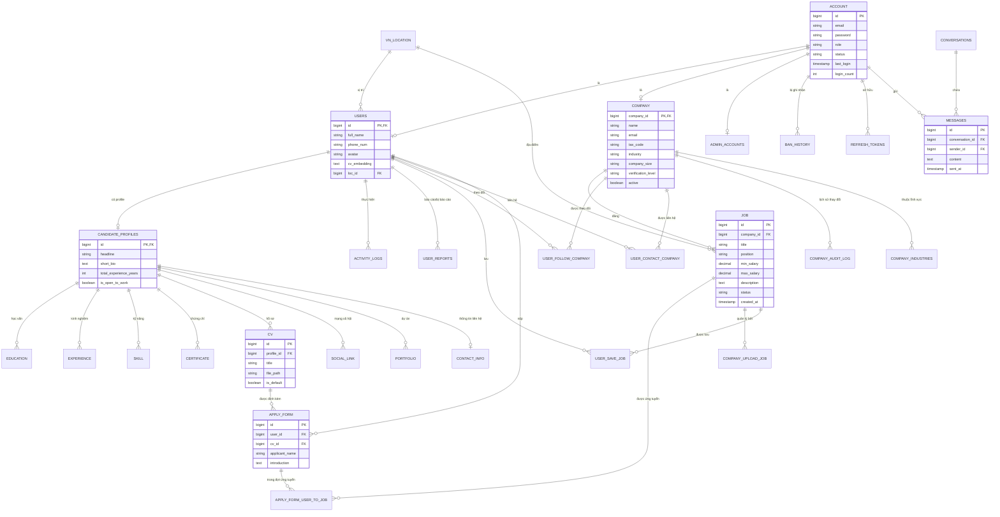

# Hệ Thống Thực Thể ITing (ERD)

Tài liệu này cung cấp cái nhìn tổng quan về cấu trúc cơ sở dữ liệu và các thực thể (biến) trong toàn bộ hệ thống ITing.

## Biểu Đồ ERD (Mermaid)

## Danh Sách Các Thực Thể Chính

### 1. Quản Lý Tài Khoản (Authentication)
- **Account**: Thông tin đăng nhập, vai trò (CANDIDATE, EMPLOYER, ADMIN).
- **Refresh_tokens**: Quản lý phiên đăng nhập.
- **Ban_history**: Lịch sử khóa/mở tài khoản.

### 2. Người Dùng & Ứng Viên (Candidate)
- **Users**: Thông tin cơ bản người dùng.
- **Candidate_profiles**: Thông tin chuyên sâu (headline, bio).
- **CV**: Các tệp hồ sơ đã tải lên.
- **Education/Experience/Skill**: Các thành phần của hồ sơ năng lực.

### 3. Công Ty & Nhà Tuyển Dụng (Employer)
- **Company**: Thông tin doanh nghiệp, trạng thái xác thực.
- **Company_industries**: Liên kết công ty với các ngành nghề.
- **Company_audit_log**: Nhật ký kiểm duyệt thông tin công ty.

### 4. Việc Làm & Ứng Tuyển (Jobs & Applications)
- **Job**: Thông tin chi tiết công việc, mức lương, yêu cầu.
- **Apply_form**: Đơn ứng tuyển (gom nhóm thông tin người dùng và CV).
- **Apply_form_user_to_job**: Bảng liên kết ứng tuyển giữa người dùng và công việc.

### 5. Tương Tác & Hệ Thống
- **Conversations/Messages**: Hệ thống chat giữa ứng viên và công ty.
- **Notification**: Thông báo hệ thống.
- **Activity_logs**: Nhật ký hoạt động của người dùng.
- **System_configs**: Các cấu hình động của hệ thống (email, giới hạn, ...).
- **VN_location**: Danh mục địa điểm (Tỉnh/Thành phố).

---
*Ghi chú: ERD này được tổng hợp từ các file migration hiện có trong hệ thống backend.*
